<!-- markdownlint-disable MD033 -->

# 技术时间线

本页不把视频生成史排成一条“旧模型被新模型替代”的队伍，而是追踪三条长期并行、彼此借力的技术主线：**表示与生成机制、视频基础模型与创作、World Model 与行动闭环**。应用层承接三条主线的成果，验证框架则横向检查每个能力主张是否站得住。

资料核查截止：**2026-08-30**

> **30 秒读法**
>
> 1. 先在下方泳道图中选择你关心的主线。
> 2. 再沿同名章节阅读节点卡片，关注“机制改变了什么”，而不是只记模型名。
> 3. 最后查看节点的四项标签，区分首次公开、正式发表、本页定位和当前开放状态。

<strong>资料口径与收录原则</strong>

- 年份采用论文首次公开或机构首次官方发布的时间，而不是后续会议、期刊或产品开放年份；因此年份标签不代表该工作已经正式发表。涉及论文的新增节点同时写“首次公开 / 正式状态”，没有 proceedings 的保留 `preprint` 标签。
- 这是一组经过筛选的技术谱系，不是所有模型的产品年表；每个节点均链接论文、作者项目页或机构官方发布等一手来源。
- 视频编辑是贯穿多条泳道的横向能力；从 Video Rewrite、时空补全、vid2vid 到 Diffusion / DiT、instruction editing 与 memory 的节点，见[视频编辑 milestones](tasks/video-to-video.md)。
- 视频退化修复是与生成/编辑相邻的观测逆问题：目标是从 blur、downsample、noise、compression 等低质观测恢复同一内容，不是重新创作或只在 mask 内补全；其横向谱系见本页专题表与[退化修复专章](tasks/video-restoration.md)。
- 每个节点的“资源”栏统一标记 Paper/Report、Project、Code、Weights 与 Demo；Code 只认作者或机构官方实现，`未公开` 表示截至核查日未找到官方公开资源，第三方复现不会冒充官方实现；`—` 表示没有独立入口或不适用，失效、归档、下线与访问受限会直接标注状态。
- 企业节点中的分辨率、速度、时长与性能，如无独立复现，均按“官方或作者报告”理解。2025–2026 节点默认标为**前沿观察（暂定）**，不把预印本、机构自评或宣传演示升格为已独立验证的能力事实。
- 联合音视频、后训练和显式控制节点的一手来源交叉核验见[缺口审计](../sources/research_20260830_missing_subfields_integration.md)；Video DiT 的公开/发表、attention topology、融合、MoE、并行与缓存边界见[backbone 研究日志](../sources/research_20260830_video_dit_backbones.md)；多视角/4D、退化修复与视频表示分别见[4D 研究日志](../sources/research_20260830_multiview_4d_generation.md)、[退化修复研究日志](../sources/research_20260830_video_restoration.md)和[tokenizer 研究日志](../sources/research_20260830_video_representation_tokenizers.md)。
- 节点卡片中的模型概念图由 imagegen 根据论文机制生成，属于**概念示意图，不是论文原图，也不代表模型真实输出**；页首索引图使用可维护的 Mermaid 文本图。

---

## 三条技术泳道与两个横向层

技术泳道回答“研究问题沿哪条路线演进”；应用层和验证尺横跨三条泳道，不是第 4、第 5 条技术路线。图中的年份是宽阶段，只用于导航，不替代后文节点的首次公开与正式发表日期。

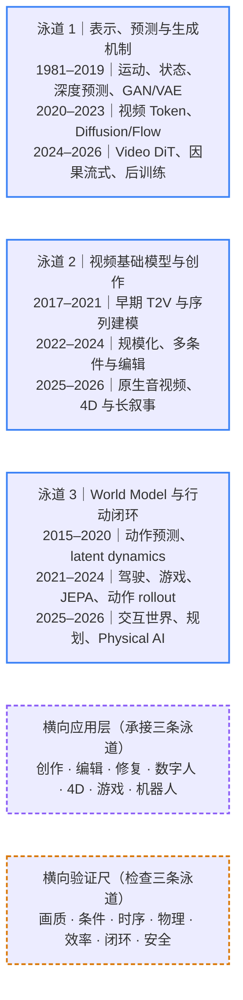
```mermaid
flowchart TB
    accTitle: 视频生成技术的三条并行主线
    accDescr: 三条主线从各自前驱走向规模化与交互生成；应用层承接成果，验证尺横向检查所有能力主张。

    lane_1["泳道 1｜表示、预测与生成机制<br/>1981–2019｜运动、状态、深度预测、GAN/VAE<br/>2020–2023｜视频 Token、Diffusion/Flow<br/>2024–2026｜Video DiT、因果流式、后训练"]
    lane_2["泳道 2｜视频基础模型与创作<br/>2017–2021｜早期 T2V 与序列建模<br/>2022–2024｜规模化、多条件与编辑<br/>2025–2026｜原生音视频、4D 与长叙事"]
    lane_3["泳道 3｜World Model 与行动闭环<br/>2015–2020｜动作预测、latent dynamics<br/>2021–2024｜驾驶、游戏、JEPA、动作 rollout<br/>2025–2026｜交互世界、规划、Physical AI"]
    application_layer["横向应用层（承接三条泳道）<br/>创作 · 编辑 · 修复 · 数字人 · 4D · 游戏 · 机器人"]
    validation_layer["横向验证尺（检查三条泳道）<br/>画质 · 条件 · 时序 · 物理 · 效率 · 闭环 · 安全"]

    lane_1 ~~~ lane_2
    lane_2 ~~~ lane_3
    lane_3 ~~~ application_layer
    application_layer ~~~ validation_layer

    classDef lane stroke:#3b82f6,stroke-width:2px
    classDef application stroke:#8b5cf6,stroke-width:2px,stroke-dasharray:5 3
    classDef validation stroke:#d97706,stroke-width:2px,stroke-dasharray:5 3
    class lane_1,lane_2,lane_3 lane
    class application_layer application
    class validation_layer validation
```

*图 1：三条技术泳道并行推进；应用层和验证尺横跨主线，不代表单线替代或能力等级。*

| 层次 | 它回答什么 | 建议入口 |
|---|---|---|
| **泳道 1｜表示、预测与生成机制** | 视频如何表示、压缩、预测和采样？ | [生成模型路线](generative-models.md) · [视频 Tokenizer](generative-models/video-tokenizers.md) · [Video DiT](generative-models/video-dit-backbones.md) |
| **泳道 2｜视频基础模型与创作** | 模型如何扩展为规模化、多条件、可迁移的创作系统？ | [视频基础模型路线](foundation-models.md) · [多视角/4D](tasks/multiview-4d-generation.md) · [视频编辑](tasks/video-to-video.md) |
| **泳道 3｜World Model 与行动闭环** | 模型能否维护状态、响应动作，并支持反事实、规划或持续交互？ | [World Model 专章](world-models.md) · [JEPA 路线](jepa.md) |
| **横向应用层** | 三条主线如何进入编辑、修复、数字人、游戏、自动驾驶与机器人？ | [相关应用](applications.md) · [任务地图](taxonomy.md) |
| **横向验证尺** | 每项能力主张应由什么证据支撑？ | [评测指南](evaluation.md) · [物理一致性](physical-consistency.md) |

> **归类原则：** 同一模型可能横跨多条泳道，本页按主要贡献归类。“统一模型”必须说明统一的是接口、流水线、共享 backbone、模型家族还是单一 checkpoint。动作条件 rollout 只有反复完成“动作 → 环境响应 → 新观测 → 再决策”，才算闭环验证。

---

## 一个节点要看四件事

这里不再把它们含混地统称为“证据状态”。技术泳道回答“它沿哪条路线发展”；下面四项标签分别回答“何时公开、发表到哪一步、为何收录、现在能获取或访问什么”。它们同时存在、彼此独立，也不是从低到高的等级。

```mermaid
flowchart TB
    accTitle: 时间线节点的四项独立标签
    accDescr: 每个节点同时记录首次公开、学术状态、本页定位和当前开放状态；四项回答不同问题，不能合并成一个已发布标签。

    first_public["① 首次公开｜何时进入公共记录？"]
    academic_status["② 学术状态｜预印本、研讨会或正式会议/期刊？"]
    page_role["③ 本页定位｜研究里程碑、历史节点、专题汇总或前沿观察（暂定）？"]
    availability["④ 当前开放与访问｜论文、代码、模型权重、接口、在线演示或下线？"]

    first_public ~~~ academic_status
    academic_status ~~~ page_role
    page_role ~~~ availability

    classDef label stroke:#64748b,stroke-width:2px
    class first_public,academic_status,page_role,availability label
```

*图 2：四项标签同时描述同一节点，彼此独立，不是从低到高的成熟度等级。*

| 你想知道什么 | 本页怎么写 | 不能据此推出 |
|---|---|---|
| **何时进入公共记录？** | arXiv v1、项目页或官方发布的首次日期 | 已同行评议或已经录用 |
| **学术进展到哪一步？** | 预印本、研讨会论文、正式会议或期刊记录 | 代码已开放、结果已复现或产品可用 |
| **为什么收进这条时间线？** | “研究里程碑”“历史节点”“专题汇总”或“前沿观察（暂定）”，属于本页的编辑定位 | 学术录用、产品成功、业界共识或通用能力 |
| **现在能拿到什么？** | 论文、代码、模型权重、接口、在线演示、访问受限或下线 | 未来仍可用，或与论文中的完整系统等价 |

> **例：** “2025 年首次公开 + 仍是预印本 + 本页视为研究里程碑 + 代码和权重已开放”完全可以同时成立。四句话分别回答时间、发表、编辑定位和开放范围。

> **能力证据另看一层：** 官方自述、作者实验、开放工件、独立复现和现实闭环实测必须分别标注；“正式发表”或“目前可用”都不能自动替代能力验证。

<strong>查看 2025–2026 节点的四项标签与开放状态</strong>

下表只回答“当前的记录与访问状态是什么”；机制、任务和边界仍以后文卡片为准。“未找到正式发表记录”指截至本次核查，没有在论文记录、官方 proceedings 或作者项目页中确认，不是对未来录用状态的预测。

| 节点 | 首次公开与学术状态 | 本页定位 | 截止 2026-08-30 的开放与访问状态 |
|---|---|---|---|
| Wan 2.1 | 2025-03-26 arXiv v1；预印本/技术报告，未找到正式发表记录 | 开放视频基础模型家族的研究里程碑 | 官方代码、权重和托管 demo 可访问 |
| NVIDIA Cosmos / Predict2 | 2025-01-07 预印本；Predict2 于 2025-06-11 官方技术发布；未找到正式发表记录 | Physical AI 平台与世界状态生成的研究里程碑 | 官方代码、权重、PyPI 和 demo 可访问 |
| V-JEPA 2 | 2025-06-11 arXiv v1；预印本，未找到正式发表记录 | 从无动作视频表示到小量动作数据后训练和规划的研究里程碑 | 官方代码与权重可访问；不是托管机器人产品 |
| Veo 3 / 3.1 | 2025-05-20 官方产品发布；2025-09-24 为独立黑盒探测预印本 | 原生音视频创作和黑盒视觉探测的前沿观察（暂定） | 官方页仍提供 Gemini、Flow、AI Studio 和 API 入口；无公开代码/权重 |
| Genie 3 | 2025-08-05 官方研究发布；未找到论文或正式发表记录 | 实时可交互生成世界的前沿观察（暂定） | Project Genie 是可访问的实验性托管原型；无公开代码/权重 |
| Matrix-Game 2.0 | 2025-08-18 arXiv v1；预印本，未找到正式发表记录 | 少步 causal diffusion 流式交互的研究里程碑 | 官方仓库仍保留 2.0 实现与权重入口；主线已更新到 3.0 |
| Marble | 2025-11-12 官方产品发布；未找到论文或正式发表记录 | 显式 3D 世界表示与导出的产品/研究前沿观察（暂定） | 官方称已普遍可用，需账号；无公开代码/权重 |
| Sora 2 | 2025-09-30 官方发布与系统卡；不是同行评议论文 | 音视频、多镜头和安全治理的历史节点 | 官方确认 Sora 产品已于 2026-04-26 下线；无公开代码/权重 |
| GWM-1 | 2025-12-11 官方研究/产品发布；未找到论文或正式发表记录 | 共享底座、独立后训练世界模型家族的前沿观察（暂定） | Worlds/Robotics 仍为申请式 early access；Characters 分支已提供 Web/API；无公开权重 |
| Cosmos 3 | 2026-06-01 arXiv v1；官方称 technical report，未找到正式发表记录 | Omnimodal 世界模型家族的前沿观察（暂定） | 官方代码、模型卡/权重和托管 demo 可访问 |
| V-JEPA 2.1 | 2026-03-15 arXiv v1；预印本，未找到正式发表记录 | dense 时空表示的前沿观察（暂定） | 官方代码与预训练 checkpoints 可访问 |
| LeWorldModel | 2026-03-13 arXiv v1；预印本，未找到正式发表记录 | 小型端到端 latent planning 的前沿观察（暂定） | 官方代码、数据与 checkpoints 可访问 |
| EB-JEPA | 2026-02-03 arXiv v1；ICLR 2026 World Models Workshop camera-ready，不冒充主会 archival proceedings | 可复现教学/研究组件的前沿观察（暂定） | 官方代码可访问；未另行发布权重 |
| Kling Video 3 / 3 Omni | 2026 官方产品发布；未找到论文或正式发表记录 | 多参考原生音视频创作的前沿观察（暂定） | 官方 Web 产品可访问，受账号/地区限制；无公开代码/权重 |
| Seedance 2.0 | 2026-02-12 官方产品发布；2026-04-15 arXiv model card，不是同行评议论文 | 统一多模态原生音视频的前沿观察（暂定） | 托管产品可访问，受账号/地区限制；无公开代码/权重 |
| MiniMax H3 | 2026-07-31 官方发布；2026-08-03 开放基础模型；未找到同行评议论文 | 全模态音视频和部分开放系统的前沿观察（暂定） | 两个 H3-Base checkpoint 与代码可用，本地基础流程为 768p；Context-IR 与 2K regeneration 仍依赖托管 API |
| Seedance 2.5 | 2026-07-31 官方产品发布；未找到论文或正式发表记录 | 长叙事、多参考与时间戳编辑的前沿观察（暂定） | 官方称已在即梦/Doubao Pro 逐步上线；发布页仍称 API 即将提供；无公开权重 |
| Dual-IPO / BranchGRPO | ICLR 2026 正式 proceedings | 奖励模型—生成器迭代与去噪轨迹信用分配的研究里程碑 | 正式论文页可访问；本表未把论文实验等同于通用后训练 recipe 或独立复现 |
| LAMP / FlashMotion / BulletTime | CVPR 2026 正式 proceedings | 语言到运动程序、少步轨迹控制与时间—视角解耦的前沿观察（暂定） | 各论文与补充材料入口可访问；工件范围逐项核验，三者不是一个统一控制系统 |
| NAVA / Ripple | 2026-05-28、2026-07-29 arXiv v1；均为预印本 | 原生 AV 对齐与带跨模态记忆的流式联合生成前沿观察（暂定） | NAVA 项目样例与两篇预印本可访问；未把作者同步/速度结果写成开放权重或独立性能 |
| 4DStreamCtrl | 2026-08-26 arXiv v1，2026-08-27 v2；预印本 | 相机、对象、深度与因果流式统一的最新前沿观察（暂定） | arXiv PDF/源码可访问；未在一手记录中确认官方代码或权重，20 FPS/长序列为作者协议结果 |
| SeedVR2 / FlashVSR / DGAF-VSR / STCDiT / DTG-Restore | SeedVR2 为 ICLR 2026 正式 proceedings；其余四项为 CVPR 2026 正式 proceedings | 一步对抗后训练、streaming、aligned evidence、结构锚定与 training-free refinement 的视频退化修复专题汇总 | 论文入口可访问；本页不把不同数据、退化、硬件和感知协议下的作者结果合并成统一排名 |

---

<strong>横向专题（可选）：2017–2026 视频退化修复谱系</strong>

这条谱系不等同于视频编辑：输入 $Y$ 是同一真实视频 $X$ 经未知或已知退化算子后的观测，目标是恢复 $X$，不是按指令改变事件。它也不等同于 inpainting：全帧通常仍有低质证据，并不存在一张天然的 mask 外硬保护区。下表只保留改变任务定义或系统边界的节点；逐篇 paper review、公式、指标和 RestorationFork-1 见[专章](tasks/video-restoration.md)。

| 阶段 | 代表节点 | 合同变化 | 仍未解决 |
|---|---|---|---|
| 2017–2020：利用跨帧证据 | [Deep Video Deblurring](https://openaccess.thecvf.com/content_cvpr_2017/html/Su_Deep_Video_Deblurring_CVPR_2017_paper.html)、[EDVR](https://openaccess.thecvf.com/content_CVPRW_2019/html/NTIRE/Wang_EDVR_Video_Restoration_With_Enhanced_Deformable_Convolutional_Networks_CVPRW_2019_paper.html)、[FastDVDnet](https://openaccess.thecvf.com/content_CVPR_2020/html/Tassano_FastDVDnet_Towards_Real-Time_Deep_Video_Denoising_Without_Flow_Estimation_CVPR_2020_paper.html) | 邻帧不再独立处理；对齐、遮挡权重与时空融合成为一等组件 | 合成 blur/noise 与真实 shutter、codec、ISP 的距离仍大 |
| 2021–2022：传播、盲退化与 Transformer | [BasicVSR](https://openaccess.thecvf.com/content/CVPR2021/html/Chan_BasicVSR_The_Search_for_Essential_Components_in_Video_Super-Resolution_and_CVPR_2021_paper.html)、[RealBasicVSR](https://openaccess.thecvf.com/content/CVPR2022/html/Chan_Investigating_Tradeoffs_in_Real-World_Video_Super-Resolution_CVPR_2022_paper.html)、[RVRT](https://proceedings.neurips.cc/paper_files/paper/2022/hash/02687e7b22abc64e651be8da74ec610e-Abstract-Conference.html) | 建立传播/对齐/聚合/上采样组件表，把真实退化和 clip 内并行、clip 间递归纳入统一诊断 | 双向方法依赖未来帧；长视频仍有传播漂移与显存债务 |
| 2023–2024：图像生成先验获得时间能力 | [SATeCo](https://openaccess.thecvf.com/content/CVPR2024/html/Chen_Learning_Spatial_Adaptation_and_Temporal_Coherence_in_Diffusion_Models_for_CVPR_2024_paper.html)、[Upscale-A-Video](https://openaccess.thecvf.com/content/CVPR2024/html/Zhou_Upscale-A-Video_Temporal-Consistent_Diffusion_Model_for_Real-World_Video_Super-Resolution_CVPR_2024_paper.html)、[MGLD-VSR](https://eccv.ecva.net/virtual/2024/poster/2534) | 冻结或适配图像 diffusion prior，以 latent/pixel、local/global 与 flow guidance 补足视频时间约束 | 感知细节可能没有观测支持；锐利不能替代 re-degradation、OCR/ID 与多 seed 审计 |
| 2024–2025：高倍率、高分辨率、复杂退化与少步 | [VideoGigaGAN](https://openaccess.thecvf.com/content/CVPR2025/html/Xu_VideoGigaGAN_Towards_Detail-rich_Video_Super-Resolution_CVPR_2025_paper.html)、[PatchVSR](https://openaccess.thecvf.com/content/CVPR2025/html/Du_PatchVSR_Breaking_Video_Diffusion_Resolution_Limits_with_Patch-wise_Video_Super-Resolution_CVPR_2025_paper.html)、[DiffVSR](https://openaccess.thecvf.com/content/ICCV2025/html/Li_DiffVSR_Revealing_an_Effective_Recipe_for_Taming_Robust_Video_Super-Resolution_ICCV_2025_paper.html)、[TurboVSR](https://openaccess.thecvf.com/content/ICCV2025/html/Wang_TurboVSR_Fantastic_Video_Upscalers_and_Where_to_Find_Them_ICCV_2025_paper.html) | 分别把生成细节、patch 条件、复杂退化 curriculum 与压缩/少步效率推到系统层 | 结果绑定各自数据、倍率、硬件与计时边界，不能直接拼成“最佳模型” |
| 2026：一步、streaming 与证据守恒分叉 | [SeedVR2](https://proceedings.iclr.cc/paper_files/paper/2026/hash/444d69470b24ded080183c907b711bbf-Abstract-Conference.html)、[FlashVSR](https://openaccess.thecvf.com/content/CVPR2026/html/Zhuang_FlashVSR_Towards_Real-time_Diffusion-Based_Streaming_Video_Super_Resolution_CVPR_2026_paper.html)、[DGAF-VSR](https://openaccess.thecvf.com/content/CVPR2026/html/Xu_Rethinking_Diffusion_Model-Based_Video_Super-Resolution_Leveraging_Dense_Guidance_from_Aligned_CVPR_2026_paper.html)、[STCDiT](https://openaccess.thecvf.com/content/CVPR2026/html/Chen_STCDiT_Spatio-Temporally_Consistent_Diffusion_Transformer_for_High-Quality_Video_Super-Resolution_CVPR_2026_paper.html)、[DTG-Restore](https://openaccess.thecvf.com/content/CVPR2026/html/Yesiltepe_DTG-Restore_Training-Free_Diffusion_Refinement_for_Generative_Video_Super-Resolution_CVPR_2026_paper.html) | 将 adversarial 一步、只读历史的 streaming、dense aligned evidence、anchor-frame structure 与无训练 refinement 分成不同系统合同 | “一步”“实时”“training-free”和“忠实”仍是四个独立主张，需分别验证 |

---

## 生成机制基础｜1981–2003：显式运动、重组与统计动态

这一阶段的工作不是今天意义上的大规模生成模型，却奠定了运动表示、帧重用、条件驱动和状态空间建模的基本语言。

<table>
<tr>
<td width="42%">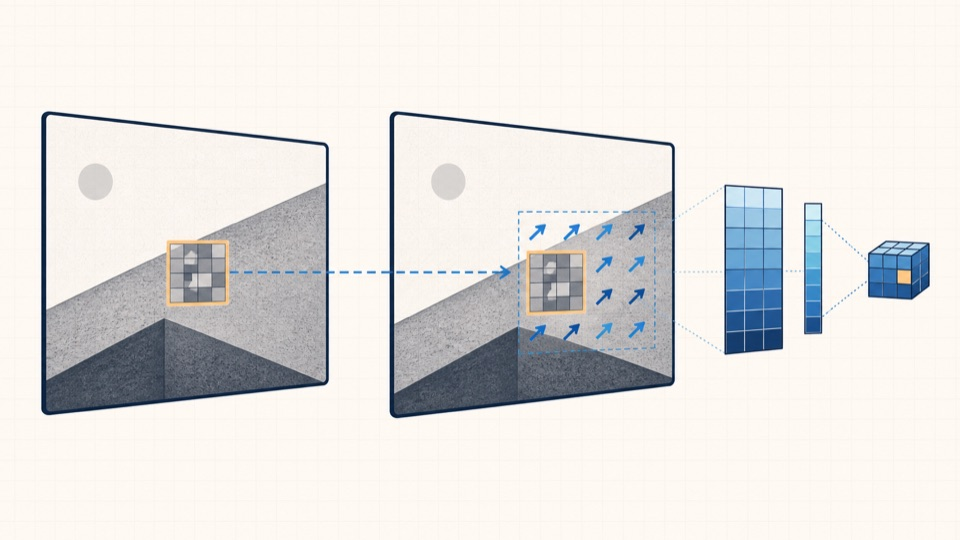</td>
<td><strong>1981 — <a href="https://publications.ri.cmu.edu/an-iterative-image-registration-technique-with-an-application-to-stereo-vision-ijcai/">Lucas–Kanade</a></strong> <code>运动表示前驱</code> <strong>表示/机制：</strong>在局部窗口内利用空间强度梯度，通过迭代配准与最小二乘估计小位移。 <strong>控制/任务：</strong>输入相邻图像或视频帧，输出局部运动；原论文首先是图像配准与立体视觉工作。 <strong>意义/边界：</strong>后来成为经典局部光流方法，并影响 flow-guided generation 与 warping，但它本身不是生成模型。 <strong>资源：</strong><a href="https://publications.ri.cmu.edu/an-iterative-image-registration-technique-with-an-application-to-stereo-vision-ijcai/">Paper</a> · Project：— · Code：未公开 · Weights：不适用 · Demo：—</td>
</tr>
</table>

<table>
<tr>
<td width="42%">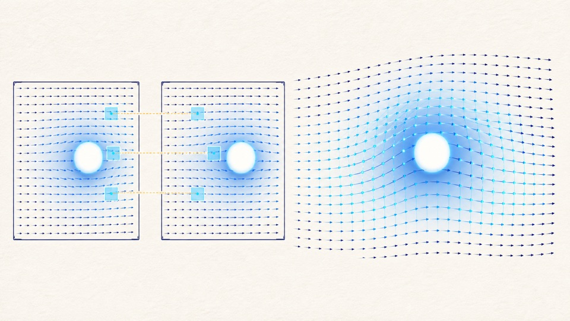</td>
<td><strong>1981 — <a href="https://doi.org/10.1016/0004-3702(81)90024-2">Horn–Schunck</a></strong> <code>运动表示前驱</code> <strong>表示/机制：</strong>把亮度恒常约束与全局平滑先验结合，联合估计整幅图像的稠密运动场。 <strong>控制/任务：</strong>输入相邻帧，输出全局一致的光流。 <strong>意义/边界：</strong>与 Lucas–Kanade 的局部法形成经典对照；全局平滑有利于补全弱纹理区域，也可能抹平真实运动边界。 <strong>资源：</strong><a href="https://doi.org/10.1016/0004-3702(81)90024-2">Paper</a> · Project：— · Code：未公开 · Weights：不适用 · Demo：—</td>
</tr>
</table>

<table>
<tr>
<td width="42%">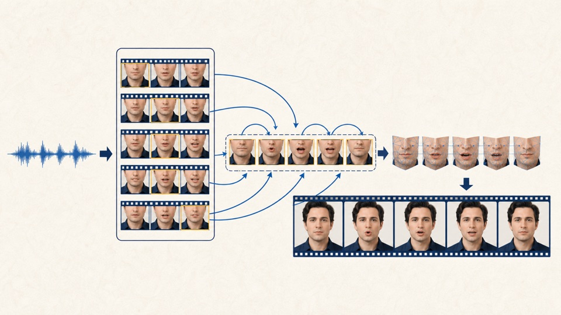</td>
<td><strong>1997 — <a href="https://doi.org/10.1145/258734.258880">Video Rewrite</a></strong> <code>数据驱动条件合成</code> <strong>表示/机制：</strong>从已拍摄素材中选择与新语音对应的嘴部片段，再通过图像变形与合成连接片段。 <strong>控制/任务：</strong>以音频为条件改变说话人的口型。 <strong>意义/边界：</strong>很早展示了“检索、重排、morphing、条件驱动”的视频合成流程，但受特定人物和素材覆盖范围限制。 <strong>资源：</strong><a href="https://doi.org/10.1145/258734.258880">Paper</a> · Project：历史页已下线 · Code：未公开 · Weights：未公开 · Demo：—</td>
</tr>
</table>

<table>
<tr>
<td width="42%">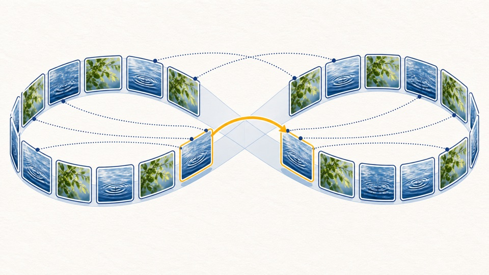</td>
<td><strong>2000 — <a href="https://www.microsoft.com/en-us/research/publication/video-textures/">Video Textures</a></strong> <code>帧重组</code> <strong>表示/机制：</strong>依据帧间相似度构建可跳转的帧图，在合适位置重排已有画面，合成任意长度的连续动态纹理。 <strong>控制/任务：</strong>从一段短视频生成稳定循环或交互式序列。 <strong>意义/边界：</strong>它不生成新像素；质量取决于素材中是否存在可无缝连接的状态。 <strong>资源：</strong><a href="https://www.microsoft.com/en-us/research/publication/video-textures/">Paper</a> · <a href="https://sites.cc.gatech.edu/gvu/perception/projects/videotexture/index.html">Project</a> · Code：未公开 · Weights：不适用 · Demo：—</td>
</tr>
</table>

<table>
<tr>
<td width="42%">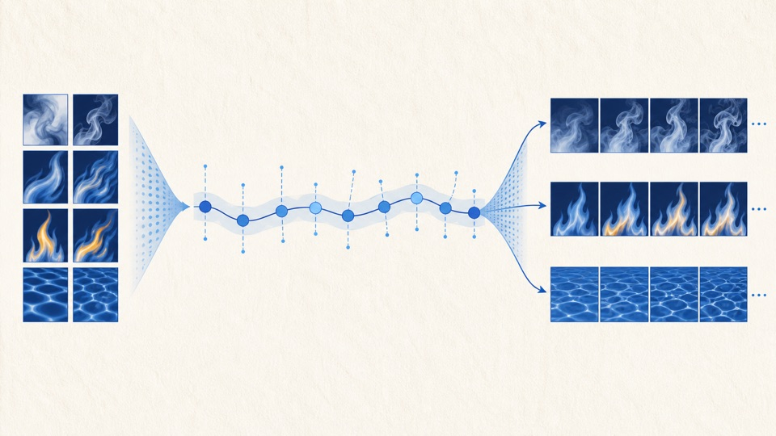</td>
<td><strong>2001/2003 — <a href="https://doi.org/10.1109/ICCV.2001.937658">Dynamic Textures</a></strong> <code>统计动态</code> <strong>表示/机制：</strong>在低维外观子空间中，用随机线性动力系统和系统辨识建模、预测并合成烟、火、水面与树叶等随机过程。 <strong>控制/任务：</strong>从观测序列学习隐状态转移，再从状态模型采样。 <strong>意义/边界：</strong>ICCV 2001 首次提出，<a href="https://doi.org/10.1023/A:1021669406132">IJCV 2003</a> 给出扩展版；它是视觉 state-space model 的直接前驱，但主要适合近似平稳动态纹理。 <strong>资源：</strong><a href="https://doi.org/10.1109/ICCV.2001.937658">Paper</a> · <a href="http://www.cs.ucla.edu/~doretto/projects/dynamic-textures.html">Project（历史页，已失效）</a> · Code：未公开 · Weights：未公开 · Demo：—</td>
</tr>
</table>

### 这一阶段留下什么

光流直接进入后来的 warping、插帧与运动引导；Dynamic Textures 则把“视觉观测由隐藏动态状态产生”写成了可学习模型。显式相机、3D 仿真与数字孪生还来自计算机图形学和机器人学的独立谱系，不能全部归因于上述节点。

---

## 生成机制基础｜2014–2017：深度视频预测

深度网络开始直接学习时空相关性。这里的核心问题不是“能否预测下一帧”，而是如何避免逐像素回归把多个合理未来平均成模糊图像。

<table>
<tr>
<td width="42%">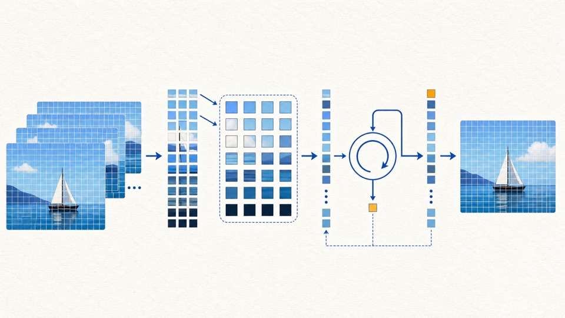</td>
<td><strong>2014 — <a href="https://arxiv.org/abs/1412.6604">Video (Language) Modeling</a></strong> <code>离散自回归前驱</code> <strong>表示/机制：</strong>把 8×8 图像 patch 量化到大型离散词典，再借用语言模型式 rNN/rCNN 预测下一时刻的 patch 分布。 <strong>控制/任务：</strong>补全缺失帧或从历史帧外推短时未来。 <strong>意义/边界：</strong>展示了自然视频中的非平凡短时运动；离散化损失明显，递归生成也容易逐渐停滞。 <strong>资源：</strong><a href="https://arxiv.org/abs/1412.6604">Paper</a> · <a href="https://ai.meta.com/research/publications/video-language-modeling-a-baseline-for-generative-models-of-natural-videos/">Project</a> · Code：未公开 · Weights：未公开 · Demo：—</td>
</tr>
</table>

<table>
<tr>
<td width="42%">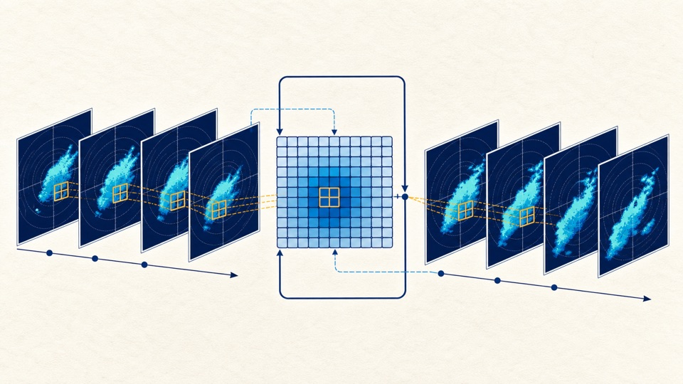</td>
<td><strong>2015 — <a href="https://papers.nips.cc/paper_files/paper/2015/hash/07563a3fe3bbe7e3ba84431ad9d055af-Abstract.html">ConvLSTM</a></strong> <code>卷积递归</code> <strong>表示/机制：</strong>把 LSTM 的 input-to-state 与 state-to-state 变换卷积化，使隐藏状态保留二维空间结构。 <strong>控制/任务：</strong>原任务是雷达回波降水临近预报，随后成为视频预测的常用时序单元。 <strong>意义/边界：</strong>比全连接 LSTM 更适合网格数据，但长序列仍受误差累积与记忆容量限制。 <strong>资源：</strong><a href="https://papers.nips.cc/paper_files/paper/2015/hash/07563a3fe3bbe7e3ba84431ad9d055af-Abstract.html">Paper</a> · Project：— · Code：未公开 · Weights：未公开 · Demo：—</td>
</tr>
</table>

<table>
<tr>
<td width="42%">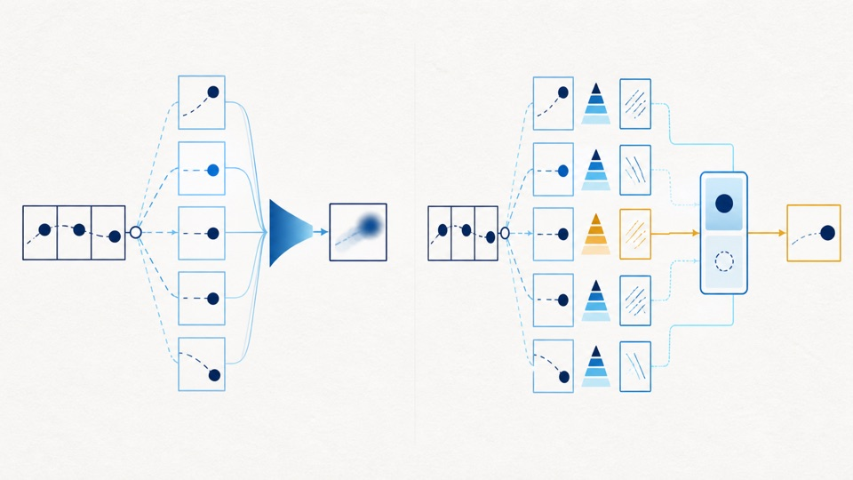</td>
<td><strong>2015 — <a href="https://arxiv.org/abs/1511.05440">Beyond MSE</a></strong> <code>感知损失</code> <strong>表示/机制：</strong>结合多尺度网络、对抗训练与 image-gradient-difference loss，减少只优化像素 MSE 带来的模糊。 <strong>控制/任务：</strong>根据历史帧预测未来画面。 <strong>意义/边界：</strong>当 one-to-many 未来被单一输出和 L2/MSE 训练时，条件均值容易模糊；这不是所有确定性模型都必然模糊的无条件结论。 <strong>资源：</strong><a href="https://arxiv.org/abs/1511.05440">Paper</a> · <a href="http://cs.nyu.edu/~mathieu/iclr2016.html">Project</a> · Code  · <a href="http://perso.esiee.fr/~coupriec/MathieuICLR16TestCode.zip">Weights</a> · Demo：—</td>
</tr>
</table>

<table>
<tr>
<td width="42%">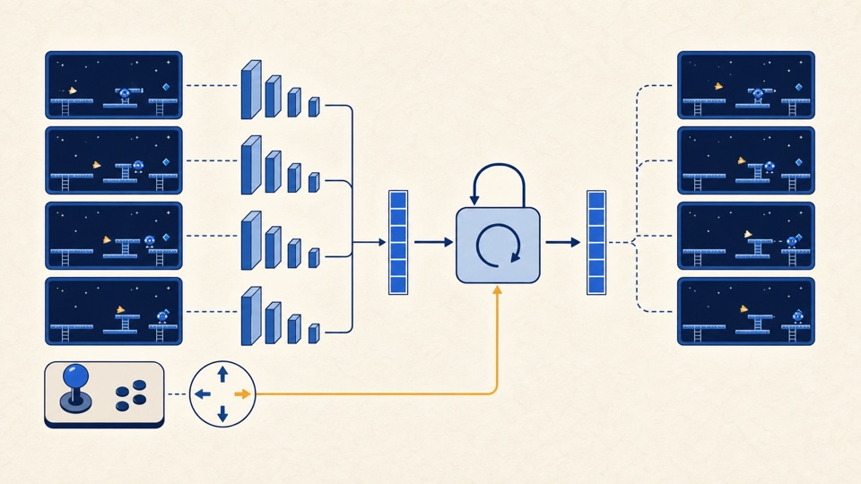</td>
<td><strong>2015 — <a href="https://papers.nips.cc/paper_files/paper/2015/hash/6ba3af5d7b2790e73f0de32e5c8c1798-Abstract.html">Action-Conditional Video Prediction</a></strong> <code>动作条件预测</code> <strong>表示/机制：</strong>CNN 编码 Atari 帧，递归模型同时接收动作并预测受控制的未来画面。 <strong>控制/任务：</strong>显式回答“采取这个动作后会看到什么”。 <strong>意义/边界：</strong>连接了视频预测与决策型 world model；但实验环境、画面结构和动作空间仍较简单。 <strong>资源：</strong><a href="https://papers.nips.cc/paper_files/paper/2015/hash/6ba3af5d7b2790e73f0de32e5c8c1798-Abstract.html">Paper</a> · <a href="https://junhyuk.com/publication/2015_action_conditional/">Project</a> · Code  · Weights：未公开 · Demo：—</td>
</tr>
</table>

<table>
<tr>
<td width="42%">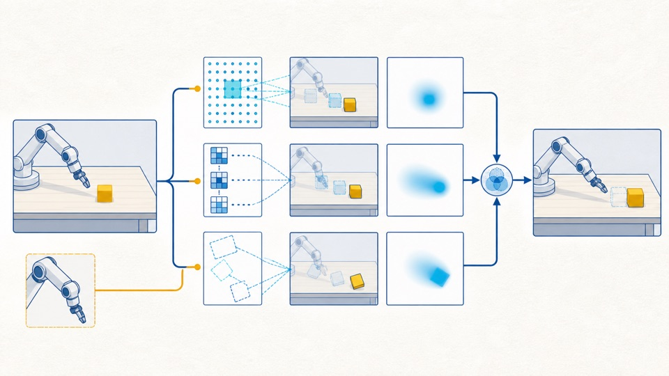</td>
<td><strong>2016 — <a href="https://arxiv.org/abs/1605.07157">DNA / CDNA / STP</a></strong> <code>变换式预测</code> <strong>表示/机制：</strong>不从头重画像素，而是预测逐像素局部变换、卷积运动核或仿射空间变换，再通过 mask 合成下一帧。 <strong>控制/任务：</strong>以机器人动作和历史图像为条件预测物体交互。 <strong>意义/边界：</strong>显式复用已有像素能得到更锐利结果；遮挡、新显露区域和长时误差仍难处理。 <strong>资源：</strong><a href="https://arxiv.org/abs/1605.07157">Paper</a> · <a href="https://sites.google.com/site/robotprediction">Project</a> · Code（历史快照）  · Weights：未公开 · Demo：—</td>
</tr>
</table>

<table>
<tr>
<td width="42%">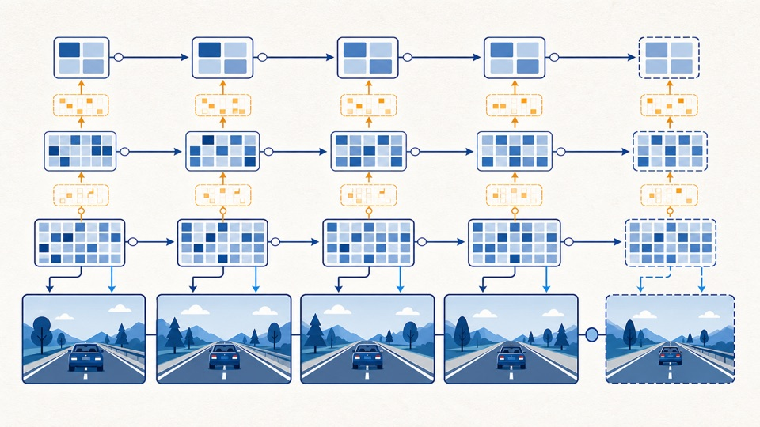</td>
<td><strong>2016 — <a href="https://openreview.net/forum?id=B1ewdt9xe">PredNet</a></strong> <code>预测编码</code> <strong>表示/机制：</strong>分层卷积递归网络在每层预测输入，只把预测误差继续向上传递。 <strong>控制/任务：</strong>无动作条件的下一帧预测与无监督表征学习。 <strong>意义/边界：</strong>把 predictive coding 组织原则具体化；预测质量仍主要在短期驾驶视频等设置中验证。 <strong>资源：</strong><a href="https://openreview.net/forum?id=B1ewdt9xe">Paper</a> · <a href="https://coxlab.github.io/prednet/">Project</a> · Code  · <a href="https://www.dropbox.com/s/iutxm0anhxqca0z/model_data_keras2.zip?dl=0">Weights</a> · Demo：—</td>
</tr>
</table>

<table>
<tr>
<td width="42%">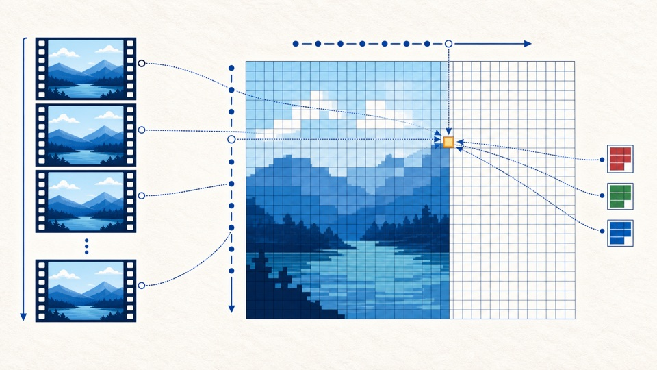</td>
<td><strong>2017 — <a href="https://proceedings.mlr.press/v70/kalchbrenner17a.html">Video Pixel Networks</a></strong> <code>像素自回归</code> <strong>表示/机制：</strong>直接分解原始视频像素的联合概率，以卷积 LSTM 与 PixelCNN 式解码逐像素建模。 <strong>控制/任务：</strong>给定前缀帧预测后续视频，并提供显式 likelihood。 <strong>意义/边界：</strong>补齐了“概率可处理”的路线，但逐像素串行采样极慢，也难扩展到高分辨率长视频。 <strong>资源：</strong><a href="https://proceedings.mlr.press/v70/kalchbrenner17a.html">Paper</a> · Project：— · Code：未公开 · Weights：未公开 · Demo：—</td>
</tr>
</table>

<table>
<tr>
<td width="42%">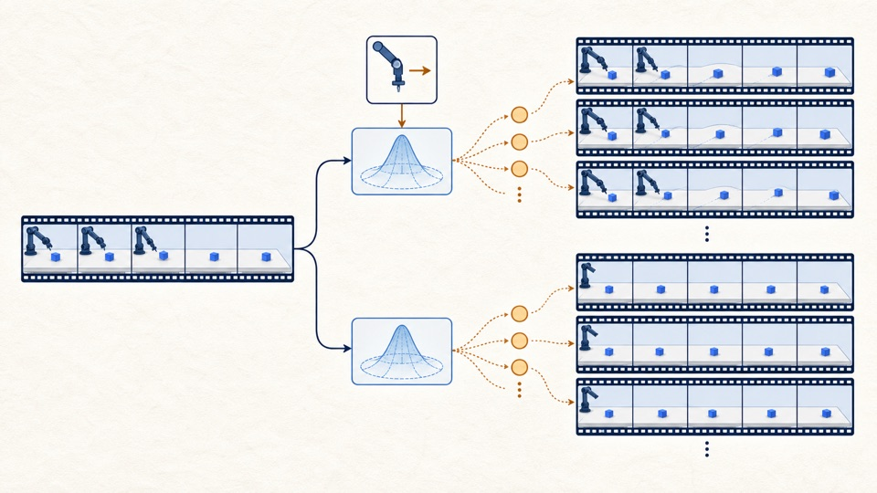</td>
<td><strong>2017 首次公开 → ICLR 2018 — <a href="https://openreview.net/forum?id=rk49Mg-CW">SV2P</a></strong> <code>随机预测</code> <strong>表示/机制：</strong>为未来序列引入随机 latent，使同一历史上下文能够采样出不同的多帧未来。 <strong>控制/任务：</strong>同时覆盖无动作与动作条件的真实视频预测。 <strong>意义/边界：</strong>较早有效处理真实视频中的 one-to-many 未来；多样性、清晰度和长期一致性仍存在权衡。 <strong>资源：</strong><a href="https://openreview.net/forum?id=rk49Mg-CW">Paper</a> · <a href="https://sites.google.com/site/stochasticvideoprediction/main">Project</a> · Code（已归档）  · Weights：未公开 · Demo：—</td>
</tr>
</table>

---

## 生成机制基础｜2016–2019：随机预测、GAN 与可处理概率

这一时期混合了两种不同问题：一类从历史帧预测多个可能未来，另一类从噪声、类别或文本合成新视频。不能只用“视频生成”把二者抹平。

<table>
<tr>
<td width="42%">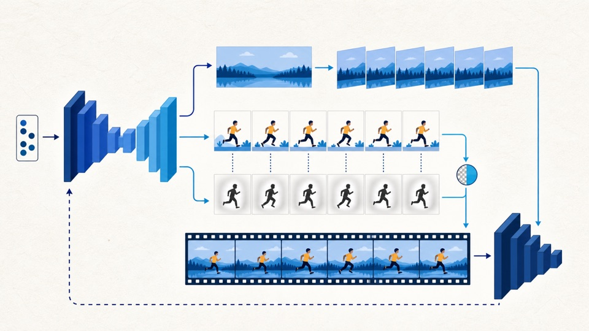</td>
<td><strong>2016 — <a href="https://proceedings.neurips.cc/paper_files/paper/2016/hash/04025959b191f8f9de3f924f0940515f-Abstract.html">VGAN / Generating Videos with Scene Dynamics</a></strong> <code>对抗式合成</code> <strong>表示/机制：</strong>以时空卷积 GAN 分离静态背景与动态前景，并通过 mask 合成短视频。 <strong>控制/任务：</strong>主要是无条件自然场景合成和表征学习。 <strong>意义/边界：</strong>展示约 64×64、32 帧、1 秒级视频；“前景运动、背景静止”的假设限制了复杂相机和动态场景。 <strong>资源：</strong><a href="https://proceedings.neurips.cc/paper_files/paper/2016/hash/04025959b191f8f9de3f924f0940515f-Abstract.html">Paper</a> · <a href="https://www.cs.columbia.edu/~vondrick/tinyvideo/">Project</a> · Code  · <a href="https://drive.google.com/file/d/0B-xMJ5CYz_F9QS1BTE5yWl9aUWs/view?usp=sharing">Weights</a> · Demo：—</td>
</tr>
</table>

<table>
<tr>
<td width="42%">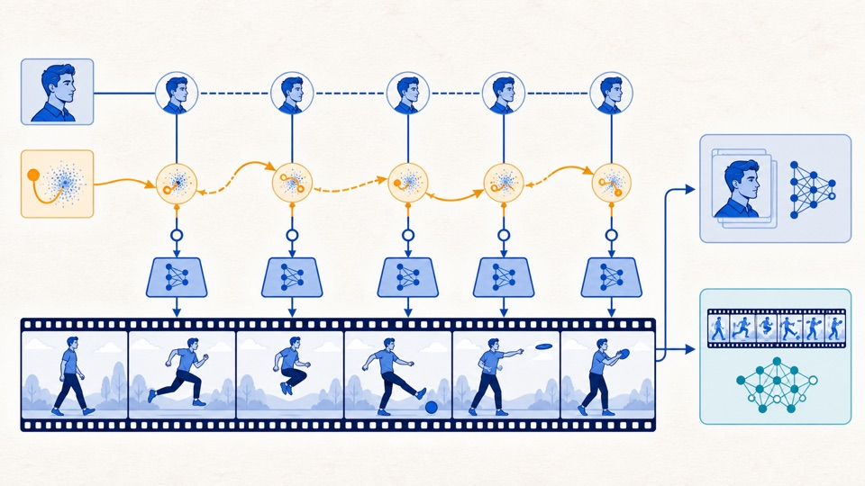</td>
<td><strong>2017 — <a href="https://openaccess.thecvf.com/content_cvpr_2018/html/Tulyakov_MoCoGAN_Decomposing_Motion_CVPR_2018_paper.html">MoCoGAN</a></strong> <code>内容—运动解耦</code> <strong>表示/机制：</strong>在整段视频中固定 content latent，让 motion latent 随随机过程演化，并同时使用图像与视频判别器。 <strong>控制/任务：</strong>无条件或类别条件视频合成。 <strong>意义/边界：</strong>把身份/外观与运动拆开成为经典设计；预印本 2017、CVPR 2018，解耦并不保证真实因果因素被正确识别。 <strong>资源：</strong><a href="https://openaccess.thecvf.com/content_cvpr_2018/html/Tulyakov_MoCoGAN_Decomposing_Motion_CVPR_2018_paper.html">Paper</a> · Project  · Code  · Weights：未公开 · Demo：—</td>
</tr>
</table>

<table>
<tr>
<td width="42%">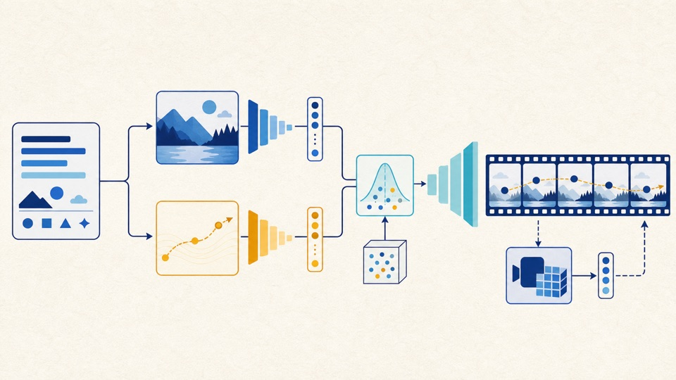</td>
<td><strong>2017 — <a href="https://arxiv.org/abs/1710.00421">Video Generation from Text</a></strong> <code>早期文本视频</code> <strong>表示/机制：</strong>先以条件 VAE 从文本生成静态 gist，再将文本动态信息转成图像滤波器，配合 GAN 生成短视频。 <strong>控制/任务：</strong>自然语言同时决定大致场景布局与运动。 <strong>意义/边界：</strong>是开放域文本到视频的早期代表；分辨率、时长、语义组合和真实感都远弱于后来的大规模预训练模型。 <strong>资源：</strong><a href="https://arxiv.org/abs/1710.00421">Paper</a> · <a href="https://www.nec-labs.com/blog/video-generation-from-text/">Project</a> · Code：未公开 · Weights：未公开 · Demo：—</td>
</tr>
</table>

<table>
<tr>
<td width="42%">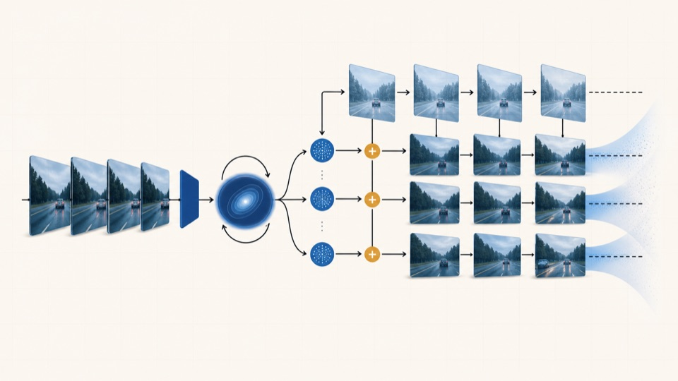</td>
<td><strong>2018 — <a href="https://proceedings.mlr.press/v80/denton18a.html">SVG-LP</a></strong> <code>随机预测</code> <strong>表示/机制：</strong>每个时间步引入随机 latent，并学习依赖历史的 prior，将随机因素与确定性预测组合。 <strong>控制/任务：</strong>给定视频历史采样多个清晰且不同的未来。 <strong>意义/边界：</strong>重点是多样未来，不是用户可控生成；递归 rollout 仍会积累误差。 <strong>资源：</strong><a href="https://proceedings.mlr.press/v80/denton18a.html">Paper</a> · <a href="https://sites.google.com/view/svglp/">Project</a> · Code  · Weights  · Demo：—</td>
</tr>
</table>

<table>
<tr>
<td width="42%">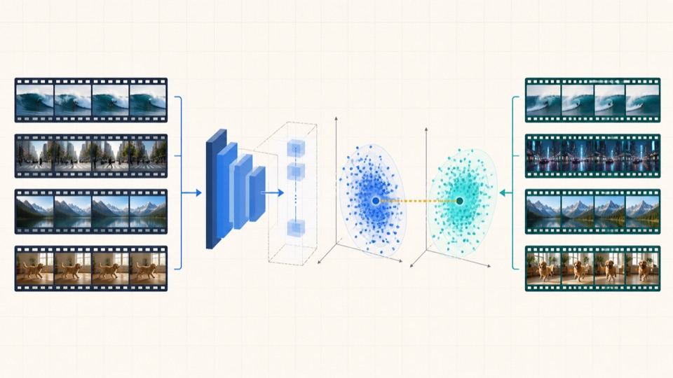</td>
<td><strong>2018 — <a href="https://research.google/pubs/towards-accurate-generative-models-of-video-a-new-metric-challenges/">Fréchet Video Distance</a></strong> <code>评测</code> <strong>表示/机制：</strong>把真实与生成视频映射到预训练 I3D 时空特征，再比较两个特征分布的 Fréchet 距离。 <strong>控制/任务：</strong>同时感知画面内容、运动与样本分布。 <strong>意义/边界：</strong>成为视频生成常用指标；它依赖特征模型与数据分布，不能单独证明文本遵循、物理、因果或闭环能力。 <strong>资源：</strong><a href="https://research.google/pubs/towards-accurate-generative-models-of-video-a-new-metric-challenges/">Paper</a> · <a href="https://research.google/blog/audio-and-visual-quality-measurement-using-fr%C3%A9chet-distance/">Project</a> · Code  · <a href="https://www.kaggle.com/models/deepmind/i3d-kinetics">Feature Weights</a> · Demo：—</td>
</tr>
</table>

<table>
<tr>
<td width="42%">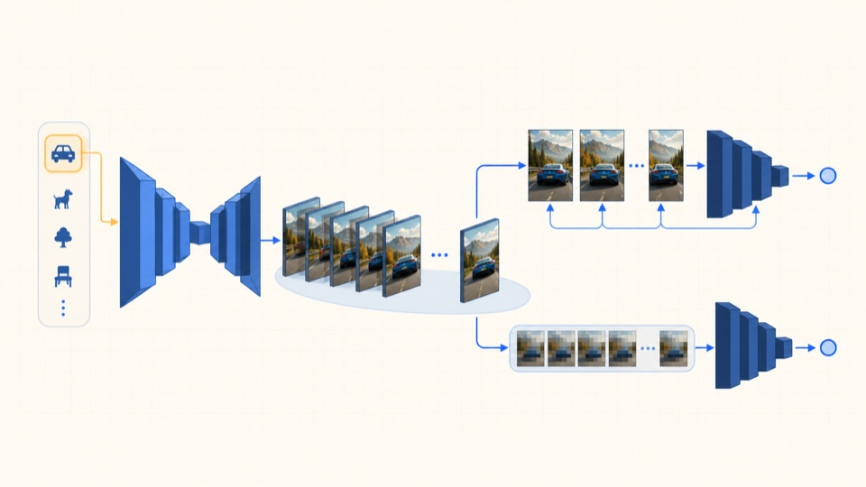</td>
<td><strong>2019 — <a href="https://arxiv.org/abs/1907.06571">DVD-GAN</a></strong> <code>大规模 GAN</code> <strong>表示/机制：</strong>基于 BigGAN；空间判别器检查抽样的全分辨率帧，时间判别器检查空间降采样后的整段视频。 <strong>控制/任务：</strong>在 Kinetics-600 上做类别条件合成。 <strong>意义/边界：</strong>相对当时扩展到 12 帧 256×256 或 48 帧 128×128；训练成本高、优化敏感，也没有显式可处理 likelihood。 <strong>资源：</strong><a href="https://arxiv.org/abs/1907.06571">Paper</a> · Project：— · Code：未公开 · Weights：未公开 · Demo：—</td>
</tr>
</table>

<table>
<tr>
<td width="42%">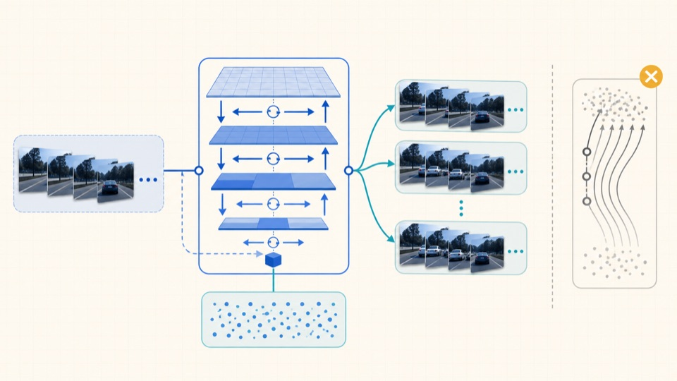</td>
<td><strong>2019 首次公开 → ICLR 2020 — <a href="https://research.google/pubs/videoflow-a-conditional-flow-based-model-for-stochastic-video-generation/">VideoFlow</a></strong> <code>Normalizing Flow</code> <strong>表示/机制：</strong>用可逆多尺度 normalizing flow 建模条件视频分布，并直接优化 likelihood。 <strong>控制/任务：</strong>根据历史帧采样多个随机未来。 <strong>意义/边界：</strong>补齐 GAN/VAE 之外的显式密度路线；这里的“flow”是可逆 normalizing flow，不等同于 2022 年后的 Flow Matching。 <strong>资源：</strong><a href="https://research.google/pubs/videoflow-a-conditional-flow-based-model-for-stochastic-video-generation/">Paper</a> · Project：— · Code（已归档）  · Weights：未公开 · Demo：—</td>
</tr>
</table>

### 随机预测与 GAN 的核心矛盾

对抗训练通常有利于感知锐度，但优化可能敏感，也不提供显式、易处理的 likelihood；显式概率模型能覆盖不确定性，却常受采样速度、重建或架构约束。样本质量与模式覆盖无法由单一指标同时充分衡量。

### 变分随机未来的延伸支线｜2019–2026

这条支线没有在 2018 停止，但也不能把所有带 latent/VAE 的新系统收进来。direct stochastic-future 节点需要 future-aware posterior、不看未来的 deployment prior 与 KL/ELBO；相邻 RSSM/world-model 支线则用新观测校正 posterior、用 action-conditioned prior 想象，并另验 action/reward/return 与 model exploitation。LPWM 是对象粒子与 latent action 的桥接节点。

| 首次公开 / 正式状态 | 节点 | 合同改变 | 证据边界 |
|---|---|---|---|
| 2019 / ICCV 2019 | [Improved Conditional VRNNs](https://openaccess.thecvf.com/content_ICCV_2019/html/Castrejon_Improved_Conditional_VRNNs_for_Video_Prediction_ICCV_2019_paper.html) | deep latent hierarchy + higher-capacity likelihood | hierarchy 与 capacity 效应缠绕；frame metric 多为 best-of-100 |
| 2020 / ICML 2020 | [SRVP](https://proceedings.mlr.press/v119/franceschi20a.html) | fully latent residual dynamics，frame synthesis 与 dynamics 解耦 | 一阶 residual 是结构限制；oracle frame metric 与 FVD 协议不同 |
| 2020 / ICLR 2021 | [DreamerV2](https://iclr.cc/virtual/2021/poster/2742) | categorical RSSM + KL balancing 的相邻控制支线 | Atari 55 tasks；discrete state 的里程碑不应归给 V3 |
| 2021 / CVPR、NeurIPS | [GHVAE](https://openaccess.thecvf.com/content/CVPR2021/html/Wu_Greedy_Hierarchical_Variational_Autoencoders_for_Large-Scale_Video_Prediction_CVPR_2021_paper.html)；[CW-VAE](https://proceedings.neurips.cc/paper/2021/hash/f490d0af974fedf90cb0f1edce8e3dd5-Abstract.html) | 贪心 deep hierarchy；slow-clock temporal abstraction | 模块数/容量是混杂；1000-frame 证据主要来自受控域 |
| 2022 / ICLR、CLeaR | [VPR](https://openreview.net/forum?id=JxFgJbZ-wft)；[VIM](https://proceedings.mlr.press/v177/assouel22a.html) | event-triggered hierarchy；object + categorical mechanism | 主要是合成事件/对象场景，不能外推开放视频 |
| 2023 / TMLR 2024 | [DDLP](https://openreview.net/forum?id=Wqn8zirthg) | particle-tracking posterior + Transformer dynamics prior | LPWM 的直接粒子前身；对象化场景、遮挡与相机运动仍是边界 |
| 2024 / ICML 2024 | [Stochastic Frame Prediction](https://proceedings.mlr.press/v235/jang24c.html) | categorical future latent 作为表示学习信号 | 单 future frame、生成质量非主证据 |
| 2023 / Nature 2025 | [DreamerV3](https://www.nature.com/articles/s41586-025-08744-2) | categorical RSSM、split KL、free bits 与 unimix | 150+ 控制任务；return 不是 uncertainty calibration |
| 2026 / ICLR 2026 Oral | [LPWM](https://openreview.net/forum?id=lTaPtGiUUc) | object particles + inverse-action posterior/policy prior + dynamics ELBO | 对象中心前沿，仍受 identity、对象数和相机运动限制 |
| 2026 / Neural Networks | [Implicit hierarchical temporal–spatial residual model](https://doi.org/10.1016/j.neunet.2026.108732) | prior–posterior residual + spatial hierarchy | 3 数据集作者协议；不证明 VAE 重回开放域 foundation-model 主干 |

纠错：2018 的 [Hierarchical Long-term Video Prediction without Supervision](https://proceedings.mlr.press/v80/wichers18a.html) 是高层 feature predictor + feature-space adversarial loss，没有上述 q/p/ELBO 合同，不能写成“分层随机 latent”。完整纳入/排除表和实验阈值见[变分随机视频生成](generative-models/variational-generation.md)。

---

## 生成机制 → 视频基础模型｜2017–2026：视觉 Token 与视频语言模型

早期节点主要把视频编码为离散符号，再使用语言模型式自回归或 masked prediction；2024 年后又出现连续兼容 latent、自适应预算和结构化表示。需要特别注意：连续/离散/结构化属于 **representation**，autoregressive/masked 属于 **factorization**，diffusion/flow/重建损失属于 **objective 或 decoder 路径**；MAGVIT 的离散 code 与 Sora/DiT 的连续 latent patch 并不是同一种“token”。完整术语和记账合同见[视频 Tokenizer 与生成式压缩](generative-models/video-tokenizers.md)。

<table>
<tr>
<td width="42%">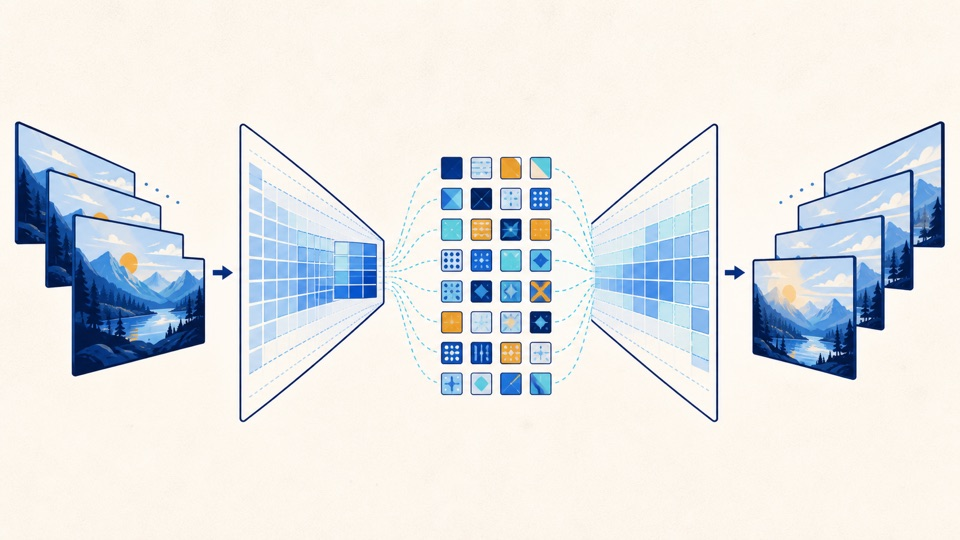</td>
<td><strong>2017 — <a href="https://arxiv.org/abs/1711.00937">VQ-VAE</a></strong> <code>离散表征基础</code> <strong>表示/机制：</strong>encoder 将连续特征量化为离散 codebook index，decoder 重建观测，prior 则另行学习。 <strong>控制/任务：</strong>论文覆盖图像、视频与语音，但它并非专门的视频 tokenizer。 <strong>意义/边界：</strong>为视觉 token 与两阶段生成奠基；压缩率、codebook 使用率和重建细节形成新的瓶颈。 <strong>资源：</strong><a href="https://arxiv.org/abs/1711.00937">Paper</a> · <a href="https://deepmind.google/blog/deepmind-papers-at-nips-2017/">Project</a> · Code（Sonnet 示例）  · Weights：未公开 · Demo/Notebook </td>
</tr>
</table>

<table>
<tr>
<td width="42%">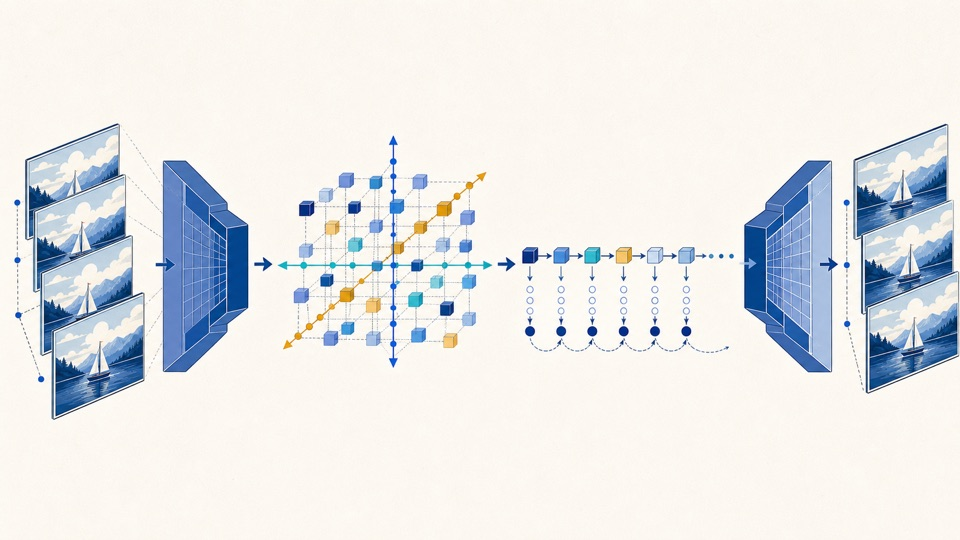</td>
<td><strong>2021 — <a href="https://arxiv.org/abs/2104.10157">VideoGPT</a></strong> <code>自回归视频 Transformer</code> <strong>表示/机制：</strong>用 3D convolution 与 axial attention 的 VQ-VAE 压缩视频，再由 GPT 式 Transformer 自回归预测离散 latent。 <strong>控制/任务：</strong>无条件、类别条件和视频前缀条件生成。 <strong>意义/边界：</strong>架构简单且概率形式统一；token 串行采样和长序列成本很高。 <strong>资源：</strong><a href="https://arxiv.org/abs/2104.10157">Paper</a> · <a href="https://wilsonyan.com/videogpt/index.html">Project</a> · Code  · Weights  · </td>
</tr>
</table>

<table>
<tr>
<td width="42%">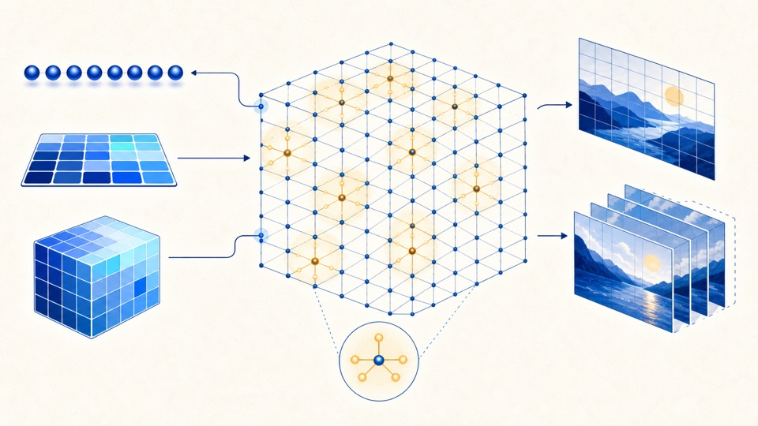</td>
<td><strong>2021 — <a href="https://arxiv.org/abs/2111.12417">NÜWA</a></strong> <code>统一视觉合成</code> <strong>表示/机制：</strong>以 3D Transformer encoder-decoder 和 3D Nearby Attention 统一处理一维文本、二维图像与三维视频。 <strong>控制/任务：</strong>覆盖文本到视频、视频预测以及零样本视觉编辑等任务。 <strong>意义/边界：</strong>较早展示“一套多模态预训练框架覆盖多种视觉合成”；规模与生成质量仍受当时 tokenizer 和算力限制。 <strong>资源：</strong><a href="https://arxiv.org/abs/2111.12417">Paper</a> · Project（资料仓库，已归档）  · Code：未公开 · Weights：未公开 · Demo：— · <a href="https://www.microsoft.com/en-us/research/articles/nuwa/">Overview</a></td>
</tr>
</table>

<table>
<tr>
<td width="42%">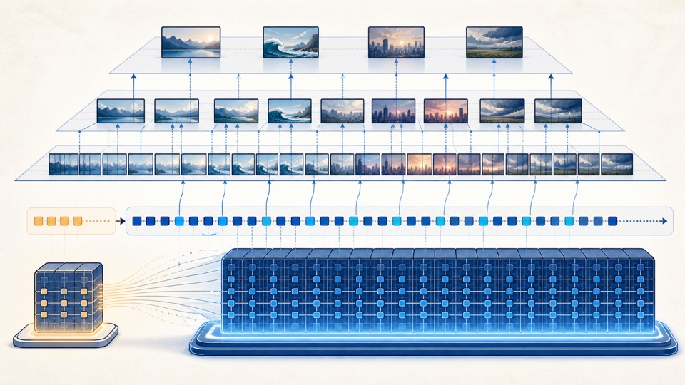</td>
<td><strong>2022 — <a href="https://arxiv.org/abs/2205.15868">CogVideo</a></strong> <code>大规模文本视频预训练</code> <strong>表示/机制：</strong>9B 自回归 Transformer 继承 CogView2 图像模型参数，并通过多帧率分层训练扩展到视频。 <strong>控制/任务：</strong>开放域文本到视频。 <strong>意义/边界：</strong>是首批开放的大规模预训练 T2V 路线之一；低帧率、低分辨率与自回归成本仍明显。 <strong>资源：</strong><a href="https://arxiv.org/abs/2205.15868">Paper</a> · Project  · Code  · Weights  · <a href="https://models.aminer.cn/cogvideo/">Demo</a></td>
</tr>
</table>

<table>
<tr>
<td width="42%">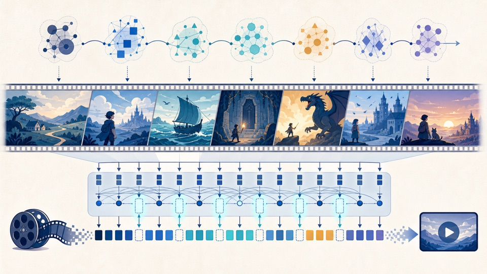</td>
<td><strong>2022 — <a href="https://arxiv.org/abs/2210.02399">Phenaki</a></strong> <code>Masked 生成</code> <strong>表示/机制：</strong>以带时间因果注意力的 C-ViViT tokenizer 压缩视频，再用文本条件双向 masked Transformer 迭代补全 token。 <strong>控制/任务：</strong>prompt 序列驱动可变长度、分段延展的视频叙事。 <strong>意义/边界：</strong>比纯自回归提高并行度；长视频仍依赖分段生成，身份、状态与质量会漂移。 <strong>资源：</strong><a href="https://arxiv.org/abs/2210.02399">Paper</a> · <a href="https://sites.research.google/gr/phenaki/">Project</a> · Code：未公开 · Weights：未公开 · Demo：—</td>
</tr>
</table>

<table>
<tr>
<td width="42%">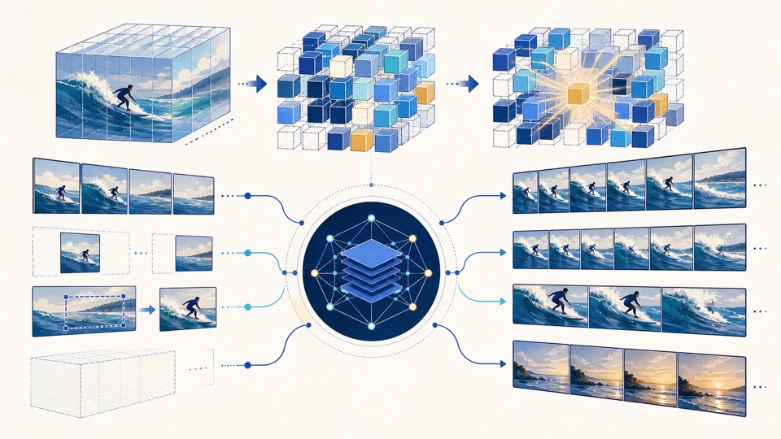</td>
<td><strong>2022 — <a href="https://arxiv.org/abs/2212.05199">MAGVIT</a></strong> <code>统一视频生成任务</code> <strong>表示/机制：</strong>3D tokenizer 将视频离散化，masked video token modeling 用一个模型覆盖十类生成任务。 <strong>控制/任务：</strong>可接受类别、图像、视频片段或掩码等不同条件。 <strong>意义/边界：</strong>首次公开为 2022，CVPR 发表为 2023；masked decoding 仍需多轮迭代，并受 tokenizer 重建损失限制。 <strong>资源：</strong><a href="https://arxiv.org/abs/2212.05199">Paper</a> · <a href="https://magvit.cs.cmu.edu/">Project</a> · Code（已归档）  · Weights：未公开 · Demo：—</td>
</tr>
</table>

<table>
<tr>
<td width="42%">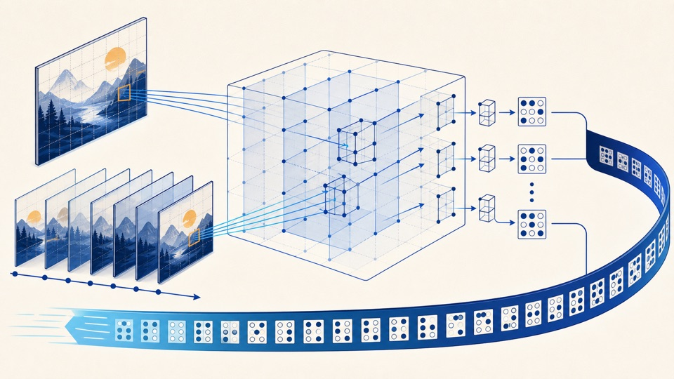</td>
<td><strong>2023 首次公开 / ICLR 2024 — <a href="https://arxiv.org/abs/2310.05737">MAGVIT-v2</a></strong> <code>视觉 tokenizer</code> <strong>表示/机制：</strong>使用 causal 3D CNN 与 lookup-free quantization，构造图像/视频共享的大型离散词表。 <strong>控制/任务：</strong>服务生成、紧凑表示和识别，并增强与语言模型式生成器的兼容；entropy regularizer 不是 entropy coder。 <strong>意义/边界：</strong>论文“LM beats diffusion”的结论来自相同数据、相近规模与预算的受控实验，不能泛化成所有语言模型都胜过 diffusion。 <strong>资源：</strong><a href="https://proceedings.iclr.cc/paper_files/paper/2024/hash/036912a83bdbb1fd792baf6532f102d8-Abstract-Conference.html">Paper（正式）</a> · <a href="https://magvit.cs.cmu.edu/v2/">Project</a> · Code：未公开 · Related Code（MAGVIT v1）  · Weights：未公开 · Demo：—</td>
</tr>
</table>

<table>
<tr>
<td width="42%">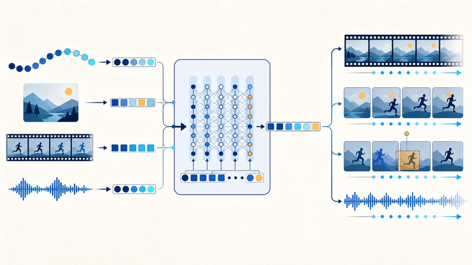</td>
<td><strong>2023 首次公开 / ICML 2024 — <a href="https://arxiv.org/abs/2312.14125">VideoPoet</a></strong> <code>多模态生成语言模型</code> <strong>表示/机制：</strong>decoder-only Transformer 统一处理文本、图像、视频与音频 token，以混合生成目标预训练后再适配任务。 <strong>控制/任务：</strong>文本/图像到视频、视频编辑、延展与视频到音频。 <strong>意义/边界：</strong>清楚展示“视频生成语言模型化”；离散 token 的序列长度、串行解码和 tokenizer 误差仍是代价。 <strong>资源：</strong><a href="https://proceedings.mlr.press/v235/kondratyuk24a.html">Paper（正式）</a> · <a href="https://sites.research.google/videopoet/">Project</a> · Code：未公开 · Weights：未公开 · Demo：—</td>
</tr>
</table>

### 2024–2026 视频表示前沿：首次公开与正式状态分列

下表只补表示层的结构性转折，不把 tokenizer 当成新的生成 factorization。`bitstream` 一列中的“是”要求概率模型、熵编码器和可解码码流；仅有更小 tensor、token 数或 nominal bits 时仍为“否”。

| 首次公开 | 正式状态（截至 2026-08-30） | 代表节点 | 改变的表示轴 | 实际 bitstream 证据 |
|---|---|---|---|---|
| 2023 | ICLR 2024 | [MAGVIT-v2](https://proceedings.iclr.cc/paper_files/paper/2024/hash/036912a83bdbb1fd792baf6532f102d8-Abstract-Conference.html) | lookup-free 离散量化与大隐式词表 | 否；entropy penalty 只是训练正则 |
| 2024 | NeurIPS 2024 | [CV-VAE](https://proceedings.neurips.cc/paper_files/paper/2024/hash/1787533e171dcc8549cc2eb5a4840eec-Abstract-Conference.html)；[OmniTokenizer](https://proceedings.neurips.cc/paper_files/paper/2024/hash/31994923f58ae5b2d661b300bd439107-Abstract-Conference.html) | 连续 latent 兼容；图像—视频联合 tokenizer | 否；报告 shape/dtype/grid/元素或 token 预算 |
| 2024-12 | **预印本；未发现正式 venue** | [VidTok](https://arxiv.org/abs/2412.13061) | 分开的 continuous-KL / discrete-FSQ 型号、causal / noncausal 与多种固定压缩配置 | 否；多型号不是 hybrid 或按样本 adaptive，VCR 也不是 bpp |
| 2024 | ICLR 2025 | [Causal VAE](https://proceedings.iclr.cc/paper_files/paper/2025/hash/03df5246cc78af497940338dd3eacbaa-Abstract-Conference.html)；[BSQ-ViT](https://proceedings.iclr.cc/paper_files/paper/2025/hash/e25198b6a75f74277ee3a2bd4165d9ef-Abstract-Conference.html)；[ElasticTok](https://proceedings.iclr.cc/paper_files/paper/2025/hash/5e6cec2a9520708381fe520246018e8b-Abstract-Conference.html)；[LARP](https://proceedings.iclr.cc/paper_files/paper/2025/hash/97c903fbf21a7d863af2015d8803ca8f-Abstract-Conference.html) | 因果联合编码、球面二值量化、可截断预算、generator-aware prior | **仅 BSQ-ViT 有实验性算术编码码流** |
| 2024 | CVPR 2025 | [CoordTok](https://openaccess.thecvf.com/content/CVPR2025/html/Jang_Efficient_Long_Video_Tokenization_via_Coordinate-based_Patch_Reconstruction_CVPR_2025_paper.html)；[VidTwin](https://openaccess.thecvf.com/content/CVPR2025/html/Wang_VidTwin_Video_VAE_with_Decoupled_Structure_and_Dynamics_CVPR_2025_paper.html)；[Divot](https://openaccess.thecvf.com/content/CVPR2025/html/Ge_Divot_Diffusion_Powers_Video_Tokenizer_for_Comprehension_and_Generation_CVPR_2025_paper.html) | triplane、结构/动态双分支、语义连续表示与生成式 de-tokenizer | 否；结构命名和 diffusion decoder 都不构成码流 |
| 2025 | ICLR 2026 | [InfoTok](https://proceedings.iclr.cc/paper_files/paper/2026/hash/432f048a844654ba981953491e6dc80e-Abstract-Conference.html)；[NeRV-Diffusion](https://proceedings.iclr.cc/paper_files/paper/2026/hash/1a17a06de88cf77f25cda0da91615a54-Abstract-Conference.html) | 内容自适应 token 预算；整段视频 INR-weight latent | 否；nominal BPP 与 latent weights 都不是码流 |
| 2025 | CVPR 2026 | [AdapTok](https://openaccess.thecvf.com/content/CVPR2026/html/Li_AdapTok_Learning_Adaptive_and_Temporally_Causal_Video_Tokenization_in_a_CVPR_2026_paper.html) | block-causal 1D adaptive latent | 否；还需计入 scorer、分配器与 ragged batching |
| 2026-07/08 | **预印本；未发现正式 venue** | [VideoRAE](https://arxiv.org/abs/2607.14088)；[V-RAE](https://arxiv.org/abs/2608.13556) | frozen video/visual foundation features、representation alignment 与固定预算的生成可学性 | 否；continuous/discrete 变体不是 hybrid，causal 性按 encoder variant 判断 |
| 2026-08 | **预印本；未发现正式 venue** | [KVAE](https://arxiv.org/abs/2608.05798) | 更高空间缩减的 causal continuous video VAE 家族 | 否；保持 preprint 与作者结果边界 |

### 视频 Token 与序列建模的核心矛盾

自回归模型具有统一概率形式，但串行采样昂贵；masked generation 提高并行度，却仍需多轮迭代。两者都受视频 token 数量、tokenizer 重建损失和长程状态一致性制约。

### 2024–2026 因果、流式与实时：四层合同怎样汇合

这条谱系横跨 factorization、训练历史、architecture、cache 与 serving，不是新的单一 objective。causal codec、causal generator、streaming commit 与 real-time SLO 也不能相互继承；详细的逐位置噪声、commit/backpressure、开放时长、作者速度口径和 `StreamFork-1` 见[因果流式专章](generative-models/causal-streaming-generation.md)。

| 首次公开 → 正式状态 | 节点 | 改变的层 | 证据边界 |
|---|---|---|---|
| 2024-07 → NeurIPS 2024 | [Diffusion Forcing](https://proceedings.neurips.cc/paper_files/paper/2024/hash/2aee1c4159e48407d68fe16ae8e6e49e-Abstract-Conference.html) | per-token noise 将 next-unit 与 full-sequence diffusion 接到同一训练接口 | 不内生 self-history、few-step、commit 或实时 SLO |
| 2024-12 → CVPR 2025 | [CausVid](https://openaccess.thecvf.com/content/CVPR2025/html/Yin_From_Slow_Bidirectional_to_Fast_Autoregressive_Video_Diffusion_Models_CVPR_2025_paper.html) | 双向 teacher → 4-step causal student 与 KV cache | GT/noised-GT 历史不等于 on-policy matching |
| 2025-06 → NeurIPS 2025 | [Self Forcing](https://proceedings.neurips.cc/paper_files/paper/2025/hash/f4823f831af67a3ef15e41a85434422a-Abstract-Conference.html) | 训练进入 self-generated rollout 分布 | detached history 仍留下 context-gradient 缺口 |
| 2025-09 → ICLR 2026 | [Rolling Forcing](https://openreview.net/forum?id=IAyzXjbfwo)；[LongLive](https://proceedings.iclr.cc/paper_files/paper/2026/hash/91a1610c6ed9e02d33f826b46f472b92-Abstract-Conference.html) | 联合 rolling noise、sink、长训、prompt recache 与固定滑窗 | 窗口内不一定严格逐帧；长 demo 不等于 survival 保证 |
| 2025-10/11 → MLSys 2026 | [StreamDiffusionV2](https://proceedings.mlsys.org/paper_files/paper/2026/hash/698cfaf72a208aef2e78bcac55b74328-Abstract-Conference.html) | TTFF、deadline、jitter、scheduler 与多卡 pipeline | 4×H100 aggregate FPS 不能替代单流延迟 |
| 2026-02 → CVPR/ICLR 2026 | [SCD](https://openaccess.thecvf.com/content/CVPR2026/html/Bai_Causality_in_Video_Diffusers_is_Separable_from_Denoising_CVPR_2026_paper.html)；[FlowCache](https://proceedings.iclr.cc/paper_files/paper/2026/hash/85dc8f85ff978b9c606d3b2f5b0da69a-Abstract-Conference.html) | 分离跨帧因果推理/帧内渲染；training-free per-chunk cache/KV 压缩 | architecture 加速与 serving 加速都不自动改变 history exposure |
| 2025-11 → ICLR 2026 | [MotionStream](https://proceedings.iclr.cc/paper_files/paper/2026/hash/0cece806cd3d1dfad4a893f016ad3d7d-Abstract-Conference.html) | 在线轨迹/相机输入、Self Forcing 与固定窗口汇合 | 官方仓库仍未提供可运行代码/权重；控制遵循不是 world-model 闭环 |
| 2026-02/05/06 | [Causal Forcing](https://arxiv.org/abs/2602.02214)（ICML 2026 accepted）、[Causal Forcing++](https://arxiv.org/abs/2605.15141)、[Causal-rCM](https://arxiv.org/abs/2606.25473) | flow-map 初始化、相邻时间 consistency 与 TF→SF recipe | step 不总等于 NFE；++ 首 latent frame 仍为 4 steps |

### 2021–2026 多视角与 4D：从动态重建到 camera × time 生成

这条谱系有两条不能混写的起点：动态场景重建从已捕获观测恢复可渲染状态，4D generation 则要为未见视角、时间或整段动态生成内容。普通 camera-controlled video 只覆盖 camera–time 平面的一条路径；同刻多视角、完整 query grid 和显式状态需要额外几何证据。详细的任务定义、五条技术路线和 `GridFork-1` 见[多视角与 4D 专章](tasks/multiview-4d-generation.md)。

| 首次公开 → 正式状态 | 节点 | 合同转折 | 未解决与证据边界 |
|---|---|---|---|
| 2020 → CVPR/ICCV 2021 | [D-NeRF](https://openaccess.thecvf.com/content/CVPR2021/html/Pumarola_D-NeRF_Neural_Radiance_Fields_for_Dynamic_Scenes_CVPR_2021_paper.html)；[Nerfies](https://openaccess.thecvf.com/content/ICCV2021/html/Park_Nerfies_Deformable_Neural_Radiance_Fields_ICCV_2021_paper.html) | canonical state + deformation 支持 novel view/time | per-scene optimization、pose 与 topology |
| 2023 → ICML 2023 | [MAV3D](https://proceedings.mlr.press/v202/singer23a.html) | T2V score distillation 首次把文字提升为 dynamic 3D state | SDS 成本、教师偏置与工件边界 |
| 2023 → ICLR/CVPR 2024 | [Consistent4D](https://openreview.net/forum?id=sPUrdFGepF)；[4D-GS](https://openaccess.thecvf.com/content/CVPR2024/html/Wu_4D_Gaussian_Splatting_for_Real-Time_Dynamic_Scene_Rendering_CVPR_2024_paper.html)；[Align Your Gaussians](https://openaccess.thecvf.com/content/CVPR2024/html/Ling_Align_Your_Gaussians_Text-to-4D_with_Dynamic_3D_Gaussians_and_Composed_CVPR_2024_paper.html) | video-to-4D consistency 与显式 dynamic Gaussian 汇合 | 实时渲染不等于实时构建；对象/场景范围有限 |
| 2024 → NeurIPS 2024 | [4Real](https://proceedings.neurips.cc/paper_files/paper/2024/hash/50358459632f7fc1c7e9f9f0ad0cc026-Abstract-Conference.html) | 真实视频 prior 推动 scene-level photorealistic text-to-4D | staged、per-scene pipeline |
| 2024 → ICLR 2025 | [4DiM](https://openreview.net/forum?id=d2UrCGtntF)；[SV4D](https://proceedings.iclr.cc/paper_files/paper/2025/hash/5297e56ac65ba2bfa70ee9fc4818c042-Abstract-Conference.html)；[GenXD](https://proceedings.iclr.cc/paper_files/paper/2025/hash/ee2841db84cd09a5f6e3e313ce3d79d9-Abstract-Conference.html) | camera/time 条件、multi-frame/multi-view diffusion 与可变条件视图进入统一模型 | 固定窗口、数据稀缺与 query 顺序一致性 |
| 2024 → CVPR 2025 | [CAT4D](https://openaccess.thecvf.com/content/CVPR2025/html/Wu_CAT4D_Create_Anything_in_4D_with_Multi-View_Video_Diffusion_Models_CVPR_2025_paper.html)；[4Real-Video](https://openaccess.thecvf.com/content/CVPR2025/html/Wang_4Real-Video_Learning_Generalizable_Photo-Realistic_4D_Video_Diffusion_CVPR_2025_paper.html) | camera-time grid→deformable state；可泛化 4D video diffusion | 生成网格偏差可能被状态优化固化 |
| 2025 → ICCV 2025 | [SV4D 2.0](https://openaccess.thecvf.com/content/ICCV2025/html/Yao_SV4D_2.0_Enhancing_Spatio-Temporal_Consistency_in_Multi-View_Video_Diffusion_for_ICCV_2025_paper.html)；[Free4D](https://openaccess.thecvf.com/content/ICCV2025/html/Liu_Free4D_Tuning-free_4D_Scene_Generation_with_Spatial-Temporal_Consistency_ICCV_2025_paper.html) | 大运动/遮挡、渐进 3D→4D 与免微调单图场景 | 未见区域不确定性和跨域几何 |
| 2026 → CVPR 2026 | [4C4D](https://openaccess.thecvf.com/content/CVPR2026/html/Zhou_4C4D_4_Camera_4D_Gaussian_Splatting_CVPR_2026_paper.html)；[DGGT](https://openaccess.thecvf.com/content/CVPR2026/html/Chen_DGGT_Feedforward_4D_Reconstruction_of_Dynamic_Driving_Scenes_using_Unposed_CVPR_2026_paper.html)；[MoRel](https://openaccess.thecvf.com/content/CVPR2026/html/Kwak_MoRel_Long-Range_Flicker-Free_4D_Motion_Modeling_via_Anchor_Relay-based_Bidirectioanl_CVPR_2026_paper.html)；[4DSurf](https://openaccess.thecvf.com/content/CVPR2026/html/Wu_4DSurf_High-Fidelity_Dynamic_Scene_Surface_Reconstruction_CVPR_2026_paper.html) | 极稀疏相机、pose-as-output、长时 anchor 与 surface consistency | 域特定、构建/更新/渲染仍需分账 |
| 2026-05/07/08 → 预印本 | [Full-4D](https://arxiv.org/abs/2605.25500)；[MV-Forcing](https://arxiv.org/abs/2607.05376)；[Stream4D](https://arxiv.org/abs/2608.19556)；[4DStreamCtrl](https://arxiv.org/abs/2608.25479) | full-scope grid、长时多视角 self-forcing、动态 4D reward 与在线 3D 控制 | 正式发表、开放工件与 SLO 均需逐项复核 |

---

## 视频基础模型｜2020–2026：表示、Objective、Backbone 与规模化生成

这条路线发生的是三条可组合而非互相替代的迁移：representation 从 pixel 扩展到连续 latent，objective 从 denoising/score 扩展到 flow/consistency 等路径，规模化 backbone 从 U-Net 扩展到 Transformer/DiT、window/factorized/full、sparse/linear/hybrid 与 noise-time experts。U-Net、hybrid 与任务专用结构仍并存；不能把三条轴压成“U-Net 被 DiT/Flow 淘汰”，也不能把所有方法概括为“逐步去噪”。完整公式、论文精读和公平实验见[Video DiT 与骨干扩展](generative-models/video-dit-backbones.md)。

### Backbone 子谱系：首次公开与正式发表分开

| First-public → formal | 节点 | 可核验推进 | 不应越界的结论 |
|---|---|---|---|
| 2022-12 → ICCV 2023 | [DiT](https://openaccess.thecvf.com/content/ICCV2023/html/Peebles_Scalable_Diffusion_Models_with_Transformers_ICCV_2023_paper.html) | latent patch Transformer、adaLN-Zero 与图像 scaling | 图像结果不是视频时序证据 |
| 2023-12 → ECCV 2024 | [W.A.L.T.](https://www.ecva.net/papers/eccv_2024/papers_ECCV/html/10270_ECCV_2024_paper.php) | spatial/spatiotemporal window attention | window 降直接连边，也延长跨窗传播路径 |
| 2024-01 → TMLR 2025 | [Latte](https://openreview.net/forum?id=ntGPYNUF3t) | 四类 factorized Video DiT 变体 | 小/中规模作者配置不是全局 topology 排名 |
| 2024-08 → ICLR 2025 | [CogVideoX](https://proceedings.iclr.cc/paper_files/paper/2025/hash/ce31378e9f41d8907e97dab172b6c559-Abstract-Conference.html) | joint full attention、Expert AdaLN、3D RoPE、frame packing | Expert AdaLN 不是 MoE |
| 2024-12 / 2025-02 → 作者报告 | [HunyuanVideo](https://arxiv.org/abs/2412.03603) / [Step-Video-T2V](https://arxiv.org/abs/2502.10248) | dual→single/full 与 video-full + text-cross 两类规模化融合 | 系统结果不能只归因于 attention |
| 2025-07 → 官方 artifact | Wan2.2  | 按噪声时间硬切 high/low-noise experts | 不是 token-routed MoE；无独立 Wan2.2 正式论文 |
| 2025-09 → ICLR 2026 | [SANA-Video](https://proceedings.iclr.cc/paper_files/paper/2026/hash/41b93c59da0d0f835907fd661d419db2-Abstract-Conference.html) | block linear DiT 与 constant-memory cumulative state | 分钟级、720p 与速度均是作者协议 |
| 2026-07 → 预印本/部分开放 | [SANA-Video 2.0](https://arxiv.org/abs/2607.21553) | 75% linear + 25% softmax anchor、AttnRes | 固定 dense 比例使严格渐近仍含 $O(N^2)$；14B 截止日未发布 |
| 2025-10 → CVPR 2026 | [LinVideo](https://openaccess.thecvf.com/content/CVPR2026/html/Huang_LinVideo_A_Post-Training_Framework_towards_On_Attention_in_Efficient_Video_CVPR_2026_paper.html) | 选择性 post-training linearization | 4-step 结果还改变 NFE，不能归给 attention alone |
| 2026 formal | [RAPID](https://openaccess.thecvf.com/content/CVPR2026/papers/Lin_RAPID_Reusing_Attention_Sparsity_with_Inter-step_Adaptation_for_Efficient_Video_CVPR_2026_paper.pdf)、[DSA](https://proceedings.iclr.cc/paper_files/paper/2026/hash/c3728248f3c627d1f16ca5726cdf83f5-Abstract-Conference.html)、[TimeRipples](https://openaccess.thecvf.com/content/CVPR2026/html/Mao_TimeRipples_Accelerating_vDiTs_by_Understanding_the_Spatio-Temporal_Correlations_in_Latent_CVPR_2026_paper.html) | inter-step sparse mask reuse、distributed sparse execution、intra-attention 时空复用 | 三者不是同一种 cache；TimeRipples 的速度含比例估算 |

<table>
<tr>
<td width="42%">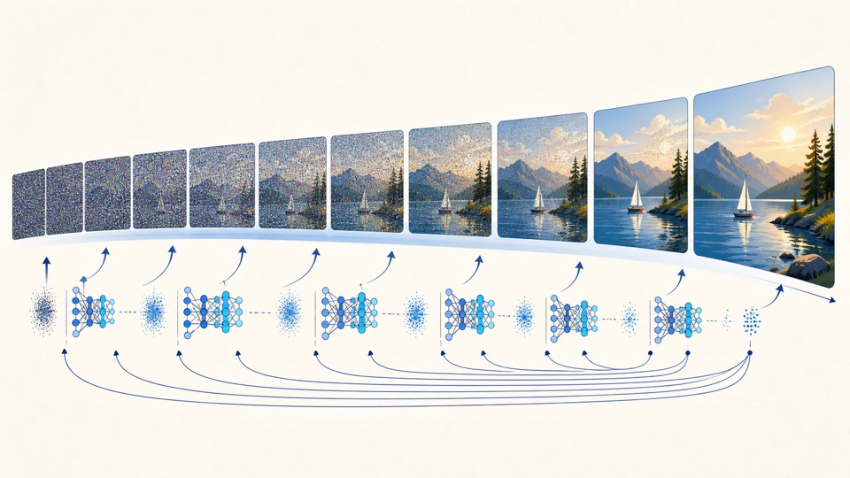</td>
<td><strong>2020 — <a href="https://arxiv.org/abs/2006.11239">DDPM</a></strong> <code>Diffusion 基础</code> <strong>表示/机制：</strong>通过前向加噪和学习反向去噪，连接 diffusion probabilistic model 与 denoising score matching。 <strong>控制/任务：</strong>原工作主要是图像生成，不是视频模型。 <strong>意义/边界：</strong>奠定现代 diffusion 训练框架；直接在高维视频像素上扩展会带来巨大计算成本。 <strong>资源：</strong><a href="https://arxiv.org/abs/2006.11239">Paper</a> · <a href="https://hojonathanho.github.io/diffusion/">Project</a> · Code  · <a href="https://www.dropbox.com/sh/pm6tn31da21yrx4/AABWKZnBzIROmDjGxpB6vn6Ja">Weights</a> · Demo：—</td>
</tr>
</table>

<table>
<tr>
<td width="42%">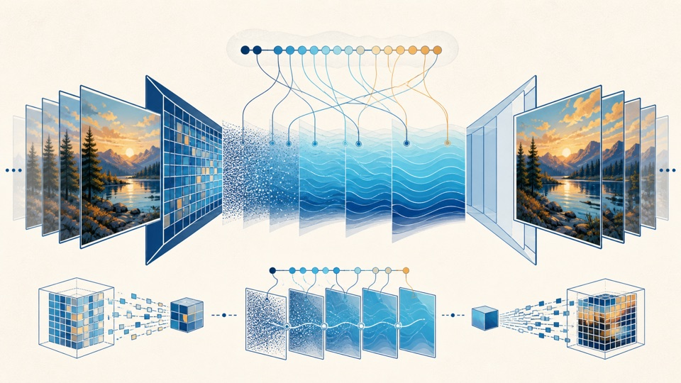</td>
<td><strong>2021 — <a href="https://arxiv.org/abs/2112.10752">Latent Diffusion Models</a></strong> <code>连续 latent</code> <strong>表示/机制：</strong>先用 autoencoder 把图像压缩到连续 latent，再在 latent 中做 diffusion，并以 cross-attention 接受文本等条件。 <strong>控制/任务：</strong>通用条件图像生成。 <strong>意义/边界：</strong>是 Video LDM 与大量视频 latent diffusion 的直接基础；压缩节省算力，也可能丢失细节。 <strong>资源：</strong><a href="https://arxiv.org/abs/2112.10752">Paper</a> · <a href="https://ommer-lab.com/research/latent-diffusion-models/">Project</a> · Code  · <a href="https://huggingface.co/CompVis/ldm-text2im-large-256">Weights</a> · <a href="https://huggingface.co/spaces/CompVis/text2img-latent-diffusion">Demo</a></td>
</tr>
</table>

<table>
<tr>
<td width="42%">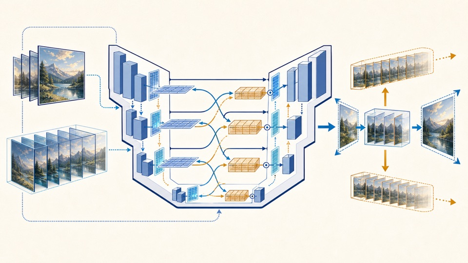</td>
<td><strong>2022 / NeurIPS 2022 — <a href="https://proceedings.neurips.cc/paper_files/paper/2022/hash/39235c56aef13fb05a6adc95eb9d8d66-Abstract-Conference.html">Video Diffusion Models</a></strong> <code>视频 diffusion</code> <strong>表示/机制：</strong>将图像 diffusion 的 U-Net 扩展到时空域，联合图像与视频训练，并通过条件采样进行空间与时间延展。 <strong>控制/任务：</strong>无条件视频、视频预测和扩展。 <strong>意义/边界：</strong>系统证明 diffusion 可用于视频；像素空间训练和多步采样成本很高。 <strong>资源：</strong><a href="https://proceedings.neurips.cc/paper_files/paper/2022/hash/39235c56aef13fb05a6adc95eb9d8d66-Abstract-Conference.html">Paper</a> · <a href="https://video-diffusion.github.io/">Project</a> · Code：未公开 · Weights：未公开 · Demo：—</td>
</tr>
</table>

<table>
<tr>
<td width="42%">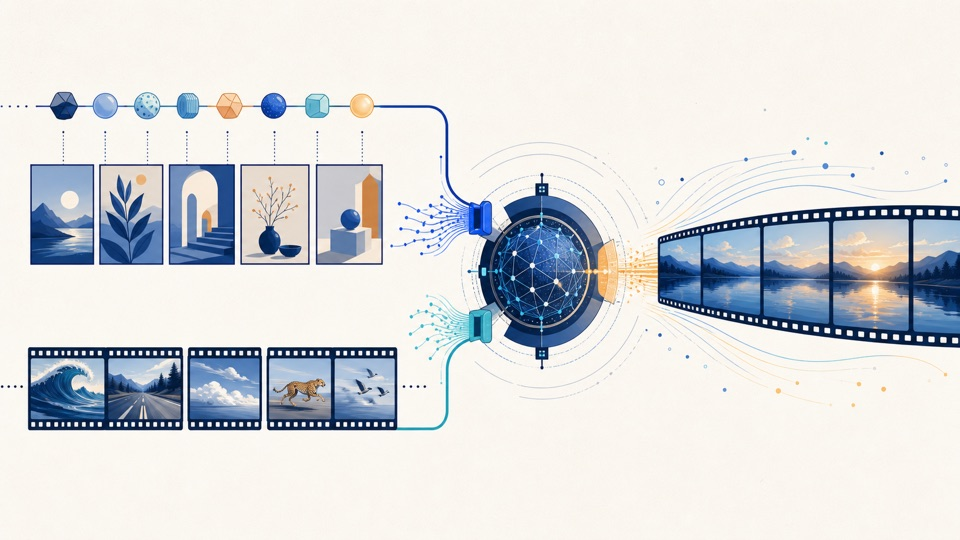</td>
<td><strong>2022 — <a href="https://arxiv.org/abs/2209.14792">Make-A-Video</a></strong> <code>弱配对文本视频</code> <strong>表示/机制：</strong>从图文数据学习语义，从无标注视频学习运动，并以分解时空 U-Net 生成视频。 <strong>控制/任务：</strong>在无需成对文本—视频训练集的情况下做文本到视频。 <strong>意义/边界：</strong>缓解高质量视频字幕稀缺；跨数据源学到的语义与运动仍可能错配。 <strong>资源：</strong><a href="https://arxiv.org/abs/2209.14792">Paper</a> · <a href="https://makeavideo.studio/">Project</a> · Code：未公开 · Weights：未公开 · Demo：—</td>
</tr>
</table>

<table>
<tr>
<td width="42%">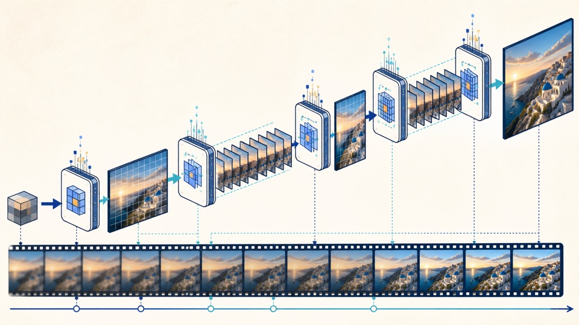</td>
<td><strong>2022 — <a href="https://arxiv.org/abs/2210.02303">Imagen Video</a></strong> <code>级联超分辨率</code> <strong>表示/机制：</strong>低分辨率 base model 后接交错的空间与时间超分辨率 diffusion，并使用 v-parameterization 与 progressive distillation。 <strong>控制/任务：</strong>高分辨率文本到视频。 <strong>意义/边界：</strong>把分辨率与帧率逐级放大；多模型级联增加训练、推理与误差传播成本。 <strong>资源：</strong><a href="https://arxiv.org/abs/2210.02303">Paper</a> · <a href="https://imagen.research.google/video/">Project</a> · Code：未公开 · Weights：未公开 · Demo：—</td>
</tr>
</table>

<table>
<tr>
<td width="42%">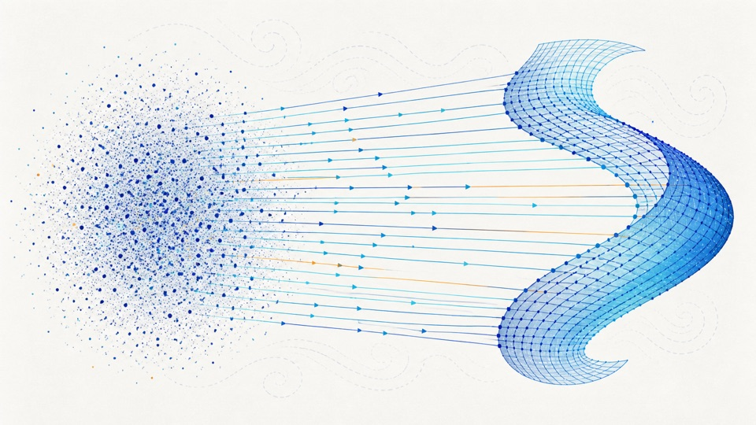</td>
<td><strong>2022 — <a href="https://arxiv.org/abs/2209.03003">Rectified Flow</a> / <a href="https://arxiv.org/abs/2210.02747">Flow Matching</a></strong> <code>连续速度场</code> <strong>表示/机制：</strong>学习把噪声运输到数据的 ODE 速度场；Rectified Flow 强调拉直运输轨迹，Flow Matching 提供无需模拟完整轨迹的条件速度回归。 <strong>控制/任务：</strong>最初是通用生成建模基础，随后进入大规模图像和视频模型。 <strong>意义/边界：</strong>可包含 diffusion path，也可使用其他概率路径；它不是简单的“逐步反向去噪”同义词。 <strong>资源：</strong><a href="https://arxiv.org/abs/2209.03003">Paper-RF</a> · <a href="https://arxiv.org/abs/2210.02747">Paper-FM</a> · <a href="https://rectifiedflow.github.io/">Project-RF</a> · <a href="https://ai.meta.com/research/publications/flow-matching-guide-and-code/">Project-FM</a> · Code-RF  · Code-FM  · Weights：不适用 · Demo：—</td>
</tr>
</table>

<table>
<tr>
<td width="42%">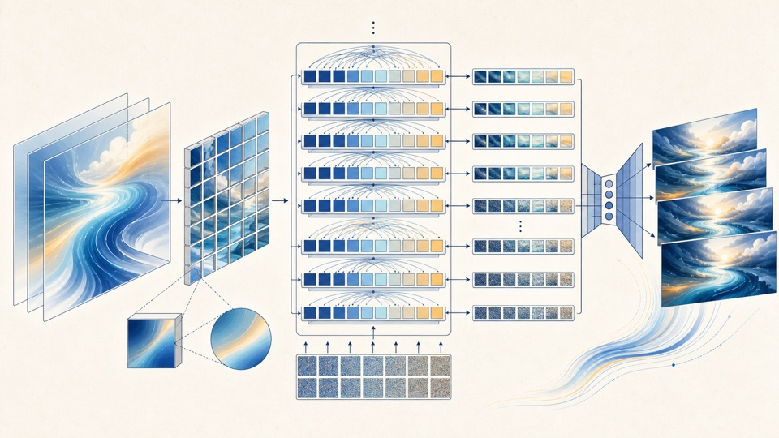</td>
<td><strong>2022 — <a href="https://arxiv.org/abs/2212.09748">Diffusion Transformer</a></strong> <code>DiT 架构桥梁</code> <strong>表示/机制：</strong>把连续 latent 切成 patch token，以 Transformer 替换常用 U-Net，并展示生成质量随模型计算规模提高。 <strong>控制/任务：</strong>原论文是类别条件图像生成。 <strong>意义/边界：</strong>为 Sora 与后续视频 DiT 提供直接架构桥梁；图像结果本身不证明视频时序能力。 <strong>资源：</strong><a href="https://arxiv.org/abs/2212.09748">Paper</a> · <a href="https://www.wpeebles.com/DiT">Project</a> · Code（已归档）  · <a href="https://dl.fbaipublicfiles.com/DiT/models/DiT-XL-2-256x256.pt">Weights</a> · <a href="https://huggingface.co/spaces/wpeebles/DiT">Demo（当前不可用）</a></td>
</tr>
</table>

<table>
<tr>
<td width="42%">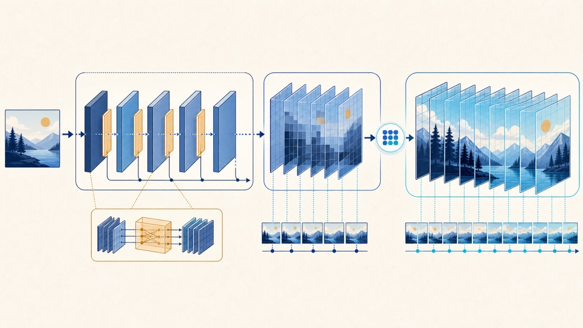</td>
<td><strong>2023 — <a href="https://arxiv.org/abs/2304.08818">Latent Video Diffusion</a></strong> <code>视频 latent diffusion</code> <strong>表示/机制：</strong>从图像 LDM 预训练出发加入时间维，在视频上微调，并让图像 upsampler 具备时间对齐能力。 <strong>控制/任务：</strong>文本到视频和高分辨率视频合成。 <strong>意义/边界：</strong>首次公开和 CVPR 均为 2023；图像先验降低训练成本，但运动学习仍依赖视频数据。 <strong>资源：</strong><a href="https://arxiv.org/abs/2304.08818">Paper</a> · <a href="https://research.nvidia.com/labs/toronto-ai/VideoLDM/">Project</a> · Code：未公开 · Weights：未公开 · Demo：—</td>
</tr>
</table>

<table>
<tr>
<td width="42%">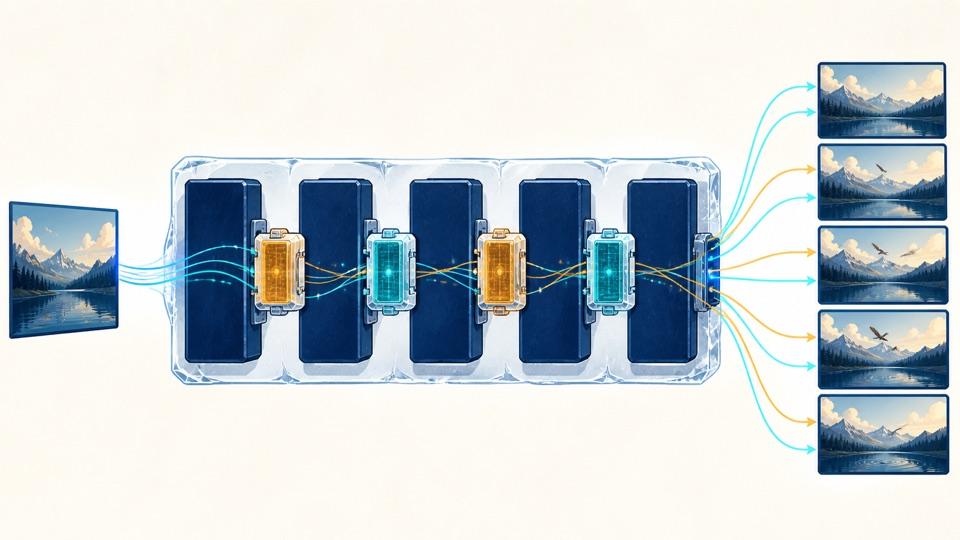</td>
<td><strong>2023 — <a href="https://arxiv.org/abs/2307.04725">AnimateDiff</a></strong> <code>可插拔运动模块</code> <strong>表示/机制：</strong>训练可插入同一基础文本图像 diffusion 家族的 motion module，并可用 MotionLoRA 学习新运动模式。 <strong>控制/任务：</strong>让个性化图像模型在尽量保留外观能力的同时生成动画。 <strong>意义/边界：</strong>显著降低社区视频化门槛；强图像先验不自动保证复杂物理和长程状态一致性。 <strong>资源：</strong><a href="https://arxiv.org/abs/2307.04725">Paper</a> · <a href="https://animatediff.github.io/">Project</a> · Code  · <a href="https://huggingface.co/guoyww/animatediff">Weights</a> · Demo：—</td>
</tr>
</table>

<table>
<tr>
<td width="42%"></td>
<td><strong>2023 — <a href="https://arxiv.org/abs/2311.15127">Stable Video Diffusion</a></strong> <code>开放权重</code> <strong>表示/机制：</strong>采用图像预训练、视频预训练、高质量视频微调三阶段流程，并系统研究视频数据筛选。 <strong>控制/任务：</strong>公开的重点权重用于图像到视频。 <strong>意义/边界：</strong>推动社区复现与应用；应称“开放权重”而非笼统“完全开源”，使用范围以<a href="https://huggingface.co/stabilityai/stable-video-diffusion-img2vid">模型卡</a>为准。 <strong>资源：</strong><a href="https://arxiv.org/abs/2311.15127">Paper</a> · <a href="https://stability.ai/news/stable-video-diffusion-open-ai-video-model">Project</a> · Code  · <a href="https://huggingface.co/stabilityai/stable-video-diffusion-img2vid">Weights</a> · Demo：—</td>
</tr>
</table>

<table>
<tr>
<td width="42%">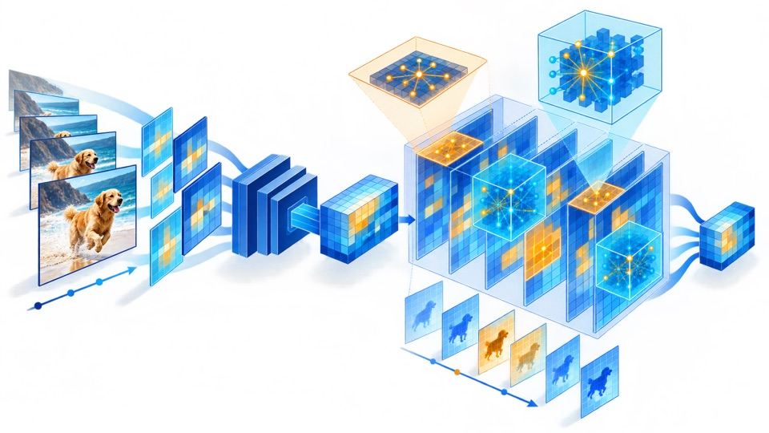</td>
<td><strong>2023 — <a href="https://arxiv.org/abs/2312.06662">W.A.L.T.</a></strong> <code>视频 diffusion Transformer</code> <strong>表示/机制：</strong>causal encoder 在共享 latent 中压缩图像和视频，window attention 兼顾空间与时空生成，并以三级模型输出高分辨率视频。 <strong>控制/任务：</strong>联合图像/视频与文本到视频。 <strong>意义/边界：</strong>是 Sora 前重要的视频 DiT 节点；窗口化降低计算，也限制直接全局交互。 <strong>资源：</strong><a href="https://arxiv.org/abs/2312.06662">Paper</a> · <a href="https://walt-video-diffusion.github.io/">Project</a> · Code：未公开 · Weights：未公开 · Demo：—</td>
</tr>
</table>

<table>
<tr>
<td width="42%">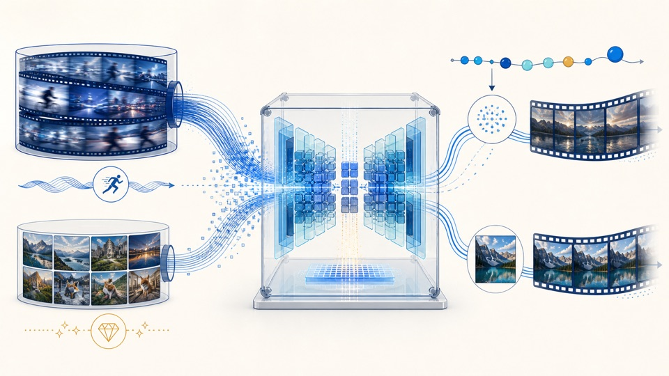</td>
<td><strong>2023/2024 — <a href="https://arxiv.org/abs/2310.19512">VideoCrafter1</a> / <a href="https://arxiv.org/abs/2401.09047">VideoCrafter2</a></strong> <code>开放研究生态</code> <strong>表示/机制：</strong>VideoCrafter1 公开 T2V/I2V diffusion 权重；VideoCrafter2 探索用低质量视频学习运动、用高质量合成图像提升画质的解耦训练。 <strong>控制/任务：</strong>文本到视频、图像到视频。 <strong>意义/边界：</strong>提供可研究的开放基线；训练数据质量分离并不消除语义、运动和身份的一致性问题。 <strong>资源：</strong><a href="https://arxiv.org/abs/2310.19512">Paper-V1</a> · <a href="https://arxiv.org/abs/2401.09047">Paper-V2</a> · <a href="https://ailab-cvc.github.io/videocrafter1/">Project-V1</a> · <a href="https://ailab-cvc.github.io/videocrafter2/">Project-V2</a> · Code  · <a href="https://huggingface.co/VideoCrafter/VideoCrafter2">Weights</a> · <a href="https://huggingface.co/spaces/VideoCrafter/VideoCrafter">Demo（当前不可用）</a></td>
</tr>
</table>

<table>
<tr>
<td width="42%">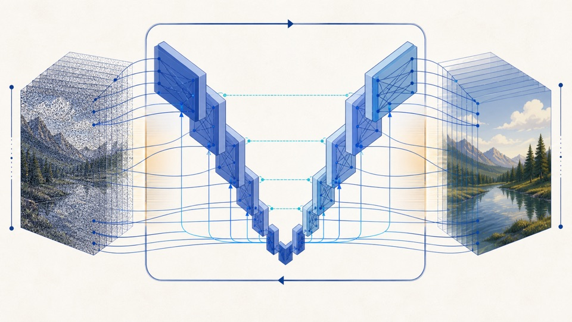</td>
<td><strong>2024 — <a href="https://arxiv.org/abs/2401.12945">Lumiere</a></strong> <code>全时域联合生成</code> <strong>表示/机制：</strong>Space-Time U-Net 在每个 diffusion step 联合处理完整时间范围，避免先生成关键帧再做时间超分。 <strong>控制/任务：</strong>文本到视频、图像动画与局部编辑。 <strong>意义/边界：</strong>“一次处理全时域”不等于一次网络调用完成采样；仍需要多步 diffusion。 <strong>资源：</strong><a href="https://arxiv.org/abs/2401.12945">Paper</a> · <a href="https://lumiere-video.github.io/">Project</a> · Code：未公开 · Weights：未公开 · Demo：—</td>
</tr>
</table>

<table>
<tr>
<td width="42%">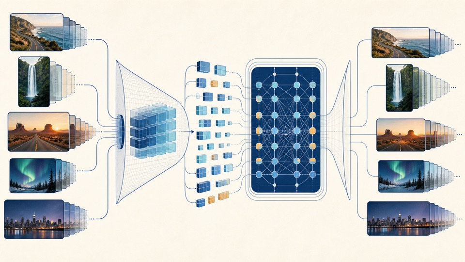</td>
<td><strong>2024 — <a href="https://openai.com/index/video-generation-models-as-world-simulators/">Sora</a></strong> <code>视频基础模型</code> <strong>表示/机制：</strong>将压缩视频 latent 切成可适配不同时长、分辨率和宽高比的空时 patch，再以 diffusion Transformer 建模。 <strong>控制/任务：</strong>文本、图像与视频条件生成和编辑。 <strong>意义/边界：</strong>2024-02-15 发布的是技术报告和演示，未公开完整实现；报告展示最长一分钟样例，也同时公开物体永久性与物理失败。 <strong>资源：</strong><a href="https://openai.com/index/video-generation-models-as-world-simulators/">Tech Report</a> · <a href="https://openai.com/index/sora-is-here/">Project</a> · Code：未公开 · Weights：未公开 · Demo：—</td>
</tr>
</table>

<table>
<tr>
<td width="42%">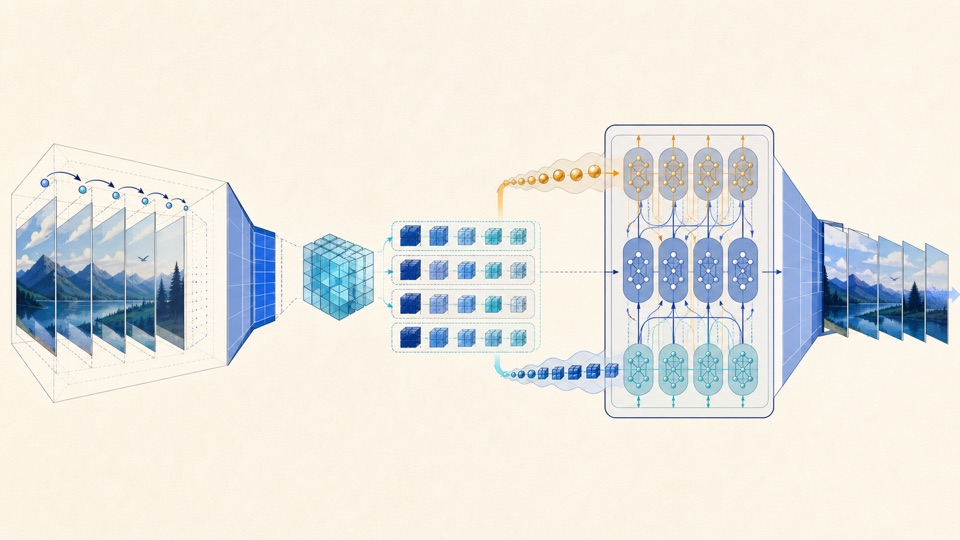</td>
<td><strong>2024 — <a href="https://arxiv.org/abs/2408.06072">CogVideoX</a></strong> <code>开放视频 DiT</code> <strong>表示/机制：</strong>3D causal VAE 做时空压缩，expert adaptive LayerNorm 融合文本/视频，并使用渐进训练与多分辨率 frame packing。 <strong>控制/任务：</strong>开放权重文本到视频和图像到视频。 <strong>意义/边界：</strong>补充了可复现的大规模视频 DiT 路线；论文中的领先结论依赖特定自动指标与人评设置。 <strong>资源：</strong><a href="https://arxiv.org/abs/2408.06072">Paper</a> · <a href="https://yzy-thu.github.io/CogVideoX-demo/">Project</a> · Code  · <a href="https://huggingface.co/zai-org/CogVideoX-5b">Weights</a> · <a href="https://huggingface.co/spaces/zai-org/CogVideoX-5B-Space">Demo</a></td>
</tr>
</table>

<table>
<tr>
<td width="42%">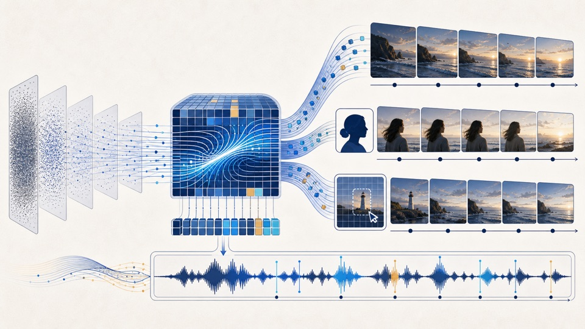</td>
<td><strong>2024 — <a href="https://arxiv.org/abs/2410.13720">Movie Gen</a></strong> <code>Flow Matching 媒体模型家族</code> <strong>表示/机制：</strong>最大视频模型为 30B Transformer，在时空 latent 上采用 Flow Matching；最长上下文约 73K 视频 token。 <strong>控制/任务：</strong>把视频生成、个性化、精准编辑与同步音频组织成模型家族。 <strong>意义/边界：</strong>作者报告 16 秒、16 FPS、1080p 等结果；这是大规模 Flow Matching 进入视频的强证据，但不是单一 checkpoint 完成全部任务。 <strong>资源：</strong><a href="https://arxiv.org/abs/2410.13720">Paper</a> · <a href="https://ai.meta.com/research/movie-gen/">Project</a> · Code：未公开 · Weights：未公开 · Demo：—</td>
</tr>
</table>

<table>
<tr>
<td width="42%">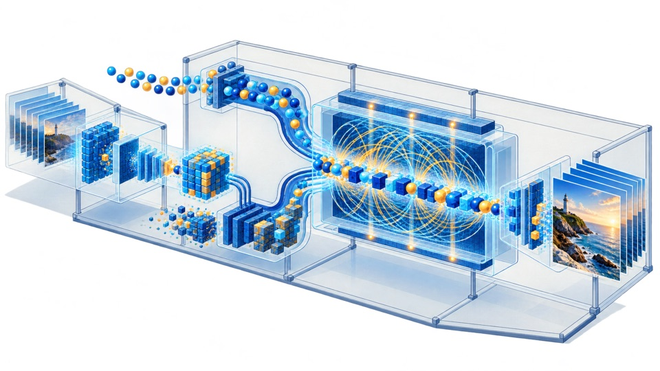</td>
<td><strong>2024 — <a href="https://arxiv.org/abs/2412.03603">HunyuanVideo</a></strong> <code>开放大型视频模型</code> <strong>表示/机制：</strong>causal 3D VAE 压缩视频，dual-stream 到 single-stream 的 full-attention Transformer 融合文本/视频，并使用 flow-matching scheduler。 <strong>控制/任务：</strong>文本到视频，并公开代码和权重 。 <strong>意义/边界：</strong>超过 13B 参数，缩小开放与闭源系统的规模差距；专业人评结论仍主要来自作者报告。 <strong>资源：</strong><a href="https://arxiv.org/abs/2412.03603">Paper</a> · <a href="https://aivideo.hunyuan.tencent.com/">Project</a> · Code  · <a href="https://huggingface.co/tencent/HunyuanVideo">Weights</a> · Demo：—</td>
</tr>
</table>

<table>
<tr>
<td width="42%">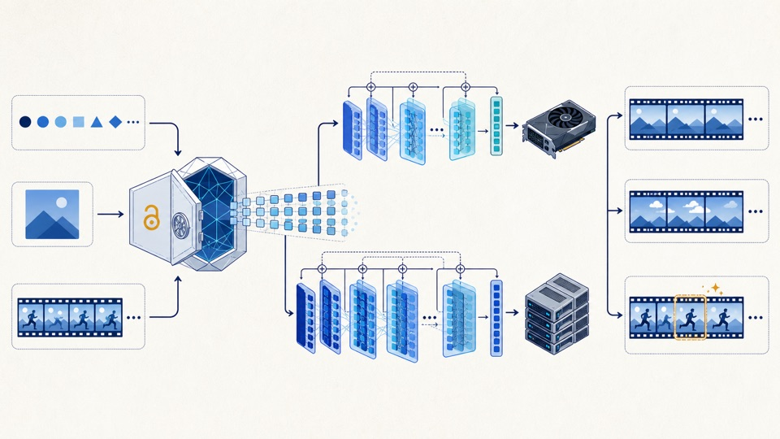</td>
<td><strong>2025 — <a href="https://arxiv.org/abs/2503.20314">Wan 2.1</a></strong> <code>首次预印本</code> <code>前沿观察（暂定）</code> <code>开放视频基础模型家族</code> <strong>表示/机制：</strong>预印本提出视频 DiT 模型家族，以新 VAE、规模化预训练、数据治理和自动评测支撑 1.3B/14B 规模。 <strong>控制/任务：</strong>覆盖 T2V、I2V、视频编辑与个性化等任务，代码和模型开放 。 <strong>意义/边界：</strong>作者报告 1.3B 版本约需 8.19 GB 显存；性能与效率数字应在具体硬件、分辨率和评测设置下理解。 <strong>资源：</strong><a href="https://arxiv.org/abs/2503.20314">Preprint</a> · <a href="https://wan.video/">Project</a> · Code  · <a href="https://huggingface.co/Wan-AI/Wan2.1-T2V-14B">Weights</a> · <a href="https://huggingface.co/spaces/Wan-AI/Wan2.1">Demo</a></td>
</tr>
</table>

### 开放集视频个性化支线｜2022–2026：从每主体适配到多参考绑定

这条支线的参考图**不占输出时间轴**：目标是让测试时未见主体在新场景、动作和组合中保持身份，而不是复制首帧或修改既有视频。下表只标合同转折；完整论文、正式年份、开放工件与反证协议见[开放集视频个性化](tasks/personalized-video-generation.md)。

| 时间 | 代表节点 | 合同转折 | 仍需保留的边界 |
|---|---|---|---|
| 2022–2023 | Textual Inversion、DreamBooth → AnimateDiff | 先学新图像概念/主体，再用通用 motion module 把个性化图像先验视频化 | 图像身份证据不等于时序、动作或绑定证据 |
| 2023–2024 | VideoDreamer、VideoBooth、DreamVideo、CustomVideo、DisenStudio、Magic-Me | 进入直接视频定制，并分化为逐主体优化、identity/motion adapter 和 feed-forward 图像提示 | 免调优不自动意味 open-set；多主体样例不等于 binding 定量 |
| 2024–2025 | ConsisID、Video Alchemist、Movie Weaver、VideoMage、PersonalVideo、MagicID / Phantom / DualReal | 从单主体适配推进到摊销式 open-set、多主体绑定和身份—运动 Pareto | 需说清是否每主体优化、适配预算及底座数据污染 |
| 2025 | MSRVTT-Personalization → OpenS2V-Nexus | 从演示转向 identity-disjoint 拆分、主体缺失计零、身份/运动分轴与规模化数据基础设施 | 人脸/图像代理指标仍不证明长时绑定、无泄漏或通用物体能力 |
| 2026 | AlcheMinT、ID-Crafter、Gloria、PoCo、ID-Sim / Vera | 多参考出现时窗、VLM-grounded RL、长时 anchor、位置控制与专用身份指标成为新前沿 | 正式论文、作者报告、占位仓库和可复现 checkpoint 必须分栏 |

### 同期闭源产品如何放入时间线

Veo、Kling 与 Runway Gen-3 Alpha 等 2024 产品推动了真实用户访问和创作工作流，但公开材料不足以确认完整训练目标与架构，因此这里把它们视为产业背景，不用产品展示替代可核验的技术节点。

---

## World Model｜2018–2023：决策型模型的并行谱系

这条谱系来自控制、强化学习和规划，并不是文本视频生成自然“升级”而来。面向决策的 latent state 不必生成漂亮像素；能生成漂亮视频也不等于状态可用于规划。

<table>
<tr>
<td width="42%">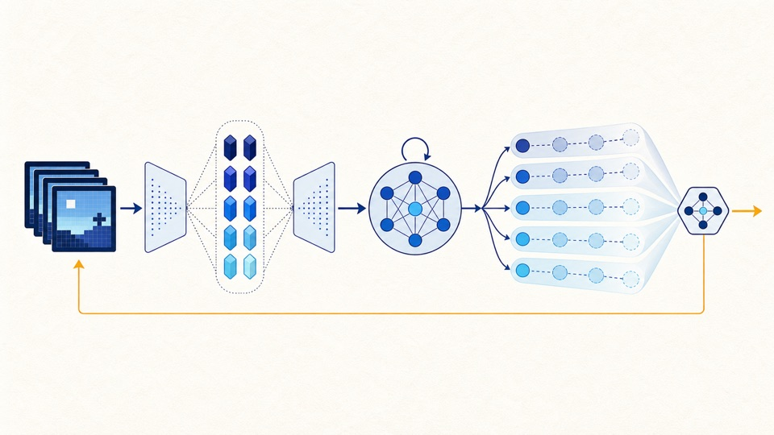</td>
<td><strong>2018 — <a href="https://arxiv.org/abs/1803.10122">World Models</a></strong> <code>决策/规划</code> <strong>表示/机制：</strong>VAE 压缩视觉观测，RNN 学习 latent dynamics，轻量 controller 在模型想象的环境中训练。 <strong>控制/任务：</strong>CarRacing 与 VizDoom 等控制任务。 <strong>意义/边界：</strong>把“表示、动态、控制器”模块化为经典范式；实验规模与环境复杂度仍有限。 <strong>资源：</strong><a href="https://arxiv.org/abs/1803.10122">Paper</a> · <a href="https://worldmodels.github.io/">Project</a> · Code  · Weights：未公开 · <a href="https://worldmodels.github.io/">Demo</a></td>
</tr>
</table>

<table>
<tr>
<td width="42%">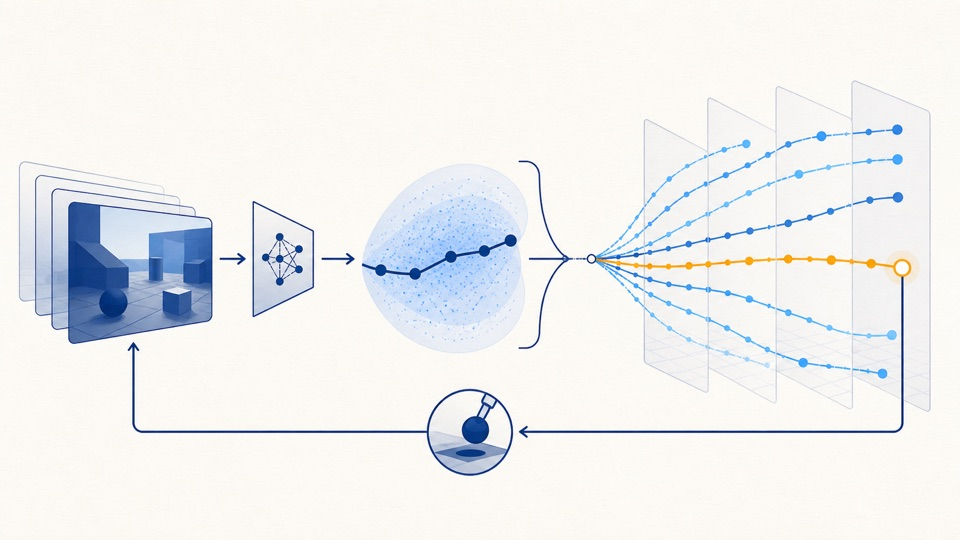</td>
<td><strong>2018 — <a href="https://arxiv.org/abs/1811.04551">PlaNet</a></strong> <code>在线 latent 规划</code> <strong>表示/机制：</strong>RSSM 同时包含确定性与随机 latent state，并以 latent overshooting 学习多步动态。 <strong>控制/任务：</strong>用 CEM 在 latent 中在线搜索动作序列。 <strong>意义/边界：</strong>首次公开于 2018，不是 2019；规划性能依赖模型在候选动作分布上的准确性。 <strong>资源：</strong><a href="https://arxiv.org/abs/1811.04551">Paper</a> · <a href="https://danijar.com/project/planet/">Project</a> · Code（已归档）  · Weights：未公开 · Demo：—</td>
</tr>
</table>

<table>
<tr>
<td width="42%">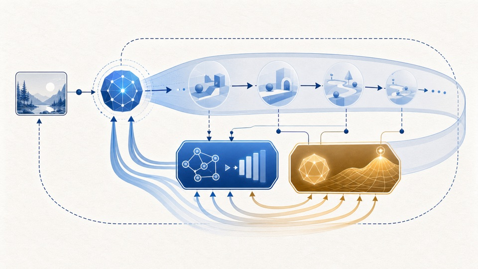</td>
<td><strong>2019 — <a href="https://arxiv.org/abs/1912.01603">Dreamer</a></strong> <code>想象中学习行为</code> <strong>表示/机制：</strong>在学习到的 latent world model 中 rollout，并通过 imagined actor–critic 与解析梯度优化行为。 <strong>控制/任务：</strong>从像素学习连续控制。 <strong>意义/边界：</strong>把每步在线规划改成后台 latent imagination 训练；模型偏差仍会被策略利用。 <strong>资源：</strong><a href="https://arxiv.org/abs/1912.01603">Paper</a> · <a href="https://danijar.com/project/dreamer/">Project</a> · Code  · Weights：未公开 · Demo：—</td>
</tr>
</table>

<table>
<tr>
<td width="42%">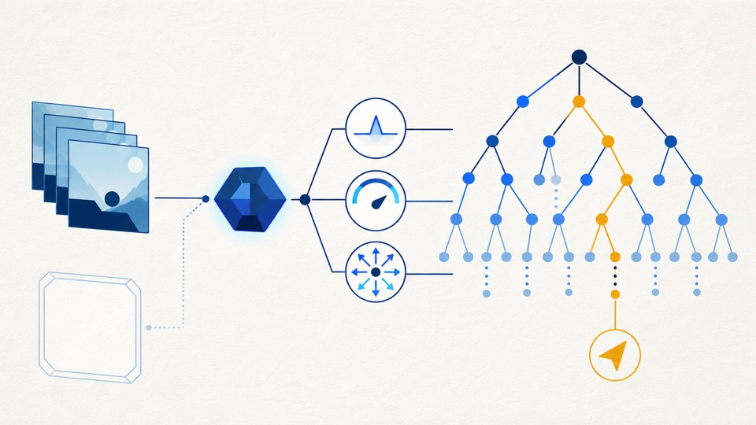</td>
<td><strong>2019/2020 — <a href="https://arxiv.org/abs/1911.08265">MuZero</a></strong> <code>任务相关动态</code> <strong>表示/机制：</strong>representation、dynamics 与 prediction networks 学习供搜索使用的 reward、value 和 policy，而不重建完整观测。 <strong>控制/任务：</strong>以 MCTS 规划 Atari、Go、国际象棋和将棋。 <strong>意义/边界：</strong>预印本 2019、Nature 版本 2020；它证明“对决策足够”不等于“视觉上完整的世界模拟器”。 <strong>资源：</strong><a href="https://arxiv.org/abs/1911.08265">Paper</a> · <a href="https://deepmind.google/blog/muzero-mastering-go-chess-shogi-and-atari-without-rules/">Project</a> · Code：未公开 · <a href="https://gist.github.com/Mononofu/6c2d27ea1b3a9b3c1a293ebabed062ed">Pseudocode</a> · Weights：未公开 · Demo：—</td>
</tr>
</table>

<table>
<tr>
<td width="42%">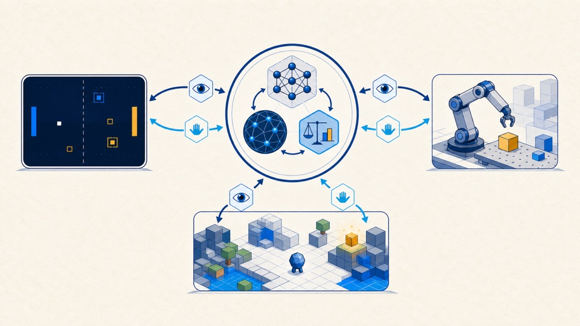</td>
<td><strong>2023 — <a href="https://arxiv.org/abs/2301.04104">DreamerV3</a></strong> <code>跨域 world model</code> <strong>表示/机制：</strong>以归一化、平衡和变换等稳定化设计，让一套固定配置跨多类任务训练。 <strong>控制/任务：</strong>覆盖 150 多个任务；作者报告在无人工数据与 curriculum 下取得 Minecraft diamond 结果。 <strong>意义/边界：</strong>展示算法通用性，而不是证明一个模型在所有环境间共享同一世界知识。 <strong>资源：</strong><a href="https://arxiv.org/abs/2301.04104">Paper</a> · <a href="https://danijar.com/project/dreamerv3/">Project</a> · Code  · Weights：未公开 · Demo：—</td>
</tr>
</table>

<table>
<tr>
<td width="42%">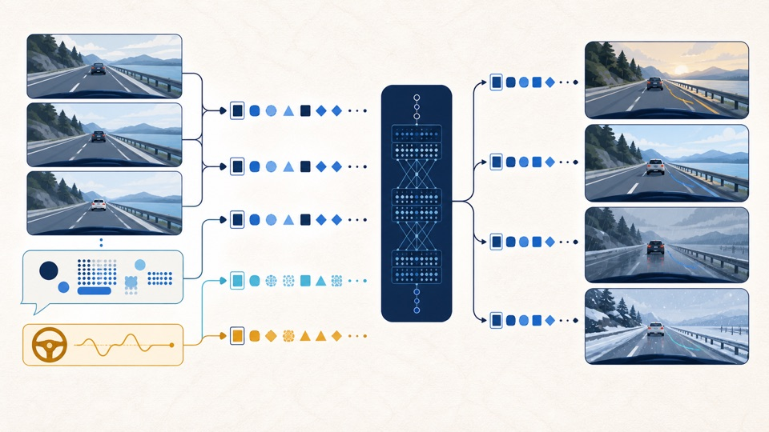</td>
<td><strong>2023 — <a href="https://arxiv.org/abs/2309.17080">GAIA-1</a></strong> <code>驾驶生成式 world model</code> <strong>表示/机制：</strong>把视频、文本和车辆动作离散为 token，自回归预测未来驾驶场景。 <strong>控制/任务：</strong>由 ego action 与文本条件控制天气、道路和车辆行为。 <strong>意义/边界：</strong>把视频生成与驾驶动作放入同一预测模型；生成合理场景不等于通过闭环自动驾驶安全验证。 <strong>资源：</strong><a href="https://arxiv.org/abs/2309.17080">Paper</a> · <a href="https://wayve.ai/thinking/scaling-gaia-1/">Project</a> · Code：未公开 · Weights：未公开 · Demo：—</td>
</tr>
</table>

<table>
<tr>
<td width="42%">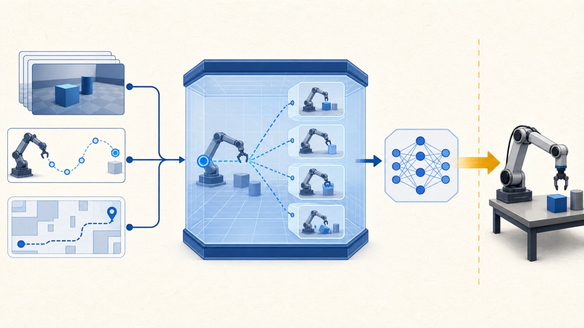</td>
<td><strong>2023 — <a href="https://arxiv.org/abs/2310.06114">UniSim</a></strong> <code>动作条件视觉模拟</code> <strong>表示/机制：</strong>汇集图像、机器人和导航数据，学习由高级语言或低级动作控制的视觉模拟器。 <strong>控制/任务：</strong>在生成经验中训练策略，再迁移到真实机器人。 <strong>意义/边界：</strong>作者报告零样本真实机器人迁移；这一结果来自特定任务与数据设置，不能泛化为任意现实环境的可靠模拟。 <strong>资源：</strong><a href="https://arxiv.org/abs/2310.06114">Paper</a> · <a href="https://universal-simulator.github.io/">Project</a> · Code：未公开 · Weights：未公开 · Demo：—</td>
</tr>
</table>

---

## 汇合节点｜2024：表示学习、交互视频与生成式游戏环境

Sora 在生成路线中提出“视频生成可能通向世界模拟器”的研究假设；同年，V-JEPA、Genie、GameNGen、DINO-WM 与 Genie 2 分别从 feature prediction、latent action、动作条件像素生成和显式交互推进这场讨论。

<table>
<tr>
<td width="42%">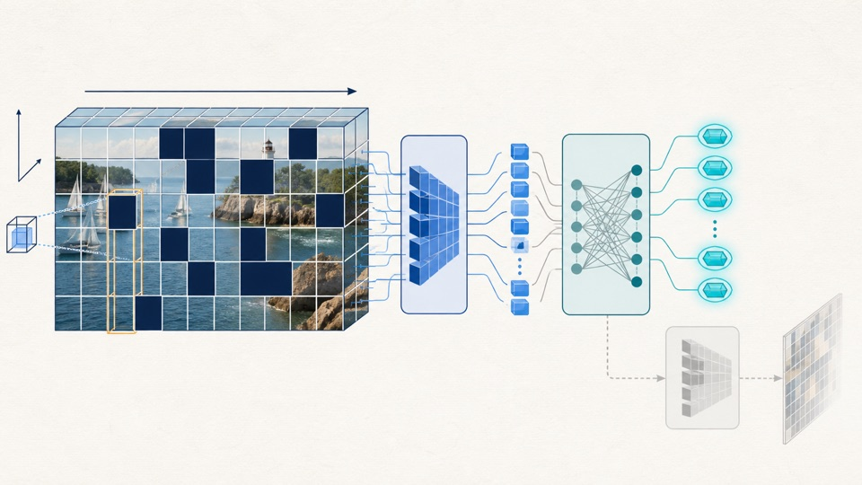</td>
<td><strong>2024 — <a href="https://arxiv.org/abs/2404.08471">V-JEPA</a></strong> <code>表示学习</code> <strong>表示/机制：</strong>遮挡视频 tube，在 representation space 预测缺失时空信息，不重建全部像素。 <strong>控制/任务：</strong>无文本、无负样本的视频自监督表征学习。 <strong>意义/边界：</strong>把计算集中在可预测特征；它本身不是动作条件模型，也不是可交互像素生成器。 <strong>资源：</strong><a href="https://arxiv.org/abs/2404.08471">Paper</a> · <a href="https://ai.meta.com/blog/v-jepa-yann-lecun-ai-model-video-joint-embedding-predictive-architecture/">Project</a> · Code  · Weights  · Demo：—</td>
</tr>
</table>

<table>
<tr>
<td width="42%">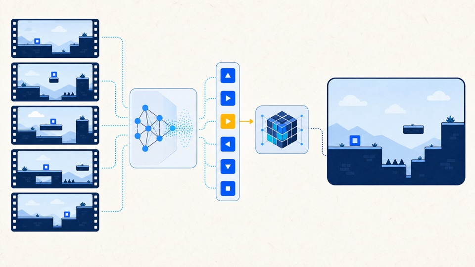</td>
<td><strong>2024 — <a href="https://arxiv.org/abs/2402.15391">Genie 1</a></strong> <code>交互视频模拟</code> <strong>表示/机制：</strong>11B 模型由时空 tokenizer、自回归 dynamics model 和 latent action model 组成，从无动作标签视频中发现控制信号。 <strong>控制/任务：</strong>主要从互联网 2D 平台游戏视频生成可控环境。 <strong>意义/边界：</strong>展示 latent action 的可扩展学习；并非已经覆盖通用 3D 或机器人世界。 <strong>资源：</strong><a href="https://arxiv.org/abs/2402.15391">Paper</a> · <a href="https://deepmind.google/research/publications/60474/">Project</a> · Code：未公开 · Weights：未公开 · Demo：—</td>
</tr>
</table>

<table>
<tr>
<td width="42%">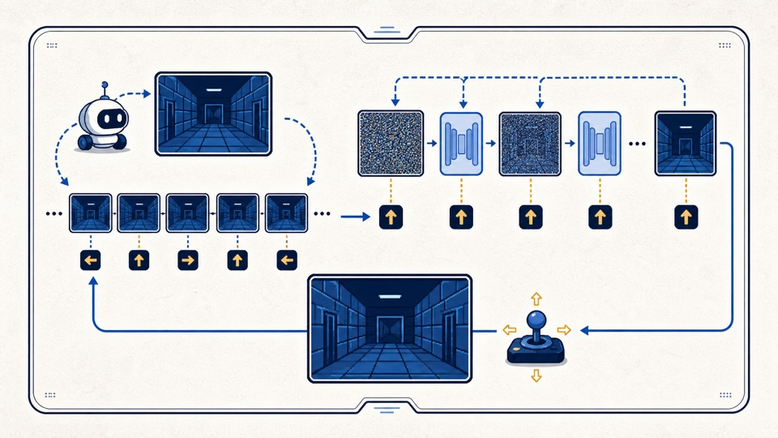</td>
<td><strong>2024 — <a href="https://arxiv.org/abs/2408.14837">GameNGen</a></strong> <code>神经游戏引擎实验</code> <strong>表示/机制：</strong>RL agent 采集 Doom 轨迹，扩散模型依据历史帧和动作预测下一帧。 <strong>控制/任务：</strong>在单一 Doom 环境中逐帧响应玩家动作。 <strong>意义/边界：</strong>作者报告单 TPU 约 20 FPS 和多分钟稳定生成；这是特定游戏实验，不是通用游戏引擎。 <strong>资源：</strong><a href="https://arxiv.org/abs/2408.14837">Paper</a> · <a href="https://gamengen.github.io/">Project</a> · Code：未公开 · Weights：未公开 · Demo：—</td>
</tr>
</table>

<table>
<tr>
<td width="42%">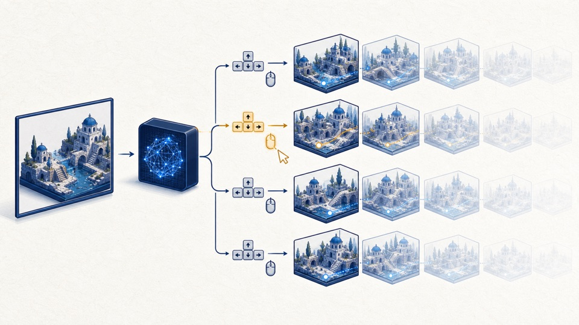</td>
<td><strong>2024 — <a href="https://deepmind.google/blog/genie-2-a-large-scale-foundation-world-model/">Genie 2</a></strong> <code>官方发布</code> <code>交互 3D 世界</code> <strong>表示/机制：</strong>从单张图像生成可由键盘和鼠标控制的 3D 环境。 <strong>控制/任务：</strong>动作分支、相机运动与环境交互。 <strong>意义/边界：</strong>官方称一致性可达约一分钟，但多数示例为 10–20 秒；未蒸馏基础模型并非实时，实时蒸馏版以画质为代价。 <strong>资源：</strong>Paper/Report：— · <a href="https://deepmind.google/blog/genie-2-a-large-scale-foundation-world-model/">Project</a> · Code：未公开 · Weights：未公开 · Demo：—</td>
</tr>
</table>

<table>
<tr>
<td width="42%">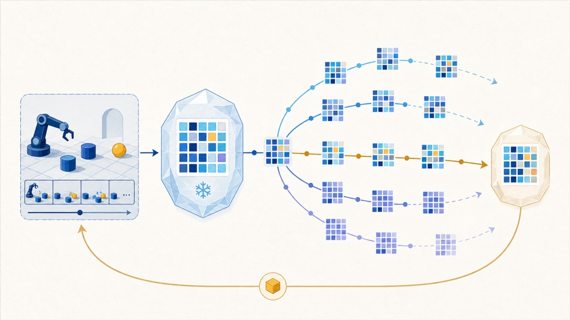</td>
<td><strong>2024 — <a href="https://arxiv.org/abs/2411.04983">DINO-WM</a></strong> <code>特征空间规划</code> <strong>表示/机制：</strong>冻结 DINOv2 patch feature，学习动作条件 dynamics，并在测试时优化动作序列使预测特征接近目标特征。 <strong>控制/任务：</strong>无需专家示范、奖励或单独逆动力学模型的目标到达。 <strong>意义/边界：</strong>说明强视觉表征可直接支撑规划；证据来自有限控制环境，且成功依赖目标特征的可达性。 <strong>资源：</strong><a href="https://arxiv.org/abs/2411.04983">Paper</a> · <a href="https://dino-wm.github.io/">Project</a> · Code  · <a href="https://osf.io/bmw48/?view_only=a56a296ce3b24cceaf408383a175ce28">Weights</a> · Demo：—</td>
</tr>
</table>

### 不能混淆的证据

- 表示预测成功，不等于像素可生成。
- 开环动作条件 rollout，不等于闭环控制可靠。
- 能维持视觉一致性，不等于具有因果模型。
- 在一个游戏实时运行，不等于可泛化到任意交互世界。

---

## 并行进展｜2025：Physical AI、交互世界与原生音视频

2025 年的关键变化不是所有路线合成了一个“万能 world model”，而是视频模型、表征模型、交互世界、显式 3D 和机器人后训练开始共享更大的数据与模型基础。本节全部是截止日的 **前沿观察（暂定）**；指标、能力和限制均保留“作者/官方报告”的证据属性。

<table>
<tr>
<td width="42%">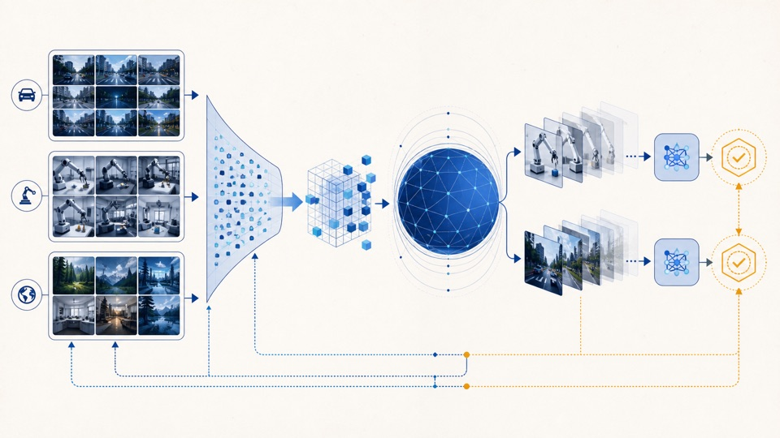</td>
<td><strong>2025 — <a href="https://arxiv.org/abs/2501.03575">NVIDIA Cosmos</a></strong> <code>首次预印本</code> <code>前沿观察（暂定）</code> <code>Physical AI 平台</code> <strong>表示/机制：</strong>技术报告提出由 autoregressive/diffusion world foundation models、tokenizer、数据整理、guardrail 和后训练工具组成的平台。 <strong>控制/任务：</strong>为机器人和自动驾驶等具体任务提供数据生成与模型底座。 <strong>意义/边界：</strong>首代官方名称是 Cosmos 平台/Predict1 系列，不是一个严格名为“Cosmos 1”的单模型；平台也不等于闭环机器人策略。 <strong>资源：</strong><a href="https://arxiv.org/abs/2501.03575">Preprint / Technical Report</a> · <a href="https://research.nvidia.com/labs/cosmos-lab/">Project</a> · Code  · <a href="https://huggingface.co/collections/nvidia/cosmos-6751e884dc10e013a0a0d8e6">Weights</a> · Demo：—</td>
</tr>
</table>

<table>
<tr>
<td width="42%">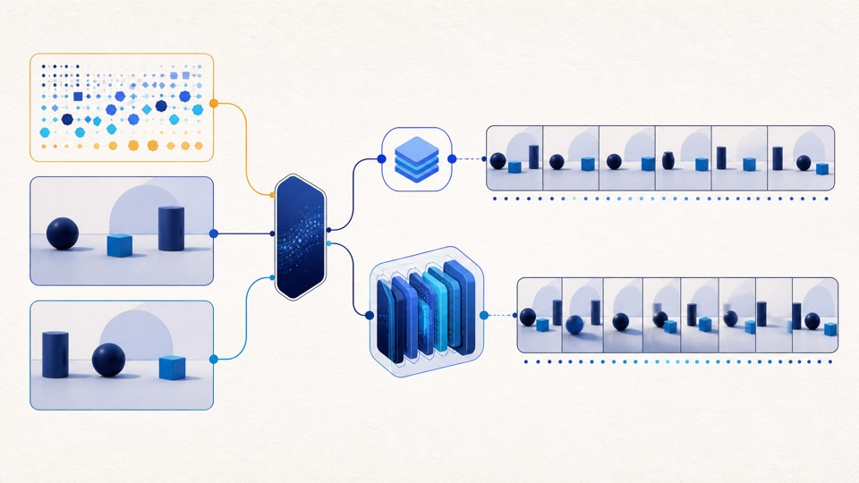</td>
<td><strong>2025 — <a href="https://developer.nvidia.com/blog/?p=101575">Cosmos Predict2</a></strong> <code>官方技术发布</code> <code>前沿观察（暂定）</code> <code>世界状态生成</code> <strong>表示/机制：</strong>官方技术发布称提供 2B/14B 世界状态视频生成模型，支持灵活分辨率、帧率和面向具体 Physical AI 场景的后训练。 <strong>控制/任务：</strong>文本、图像、首尾帧等条件的未来状态生成。 <strong>意义/边界：</strong>适合作为数据与预测底座；“物理准确”等性能为 NVIDIA 自评，具体控制收益仍需由下游任务独立验证。 <strong>资源：</strong><a href="https://developer.nvidia.com/blog/?p=101575">Technical Release</a> · <a href="https://research.nvidia.com/labs/cosmos-lab/cosmos-predict2/">Project</a> · Code  · <a href="https://huggingface.co/collections/nvidia/cosmos-predict2">Weights</a> · <a href="https://huggingface.co/spaces/nvidia/Cosmos-Predict2">Demo</a></td>
</tr>
</table>

<table>
<tr>
<td width="42%">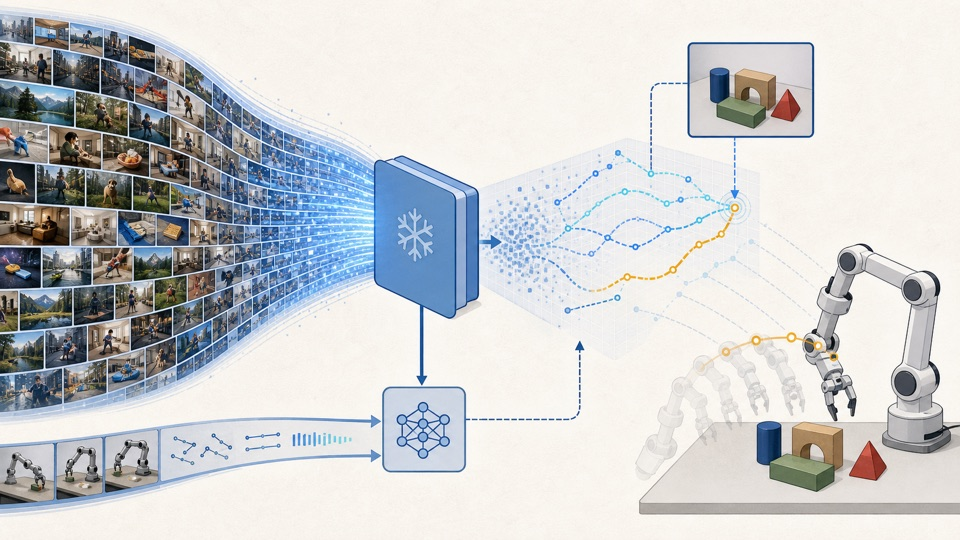</td>
<td><strong>2025 — <a href="https://arxiv.org/abs/2506.09985">V-JEPA 2</a></strong> <code>首次预印本</code> <code>前沿观察（暂定）</code> <code>表示到规划</code> <strong>表示/机制：</strong>预印本报告先从超过一百万小时无动作互联网视频和图像学习表示，再用少于 62 小时 DROID 机器人数据训练动作条件模型。 <strong>控制/任务：</strong>作者在新实验室的 Franka 机械臂上，以目标图像完成 reach、grasp 与 pick-and-place。 <strong>意义/边界：</strong>“zero-shot”指无需目标实验室额外机器人数据、任务训练或奖励，并非完全没用机器人数据；论文还报告相机位姿敏感、长时误差和搜索成本等限制。 <strong>资源：</strong><a href="https://arxiv.org/abs/2506.09985">Preprint</a> · <a href="https://ai.meta.com/research/vjepa/">Project</a> · Code  · <a href="https://huggingface.co/collections/facebook/v-jepa-2-6841bad8413014e185b497a6">Weights</a> · Usage Demo </td>
</tr>
</table>

<table>
<tr>
<td width="42%">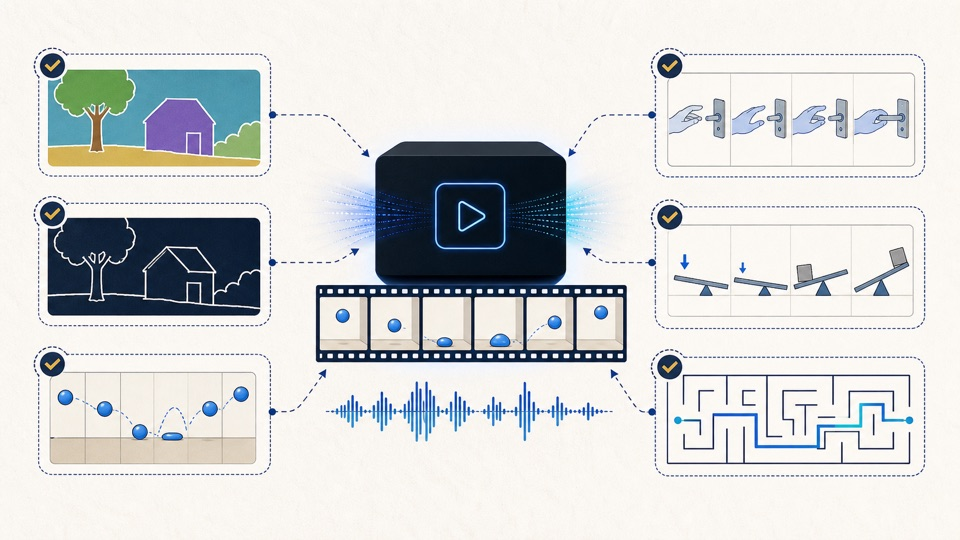</td>
<td><strong>2025 — <a href="https://blog.google/innovation-and-ai/products/generative-media-models-io-2025/">Veo 3</a> / Veo 3.1</strong> <code>官方产品发布</code> <code>前沿观察（暂定）</code> <code>创作模型</code> <code>视觉探测</code> <strong>表示/机制：</strong>Google 于 2025-05 发布原生音视频生成；后续<a href="https://arxiv.org/abs/2509.20328">预印本研究</a>用黑盒 prompting 探测分割、边缘、物理属性、affordance、工具使用、迷宫与对称推理。 <strong>控制/任务：</strong>文本/图像到视频与音频、创作控制。 <strong>意义/边界：</strong>这些零样本能力来自后续黑盒研究，不代表显式 perception head 或机器人闭环验证；任务专用模型通常仍更强，部分结果依赖多次采样，该预印本也不支持“深度估计”这一旧表述。 <strong>资源：</strong><a href="https://arxiv.org/abs/2509.20328">Probing Preprint</a> · <a href="https://deepmind.google/models/veo/">Project / Model Card</a> · Code：未公开 · Weights：未公开 · <a href="https://labs.google/fx/tools/flow">Demo</a></td>
</tr>
</table>

<table>
<tr>
<td width="42%">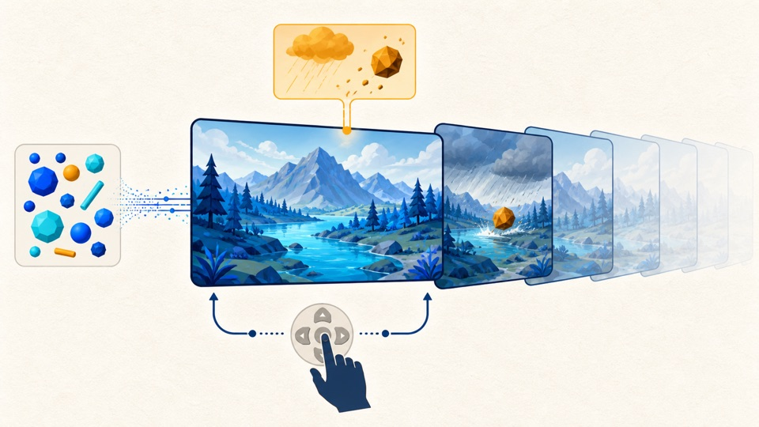</td>
<td><strong>2025 — <a href="https://deepmind.google/blog/genie-3-a-new-frontier-for-world-models/">Genie 3</a></strong> <code>官方研究发布</code> <code>前沿观察（暂定）</code> <code>交互世界</code> <strong>表示/机制：</strong>官方页面报告从文本生成 720p、24 FPS 的动态世界，并允许通过文本事件改变环境。 <strong>控制/任务：</strong>官方演示实时导航与数分钟级交互一致性。 <strong>意义/边界：</strong>2025-08 初始发布为有限研究预览；截止日的 Project Genie 是可访问的实验性托管原型，仍受账号、订阅和地区等条件限制。官方还列出动作空间、多智能体、地理准确性、文字渲染和持续时长等限制。 <strong>资源：</strong><a href="https://deepmind.google/blog/genie-3-a-new-frontier-for-world-models/">Official Research Release</a> · <a href="https://deepmind.google/models/genie/">Project</a> · Code：未公开 · Weights：未公开 · <a href="https://labs.google/fx/projectgenie/">Experimental Demo（受访问条件限制）</a></td>
</tr>
</table>

<table>
<tr>
<td width="42%">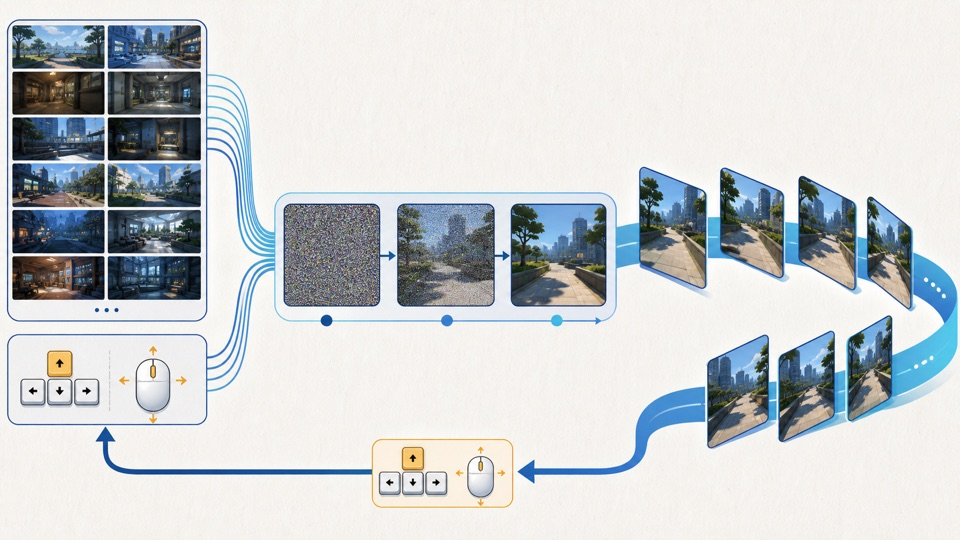</td>
<td><strong>2025 — <a href="https://arxiv.org/abs/2508.13009">Matrix-Game 2</a></strong> <code>首次预印本</code> <code>前沿观察（暂定）</code> <code>开放交互视频世界</code> <strong>表示/机制：</strong>预印本提出以 UE/GTA 等游戏数据和键鼠动作训练 few-step causal diffusion，逐帧生成可控画面。 <strong>控制/任务：</strong>键盘鼠标驱动的流式游戏交互。 <strong>意义/边界：</strong>作者报告约 1,200 小时数据、25 FPS 和分钟级交互；均是作者设置下的结果，不代表现实物理或跨游戏泛化。截止日官方仓库主线已纳入 3.0，本卡仍只记录 2.0 的历史节点。 <strong>资源：</strong><a href="https://arxiv.org/abs/2508.13009">Preprint</a> · <a href="https://matrix-game-v2.github.io/">Project</a> · Code  · <a href="https://huggingface.co/Skywork/Matrix-Game-2.0">Weights</a> · Demo：—</td>
</tr>
</table>

<table>
<tr>
<td width="42%">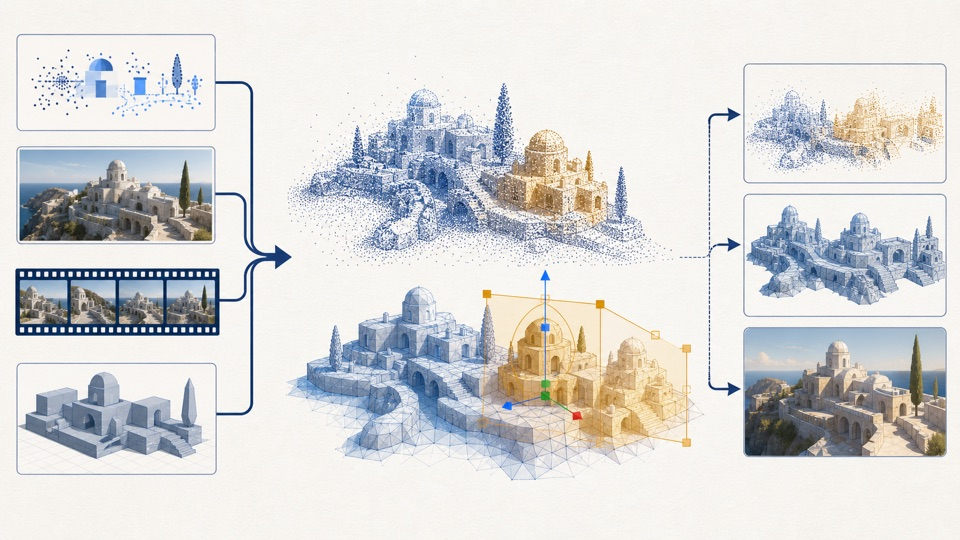</td>
<td><strong>2025 — <a href="https://www.worldlabs.ai/blog/marble-world-model">Marble</a></strong> <code>官方产品发布</code> <code>前沿观察（暂定）</code> <code>显式 3D 世界</code> <strong>表示/机制：</strong>官方发布称可从文本、图像、视频或粗略 3D 条件生成可持续、可编辑、可扩展的世界，并可导出 Gaussian splat、mesh 或视频。 <strong>控制/任务：</strong>相机探索、世界编辑、扩展和资产导出。 <strong>意义/边界：</strong>它补上显式三维表示路线；官方仍把动态交互列为后续方向，因此不应写成动作条件动态模拟器。“可持续”等描述仍是产品自述，尚无论文或独立评测支持通用能力结论。 <strong>资源：</strong><a href="https://www.worldlabs.ai/blog/marble-world-model">Official Product Release</a> · <a href="https://docs.worldlabs.ai/">Project</a> · Code：未公开 · Weights：未公开 · <a href="https://marble.worldlabs.ai/">Demo（需账号/付费）</a></td>
</tr>
</table>

<table>
<tr>
<td width="42%">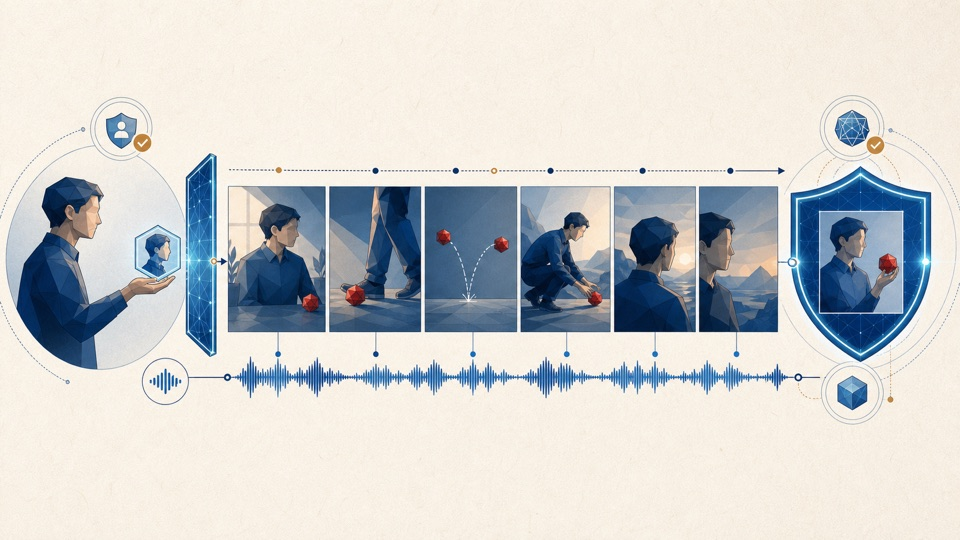</td>
<td><strong>2025 — <a href="https://openai.com/index/sora-2/">Sora 2</a></strong> <code>官方产品发布</code> <code>前沿观察（暂定）</code> <code>可用性：已下线</code> <strong>表示/机制：</strong>官方发布称相较前代改进物理结果、多镜头控制和状态延续，并原生生成对白、环境声和音效。 <strong>控制/任务：</strong>复杂镜头指令、参考主体与同步音视频。 <strong>意义/边界：</strong><a href="https://openai.com/index/sora-2-system-card/">系统卡</a>仍记录物理、控制、肖像同意、误导性媒体与来源风险；上述改进为官方自述，不是独立能力证据。官方页面注明 Sora 产品自 2026-04-26 起不再提供，但这不改变其历史节点地位。 <strong>资源：</strong><a href="https://openai.com/index/sora-2-system-card/">System Card</a> · <a href="https://openai.com/index/sora-2/">Project</a> · Code：未公开 · Weights：未公开 · Demo：已下线</td>
</tr>
</table>

<table>
<tr>
<td width="42%">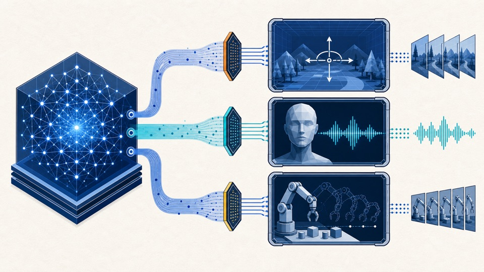</td>
<td><strong>2025 — <a href="https://runway.com/research/introducing-runway-gwm-1">GWM-1</a></strong> <code>官方研究/产品发布</code> <code>前沿观察（暂定）</code> <code>模型家族</code> <strong>表示/机制：</strong>官方页面称以 Gen-4.5 为共同底座，分别后训练 Worlds、Avatars/Characters 与 Robotics 三个模型。 <strong>控制/任务：</strong>官方展示可探索世界、实时角色和机器人动作条件 rollout。 <strong>意义/边界：</strong>不是一个 checkpoint 同时完成全部任务；官方展示最长约两分钟、720p 的实时逐帧生成，但没有论文或独立评测支撑通用能力结论。 <strong>资源：</strong>Paper/Report：— · <a href="https://runway.com/research/introducing-runway-gwm-1">Official Page</a> · Code：未公开 · Weights：未公开 · Access：Worlds/Robotics 需申请，Characters 已提供 Web/API</td>
</tr>
</table>

---

## World Model｜2026：世界—动作系统与可规划表征

本节全部是截止日的 **前沿观察（暂定）**。预印本、workshop camera-ready、开源工件和托管演示是不同证据，不使用一个“已发布”统称。

<table>
<tr>
<td width="42%">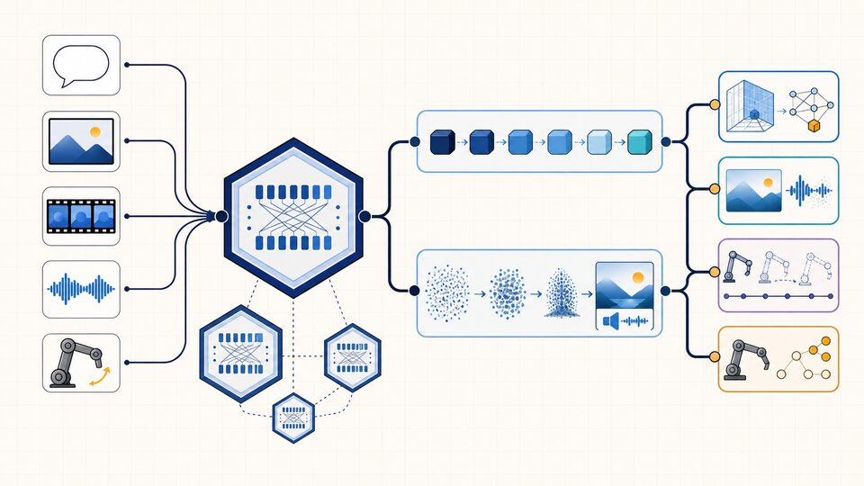</td>
<td><strong>2026 — <a href="https://arxiv.org/abs/2606.02800">Cosmos 3</a></strong> <code>首次预印本</code> <code>前沿观察（暂定）</code> <code>Omnimodal 模型家族</code> <strong>表示/机制：</strong>技术报告提出 Edge、Nano、Super 等尺度共享自回归 reasoner 与 diffusion generator 双塔 Mixture-of-Transformers 架构。 <strong>控制/任务：</strong>作者报告这个家族可接收语言、图像、视频、音频和动作，并以不同后训练版本覆盖视觉语言推理、音视频生成、forward/inverse dynamics 和机器人策略。 <strong>意义/边界：</strong>这是统一架构下的模型家族，不是一个 checkpoint 已同时解决全部 Physical AI 任务；基准结果仍是作者自评。 <strong>资源：</strong><a href="https://arxiv.org/abs/2606.02800">Preprint / Technical Report</a> · <a href="https://research.nvidia.com/labs/cosmos-lab/cosmos3/">Project</a> · Code  · <a href="https://huggingface.co/collections/nvidia/cosmos3">Weights / Model Cards</a> · <a href="https://build.nvidia.com/models?q=cosmos">Demo</a></td>
</tr>
</table>

<table>
<tr>
<td width="42%">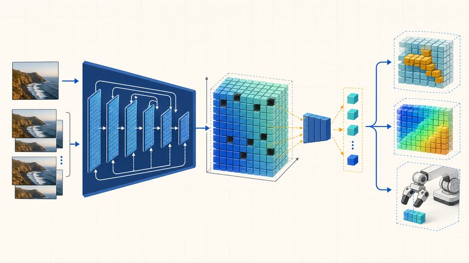</td>
<td><strong>2026 — <a href="https://arxiv.org/abs/2603.14482">V-JEPA 2.1</a></strong> <code>首次预印本</code> <code>前沿观察（暂定）</code> <code>稠密表征</code> <strong>表示/机制：</strong>预印本提出通过 dense predictive loss、跨层 deep self-supervision、统一图像—视频输入表示和规模扩展学习 dense 时空特征。 <strong>控制/任务：</strong>服务视觉理解、密集预测与机器人后训练。 <strong>意义/边界：</strong>作者报告相对 V-JEPA 2-AC 抓取成功率提高 20 个百分点；它仍主要是 representation/world-modeling 方法，不是交互式像素世界生成器。 <strong>资源：</strong><a href="https://arxiv.org/abs/2603.14482">Preprint</a> · <a href="https://ai.meta.com/research/vjepa/">Project</a> · Code  · Weights  · Demo </td>
</tr>
</table>

<table>
<tr>
<td width="42%">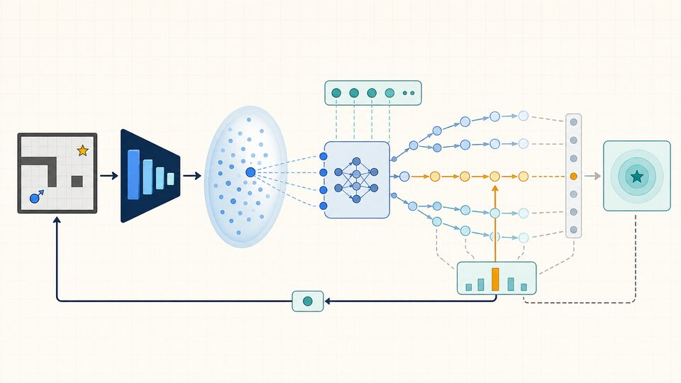</td>
<td><strong>2026 — <a href="https://arxiv.org/abs/2603.19312">LeWorldModel</a></strong> <code>首次预印本</code> <code>前沿观察（暂定）</code> <code>端到端 latent dynamics</code> <strong>表示/机制：</strong>预印本提出以 next-embedding prediction 和 Gaussian latent regularization，从原始像素稳定联合训练 encoder 与动作条件 dynamics。 <strong>控制/任务：</strong>作者在 latent rollout 上执行 model predictive control。 <strong>意义/边界：</strong>作者报告约 15M 参数、单 GPU 数小时训练和显著规划加速；证据来自小规模 2D/3D 控制实验，不能外推为 foundation-scale Physical AI。 <strong>资源：</strong><a href="https://arxiv.org/abs/2603.19312">Preprint</a> · <a href="https://le-wm.github.io/">Project</a> · Code / Data  · <a href="https://huggingface.co/collections/quentinll/lewm">Weights</a> · Demo：—</td>
</tr>
</table>

<table>
<tr>
<td width="42%">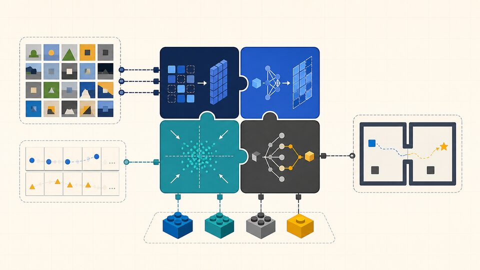</td>
<td><strong>2026 — <a href="https://arxiv.org/abs/2602.03604">EB-JEPA</a></strong> <code>Workshop camera-ready</code> <code>前沿观察（暂定）</code> <code>教学/研究组件</code> <strong>表示/机制：</strong>作者将 context encoder、predictor、collapse regularization 与 latent planning 拆成轻量模块。 <strong>控制/任务：</strong>覆盖 CIFAR-10 表征、MovingMNIST 多步预测和 Two Rooms 动作规划。 <strong>意义/边界：</strong>价值在于单卡、数小时级可复现实验；它是 toy-scale 教学库，不是现实世界 foundation model。arXiv v3 标注为 ICLR 2026 World Models Workshop camera-ready，不写成 ICLR 主会正式发表。 <strong>资源：</strong><a href="https://arxiv.org/abs/2602.03604">Workshop Paper / Preprint</a> · Project  · Code  · Weights：未公开 · Demo：—</td>
</tr>
</table>

---

## 视频基础模型｜2026：原生音视频与多模态创作

这些模型代表生成—参考—编辑一体化，但目前没有证据证明它们已经构成可用于机器人闭环控制的 Physical AI world model。本节全部是截止日的 **前沿观察（暂定）**；官方产品规格不作为已独立验证的研究结论。

<table>
<tr>
<td width="42%">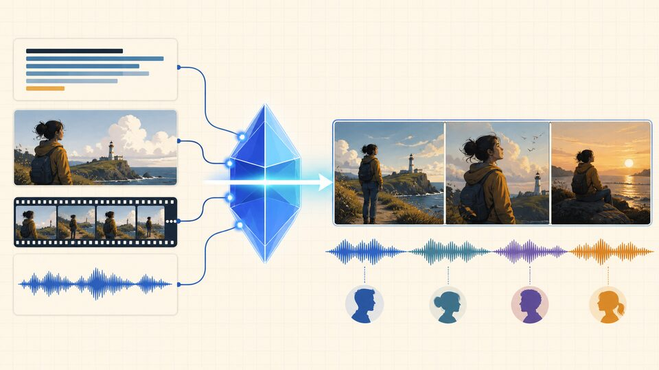</td>
<td><strong>2026 — <a href="https://kling.ai/release-note/release-notes/whbvu8hsip">Kling Video 3 / Video 3 Omni</a></strong> <code>官方产品发布</code> <code>前沿观察（暂定）</code> <code>创作模型</code> <strong>表示/机制：</strong>官方产品页称以统一多模态输入输出支持文本、图像、音频和视频参考。 <strong>控制/任务：</strong>官方规格包括文本/图像/参考到视频、视频内编辑、最长 15 秒多镜头 storyboard 与原生多语言/方言音频。 <strong>意义/边界：</strong>代表创作控制和音视频联合生成的产品方向；没有论文、开源权重、机器人闭环或可规划状态证据。 <strong>资源：</strong><a href="https://kling.ai/release-note/release-notes/whbvu8hsip">Official Product Release</a> · <a href="https://kling.ai/quickstart/klingai-video-3-model-user-guide">Product Guide</a> · Code：未公开 · Weights：未公开 · <a href="https://kling.ai/">Demo（需账号/地区限制）</a></td>
</tr>
</table>

<table>
<tr>
<td width="42%">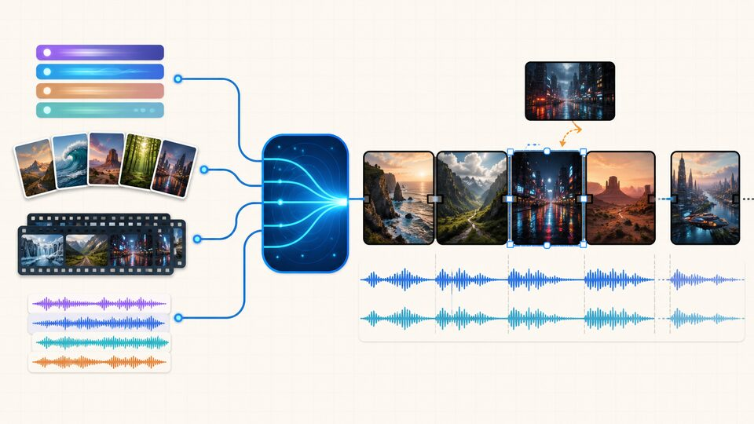</td>
<td><strong>2026 — <a href="https://seed.bytedance.com/en/blog/seedance-2-0-%E6%AD%A3%E5%BC%8F%E5%8F%91%E5%B8%83">Seedance 2.0</a></strong> <code>官方产品发布</code> <code>arXiv model card</code> <code>前沿观察（暂定）</code> <strong>表示/机制：</strong>官方模型卡称采用统一多模态音视频架构，可同时接收文本、图像、视频和音频参考。 <strong>控制/任务：</strong>官方规格为最多 9 张图像、3 段视频、3 段音频参考，生成最长 15 秒多镜头立体声音视频，并支持编辑与延展。 <strong>意义/边界：</strong>官方仍列出细节稳定性、复杂动态、多主体、文字和音频失真等限制；自评结果不是同行评议或独立复现。 <strong>资源：</strong><a href="https://arxiv.org/abs/2604.14148">Model Card / Preprint</a> · <a href="https://seed.bytedance.com/seedance2_0">Project</a> · Code：未公开 · Weights：未公开 · <a href="https://jimeng.jianying.com/">Demo（需账号/地区限制）</a></td>
</tr>
</table>

<table>
<tr>
<td width="42%">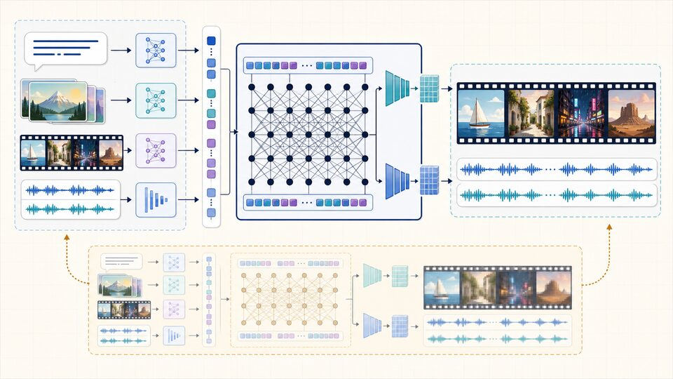</td>
<td><strong>2026 — <a href="https://www.minimax.io/blog/minimax-h3">MiniMax H3</a></strong> <code>官方技术发布</code> <code>前沿观察（暂定）</code> <code>部分开放权重</code> <strong>表示/机制：</strong>官方技术说明称将文本、图像、视频和音频编码为 packed multimodal sequence，由 33B dense single-stream H3-Omni-Transformer 联合预测视频与双声道音频 latent；视觉与音频分别使用 H3-VisualVAE 和 H3-AudioVAE。 <strong>控制/任务：</strong>官方规格覆盖文本、首/尾帧和全模态参考生成；Ref2VA 最多接收 9 张图像、3 段视频和 3 段音频且总文件不超过 12 个，托管系统规格为 4–15 秒、24 FPS、32 kHz 立体声，2K 通过 in-context regeneration 获得。 <strong>意义/边界：</strong><a href="https://www.minimax.io/news/minimax-h3-open-source">2026-08-03 开放</a>的是两个 CFG-distilled H3-Base checkpoint，本地 Base 工作流输出 768p；H3-Context-IR、H3-Regenerate-2K 与初版 sparse-attention 实现并未随首批权重开放，因此不能把完整托管 2K 系统笼统称为全部开源；性能仍是官方自评。 <strong>资源：</strong><a href="https://www.minimax.io/blog/minimax-h3">Official Technical Release</a> · <a href="https://www.minimax.io/research">Project</a> · Code  · <a href="https://huggingface.co/MiniMaxAI/MiniMax-H3">Base Weights</a> · <a href="https://hailuoai.video/">Hosted Demo（需账号/地区限制）</a></td>
</tr>
</table>

<table>
<tr>
<td width="42%">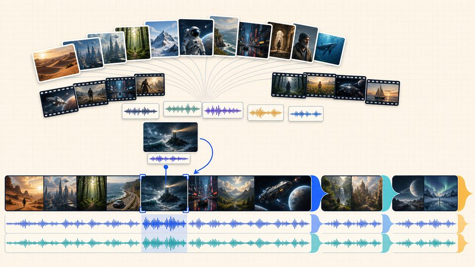</td>
<td><strong>2026 — <a href="https://seed.bytedance.com/en/blog/one-take-creation-flexible-referencing-introducing-seedance-2-5">Seedance 2.5</a></strong> <code>官方产品发布</code> <code>前沿观察（暂定）</code> <code>创作模型</code> <strong>表示/机制：</strong>官方发布称在 Seedance 2.0 的联合音视频架构上强化长叙事、参考生成与局部编辑。 <strong>控制/任务：</strong>官方规格为单次最长 30 秒、支持多轮延展，最多 30 张图像、10 段视频和 10 段音频参考，并支持时间戳级编辑。 <strong>意义/边界：</strong>截至 2026-08 是该路线更新节点；复杂物理、多主体与长时状态稳定性仍需独立评测，官方也明示了相关限制。 <strong>资源：</strong><a href="https://seed.bytedance.com/en/blog/one-take-creation-flexible-referencing-introducing-seedance-2-5">Official Product Release</a> · <a href="https://seed.bytedance.com/seedance2_5">Project</a> · Code：未公开 · Weights：未公开 · <a href="https://jimeng.jianying.com/">Demo（需账号/地区限制）</a> · API：发布页仍标注即将提供</td>
</tr>
</table>

---

## 如何正确阅读这条时间线

对每个节点都问六个问题：

1. **表示是什么？** 原始像素、光流、离散 code、连续 latent、feature，还是显式 3D？
2. **时间如何建模？** 帧重组、RNN、变换核、自回归、masked prediction、diffusion、速度场，还是动作条件 dynamics？
3. **骨干怎样混合？** patch/grid、full/factorized/window/sparse/linear mixer、mask、3D position、condition fusion、total/active parameters 分别是什么？
4. **控制信号是什么？** 历史帧、文本、图像、音频、相机、键鼠、机器人动作，还是目标状态？
5. **成本怎样产生？** 每次 denoiser FLOPs、NFE、precision、cache、并行、通信与 codec 是否分别报告？
6. **成功如何证明？** 画质、人评、likelihood、FVD、长距/绑定/网格外推、实时帧率、规划回报，还是现实任务成功率？

最需要避免的四种推断是：

- 画面逼真 ⇒ 物理正确；
- 能预测视频 ⇒ 能支持规划；
- 开环 demo 稳定 ⇒ 闭环控制可靠；
- 官方 benchmark 领先 ⇒ 已被独立复现。

JEPA 从图像表征、视频预测到动作条件规划的独立演化，见 [JEPA 参考阅读](jepa.md)。视频表示的完整定义、预算与 codec 验收见[视频 Tokenizer 与生成式压缩](generative-models/video-tokenizers.md)，attention/fusion/MoE/parallel/cache 的机制与反证见[Video DiT 与骨干扩展](generative-models/video-dit-backbones.md)；具体任务与模型则见 [任务与方法分类](taxonomy.md)、[评测指南](evaluation.md) 和 [开放模型与代码](../resources/open-models.md)。
