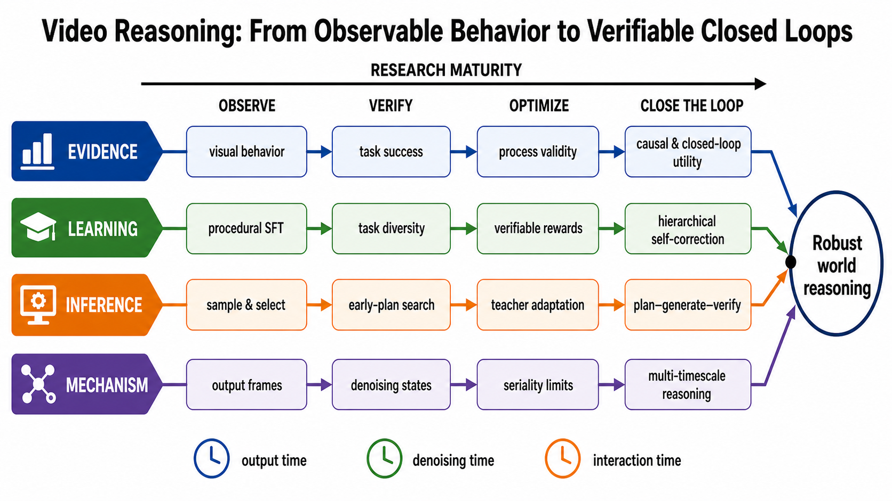
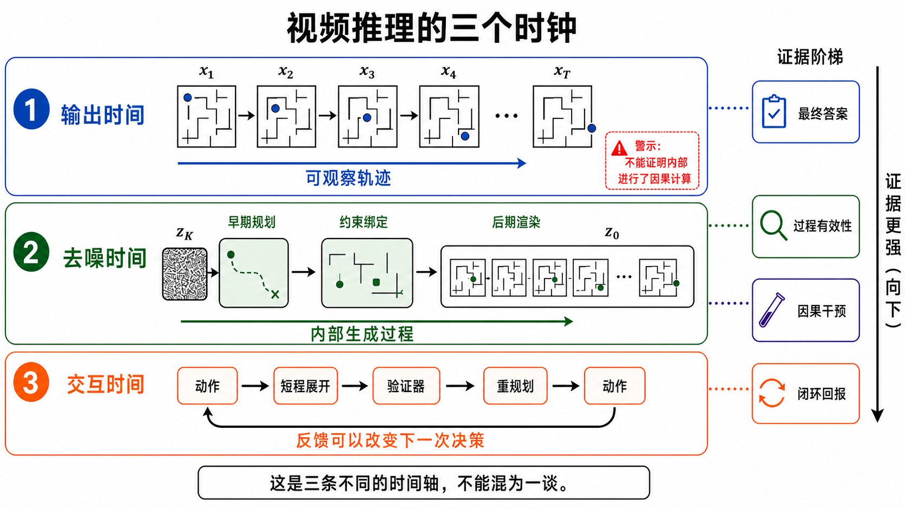
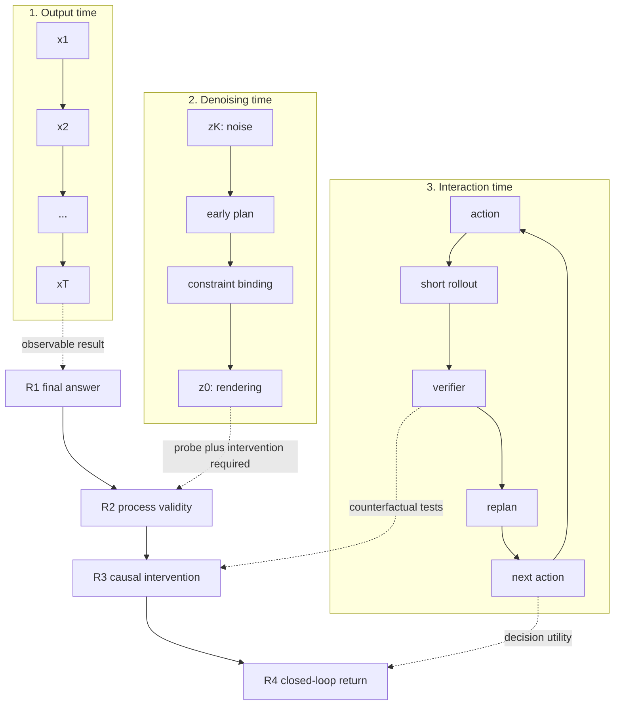

# Video Reasoning：从 Zero-Shot Learners 到可验证闭环

> 综述与引用核验截至 **2026 年 8 月 30 日（Asia/Shanghai）**。本章以 2025 年 9 月的 *Video models are zero-shot learners and reasoners* 为叙事原点：先还原它观察到了什么、Chain-of-Frames 假说如何提出、证据到哪里为止；再向前追溯视觉思维与受控世界模型前史，向后展开 benchmark、监督训练、RLVR、去噪机制、推理时优化与闭环系统。VBVR 是其中的规模化基础设施节点，而不是整章中心。

2026 年夏季新增工作的标题、版本、代码、数据口径、venue 更正、图片生成记录与纳排边界，见[本轮增量检索审计](../sources/research_20260830_video_reasoning_refresh.md)；VBVR 的前后向引用核验仍见[专项审计](../sources/research_20260829_video_reasoning_vbvr.md)。

## 1. 原点论文：Video models are zero-shot learners and reasoners

### 1.1 它问的不是“能不能走迷宫”，而是视觉是否迎来 GPT-3 moment

Wiedemer 等人的核心问题是：大语言模型从任务专用系统演变为通用语言基础模型，依靠的是大规模生成式预训练及其零样本涌现能力；使用相似训练范式的视频生成模型，是否也可能成为通用视觉基础模型 [[3]](#ref-3)？

因此，论文并没有把 reasoning 孤立成一个新 benchmark。它先建立一条能力阶梯：

1. **Perception**：读取边缘、对象、纹理和空间信息；
2. **Modeling**：形成关于对象、物理属性和世界状态的内部模型；
3. **Manipulation**：按指令编辑、移动或模拟对象与工具；
4. **Reasoning**：在空间与时间上连续执行多步 manipulation，得到目标状态。

迷宫之所以重要，不是因为它本身代表通用智能，而是因为走迷宫同时要求读懂墙和路径、保持当前状态、选择合法动作，并把计划展开成连续视觉变化。论文把这种“感知—建模—操作—多步变化”的组合视为早期视觉推理。

### 1.2 实验到底做了什么？

| 项目 | 原论文设置 |
|---|---|
| 被测系统 | 通过 Google Cloud Vertex AI 调用可公开访问、但模型权重与系统细节闭源的 Veo 2 与 Veo 3 API |
| 输入与输出 | 一张初始图像作为首帧 + 文字指令；生成 16:9、720p、24 FPS、8 秒视频 |
| 总规模 | 18,384 个生成视频：17,640 个定量样本 + 744 个定性样本 |
| 定性范围 | 62 个任务，通常每项生成 12 次，共 744 个视频；覆盖 perception、modeling、manipulation、reasoning |
| 定量范围 | 7 个任务，共 17,640 个视频：边缘检测、分割、对象提取、图像编辑、迷宫、视觉对称、视觉类比 |
| 主要比较 | Veo 2、Veo 3、部分图像模型、专用模型或 Gemini 2.5 Pro；不同任务的比较对象和指标并不完全相同 |

有代表性的结果包括：

| 能力 | 论文报告的结果 | 正确解读 |
|---|---:|---|
| 边缘检测 | Veo 3 OIS best-over-10 = 0.77；专用 SOTA = 0.90 | 零样本能力明显，但仍落后于专用模型；这里是在连续指标上取 10 次最佳 |
| 实例分割 | best-frame、best-over-10 mIoU = 0.74；Nano Banana = 0.73 | 每段视频先选最高分帧，再在 10 次生成中取最高分候选，包含两层 oracle 选择 |
| 对象提取 | 最高 93% pass@10 | 说明模型能识别并重排对象；简单任务仍未达到 100% |
| 5×5 迷宫 | Veo 3 pass@10 = 78%；Veo 2 = 14% | 显示代际能力跃升和候选覆盖上限，不是 78% 单次成功率 |
| 视觉类比 | color、resize 可解；reflect、rotate 低于 0.33 chance | 能力不是均匀出现，而存在系统性偏差 |

论文还展示了图遍历、视觉 BFS、序列补全、同色连接、形状嵌合、排序、工具使用、简单 Sudoku、导航和规则外推等定性案例。这些案例的价值在于扩展能力假说，而不是为每一类任务给出稳定准确率。

复现时还要注意一个版本细节：方法正文将 Veo 2 模型标识写作 `veo-2.0-generate-001`，多个附录段落则写作 `veo-2.0-generate-preview-001`。因此，Veo 2—Veo 3 的差异应视为两个闭源产品快照的比较，而不是架构、数据和算力均受控的 scaling law。

### 1.3 Chain-of-Frames 原本是什么意思？

论文的原始类比是：语言模型通过一串文字 token 展开 Chain-of-Thought；视频模型可以通过一串随时间变化的帧，对现实世界的空间与时间维度施加连续操作，因此这种接口“可以称为” **Chain-of-Frames（CoF）**。

```text
输入图像与指令
  → 感知当前视觉状态
  → 建模对象、约束和可能变化
  → 在连续帧中执行 manipulation
  → 得到可观察的最终状态
```

这里的措辞很重要：CoF 首先是一个**行为假说和任务接口**。论文证明了视频中可以出现多步、目标导向的视觉变化，却没有证明内部计算严格遵循“一帧对应一步 thought”。后来的 Demystifying Video Reasoning、Video Models Reason Early、Seriality Gap 和 VGI-Bench，正是从这个未决问题继续向内追踪去噪状态、早期计划和串行计算上限。

### 1.4 这篇论文最重要的证据边界

1. **系统级零样本不等于视频模型本体零样本。** Vertex API 使用 LLM prompt rewriter；作者明确把 rewriter 与视频生成器当作一个黑盒系统，并认为简单 Sudoku 的解法很可能来自 LLM 而非视频模型。独立 Gemini 2.5 Pro 在若干关键视觉任务上不能稳定求解，是有价值的对照，但它既没有识别隐藏 rewriter，也没有复现实际的重写提示，因而不能完全分离系统组件。
2. **这里的 zero-shot 是任务协议，不是训练数据证明。** 它指没有任务专用微调或新任务 head；Veo 的训练数据与后训练流程闭源，无法审计训练集中是否存在相似视觉模式、任务演示或提示模板。
3. **pass@$k$ / best-of-$k$ 的定义随任务而变。** 迷宫的 pass@10 是 10 次中至少一次二值成功；边缘检测和分割是在 $k$ 个候选上取最佳指标，其中还包含逐视频选帧；视觉类比在 $k>1$ 时采用多数投票。共同点只是额外采样引入了额外计算，不能把这些数字等同于 pass@1、平均可靠性或同预算下优于搜索算法；best frame 也是事后才知道的性能上限，不是免费可用的读出规则。
4. **定性广度不等于定量稳定性。** 62 个定性任务通常每项生成 12 次并由作者判断，用于发现现象，而非建立窄置信区间。
5. **提示方式本身是强变量。** 对称任务中，最佳与最差 prompt 的 pass@1 相差 40 个百分点（shape split）和 64 个百分点（random split）；分割的绿色背景也明显优于白色背景。模型可能利用训练分布中的呈现捷径。
6. **部分评测仍依赖模型裁判。** 视觉类比由 Gemini 2.5 Pro autorater 辅助判分，并向裁判提供变换类型和值；作者在每种 condition 的 25 个样本上报告与专家超过 88% 一致。这支持近似可用性，但不是完全确定性的任务 scorer。
7. **可观察过程不等于内部机制。** 一条正确路径可能在去噪早期已经决定，随后只是被动画化；正确终点也可能伴随穿墙、对象复制或错误中间状态。
8. **通用接口不等于专用性能。** 多项结果仍落后于任务专用模型。论文更接近“视觉 GPT-3 moment”的研究议程，而不是“通用视觉推理已经解决”的结论。

因此，这篇论文最稳妥的历史定位是：**它以当时罕见的任务广度和实验规模，把视频生成模型从内容生成器重新表述为潜在的通用视觉学习器与 reasoner，并把后续研究问题清楚地暴露出来。**



> 图中表示的是证据与系统能力的成熟度，而非严格年份。历史时间线以本节的 zero-shot 发现为原点，在后文分别向前追溯、向后展开。

## 2. 从原点论文出发：整个领域需要回答五个问题

| 原点论文留下的问题 | 为什么原论文还没有回答完 | 后续研究路线 |
|---|---|---|
| **能力有多广？** | 62 个定性任务适合发现现象，不足以形成稳定排行榜 | MME-CoF、TiViBench、Gen-ViRe、V-ReasonBench、RULER、MMGR、VGI-Bench 扩大能力与难度覆盖 |
| **结果怎样可靠验证？** | 人工判断、VLM judge、best frame 和最终帧各有偏差 | 程序 scorer、过程评分、scorer—人评校准、Physics-IQ Verified 式 benchmark 审计 |
| **能力能否通过训练稳定获得？** | 原论文只测 Veo 的零样本黑盒行为 | VR-Bench SFT、VBVR 百万规模监督、NewtonRewards、Wan-R1、VideoRLVR、VBVR-Pro 多任务 RL |
| **推理究竟发生在哪里？** | CoF 是从输出视频做出的行为类比 | Chain-of-Steps、early commitment、latent thought、Seriality Gap、层级去噪与因果干预 |
| **怎样从演示变成可靠系统？** | 单次开环生成不能回滚，也不能证明决策效用 | VideoTPO、ChEaP、TFE、test-time LoRA、CollabVR、NEWTON 与动作—反馈闭环 |

后文把“能力广度”和“结果验证”合并为同一条 benchmark 响应，因此五个问题对应四条研究响应主线；VBVR 作为跨越 benchmark、训练与泛化分析的关键案例单独展开。

### 2.1 本章的综合结论

1. **Video reasoning 不是一种单一方法。** 当前至少包含输出视频中的 Chain-of-Frames、扩散去噪中的隐式搜索、视觉—语言模型与视频生成模型协作，以及动作—反馈闭环中的世界推演四种形态。
2. **这条路线已经从“有趣的涌现现象”进入“可训练、可验证、可干预”的阶段。** 2025 年的工作主要回答“模型会不会”；2026 年开始集中回答“怎样学会、在何处推理、为什么失败、怎样闭环纠错”。
3. **最强证据仍集中在合成、离散、规则可判定的任务。** 迷宫、搬运、排序、几何变换和简单物理任务能可靠测量进展，但不能直接外推到开放世界的因果理解。
4. **VBVR 是重要转折点，但不是这条路线的全部。** 它把任务多样性、训练规模、确定性 scorer 和 ID/OOD 对比统一起来；其后工作很快转向机制分析、推理时优化、外部验证器和闭环协作。
5. **当前最可信的发展方向不是单纯“生成更长的视频”。** 更可能的路线是：可验证任务与过程监督 → 计算预算受控的推理时搜索 → 内生计划与自校验 → 外部工具/验证器 → 可干预、可回滚的闭环世界推演。

---

## 3. 先把原始主张拆开：什么才算 Video Reasoning？

“视频”和“推理”可以在系统中扮演完全不同的角色。若不先分清，容易把视觉问答、视频生成、世界模型和智能体规划混成一个概念。

| 范式 | 典型输入 | 中间计算或输出 | 核心证据 | 本章位置 |
|---|---|---|---|---|
| **Reasoning about video** | 已有视频 + 问题 | 文字、标签或动作答案 | 回答是否正确、是否定位到证据帧 | 相邻领域，不是本章主体 |
| **Reasoning through video / Chain-of-Frames** | 初始图像、规则或题目 | 一段把状态逐步变换到答案的视频 | 终态正确，中间状态合法 | 本章核心 |
| **Latent visual reasoning** | 图像/视频条件 + 任务 | 扩散 latent、视觉 token 或隐式状态中的搜索 | 对内部状态做可重复、因果性的干预 | 本章核心，但证据更难获得 |
| **Reasoning-enhanced generation** | 创作或物理要求 | 先规划、再生成、再验证的视频 | 条件遵循、物理一致性或任务得分提升 | 本章重要系统路线 |
| **World-model reasoning** | 状态、动作、目标、奖励 | 多种动作后果的 rollout 与策略选择 | 反事实准确性和闭环回报 | 与本章交叉，但还需动作接口 |

本章采用一个较严格的定义：

> **Video reasoning 是模型或系统利用生成的连续视觉状态来表示、推进或检验一个多步问题求解过程；能力声明必须由任务结果、过程合法性、分布外泛化或因果干预中的至少一种证据支持。**

这一定义有两个边界。第一，“生成的视频看起来像在思考”不是证据；第二，若全部计划由外部语言模型完成、视频模型只负责渲染，就应称为**协作式视觉推理系统**，不能把全部智能归给视频生成器。

### 3.1 Reasoning for generation 与 reasoning through generation

- **Reasoning for generation**：推理服务于生成。系统先拆解 prompt、规划镜头、估计物理约束，再让视频模型渲染结果。
- **Reasoning through generation**：生成本身承担推理。模型通过连续帧、视觉 token 或去噪状态探索答案。

VChain 用外部多模态模型生成关键视觉思维，再适配视频生成器，属于前者与后者之间的混合系统 [[4]](#ref-4)；VR-Bench、VBVR 和 VGI-Bench 更直接地追问视频生成本身能否成为问题求解轨迹 [[9]](#ref-9) [[19]](#ref-19) [[36]](#ref-36)。

---

## 4. 从展示性行为到可验证定义

给定任务描述 $q$、初始视觉状态 $x_0$ 和随机变量 $\epsilon$，视频生成器产生：

$$
V_\theta(q,x_0,\epsilon)=(x_1,x_2,\ldots,x_T).
$$

评测不能只有一个“好不好看”的总分。至少应分为：

$$
R=\alpha R_{\text{answer}}+\beta R_{\text{process}}+\gamma R_{\text{generalization}}+\delta R_{\text{robustness}},
$$

其中：

- $R_{\text{answer}}$：最终状态是否满足任务目标；
- $R_{\text{process}}$：必要中间步骤是否出现、顺序是否正确、状态是否守恒；
- $R_{\text{generalization}}$：能否迁移到未见规则、长度、布局、风格或组合；
- $R_{\text{robustness}}$：对提示词表述、输入风格、随机种子和轻微扰动是否稳定。

此外必须把推理预算 $B$ 写进结果：视频长度、分辨率、采样数、扩散步数、候选筛选器、外部模型调用数和总计算量都会改变成功率。单次生成、pass@10 和“生成十个再由强 VLM 选最好”测量的不是同一种能力。

---

## 5. 为什么视频可能成为推理介质？

### 5.1 它提供了空间化的工作记忆

对于迷宫、物体重排、旋转、遮挡和几何构造，视觉状态可以直接保留位置、形状和拓扑关系。模型不必先把二维结构完全翻译成“第几行第几列”的文字，再把文字还原成空间。MVoT 较早展示了让多模态模型在推理中生成视觉化中间状态的思路 [[2]](#ref-2)；随后视频模型把这种离散视觉思维扩展为连续状态轨迹。

### 5.2 它天然表示“变化”而不只表示“描述”

静态图像适合表达一个状态，视频适合表达状态转移。Pathways on the Image Manifold 将图像编辑重写为一条连续视频路径，虽然它并非推理 benchmark，却提供了一个重要前驱：复杂变换可以被表示为从初态到终态的连续视觉轨迹 [[1]](#ref-1)。

### 5.3 预训练视频模型包含大量运动和对象先验

大规模视频训练迫使模型学习一定程度的对象持续性、相机运动、局部动力学和事件顺序。第 1 节的原点论文把这些预训练先验转化为可观察的 perception、modeling、manipulation 与 reasoning 行为 [[3]](#ref-3)。它说明生成模型中确实存在可被提示激活的视觉计算先验；至于这些先验能否稳定执行算法、迁移到新规则，则需要后续 benchmark 和训练研究回答。

### 5.4 但“适合表示”不等于“已经学会算法”

视频也带来新的失败模式：对象身份漂移、帧间偷偷改题、物体凭空出现、视觉答案被画对但过程不合法、较早的错误被后续高质量渲染掩盖。生成一段 5–10 秒视频的成本还远高于输出几十个文字 token。因此，视频只在**视觉表示能减少问题难度，而且生成误差没有抵消这一优势**时有价值。VisWorld-Eval 的受控实验也支持这种条件性结论：视觉—语言交错推理在偏视觉世界模型的任务上有益，在不需要视觉表征的任务上没有稳定优势 [[17]](#ref-17)。

---

## 6. 以原点为轴：向前追溯，向后展开

### 6.1 前史：受控世界模型揭示规模边界

在“video reasoning”成为专门名词之前，PhyWorld 已经用 Box2D 控制匀速运动、碰撞和抛物线等因素，把视频生成模型从约 3 万扩到 300 万条数据、从约 22M 扩到 310M 参数 [[39]](#ref-39)。它观察到 ID 和组合覆盖可随规模明显改善，但真正的物理 OOD 并不稳定变好，模型还表现出 color > size > velocity > shape 的相似样例偏好。这是后来 VBVR scaling 结论的重要前史：**规模能改善覆盖和执行，却不会自动把像素相关性压缩成可外推的规则。**

### 6.2 2024—2025 上半年：连续视觉路径与视觉化思维

- **连续视觉路径**：Pathways on the Image Manifold 表明视频生成器可把一个复杂视觉编辑分解为连续变化 [[1]](#ref-1)。
- **Visualization-of-Thought**：MVoT 让多模态语言模型在空间推理时生成中间图像，建立“视觉状态可以是思维载体”的相邻路线 [[2]](#ref-2)。

这两类工作还没有证明视频生成器具备通用推理，但它们分别提供了“连续状态轨迹”和“视觉化中间思维”两个构件。

### 6.3 2025 年 9 月：原点论文把分散线索连成研究议程

原点论文把此前三个分散方向接到了一起：视频预测提供隐式世界状态，生成式编辑表明视频可以表达连续变换，视觉化思维工作则提出视觉状态本身可以承担中间计算。它进一步把这些线索组织为 perception → modeling → manipulation → reasoning，并预言自动 verifier、后训练和 inference-time scaling 可能把零样本 sparks 变成稳定能力 [[3]](#ref-3)。

### 6.4 2025 年 10—12 月：benchmark 爆发

原点论文发布后，研究问题迅速从“能否找到有趣成功案例”变成“能力能否被覆盖、分级、复现和验证”。随后出现多条评测路线：

- MME-CoF、Thinking with Video、TiViBench、Gen-ViRe 检查广泛的空间、逻辑、物理与规划能力 [[5]](#ref-5) [[6]](#ref-6) [[7]](#ref-7) [[8]](#ref-8)；
- VR-Bench 把迷宫转成大规模程序化训练与评测，V-ReasonBench 强调统一、可判定的终态 [[9]](#ref-9) [[10]](#ref-10)；
- RULER-Bench 转向规则执行，VIPER 开始检查过程而不只检查最后一帧 [[13]](#ref-13) [[15]](#ref-15)；
- NewtonRewards 用可验证的物理奖励进行后训练，代表“不是只测，而是直接教模型遵守结构”的路线 [[12]](#ref-12)。
- VANS 把“答案”定义为下一个视频事件，以 VLM、视频 diffusion 与 Joint-GRPO 训练 Video-as-Answer 系统，是生成式答案而非单纯 benchmark 的另一支 [[11]](#ref-11)。

这一阶段确认了两个事实：强视频模型存在非零的视觉问题求解能力；但得分高度依赖任务长度、提示方式、采样预算和评分器。

### 6.5 2026 年初：规模化训练与系统性验证

VBVR 将 100 万训练 clips、任务专用规则 scorer、ID/OOD 拆分和 scaling study 结合起来，使 video reasoning 首次具备接近“训练—评测—泛化分析”闭环的基础设施 [[19]](#ref-19)。RISE-Video 从隐式规则解码角度补充人工标注评测；CHAIN 则把被动生成推进到物理驱动的交互环境 [[18]](#ref-18) [[20]](#ref-20)。

同一时期，CoF-T2I 把视频中的渐进视觉状态反过来用于单张图像生成：模型先用中间帧逐步修正空间与组合关系，再取最终图像 [[16]](#ref-16)。这说明 video reasoning 不只是“解迷宫”，还可以成为其他生成任务的中间计算模块。

### 6.6 2026 年春：研究重心转向“推理发生在哪里”

- EndoCoT 用内生 latent thought 引导扩散模型，再把最终状态落到可见视频 [[21]](#ref-21)；
- Demystifying Video Reasoning 提出 Chain-of-Steps：关键计算主要沿扩散去噪步骤发生，而非只沿输出帧发生 [[22]](#ref-22)；
- Video Models Reason Early 则观察到早期计划承诺，并提出利用早期状态进行搜索的 ChEaP [[26]](#ref-26)；
- MME-CoF-Pro 和 Physion-Eval 表明“最终好看”“过程连贯”“人能识别物理错误”是不同维度 [[23]](#ref-23) [[24]](#ref-24)。

研究由行为学进入了机制学：不再只问模型答对了没有，而是用噪声干预、中间 latent、必要步骤和路径长度来定位计算过程。

### 6.7 2026 年夏：推理时适应、协作闭环与层级架构

- CollabVR 把 VLM 规划、视频生成和 VLM 验证组成逐步闭环 [[28]](#ref-28)；
- VLMs are Good Teachers 将 VLM 的判断转成可微奖励，在测试时在线更新视频模型 [[31]](#ref-31)；
- OpenCoF 同时引入视觉和文字 reasoning token，Hierarchical Denoising 用树形层级先探索粗粒度全局假设、再细化视觉状态 [[33]](#ref-33) [[34]](#ref-34)；
- Visual Prompt Engineering 说明改变视觉输入表示有时比增加文字提示或盲目扩大采样更有效 [[35]](#ref-35)；
- VGI-Bench 进一步测试输入敏感性、过程有效性和去噪中的自我修正 [[36]](#ref-36)。
- VBVR-Pro 复用并重写 VBVR 的 150 个任务，再新增 150 个，把图像、视频、交错生成、可验证 reward、多任务 RL 与机制探针放到同一平台比较 [[48]](#ref-48)。

这一步把研究推向一个更现实的结论：近期最强方案往往不是“一个视频模型一次性想完”，而是让生成、选择、验证和重规划形成系统。

### 6.8 2026 年 7—8 月：视觉轨迹、因果缺口与未见规则对照

同一阶段出现三项容易被标题或任务表面混在一起、却应分别归类的工作：

1. **UniVR 是视觉轨迹训练路线。** 它以 Emu3.5 为底座，把视觉推理过程表示为纯视觉 demonstration；官方仓库描述的 VR-X 原始集合约 150 万样本，训练配方使用约 31 万 SFT 样本和 3 千条 RL 样本，并以全局与步骤聚焦奖励联合训练 [[56]](#ref-56)。这里的“纯视觉”指 reasoning trajectory 的主要载体，不等于整个系统没有语言：输入仍含文字指令，奖励构造还使用 VLM 与视觉特征。
2. **Thinking in Video 是因果—生成双判据。** 这篇 2026 年 7 月预印本与 2025 年的 *Thinking with Video* [[6]](#ref-6) 不是同一工作。它把显式因果感知和隐式未来生成放到 1,500 个视频的 Causal-Generative Dual-Judge 中比较，并报告两者存在明显缺口 [[57]](#ref-57)。因此，“未来画得合理”只能说明生成分布有可接受样本，不能单独证明模型显式识别了真实因果关系。
3. **RuleMaze 是相邻的未见规则控制。** 它面向 MLLM 的规则约束视觉空间规划，公开数据卡在冻结日显示 119,595 条记录，并分开 seen-rule 与 unseen-rule split；方法把感知、执行和规则验证解耦 [[58]](#ref-58)。它为 video reasoning 提供严格 split、可执行 validator 和前缀进度指标，但模型输出主体不是视频，因而不能计作视频生成器已经通过的里程碑。

这三项工作共同强化了一个验收原则：**视觉轨迹的训练规模、生成未来的可信度、显式因果判断和未见规则泛化是四项不同证据，不能由其中一项替代其余三项。**

---

## 7. 第一个响应：从成功案例到可重复 Benchmark

下面的表不把所有 benchmark 压成一个排行榜，而是比较它们提供的**证据类型**。

| 工作 | 规模与覆盖 | 主要评测对象 | 评分思路 | 最重要的贡献 | 主要边界 |
|---|---|---|---|---|---|
| Video models are zero-shot learners and reasoners [[3]](#ref-3) | 62 个定性任务、7 个定量任务；18,384 个视频 | 零样本视觉操作、推演与问题求解 | 任务专用分析、best-frame/pass@k 等 | 建立强视频模型存在零样本能力的广泛行为证据 | 黑盒产品含 prompt rewriter；best-of-$k$ 混入搜索预算 |
| MME-CoF [[5]](#ref-5) | 原论文列 59 个 benchmark entries、12 个维度 | 短程空间、局部动力学、抽象与逻辑 | 多维人工/模型辅助评测 | 较早系统划分 Chain-of-Frames 能力 | VBVR 对比表写 120，与原论文口径不一致；长程因果和严格几何较弱 |
| Thinking with Video / VideoThinkBench [[6]](#ref-6) | 视觉中心与文字中心任务 | 把视频作为多模态思考介质 | 答案提取、自一致性和 ICL | 测试视频生成能否帮助 MATH、MMMU 等非传统任务 | Sora 2 是黑盒系统；答案提取和隐含语言模块会混入结果 |
| TiViBench [[7]](#ref-7) | 24 个场景、4 个维度、3 个难度 | 结构搜索、空间模式、符号逻辑、行动规划 | 候选生成 + VideoTPO 分析选择 | 明确测试时选择/反思可提升表现 | 提升不等同于基础生成器单次能力 |
| Gen-ViRe [[8]](#ref-8) | 6 个认知维度、24 个子任务 | world simulator 的视觉推理 | 多源数据 + VLM 辅助评测 | 揭示视觉质量与推理深度并不同步 | 自动 judge 仍需独立校准 |
| VR-Bench [[9]](#ref-9) | 论文报告 7,920 个程序化迷宫视频、5 类迷宫 | 路径规划与 test-time scaling | 路径/终点规则验证 | 提供可训练、可扩展、清晰判定的单任务试验床 | VBVR 表中的 train/test 分项合计 7,874，与原论文总数不一致；迷宫是窄域 |
| V-ReasonBench [[10]](#ref-10) | 合成与真实图像序列，多任务 | 结构化求解、空间、模式、物理 | 可确定的最终帧验证 | 降低 VLM 裁判误差，统一多类问题 | 正确终态仍可能掩盖错误过程 |
| RULER-Bench [[13]](#ref-13) | 40 个任务、6 类规则、622 个实例 | 规则发现、组合与执行 | GPT-o3 checklist；报告与人评 85% 一致 | 把“规则一致性”从画质中剥离 | 最佳模型规则一致性仅 48.87%；judge 不是完全确定性 |
| MMGR [[14]](#ref-14) | 抽象、具身、物理三域；五类能力 | 多模态生成式推理 | 跨模态任务评分 | 把图像/视频生成放入更统一的生成式推理视角 | ARC-AGI 等抽象任务仍低于 10%，能力高度不均衡 |
| VIPER / Beyond the Last Frame [[15]](#ref-15) | 16 个任务 | 中间过程与最终结果 | Process-Oriented Correctness, POC@$r$ | 证明 outcome-only 容易被“结果投机”误导 | 论文所测 SOTA 的 POC@1 约 20%，过程能力仍很弱 |
| RISE-Video [[18]](#ref-18) | 467 个专家标注样本、8 类规则 | 从初始条件推演隐含世界规则 | TI2V、多项分解指标 | 以人类标注补足纯程序任务 | 样本量较小，开放规则的可重复评分更难 |
| VBVR-Bench [[19]](#ref-19) | 100 个任务：50 ID + 50 OOD；每任务 5 个样本 | 感知、空间、转换、抽象、知识 | 任务专用确定性规则 scorer | 大规模训练、可验证评测和 OOD scaling 一体化 | 合成分布、开环生成；OOD 与 ID 仍有约 15% 差距 |
| MME-CoF-Pro [[24]](#ref-24) | 303 个样本、16 类任务 | 必要中间步骤、文本/视觉提示作用 | Reasoning Score + 终态/质量指标 | 直接检查推理连贯性与提示干预 | 文本提示有时诱发不一致，说明语言解释不等于视觉执行 |
| Thinking in Video / CGDJ [[57]](#ref-57) | 1,500 个视频：900 个 Video-MME 样本 + 600 个输入/真实未来配对 | 显式因果感知与隐式未来预测是否一致 | 因果问题 + 生成未来双判据 | 直接暴露 perception–prediction gap | 预印本；未来合理性仍受生成评价器与配对协议影响 |
| CLVG-Bench [[27]](#ref-27) | 超过 1,000 个 metadata；6 类、47 子类 | 跨模态逻辑和交互能力 | AVE 自动评测器 | 扩展到更复杂的多模态推理 | 论文报告逻辑任务低于 25%，交互任务接近 0% |
| VGI-Bench [[36]](#ref-36) | 27 个任务、810 个实例 | 过程有效性、输入敏感性、视觉智能 | 任务 scorer + 内部去噪分析 | 把行为测试与机制探针结合 | 最强 Seedance 2 仍约 51%；晚期去噪多在精修早期假设 |
| RuleMaze（相邻 MLLM 对照） [[58]](#ref-58) | 数据卡 119,595 条；seen/unseen rule split | 规则约束的视觉空间规划 | 精确步骤、整迷宫正确率、前缀进度 | 提供未见规则与可执行 validator 的强控制 | 输出是 MLLM 规划轨迹而非生成视频，不能并入 VGM 排名 |

### 7.1 Benchmark 的四次迁移

1. **从作品质量到任务成功**：不再只问视频是否清晰，而问迷宫是否走通、规则是否执行。
2. **从开放印象分到可验证 scorer**：程序化终态、轨迹和物理量减少 VLM judge 的随意性。
3. **从最终帧到过程**：VIPER、MME-CoF-Pro 和 VGI-Bench 检查必要步骤、顺序与中间一致性。
4. **从静态集合到干预和闭环**：视觉提示、latent 噪声、路径长度、在线优化和交互反馈开始成为评测变量。

### 7.2 Scorer 本身必须审计

规则 scorer 并不天然正确：它可能被渲染误差、检测器阈值或数据泄漏影响；VLM judge 则可能忽略帧序、数量和局部几何。Physics-IQ Verified 对已有物理 benchmark 的复核发现，需要修改 57.6% 的样本和 34.8% 的 prompts，原始排序与复核排序的 Kendall $\tau$ 仅 0.46 [[32]](#ref-32)。因此，benchmark 应公开：

- 原始输入、生成视频和逐样本得分；
- scorer 代码、阈值和失败样例；
- scorer 与多人标注的一致性及置信区间；
- 不同分辨率、帧采样和编码方式的敏感性；
- 被 scorer 错判的 adversarial 或视觉退化案例。

---

## 8. 第二个响应：从 Zero-Shot Sparks 到可训练能力

### 8.1 程序化监督微调

最直接的方法是用程序生成问题、初始状态、合法中间状态和答案视频，然后对视频扩散/flow 模型监督微调。VR-Bench 在迷宫上证明 SFT 可以显著唤起路径行为 [[9]](#ref-9)；VBVR 则把任务种类和样本规模同时放大，研究任务多样性、数据规模与 OOD 泛化 [[19]](#ref-19)。

这种路线的优势是数据无限、标签准确、scorer 可执行；风险是模型记住渲染模板或局部运动模式，而没有学到可组合算法。可靠的 split 应同时隔离：

- 未见布局与长度；
- 未见规则及规则组合；
- 未见视觉风格与对象集合；
- 未见问题族，而不只是同族新样本。

### 8.2 从单一视频轨迹到视觉/文字 reasoning token

OpenCoF 构建约 17K 样本、11 个任务族的数据，并同时建模视觉与文字 reasoning token，意图让低层空间先验和高层符号规则互补 [[33]](#ref-33)。这类 unified multimodal reasoning 的关键不在“是否加入文字”，而在信息是否真正双向流动：文字计划能否约束视觉状态，视觉失败能否反过来修改文字计划。

UniVR 把另一条路线推进到统一视觉自回归模型：先用视觉 demonstration 做 SFT，再用 VR-GRPO 优化全局结果和高不确定步骤 [[56]](#ref-56)。其步骤奖励借助 VLM 评估与 CLIP 特征方差定位薄弱片段，因此最准确的归因是“视觉轨迹表征 + 外部构造的可验证奖励”，而不是“无需语言或外部裁判的内生视觉推理”。要判断它是否学到可组合算法，还需在未见规则、视觉风格和任务族上分别报告结果，而不能只看混合测试集平均分。

### 8.3 内生 latent thought 与层级推理

EndoCoT 让 MLLM 产生的指导与扩散模型的内生 latent thought 迭代交互，并在迷宫、TSP、视觉空间任务和数独上报告平均 92.1%、比基线高 8.3 个百分点 [[21]](#ref-21)。Hierarchical Denoising 则把平坦去噪改成树形搜索：先展开粗粒度全局假设，再细化局部视觉状态；论文在六类任务上报告成功率由 34.22% 提升到 60.29%，平均进度由 76.00% 提升到 89.56%，同时比双向扩散搜索快 54.2 倍 [[34]](#ref-34)。

它们共同指向一个架构判断：多步视觉推理可能需要**显式分离全局计划、局部状态和最终渲染**，而不是要求一个均匀的时空 denoiser 在同一表示里隐式完成全部工作。

### 8.4 可验证奖励与物理结构

NewtonRewards 不是奖励“看起来物理”，而是从光流和外观/质量代理量构造牛顿运动规律的可验证信号，在 NewtonBench-60K 和五类运动 primitive 上进行物理后训练 [[12]](#ref-12)。这条路线的重要性在于：

- 把自然语言“更符合物理”转成连续、可优化的量；
- 可以定位速度、质量代理或受力关系的具体错误；
- 为 RL、preference optimization 和 test-time adaptation 提供可执行 reward。

但代理量不等于真实物理变量。光流错误、遮挡、透视和相机运动都可能污染奖励，因此需要和干预实验、真实轨迹或模拟器状态交叉验证。

### 8.5 从 SFT 走向 RLVR

VideoRLVR 将 Maze、FlowFree、Sokoban 的程序正确性分解为 dense rewards，再以 SDE-GRPO 和 Early-Step Focus 优化视频模型；论文报告训练延迟约降低 40%，并在 VBVR OOD 上检查迁移 [[41]](#ref-41)。Wan-R1 则把 GRPO 适配到 flow-based VGM，发现通用多模态 reward model 容易失效，必须使用轨迹/embedding 级可验证 reward；其报告的 3D maze exact match 比 SFT 高 29.1 个百分点，trap avoidance 高 51.4 个百分点 [[55]](#ref-55)。

这类结果把问题从“视频模型能不能偶尔解对”推进到“什么 reward 能把合法轨迹稳定写进生成分布”。同时也必须防止 reward hacking：最终位置、轨迹长度和规则遵循要分别计分，并保留不参与训练的规则族和 scorer 做外部验证。

---

## 9. 第三个响应：从 Pass@10 到主动分配推理预算

| 路线 | 代表工作 | 是否改视频模型参数 | 外部模型角色 | 改善来自哪里 | 应怎样归因 |
|---|---|---:|---|---|---|
| 多采样 | VR-Bench、零样本研究 | 否 | 可无 | 扩大候选覆盖 | 报 pass@1 与 pass@$k$，不能只报最好结果 |
| 候选反思与选择 | VideoTPO [[7]](#ref-7) | 否 | LLM 分析候选优缺点 | 选择与迭代 prompt | 属于系统级 test-time scaling |
| 外部关键帧规划 | VChain [[4]](#ref-4) | 适配器/少量训练 | MLLM 生成稀疏关键视觉思维 | 先给全局视觉锚点 | 规划能力不能全部归给 VGM |
| 去噪特征增强 | Demystifying / TFE [[22]](#ref-22) | 否 | 不必需 | 利用中间层与去噪阶段 | 更接近生成器内部机制 |
| 早期计划搜索 | Reason Early / ChEaP [[26]](#ref-26) | 否 | 评分器可选 | 早期丢弃错误计划，节省完整生成 | 必须控制总去噪计算量 |
| 视觉输入重表达 | Visual Prompt Engineering [[35]](#ref-35) | 否 | 可无 | 改变初始视觉问题表征 | 测到的是模型—输入接口共同能力 |
| 在线参数适应 | VLMs are Good Teachers [[31]](#ref-31) | 是，test-time LoRA | VLM 产生可微奖励 | 针对当前任务小步更新 | 已超出纯 inference-only，需计入更新成本 |
| 逐步生成—验证 | CollabVR [[28]](#ref-28) | 可不改基础模型 | VLM 规划下一步并验证 | 错误在短片段后被发现和重规划 | 属于协作式闭环系统 |
| 工具化 agent | NEWTON [[30]](#ref-30) | 可不改 | planner、科学计算、关键帧、verifier | 把物理推演拆成可审计工具链 | 视频生成器是行动模块之一 |

### 9.1 计算公平性是核心问题

若系统 A 生成一次，系统 B 生成 16 次并调用一个更强的 VLM 选择，两者不能只比较最终准确率。至少应报告：

$$
\text{success per compute},\quad \text{success per generated frame},\quad \text{latency},\quad \text{external-token cost}.
$$

第 1 节讨论的 5×5 迷宫结果就是典型例子：78% 的 pass@10 是候选覆盖上界，不是单次可靠性 [[3]](#ref-3)。因此，任何“self-consistency 提升”都应与同预算的随机重采样、早停、规则搜索和外部规划基线比较。

### 9.2 闭环往往比更长的开环更可靠

CollabVR 让 VLM 决定下一动作，VGM 只生成短片段，再由 VLM 检查结果并更新计划。论文在匹配计算预算下，把 VBVR-Wan 的得分从 0.671 提升到 0.757，并获得 73.8% 的人类偏好；但作者也发现收益受限于 VGM 对单步指令的遵循 [[28]](#ref-28)。这说明闭环能降低长程误差累积，却不能绕过基础动作执行能力。

VLMs are Good Teachers 走另一条闭环：从 VLM 判断中提取奖励，对 VGM 做在线 LoRA 优化。论文在 VBVR/RULER 上平均提升 16.7 个百分点，VBVR 从 0.666 提升到 0.781；对比 pass@5 只提升 0.017 [[31]](#ref-31)。代价是额外更新开销，且 reward 上限受 VLM 感知与校准能力限制。

---

## 10. 第四个响应：重审 Chain-of-Frames 的内部机制

### 10.1 Chain-of-Frames：可见帧究竟是推理，还是已定计划的动画？

第 1 节已经还原了原点论文的行为类比：路径每延伸一格、物体每移动一步、图形每变换一次，看起来都像一个可见 reasoning step。这种接口易于人类检查，也支持过程评分。后续机制研究追问的却是更严格的问题：这些帧是否真的承担了产生答案所必需的计算，还是模型先决定整条路径，再把计划动画化？时间相邻本身不能证明计算因果，最后若干帧偶然得到正确答案也不能证明此前过程忠实。

### 10.2 Chain-of-Steps：推理沿扩散去噪展开

Demystifying Video Reasoning 对去噪轨迹做中间解码与噪声干预，提出关键搜索发生在 diffusion steps。论文在 200 个样例中观察到约 72% 存在多路径/叠加候选；向某一去噪阶段注入噪声会把 VBVR-Wan2.2 从约 0.685 降到 0.3 以下，而扰动输出帧更不敏感，并据此提出 Training-Free Ensemble（TFE），使 VBVR-Wan2.2 由 0.685 提升到 0.716 [[22]](#ref-22)。

这说明“视频是答案展示”与“去噪是搜索过程”可以同时成立：输出帧是可观察轨迹，去噪轨迹才是产生它的内部计算。

### 10.3 Early Commitment：全局计划很早就定了

Video Models Reason Early 在迷宫和 FrozenLake 等任务上发现，路径长度比表面图像复杂度更能预测难度，并观察到约 12 步附近的急剧退化。其 ChEaP 方法利用早期计划承诺，在长迷宫上把准确率从 7% 提升到 67%，困难任务上平均约 2.5 倍提升 [[26]](#ref-26)。VGI-Bench 的内部分析也认为后期去噪通常精修早期假设，自我纠错有限 [[36]](#ref-36)。

相邻的 VLM 研究也观察到潜在视觉状态：Do multimodal models imagine electric sheep? 在 12 类视觉 puzzle 上从中间 activation 解码世界状态，并报告每步加入 16 个视觉 token 后平均成功率由 83% 提升到约 89% [[29]](#ref-29)。它不证明视频 diffusion 具有同一机制，但说明“不可见视觉状态参与推理”并非生成模型独有的假说。

### 10.4 Seriality Gap：更多去噪步不等于更多串行计算

The Seriality Gap in Video Diffusion Models 用可控的多球依赖链指出：双向 diffusion 在因果事件链变长时迅速退化，而单球、相同时长但没有串行依赖的对照不会同样下降 [[44]](#ref-44)。其理论与实验提醒我们，增加 denoising steps 并不会自动增加 backbone 的有效顺序计算深度。若一个问题必须完成“先 A、再由 A 决定 B、再由 B 决定 C”的深链，双向一次性生成可能在架构上就不占优势；自回归、分块、增加网络深度或显式层级状态更可能有效。

这也解释了为什么“更多帧”有时有益、有时反而积累几何漂移。Thinking in Frames 把帧数当作视觉 test-time compute，在迷宫中观察到长路径受益，却在 Tangram 中看到误差随帧累积 [[40]](#ref-40)。帧数只有在模型能把它转化为新的依赖计算时才是 compute；否则只是把既定计划渲染得更长。

### 10.5 三个“推理时钟”：统一表面冲突

现有论文的机制结论经常互相冲突，一个根本原因是它们观测了不同时间轴：



**图注：** 三条横轴不是同一条时间线的不同名字。输出帧能让过程可读；去噪状态可能在整段视频成形前决定计划；只有交互时钟中的新观测与 verifier 才能改变下一次动作。右侧阶梯表示主张强度：结果正确、过程有效、因果干预和闭环效用需要逐级新增实验，不能互相替代。

本节把这四级局部机制证据记作 **R1–R4**。它们只回答“视频推理结论由什么实验支持”，不等同于[评测指南](evaluation.md)中世界模型能力的全局 L0–L7；例如 R4 闭环回报仍可能只发生在模拟器里，不能自动上升为全局 L7 现实效用。



**顺序化文字替代：**

1. 输出时间从 $x_1$ 走到 $x_T$，提供可观察轨迹和最终答案，但不单独证明内部因果计算。
2. 去噪时间从 $z_K$ 走到 $z_0$，可依次形成早期计划、绑定约束和完成渲染；必须配合 probe 与干预才构成机制证据。
3. 交互时间依次执行动作、短 rollout、验证和重规划，再把下一动作送回环境；新反馈可以真正改变后续决策。
4. 局部机制证据从 R1 最终答案、R2 过程有效、R3 因果干预逐级上升到 R4 闭环回报，每一级都需要新增对照。

回到研究问题，三个时钟分别测量：

1. **Output time：输出帧时间。** $x_1\rightarrow x_2\rightarrow\cdots\rightarrow x_T$ 是否构成可读的 Chain-of-Frames。
2. **Denoising time：去噪时间。** 同一整段视频从噪声到成形的 $z_K\rightarrow\cdots\rightarrow z_0$ 中，何时决定全局计划、何时补全局部细节。
3. **Interaction time：交互时间。** 系统执行一小步、观察结果、校验、重规划，再继续下一步。

一段视频可以在输出时间上逐帧展示解题，但路径早已在去噪早期确定；也可以在一次生成中不能纠错，却在交互时间上通过外部验证器完成闭环纠错。三个时钟分别测量可见状态轨迹、内部生成计算与系统反馈循环，不能用其中一个直接替代另外两个。

### 10.6 四种结论如何同时成立？

一个更统一、但仍待验证的解释是：

```text
去噪早期：形成全局拓扑或动作骨架（early commitment）
    ↓
去噪中期：竞争候选被消解，局部约束和对象状态被绑定（denoising search）
    ↓
去噪后期：渲染、纹理和小范围修正（visual refinement）
    ↓
输出时间：把已形成的计划展开成可读的状态轨迹（chain of frames）
    ↓
交互时间：外部反馈允许真正回滚并重规划（closed-loop correction）
```

这是一种**综合推断**，不是已经被单篇论文证明的统一机制。不同模型架构、任务分支数、路径长度和 probe 方法都可能改变观察结果。

### 10.7 下一步应怎样做因果机制实验？

仅可视化 latent 不足以证明“模型在想”。更强的实验应包含：

1. **时间定位**：分别干预去噪早、中、晚期，测终态和过程分数，而非只看画质。
2. **状态移植**：把成功样本的中间 latent 移植到失败样本，检查计划是否随之改变。
3. **路径分叉**：构造同一初态、多个合法终态，测早期表示能否预测最终分支及其熵。
4. **长度外推**：固定画面复杂度，仅增加必要推理步数，定位容量阈值。
5. **表征对照**：同一算法问题用文本、栅格、自然图像和不同视觉 prompt 表达，分离算法能力与视觉接口。
6. **渲染对照**：给定正确抽象计划，测生成器能否忠实执行；给定错误计划，测它会盲从还是纠错。
7. **闭环对照**：同计算预算比较一次性长视频、短片段滚动、规则搜索、VLM verifier 和 oracle verifier。

---

## 11. 关键案例：VBVR 如何把原点议题做成规模化基础设施

### 11.1 当前 v3 的数据结构

VBVR v3（2026-08-27）正文报告 [[19]](#ref-19)：

- **150 个策划并公开的任务**；
- 共 **2,015,000 张图像、1,007,500 个 clips**；
- 训练集为 **100 个任务 × 每任务 10,000 clips = 1,000,000 clips**；
- 测试数据为 **150 个任务 × 每任务 50 clips = 7,500 clips**；
- VBVR-Bench 从中使用 **100 个任务**，其中 50 个 in-domain、50 个 out-of-domain，每任务评测 5 个样本，共 500 个 benchmark 样本。

需要特别说明：部分早期摘要、搜索索引，甚至 v3 的一处遗留附录文字仍显示“200 tasks”。本章以 v3 的方法与数据主体正文为准，不能混用不同版本数字。

### 11.2 五类能力与可验证 scorer

| 能力 | 关注的问题 | 典型失败 |
|---|---|---|
| Perception | 是否正确读取颜色、数量、字符和局部关系 | 起点、对象或数量读错 |
| Spatiality | 是否保持位置、拓扑和几何约束 | 穿墙、走错格、相对位置漂移 |
| Transformation | 是否正确执行旋转、折叠、混合、连续运动 | 规则只执行一半或对象身份改变 |
| Abstraction | 是否发现并应用隐含规律 | 只模仿外观，不迁移规则 |
| Knowledge | 是否调用常识或给定符号知识 | 事实调用正确但视觉执行失败 |

每个任务配有确定性 0–1 scorer；论文报告规则 scorer 与人类判断的 Spearman 相关系数 $\rho>0.9$。不过该相关系数是在 9 个模型级 win-ratio 点上计算，并非 4,500 个视频级判断点；它支持模型排序大体一致，不证明每个 scorer 的每条过程规则都完整。附录中不同任务的 scorer 覆盖也不相同：有的检查动作顺序，有的主要检查终态、颜色和跳变。它比单一 VLM judge 更可重复，但还不是“全过程已被完全验证”。

### 11.3 关键结果与应有解释

| 模型/参考 | VBVR-Bench 总分 |
|---|---:|
| Human | 0.974 |
| Wan2.2 base | 0.371 |
| Sora 2 | 0.546 |
| Veo 3.1 | 0.480 |
| VBVR-Wan2.2 | 0.685 |
| VBVR-LTX2.3 | 0.516 |

VBVR-Wan2.2 相对其 base 提升 84.6%。主文从 0K 画到 500K 的 scaling curve 中，ID 从 0.412 上升到 0.760，OOD 从 0.329 上升到 0.610；但二者持续相差约 15%，并在约 20–40 万训练样本后出现明显收益递减。数据集虽有 100 万训练 clips，不能把这条 500K 曲线写成“已展示完整 1M scaling”。

这支持：大量可验证视觉任务能把潜在能力转成稳定行为，并带来部分跨任务迁移。它**不支持**：只要继续堆数据就会自然获得通用视觉算法。持续 OOD gap 和早期饱和恰恰说明任务结构、表示、搜索和反馈机制仍是瓶颈。

微调也并非所有生成属性都单调变好：VBVR 报告 VBench-I2V 总分约由 0.8816 到 0.8835，camera-motion consistency 从 0.5444 提升到 0.6592，但 dynamic degree 从 0.5285 降到 0.4106。推理任务得分、画质、运动幅度和多样性应分开报告。

### 11.4 “先可控，再谈推理”

VBVR 的一个容易被忽略的观察是：基础模型可能重写场景、改变题目或忽略精确动作。此时失败首先是 controllability，不一定是 reasoning。反过来，一个能忠实执行给定轨迹的模型也未必自己计算出了轨迹。因此应做 2×2 分解：

| | 能执行给定正确计划 | 不能执行给定正确计划 |
|---|---|---|
| 能自行求出计划 | 真正的端到端视觉推理候选 | 推理有了，但生成控制不足 |
| 不能自行求出计划 | 是可靠执行器，不是独立 reasoner | 计划与执行都失败 |

---

## 12. 专题附录：VBVR 的引用网络如何继续扩散

### 12.1 它从哪些路线发展而来？

VBVR 的直接背景并不是单一论文，而是四股工作在 2025 年末汇合：

- **视觉状态作为思维介质**：Pathways、MVoT、VChain [[1]](#ref-1) [[2]](#ref-2) [[4]](#ref-4)；
- **强视频模型的零样本涌现**：Video models are zero-shot learners and reasoners、MME-CoF、Thinking with Video [[3]](#ref-3) [[5]](#ref-5) [[6]](#ref-6)；
- **可训练、可验证的任务集**：VR-Bench、V-ReasonBench、RULER-Bench、NewtonRewards [[9]](#ref-9) [[10]](#ref-10) [[12]](#ref-12) [[13]](#ref-13)；
- **过程而不只是终态**：TiViBench、Gen-ViRe、VIPER [[7]](#ref-7) [[8]](#ref-8) [[15]](#ref-15)。

因此，VBVR 的主要创新不是首次提出“视频会推理”，而是把此前分散的小规模行为证据变成可规模化训练和 OOD 检验的 suite。特别要注意，Demystifying Video Reasoning 发表于 VBVR v1 之后，只因 VBVR 在 8 月更新到 v3 才被反向纳入参考文献，不能把它写成历史前驱。

### 12.2 哪些后续工作实质性使用或推进了 VBVR？

截至检索日，Semantic Scholar 快照显示 22 条；再与 OpenAlex 全文命中及论文 PDF 参考文献逐篇交叉核验，至少确认 **28 篇正式引用**（27 篇 arXiv 论文、1 篇 OpenReview workshop 论文）。索引差异很大，因此判断时使用两个独立问题：**该论文是否实质推进广义 video reasoning？VBVR 在该论文中是数据/模型/benchmark，还是只作 related work？**

| VBVR 的实际角色 | 代表后续工作 | 关系与意义 |
|---|---|---|
| 直接复用任务/数据 | VBVR-Pro [[48]](#ref-48)、OpenCoF [[33]](#ref-33)、VideoRLVR [[41]](#ref-41) | VBVR-Pro 复用并重写 150 个任务，再新增 150 个；OpenCoF 取 30 个 VBVR 子任务、7,750 个视频；VideoRLVR 测 VBVR OOD transfer |
| 构造新的派生任务 | ChronoVision [[47]](#ref-47) | 从 VBVR-Dataset/Bench 采样重组 Vbvr-VQA，把生成式轨迹转成潜状态重建与时序问答诊断 |
| 直接训练或评测 | World Model Self-Distillation [[43]](#ref-43)、VLMs are Good Teachers [[31]](#ref-31)、SenseNova-U1 [[42]](#ref-42)、Apple-$\pi$ [[45]](#ref-45)、VGI-Bench [[36]](#ref-36) | 分别用于 OOD puzzle、自适应测试时优化、VBVR-Image、物理定律评测及 synthetic transfer 审计 |
| 直接闭环评测 | CollabVR [[28]](#ref-28) | 直接使用 VBVR-Wan2.2 和 VBVR-Bench，检验 plan—generate—verify 的逐步协作 |
| 下游动态先验 | Articulated Object Reconstruction [[46]](#ref-46) | 直接使用 Wan2.2 + VBVR LoRA 生成关节运动假设，用几何一致性验证 3D 关节参数 |
| 直接做机制分析 | Demystifying Video Reasoning [[22]](#ref-22) | 主要抽取 VBVR 测试任务并分析 VBVR 微调模型，提出 Chain-of-Steps 和 TFE |
| 实质推进领域、VBVR 作背景/对照 | VIPE [[35]](#ref-35)、Seriality Gap [[44]](#ref-44)、Video-MME-Logical [[50]](#ref-50)、WorldReasonBench [[49]](#ref-49)、CLVG-Bench [[27]](#ref-27)、Reason Early [[26]](#ref-26)、MME-CoF-Pro [[24]](#ref-24)、EndoCoT [[21]](#ref-21)、IA-JEPA [[51]](#ref-51)、Physics-IQ Verified [[32]](#ref-32) | 研究输入接口、串行性、逻辑、世界推理、过程、早期计划、提示、latent thought、表征或 benchmark 审计；不能把贡献误写成“基于 VBVR” |
| 邻接/背景引用 | Visual General Intelligence white paper [[54]](#ref-54)、Deferred Exposure [[53]](#ref-53)、PaintBench [[52]](#ref-52) | 说明“程序任务 + 可验证 scorer”已扩散到通用视觉智能、自动驾驶和精确图像编辑，但不是这些工作的实验核心 |

逐篇核对后，至少 12 篇真正使用或继承了 VBVR 资产，其余是方法推进、benchmark 对照或背景引用。28 条标题、标识符、证据和角色记录在[检索审计](../sources/research_20260829_video_reasoning_vbvr.md)。数据库计数会继续变化，且修订版会产生“较晚论文被较早论文新版本引用”的非单向时间关系。

### 12.3 与 VBVR 并行但不应遗漏的路线

不是所有重要工作都引用 VBVR。NEWTON 将视频生成器嵌入物理 agent 工具链；World Reasoning Arena 和 CHAIN 把问题推进到交互与行动；Video Generation Models are General-Purpose Vision Learners 则从生成 backbone 提取通用感知表征 [[20]](#ref-20) [[25]](#ref-25) [[30]](#ref-30) [[37]](#ref-37)。按“是否引用 VBVR”筛文献会漏掉这些关键分支。

---

## 13. 回到原点论文：现阶段证据到底支持什么？

### 13.1 相对稳固的结论

- 强视频生成模型在若干空间、变换、搜索和局部物理任务上具有高于随机的零样本能力。
- 程序化 SFT、任务多样性和可验证奖励能显著提高单次任务成功率。
- 视觉质量、最终答案和过程正确性高度相关但不等价。
- 数据扩大对 ID/OOD 都有帮助，但会饱和，OOD gap 不会自动消失。
- 规划/验证/短片段重规划通常比一次性生成长轨迹更可靠。
- 去噪中间状态包含与最终计划相关、且在部分实验中具有因果作用的信息。

### 13.2 仍然不足以支持的说法

- **“视频模型已获得通用逻辑推理。”** 当前抽象逻辑、严格组合规则和长步数仍显著落后。
- **“生成逼真的物理视频等于理解物理。”** Physion-Eval 的 10,990 条专家推理轨迹显示，所测生成视频中 83.3% 的外部视角和 93.5% 的第一视角样本含有人可识别的 glitch [[23]](#ref-23)。
- **“最终答案正确证明中间过程正确。”** VIPER 直接表明 outcome hacking 普遍存在。
- **“更强的外部 VLM 证明 VGM 更会推理。”** 它证明的是组合系统更强，除非做模块替换和 oracle 对照。
- **“开环视频生成就是 world model。”** 没有动作条件、反事实一致性和闭环回报时，只能说它展示了某些模拟或视觉推演能力。
- **“内部 probe 可读就证明那是思维。”** 相关性 probe 需要由干预、移植和行为变化建立因果性。

---

## 14. 一个更严格的视频推理证据阶梯

| 层级 | 所需证据 | 能声称什么 | 仍不能声称什么 |
|---:|---|---|---|
| 0 | 视觉上像在解题的个例 | 存在定性现象 | 稳定能力 |
| 1 | 可执行 scorer 的单次任务成功 | 在该任务分布上能完成目标 | 中间过程正确、可泛化 |
| 2 | 必要步骤、顺序、守恒量都正确 | 轨迹满足已定义过程约束 | 没用 shortcut |
| 3 | 未见规则、长度、风格和组合仍成功 | 有受限 OOD 泛化 | 开放世界通用性 |
| 4 | 同计算预算优于采样、搜索和外部规划基线 | 方法本身带来有效计算 | 内部机制已被解释 |
| 5 | 对内部计划状态做因果干预可预测地改变行为 | 找到具有因果作用的中间表示 | 表示等同人类思维 |
| 6 | 动作—观察—校验—重规划闭环提高真实/模拟环境回报 | 能支持交互式决策 | 跨环境通用世界模型 |

论文或产品最好明确自己到达哪一级，而不是统一使用“reasoning”这个模糊标签。

### 14.1 推荐的统一实验报告模板

#### 任务与数据

- 任务生成规则、训练/测试任务族、ID/OOD 定义；
- 必要步数、分支数、视觉复杂度分别分桶；
- 自然图像与程序化渲染的比例；
- 去重、污染和 prompt 泄漏检查。

#### 模型与预算

- 基础 checkpoint、微调数据、参数更新方式；
- 分辨率、帧数、fps、扩散步数、随机种子；
- pass@1、pass@$k$、筛选器和外部模型调用；
- 总延迟、显存、生成帧数与近似成本。

#### 结果与过程

- answer、process、quality、OOD 四个分数分开；
- 每类任务和每个长度桶的置信区间；
- scorer—人评一致性与错判案例；
- 成功、失败、终态正确但过程错误三类视频。

#### 归因与对照

- 文字 CoT、静态草图、视频 CoF、纯搜索同预算比较；
- oracle plan / oracle executor / oracle verifier 模块替换；
- 视觉 prompt、路径长度、去噪阶段和反馈频率消融；
- 训练时收益与测试时计算收益分开。

---

## 15. 从原始愿景到可靠 World Reasoning：下一阶段路线

### 路线 A：把“会做题”升级为“过程可证”

近期最可复现的方向是扩展程序化任务，但把完整状态图、合法操作、必要步骤和守恒量一起发布。目标不是再造一个更大的总分，而是让每个错误能归因到 perception、planning、execution、memory 或 rendering。

**验收标准**：scorer 与多人判断 $\rho>0.9$；终态正确但过程错误可以单独识别；未见规则与未见渲染风格分别报告。

### 路线 B：建立多时间尺度的机制模型

在同一 checkpoint 上同时观测输出帧、去噪 latent 和交互 rollout，检验“早期全局承诺—中期约束消解—后期渲染—外部闭环纠错”的统一假设。

**验收标准**：中间状态干预对最终计划有可预测因果效应；结论跨至少两种扩散/flow 架构和三类任务成立。

### 路线 C：把计算预算变成第一类指标

研究 adaptive compute：容易题早停，分叉多的题增加候选，只在低置信步骤调用 verifier。ChEaP、VideoTPO、TFE 和 test-time LoRA 可放入同一预算曲线比较。

**验收标准**：报告成功率—延迟—生成帧数 Pareto 曲线；在等 FLOPs、等外部调用和等 wall-clock 三种口径下都不靠隐藏预算取胜。

### 路线 D：从外部教师过渡到内生自校验

当前外部 VLM planner/verifier 有效，但会把瓶颈转移到 VLM。可以先用强教师产生错误解释、对比轨迹和 verifier 数据，再蒸馏进视频模型的中间状态或轻量 critic。

**验收标准**：移除外部教师后仍保留大部分增益；critic 能识别自身模型的新型错误，而不只拟合训练 scorer。

### 路线 E：跨过“视频推理—World Model”的证据鸿沟

将可验证视觉任务放入带动作和隐藏状态的环境：模型先预测候选后果，再选择动作，环境返回真实下一状态，模型据此修正。World Reasoning Arena、CHAIN、CollabVR 和 NEWTON 提供了不同起点 [[20]](#ref-20) [[25]](#ref-25) [[28]](#ref-28) [[30]](#ref-30)。

**验收标准**：不仅预测视频更像真值，而且提高任务回报；能在反事实动作、扰动和长时状态持续性上超过无 world-model 的策略基线。

### 路线 F：真实世界与科学任务

把迷宫式确定性逐步扩展到机器人操作、交通、材料运动和实验过程，同时保留传感器或模拟器中的可验证状态。不要直接从自然视频“看起来合理”跳到通用物理；应建立从离散规则、连续仿真到真实传感的逐级迁移。

**验收标准**：真实状态变量、视频观测与人工判断三方一致；对相机运动、遮挡和域偏移有单独控制实验。

---

## 16. 以原点论文为中心的阅读顺序

如果只读十余篇，建议先读原点，再按“回看前史 → benchmark → 训练与规模化 → 机制 → 闭环”展开：

1. **Video models are zero-shot learners and reasoners**：先掌握广泛零样本现象、Chain-of-Frames 假说及其黑盒边界 [[3]](#ref-3)。
2. **Pathways on the Image Manifold 与 MVoT**：倒叙理解连续视觉路径和视觉化中间状态这两条前史 [[1]](#ref-1) [[2]](#ref-2)。
3. **MME-CoF**：看原始现象怎样被拆成能力维度及短程/长程差异 [[5]](#ref-5)。
4. **VR-Bench 与 V-ReasonBench**：理解可执行终态评测 [[9]](#ref-9) [[10]](#ref-10)。
5. **VIPER**：理解为什么正确终态不足以证明忠实过程 [[15]](#ref-15)。
6. **NewtonRewards 与 VideoRLVR**：看可验证奖励怎样训练物理结构和多步任务 [[12]](#ref-12) [[41]](#ref-41)。
7. **VBVR**：看任务多样性、百万规模监督和 ID/OOD scaling 怎样把原点议题变成基础设施 [[19]](#ref-19)。
8. **Demystifying Video Reasoning**：从 Chain-of-Frames 转向 Chain-of-Steps 与因果干预 [[22]](#ref-22)。
9. **Video Models Reason Early 与 Seriality Gap**：理解早期计划承诺、有效串行深度和计算上限 [[26]](#ref-26) [[44]](#ref-44)。
10. **CollabVR 与 VLMs are Good Teachers**：比较外部反馈闭环与测试时参数适应 [[28]](#ref-28) [[31]](#ref-31)。
11. **OpenCoF 与 Hierarchical Denoising**：看统一 token 和层级搜索的架构方向 [[33]](#ref-33) [[34]](#ref-34)。
12. **VGI-Bench 与 VBVR-Pro**：用最新综合评测和多任务扩展回看原始愿景 [[36]](#ref-36) [[48]](#ref-48)。

完整检索、版本核验和前后向引用审计见 [video reasoning 文献与引用审计](../sources/research_20260829_video_reasoning_vbvr.md)。持续更新的社区目录可参考 [Awesome Video Reasoning](https://github.com/Video-Reason/Awesome-Video-Reasoning)，但目录用于发现文献，具体数字仍应回到论文正文和官方代码核验 [[38]](#ref-38)。

---

## 17. 与本知识地图其他章节的关系

- 想理解 video diffusion、flow、tokenizer 和 Transformer：读[生成模型路线](generative-models.md)与[视频基础模型路线](foundation-models.md)。
- 想区分视觉推演与动作条件 world model：读[从视频生成到 World Model](world-models.md)。
- 想建立可重现的 scorer、人评和计算预算：读[视频生成与世界模型评测](evaluation.md)。
- 想检查真实物理、守恒量和常见 glitch：读[物理一致性的视频生成](physical-consistency.md)。
- 想按输入、输出和任务目标定位工作：读[任务地图](taxonomy.md)。

---

## 参考文献

<a id="ref-1"></a>[1] [Pathways on the Image Manifold: Image Editing via Video Generation](https://arxiv.org/abs/2411.16819). Noam Rotstein, Gal Yona, Daniel Silver, Roy Velich, David Bensaïd, Ron Kimmel. CVPR. 2025.

<a id="ref-2"></a>[2] [Imagine while Reasoning in Space: Multimodal Visualization-of-Thought](https://arxiv.org/abs/2501.07542). Chengzu Li, Wenshan Wu, Huanyu Zhang, Yan Xia, Shaoguang Mao, Li Dong, et al. ICML. 2025.

<a id="ref-3"></a>[3] [Video models are zero-shot learners and reasoners](https://arxiv.org/abs/2509.20328). Thaddäus Wiedemer, Yuxuan Li, Paul Vicol, Shixiang Shane Gu, Nick Matarese, Kevin Swersky, et al. arXiv preprint. 2025.

<a id="ref-4"></a>[4] [VChain: Chain-of-Visual-Thought for Reasoning in Video Generation](https://aclanthology.org/2026.findings-acl.12/). Ziqi Huang, Ning Yu, Gordon Chen, Haonan Qiu, Paul Debevec, Ziwei Liu. Findings of ACL, pages 226–250. 2026.

<a id="ref-5"></a>[5] [Are Video Models Ready as Zero-Shot Reasoners? An Empirical Study with the MME-CoF Benchmark](https://openaccess.thecvf.com/content/CVPR2026F/html/Guo_Are_Video_Models_Ready_as_Zero-Shot_Reasoners_An_Empirical_Study_CVPRF_2026_paper.html). Ziyu Guo, Xinyan Chen, Renrui Zhang, Ruichuan An, Yu Qi, Dongzhi Jiang, et al. Findings of CVPR, pages 9175–9184. 2026.

<a id="ref-6"></a>[6] [Thinking with Video: Video Generation as a Promising Multimodal Reasoning Paradigm](https://openaccess.thecvf.com/content/CVPR2026/html/Tong_Thinking_with_Video_Video_Generation_as_a_Promising_Multimodal_Reasoning_CVPR_2026_paper.html). Jingqi Tong, Yurong Mou, Hangcheng Li, Mingzhe Li, Yongzhuo Yang, Ming Zhang, et al. CVPR, pages 41121–41129. 2026.

<a id="ref-7"></a>[7] [TiViBench: Benchmarking Think-in-Video Reasoning for Video Generative Models](https://arxiv.org/abs/2511.13704). Harold Haodong Chen, Disen Lan, Wen-Jie Shu, Qingyang Liu, Zihan Wang, Sirui Chen, et al. CVPR. 2026.

<a id="ref-8"></a>[8] [Can World Simulators Reason? Gen-ViRe: A Generative Visual Reasoning Benchmark](https://arxiv.org/abs/2511.13853). Xinxin Liu, Zhaopan Xu, Kai Wang, Yong Jae Lee, Yuzhang Shang. arXiv preprint. 2025.

<a id="ref-9"></a>[9] [Reasoning via Video: The First Evaluation of Video Models' Reasoning Abilities through Maze-Solving Tasks](https://arxiv.org/abs/2511.15065). Cheng Yang, Haiyuan Wan, Yiran Peng, Xin Cheng, Zhaoyang Yu, Jiayi Zhang, et al. arXiv preprint. 2025.

<a id="ref-10"></a>[10] [V-ReasonBench: Toward Unified Reasoning Benchmark Suite for Video Generation Models](https://arxiv.org/abs/2511.16668). Yang Luo, Xuanlei Zhao, Baijiong Lin, Lingting Zhu, Liyao Tang, Yuqi Liu, et al. arXiv preprint. 2025.

<a id="ref-11"></a>[11] [Video-as-Answer: Predict and Generate Next Video Event with Joint-GRPO](https://arxiv.org/abs/2511.16669). Junhao Cheng, Liang Hou, Xin Tao, Jing Liao. CVPR. 2026.

<a id="ref-12"></a>[12] [What about gravity in video generation? Post-Training Newton's Laws with Verifiable Rewards](https://arxiv.org/abs/2512.00425). Minh-Quan Le, Yuanzhi Zhu, Vicky Kalogeiton, Dimitris Samaras. arXiv preprint. 2025.

<a id="ref-13"></a>[13] [RULER-Bench: Probing Rule-based Reasoning Abilities of Next-level Video Generation Models for Vision Foundation Intelligence](https://arxiv.org/abs/2512.02622). Xuming He, Zehao Fan, Hengjia Li, Fan Zhuo, Hankun Xu, Senlin Cheng, et al. arXiv preprint. 2025.

<a id="ref-14"></a>[14] [MMGR: Multi-Modal Generative Reasoning](https://arxiv.org/abs/2512.14691). Zefan Cai, Haoyi Qiu, Tianyi Ma, Haozhe Zhao, Gengze Zhou, Kung-Hsiang Huang, et al. arXiv preprint. 2025.

<a id="ref-15"></a>[15] [Beyond the Last Frame: Process-aware Evaluation for Generative Video Reasoning](https://aclanthology.org/2026.acl-long.934/). Yifan Li, Yukai Gu, Yingqian Min, Zikang Liu, Yifan Du, Kun Zhou, et al. ACL, pages 20393–20409. 2026.

<a id="ref-16"></a>[16] [CoF-T2I: Video Models as Pure Visual Reasoners for Text-to-Image Generation](https://arxiv.org/abs/2601.10061). Chengzhuo Tong, Mingkun Chang, Shenglong Zhang, Yuran Wang, Cheng Liang, Zhizheng Zhao, et al. arXiv preprint. 2026.

<a id="ref-17"></a>[17] [Visual Generation Unlocks Human-Like Reasoning through Multimodal World Models](https://arxiv.org/abs/2601.19834). Jialong Wu, Xiaoying Zhang, Hongyi Yuan, Xiangcheng Zhang, Tianhao Huang, Changjing He, et al. arXiv preprint. 2026.

<a id="ref-18"></a>[18] [RISE-Video: Can Video Generators Decode Implicit World Rules?](https://arxiv.org/abs/2602.05986). Mingxin Liu, Shuran Ma, Shibei Meng, Xiangyu Zhao, Zicheng Zhang, Shaofeng Zhang, et al. arXiv preprint. 2026.

<a id="ref-19"></a>[19] [A Very Big Video Reasoning Suite](https://arxiv.org/abs/2602.20159). Maijunxian Wang, Ruisi Wang, Juyi Lin, Ran Ji, Thaddäus Wiedemer, Qingying Gao, et al. arXiv preprint. 2026. See also the [official benchmark](https://video-reason.com/bench/) and [EvalKit](https://github.com/Video-Reason/VBVR-EvalKit).

<a id="ref-20"></a>[20] [From Perception to Action: An Interactive Benchmark for Vision Reasoning](https://arxiv.org/abs/2602.21015). Yuhao Wu, Maojia Song, Yihuai Lan, Lei Wang, Zhiqiang Hu, Yao Xiao, et al. arXiv preprint. 2026.

<a id="ref-21"></a>[21] [EndoCoT: Scaling Endogenous Chain-of-Thought Reasoning in Diffusion Models](https://arxiv.org/abs/2603.12252). Xuanlang Dai, Yujie Zhou, Long Xing, Jiazi Bu, Xilin Wei, Yuhong Liu, et al. arXiv preprint. 2026.

<a id="ref-22"></a>[22] [Demystifying Video Reasoning](https://arxiv.org/abs/2603.16870). Ruisi Wang, Zhongang Cai, Fanyi Pu, Junxiang Xu, Wanqi Yin, Maijunxian Wang, et al. arXiv preprint. 2026.

<a id="ref-23"></a>[23] [Physion-Eval: Evaluating Physical Realism in Generated Video via Human Reasoning](https://arxiv.org/abs/2603.19607). Qin Zhang, Peiyu Jing, Hong-Xing Yu, Fangqiang Ding, Fan Nie, Weimin Wang, et al. arXiv preprint. 2026.

<a id="ref-24"></a>[24] [MME-CoF-Pro: Evaluating Reasoning Coherence in Video Generative Models with Text and Visual Hints](https://arxiv.org/abs/2603.20194). Yu Qi, Xinyi Xu, Ziyu Guo, Siyuan Ma, Renrui Zhang, Xinyan Chen, et al. arXiv preprint. 2026.

<a id="ref-25"></a>[25] [World Reasoning Arena](https://arxiv.org/abs/2603.25887). Qiyue Gao, Kun Zhou, Jiannan Xiang, Zihan Liu, Dequan Yang, Junrong Chen, et al. arXiv preprint. 2026.

<a id="ref-26"></a>[26] [Video Models Reason Early: Exploiting Plan Commitment for Maze Solving](https://arxiv.org/abs/2603.30043). Kaleb Newman, Tyler Zhu, Olga Russakovsky. arXiv preprint. 2026.

<a id="ref-27"></a>[27] [How Far Are Video Models from True Multimodal Reasoning?](https://arxiv.org/abs/2604.19193). Xiaotian Zhang, Jianhui Wei, Yuan Wang, Jie Tan, Yichen Li, Yan Zhang, et al. arXiv preprint. 2026.

<a id="ref-28"></a>[28] [CollabVR: Collaborative Video Reasoning with Vision-Language and Video Generation Models](https://arxiv.org/abs/2605.08735). Joowon Kim, Seungho Shin, Joonhyung Park, Eunho Yang. arXiv preprint. 2026.

<a id="ref-29"></a>[29] [Do multimodal models imagine electric sheep?](https://arxiv.org/abs/2605.09693). Santhosh Kumar Ramakrishnan, Carl Vondrick, Raja Giryes, Philipp Krähenbühl, Vladlen Koltun. arXiv preprint. 2026.

<a id="ref-30"></a>[30] [NEWTON: Agentic Planning for Physically Grounded Video Generation](https://arxiv.org/abs/2605.18396). Yuxiang Feng, Juncheng Wang, Chao Xu, Yijie Qian, Huihan Wang, Wenlong Hou, et al. arXiv preprint. 2026.

<a id="ref-31"></a>[31] [VLMs are Good Teachers for Video Reasoning via Adaptive Test-Time Optimization](https://arxiv.org/abs/2606.02564). Junhao Cheng, Liang Hou, Tianxiong Zhong, Xin Tao, Pengfei Wan, Kun Gai, et al. arXiv preprint. 2026.

<a id="ref-32"></a>[32] [Physics-IQ Verified](https://arxiv.org/abs/2606.18943). Tim Rädsch, Yuki M. Asano, Hilde Kuehne, Stefan Bauer, Priyank Jaini, Robert Geirhos, et al. arXiv preprint. 2026.

<a id="ref-33"></a>[33] [OpenCoF: Learning to Reason Through Video Generation](https://arxiv.org/abs/2607.08763). Xinyan Chen, Ziyu Guo, Renrui Zhang, Dongzhi Jiang, Hongsheng Li. arXiv preprint. 2026.

<a id="ref-34"></a>[34] [Hierarchical Denoising For Multi-Step Visual Reasoning](https://arxiv.org/abs/2607.15278). Zezhong Qian, Xiaowei Chi, Chak-Wing Mak, Tianze Zhou, Ruibin Yuan, Yuhan Rui, et al. arXiv preprint. 2026.

<a id="ref-35"></a>[35] [Visual prompt engineering for video models](https://arxiv.org/abs/2607.25537). Robert Geirhos, Yuxuan Li, Thaddäus Wiedemer, Neha Kalibhat, Zi Wang, Mani Malek, et al. arXiv preprint. 2026.

<a id="ref-36"></a>[36] [VGI-Bench: Probing Visual Intelligence in Video Generation Models](https://arxiv.org/abs/2608.19583). Xuan He, Cong Wei, Yuhao Cheng, Linrui Ma, Yuxuan Zhang, Zuojun Li, et al. arXiv preprint. 2026.

<a id="ref-37"></a>[37] [Video Generation Models are General-Purpose Vision Learners](https://arxiv.org/abs/2607.09024). Letian Wang, Chuhan Zhang, Rishabh Kabra, Jasper Uijlings, Steven Waslander, Andrew Zisserman, et al. ECCV. 2026.

<a id="ref-38"></a>[38] [Awesome Video Reasoning](https://github.com/Video-Reason/Awesome-Video-Reasoning). Video-Reason community curation (VBVR team). GitHub repository, accessed 2026-08-29.

<a id="ref-39"></a>[39] [How Far is Video Generation from World Model: A Physical Law Perspective](https://arxiv.org/abs/2411.02385). Bingyi Kang, Yang Yue, Rui Lu, Zhijie Lin, Yang Zhao, Kaixin Wang, et al. ICML. 2025.

<a id="ref-40"></a>[40] [Thinking in Frames: How Visual Context and Test-Time Scaling Empower Video Reasoning](https://arxiv.org/abs/2601.21037). Chengzu Li, Zanyi Wang, Jiaang Li, Yi Xu, Han Zhou, Huanyu Zhang, et al. arXiv preprint. 2026.

<a id="ref-41"></a>[41] [Video Models Can Reason with Verifiable Rewards](https://arxiv.org/abs/2605.15458). Tinghui Zhu, Sheng Zhang, James Y. Huang, Selena Song, Xiaofei Wen, Yuankai Li, et al. arXiv preprint. 2026.

<a id="ref-42"></a>[42] [SenseNova-U1: Unifying Multimodal Understanding and Generation with NEO-unify Architecture](https://arxiv.org/abs/2605.12500). Haiwen Diao, Penghao Wu, Hanming Deng, Jiahao Wang, Shihao Bai, Silei Wu, et al. arXiv preprint. 2026.

<a id="ref-43"></a>[43] [World Model Self-Distillation: Training World Models to Solve General Tasks](https://arxiv.org/abs/2606.12072). Sebastian Stapf, Pablo Acuaviva Huertos, Aram Davtyan, Paolo Favaro. arXiv preprint. 2026.

<a id="ref-44"></a>[44] [The Seriality Gap in Video Diffusion Models](https://arxiv.org/abs/2607.13031). Jorge Diaz Chao, Konpat Preechakul, Yuxi Liu, Yutong Bai. arXiv preprint. 2026.

<a id="ref-45"></a>[45] [Apple-π: Benchmarking Thinking with Video Towards Law-Grounded Physical Intelligence](https://arxiv.org/abs/2607.16401). Runmao Yao, Kairui Hu, Yukang Cao, Ruisi Wang, Shulin Tian, Ziang Cao, et al. arXiv preprint. 2026.

<a id="ref-46"></a>[46] [Articulated Object Reconstruction from Rest-State Observation](https://arxiv.org/abs/2607.27749). Daeun Lee, Jaeah Lee, Woosung Kim, Haebeom Jung, Jaesik Park. ECCV. 2026.

<a id="ref-47"></a>[47] [ChronoVision: Temporal Reasoning via Latent State Reconstruction](https://arxiv.org/abs/2608.05631). Yifan Shen, Jian Xu, Boyi Li, Yuner Zhang, Tianjiao Yu, Bingxuan Li, et al. arXiv preprint. 2026.

<a id="ref-48"></a>[48] [VBVR-Pro: A Scalable and Verifiable Suite for Native Visual Reasoning](https://arxiv.org/abs/2608.26105). Junxiang Xu, Ruisi Wang, Fanyi Pu, Maijunxian Wang, Ran Ji, Tongxi Zhou, et al. arXiv preprint. 2026.

<a id="ref-49"></a>[49] [WorldReasonBench: Human-Aligned Stress Testing of Video Generators as Future World-State Predictors](https://arxiv.org/abs/2605.10434). Keming Wu, Yijing Cui, Wenhan Xue, Qijie Wang, Xuan Luo, Zhiyuan Feng, et al. arXiv preprint. 2026.

<a id="ref-50"></a>[50] [Video-MME-Logical: A Controlled Diagnostic Benchmark for Video Temporal-Logical Reasoning](https://arxiv.org/abs/2606.27828). Hohin Kwan, Hongyu Li, Ray Zhang, Manyuan Zhang, Xianghao Kong, Anyi Rao, et al. arXiv preprint. 2026.

<a id="ref-51"></a>[51] [Entity-Centric World Models: Interaction-Aware Masking for Causal Video Prediction](https://arxiv.org/abs/2605.15466). Santosh Kumar Paidi. arXiv preprint. 2026.

<a id="ref-52"></a>[52] [PaintBench: Deterministic Evaluation of Precise Visual Editing](https://arxiv.org/abs/2606.00188). Kai Xu, Ellis Brown, Shrikar Madhu, Rob Fergus, He He, Saining Xie. arXiv preprint. 2026.

<a id="ref-53"></a>[53] [Deferred Exposure of Future Trajectories for Verifiable Reasoning in Autonomous Driving VLMs](https://arxiv.org/abs/2608.01755). Zixuan Huang, Yang Zhou, Kaixuan Wang, Guli Zhang, Hongyan Xie, Yakun Zhu, et al. arXiv preprint. 2026.

<a id="ref-54"></a>[54] [Visual General Intelligence: A White Paper](https://arxiv.org/abs/2608.25924). Hirokatsu Kataoka, Yoshihiro Fukuhara, Yonglong Tian, Shangzhe Wu, Oishi Deb, Ryousuke Yamada, et al. arXiv preprint. 2026.

<a id="ref-55"></a>[55] [Wan-R1: Verifiable-Reinforcement Learning for Video Reasoning](https://arxiv.org/abs/2603.27866). Ming Liu, Yunbei Zhang, Shilong Liu, Liwen Wang, Wensheng Zhang. arXiv preprint. 2026.

<a id="ref-56"></a>[56] [UniVR: Thinking in Visual Space for Unified Visual Reasoning](https://arxiv.org/abs/2607.12800). Zhongwei Ren, Yunchao Wei, Yao Zhao, Weibo Gong, Xiao Liu, Anran Wang, Xiangtai Li, Xiaojie Jin. arXiv preprint. 2026. See also the [official repository](https://github.com/bytedance/UniVR).

<a id="ref-57"></a>[57] [Thinking in Video: Can Video Generators Really Reason About the Real World?](https://arxiv.org/abs/2607.17523). Yongheng Zhang, Guang Yang, Ruihan Hou, Qiguang Chen, Ziang Liu, Xiaolong Liu, et al. arXiv preprint. 2026. See also the [official repository](https://github.com/BRZ911/Thinking-in-Video).

<a id="ref-58"></a>[58] [Rule-Compliant Visual Spatial Planning for Multimodal Large Language Models](https://arxiv.org/abs/2608.20237). Yu Chen, Ting Lei, Yaoyi Li, Jia Cai, Zhecen Wu, Yang Liu. arXiv preprint. 2026. See also the [official repository](https://github.com/oceanflowlab/RuleMaze) and [dataset card](https://huggingface.co/datasets/Fish-03/RuleMaze).
