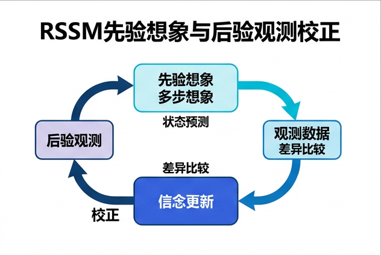
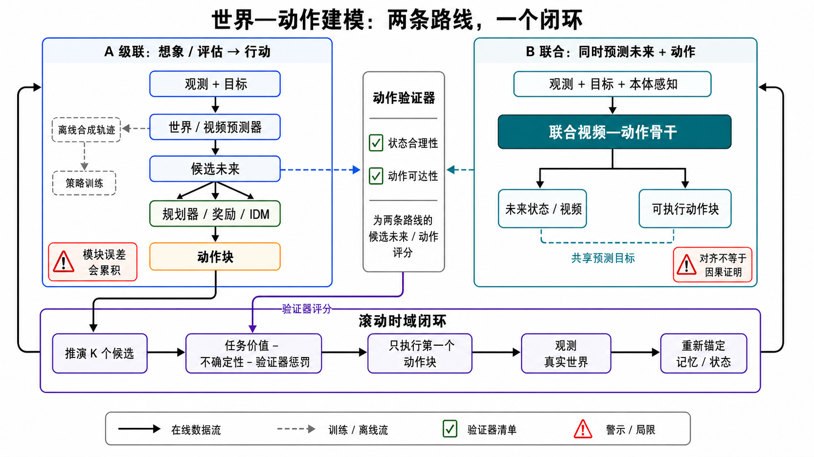
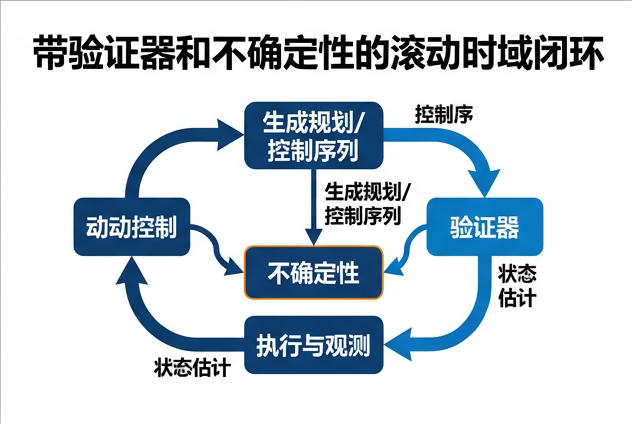

# 从视频生成器到 World Action Model：机制、闭环与证据

本章讨论的不是“哪一个视频模型看起来最像世界”，而是一个更严格的问题：**模型能否在动作干预下维护状态、预测多种可能未来，并让真实环境中的决策变得更好？** 资料检索与发布状态核验截止到 **2026-08-30**；检索式、纳排规则、证据等级和图稿记录见[研究日志](../sources/research_20260830_video_world_action_models.md)。

## 学习目标

读完本章，应当能够：

1. 区分 video generator、predictive world model、world action model、controllable simulator、policy 与 environment model。
2. 解释 deterministic latent dynamics、stochastic latent dynamics 和 RSSM 各自保留了什么信息。
3. 从机制与用途理解 World Models、PlaNet、Dreamer、MuZero、TD-MPC、Genie、GameNGen 和机器人 WAM 的关系。
4. 比较“planner/policy + video generator”级联路线与 joint action–video model 联合路线。
5. 设计包含 action verifier、persistent state、反事实、不确定性和 receding-horizon feedback 的闭环。
6. 用分层协议评价画质、状态/动作忠实度、决策效用和现实迁移，而不是只看一段 demo。

## 1. 六个容易混用的概念

先固定符号。观测为 $o_t$，不可直接观测的环境状态为 $s_t$，动作或动作块为 $a_t$，目标为 $g$，内部记忆为 $m_t$。一个动作条件预测器近似：

```math
p(o_{t+1:t+H},s_{t+1:t+H}\mid o_{\leq t},a_{t:t+H-1},g,m_t).
```

这条式子仍不足以说明系统会规划、会执行或能在现实中安全工作。

| 概念 | 最小输入/输出 | 训练或使用目标 | 最低成立证据 | 不能自动推出 |
|---|---|---|---|---|
| **Video generator** | 文本/图像/视频条件 → 视频 | 生成视觉上合理的时空样本 | 视觉质量、运动质量、多样性 | 动作因果、可执行性、规划价值 |
| **Predictive world model** | 历史状态/观测 + 候选动作 → 未来状态、观测、奖励或价值 | 学习动作条件转移 | 动作分支、状态转移或 return 验证 | 一定生成像素；一定就是 policy |
| **World action model (WAM)** | 观测/目标 → 动作，并在推理时与未来预测耦合 | 让“想象未来”和“产生动作”共同服务控制 | 未来预测与动作生成在同一推理闭环中发生 | 任意任务零样本成功；因果模型已识别 |
| **Controllable simulator** | 外部动作/事件 → 可持续交互的观测流 | 作为人或 agent 可操控的环境 | 动作响应、实时性、长时状态与回访一致性 | 能输出真实设备可执行动作 |
| **Policy** | 状态/观测/目标 → 动作分布 | 最大化真实或仿真环境中的任务收益 | 外部环境成功率、return、风险 | 拥有显式或可视化世界模型 |
| **Environment model** | 状态 + 动作 → 下一状态/奖励/终止 | 复现某一环境的转移接口 | 对该环境的转移与 reward fidelity | 是大规模预训练模型；覆盖开放世界 |

机器人 WAM 教程把 WAM 定义为一种 policy：它的动作生成在推理时与未来预测耦合，并归纳出 imagine-then-execute、video-feature-conditioned action、joint video–action、auxiliary video prediction 四类范式 [[1]](#ref-1)。机器人 world-model 综述则从“为 policy 提供预测”“作为 simulator”“robotic video world model”组织系统 [[2]](#ref-2)。两种分类并不冲突：前者问动作如何产生，后者问世界模型在整个学习系统中扮演什么角色。

三个判断边界尤其重要：

- **视频先验不是干预模型。** 从自然视频学到“通常接下来发生什么”，不等于学到“如果我换一个动作会发生什么”。
- **联合输出不是因果证明。** 同一 backbone 同时生成视频与动作，可以改善表示对齐，却仍可能复现数据中的相关性。
- **交互 demo 不是决策效用。** 键鼠能改变画面只证明接口存在；规划价值要在独立环境或真实机器人中验证。

## 2. 从确定性动力学到 stochastic latent state

### 2.1 Deterministic latent dynamics

最简单的 latent world model 用一个确定性状态递推：

```math
h_{t+1}=f_\theta(h_t,a_t),\qquad
\hat{o}_{t+1}=g_\theta(h_{t+1}).
```

优点是 rollout 快、缓存简单、同一动作序列可复现；缺点是把所有不确定性压进单一路径。当门后是否有人、遮挡物如何运动或接触结果本来就有多种可能时，均方误差会产生模糊平均，离散 token 则可能过早锁定一个未来。

### 2.2 Stochastic latent dynamics

随机状态显式表示“一段历史之后仍不能确定”的部分：

```math
z_{t+1}\sim p_\theta(z_{t+1}\mid h_{t+1}),\qquad
\hat{o}_{t+1}\sim p_\theta(o_{t+1}\mid h_{t+1},z_{t+1}).
```

模型可以采样多个 future rollouts，估计任务收益分布和失败概率。但“样本不同”不必然等于“概率校准”：若训练数据没有覆盖某类动作或接触，模型可能对错误未来非常自信。

### 2.3 RSSM：记忆与随机性的组合

PlaNet 的 recurrent state-space model（RSSM）把 deterministic recurrent state $h_t$ 与 stochastic state $z_t$ 组合 [[5]](#ref-5)：

```math
\begin{aligned}
h_t &= f_\theta(h_{t-1},z_{t-1},a_{t-1}),\\
p_\theta(z_t\mid h_t) &\quad\text{（先验，用于想象）},\\
q_\phi(z_t\mid h_t,o_t) &\quad\text{（后验，用于观测校正）}.
\end{aligned}
```

这里的 posterior 在新观测到来时校正 belief，prior 在没有新观测时按动作想象；数学上与随机未来模型共享 variational state-space 接口。ELBO、prior–posterior gap、posterior collapse、aleatoric/epistemic 分账见[变分随机视频生成](generative-models/variational-generation.md)；reward/continue、planner、return 与 model exploitation 仍由本章负责。两种验收不能互相替代。


_图 1：RSSM 的“先验想象—后验校正”结构。实线表示有观测时的更新，虚线表示仅依靠 learned dynamics 的 rollout。_

顺序化文字替代：

1. 上一时刻的确定性状态、随机状态和动作进入 recurrent transition。
2. transition 产生新的确定性记忆 $h_t$。
3. 没有新观测时，从 prior 采样 $z_t$ 并继续想象；有新观测时，encoder 与 $h_t$ 共同形成 posterior。
4. $h_t,z_t$ 用于重建观测或预测 reward/value；真实观测到达后，posterior 把 rollout 重新锚定到环境。

### 2.4 同是 model-based，预测目标并不相同

| 路线 | 模型预测什么 | 决策怎样使用模型 | 主要优势 | 主要风险 |
|---|---|---|---|---|
| World Models [[4]](#ref-4) | 图像 latent 的 recurrent dynamics | controller 在 learned environment 中训练 | 建立“表示—世界—策略”分工 | learned environment 可被 controller 利用 |
| PlaNet / RSSM [[5]](#ref-5) | latent state 与 reward | 在线搜索候选动作序列 | 从像素直接做 latent planning | horizon 越长，模型误差越容易累积 |
| Dreamer [[6]](#ref-6) | latent trajectory、reward、continuation | imagined actor–critic | 避免每一步昂贵的在线搜索 | actor 会偏好模型的乐观区域 |
| MuZero [[7]](#ref-7) | reward、value、policy 所需的任务相关状态 | tree search | 不要求重建完整观测 | latent 对决策充分，不等于可视世界完整 |
| DreamerV3 [[8]](#ref-8) | 统一 RSSM 下的多域 dynamics | imagined policy learning | 一套配置跨广泛任务 | 算法通用不等于共享世界知识的单 checkpoint |
| TD-MPC2 [[9]](#ref-9) | task-oriented latent、reward、value | trajectory optimization + learned policy prior | 多任务连续控制、滚动规划高效 | 仍依赖训练任务覆盖和短时可靠 rollout |

因此，world model 没有唯一正确的输出空间。若用途是控制，只需保留 reward-relevant state；若用途是人可检查的交互环境，就还要生成视觉与声音；若用途是训练通用机器人，动作、接触、对象状态和语言目标都可能是必要变量。

## 3. 三条历史支流怎样汇合

### 3.1 动作条件预测：先回答“做了之后会怎样”

Action-Conditional Video Prediction 在 Atari 中把动作显式放进未来帧预测 [[3]](#ref-3)。World Models、PlaNet、Dreamer 和 MuZero 随后把 latent prediction 接到 controller、planning 或 value search。这个时期的实验域小，却建立了最严格的验收方式：最终要看外部环境 return，而不只是下一帧误差。

2023 年后出现两种规模化：

- DreamerV3 和 TD-MPC2 扩大算法、任务与 embodiment 覆盖，但核心仍是决策型 latent model。
- GAIA-1 和 UniSim 把生成视频先验接到驾驶或机器人动作，开始形成可供策略训练或评估的视觉模拟器 [[10]](#ref-10) [[11]](#ref-11)。

### 3.2 无动作视频：先学世界，再识别 latent action

Genie 从无动作标签的平台游戏视频中学习 video tokenizer、latent action model 与 autoregressive dynamics，并在生成时用 latent action 控制下一帧 [[12]](#ref-12)。它解决的是“互联网视频没有控制标签时，怎样发现可控变化”，但 latent action 不天然对应现实机器人的关节、末端位姿或力。

ViPRA 延续这条思路：预训练时联合预测未来视觉与 motion-centric latent action，再用较小的 flow decoder 映射为连续动作块 [[21]](#ref-21)。这种设计把 action-free video 的规模优势带入 policy，但动作落地仍依赖少量带动作数据及 embodiment-specific decoder。

### 3.3 神经交互环境：把下一帧生成推到实时闭环

| 系统 | 机制与用途 | 作者报告的系统尺度 | 证据边界 |
|---|---|---|---|
| GameNGen [[13]](#ref-13) | action-conditioned diffusion 自回归生成 Doom；用上下文噪声增强训练缓解误差累积 | 单 TPU 超过 20 FPS | 单一游戏；实时画面不等于通用状态正确 |
| DIAMOND [[14]](#ref-14) | diffusion world model 作为强化学习环境；同时报告 Atari 与 CS:GO | CS:GO 约 10 FPS（RTX 3090）；开源代码与可玩 demo | learned model 中“多跳”错误会被 agent 利用，正是 model exploitation |
| Oasis [[15]](#ref-15) | Minecraft 风格 action-conditioned video world model；dynamic noising 稳定长 rollout | 项目页报告约 20 FPS | 开放 500M 权重与更大在线 demo 不是同一证据面 |
| Genie 2 / Genie 3 [[32]](#ref-32) [[33]](#ref-33) | 从提示生成可键鼠控制的世界，官方展示长时一致性与 promptable events | 以机构发布和交互 demo 为主 | 没有同等级公开论文、权重与独立闭环评测，不能按 checkpoint 证据表述 |

GameNGen、DIAMOND 和 Oasis 的意义不只是“会玩游戏”。它们把 **action rate、渲染 FPS、闭环延迟、自由 rollout 稳定性** 暴露为系统变量，也清楚展示了策略可能主动寻找 learned simulator 的漏洞。

开放域 video generator 是另一条重要支流：Sora 技术报告把大规模视频生成表述为 world-simulator 研究方向，但没有公开动作接口或规划实验 [[16]](#ref-16)；Cosmos 把 tokenizer、生成模型、数据处理和后训练组织为 Physical AI 平台，却也不能让每个 checkpoint 自动获得闭环控制能力 [[31]](#ref-31)。它们提供 world prior 与工程底座，不应仅凭命名升级为 WAM。

## 4. World Action Model：未来预测怎样参与动作生成

WAM 不是给普通 policy 加一个“world”名字。最低条件是：**未来预测在推理阶段参与动作产生或选择** [[1]](#ref-1)。按耦合位置，可以得到四种范式：

| 范式 | 推理路径 | 典型用途 | 关键验收 |
|---|---|---|---|
| Imagine then execute | 候选动作 → rollout → 评分 → 执行 | MPC、规划、风险筛选 | rollout ranking 与真实结果一致 |
| Video-feature-conditioned action | 预测未来的特征 → action decoder | 将动作免费的视频预训练迁移到机器人 | 特征变化与可执行 action chunk 对齐 |
| Joint video–action modeling | 一个 backbone 联合预测未来与动作 | 端到端闭环 policy | 视频、动作、状态三者一致，且真机收益成立 |
| Auxiliary video prediction | policy 训练时附加未来预测损失 | 改善表示和数据效率 | 去掉辅助头后的消融与真实成功率 |

实践中还可按系统拓扑归并为两条主路线：**级联路线**让预测器、planner/verifier、policy 保持模块化；**联合路线**在共享模型中同时预测未来和动作。

## 5. 两条路线：级联与联合



_图 2：World–Action Modeling 的两条系统路线。AI-generated scientific schematic；生成提示、迭代记录、SHA-256、尺寸与视觉检查见[研究日志](../sources/research_20260830_video_world_action_models.md)。_

顺序化文字替代：

1. 左侧级联系统先从当前观测与目标预测 $K$ 个候选未来。
2. planner/reward/IDM 和 action verifier 分别检查任务价值、状态合理性与动作可达性，再选出动作块；同一预测器也可离线产生合成轨迹训练 policy。
3. 右侧联合系统用一个共享 video–action backbone 同时产生未来状态/视频与动作块，用共同预测目标约束二者对齐。
4. 两条路线都只执行动作块的第一部分，读取真实环境新观测，更新近期上下文、实体/空间记忆与不确定性，然后重新规划。

### 5.1 路线 A：planner/policy + video generator

级联路线有两种常被混在一起的用法。

**在线 imagine–evaluate–act。** 世界模型针对候选动作生成 future rollouts；reward/value、约束、IDM 或 verifier 对候选打分；MPC 只执行第一个动作或短 action chunk。PlaNet、TD-MPC2、DINO-WM 与 V-JEPA 2-AC 都可放在这条谱系中，尽管它们预测 pixel、feature 或 task latent 的方式不同 [[5]](#ref-5) [[9]](#ref-9) [[17]](#ref-17) [[18]](#ref-18)。

**离线 imagine–label–train。** DreamGen 先后训练可由机器人动作控制的 video world model，用它生成大量新颖交互视频，再通过 inverse dynamics/latent pseudo-action 标注轨迹，最后训练通用 policy [[19]](#ref-19)。它的主证据是**合成数据改善 policy**，不是在线 planner 延迟。官方代码现已公开 world-model finetune、视频生成、动作恢复和 policy 训练四阶段；这比只有演示视频的发布面更强，但仍需分别核对所用 checkpoint、真实数据比例和任务成功率。

World Action Verifier（WAV）提供了一个可插入这两种级联系统的验证器 [[20]](#ref-20)。其核心不是问整段视频“像不像”，而是把转移检查拆成：

```math
\underbrace{p(s'\mid s)}_{\text{state plausibility}}
\quad\text{与}\quad
\underbrace{p(a\mid s,s')}_{\text{action reachability}}.
```

论文用 action-free video 产生多样 subgoal、稀疏 inverse model 恢复动作，并通过 forward rollout cycle 检查可达性。作者在 9 个 MiniGrid、RoboMimic 与 ManiSkill 任务上报告约 2 倍 sample efficiency 和超过 22% 的下游提升。这里的正确结论是“分解 verifier 可改善指定任务的数据筛选/学习”，不是“WAV 已成为通用实时安全证书”；它的 ICLR 2026 证据来自 World Models workshop 与 Recursive Self-Improvement workshop，而不是 ICLR 主会录用。

### 5.2 路线 B：joint action–video model

联合路线希望同一个预测 backbone 在学习“世界将怎样变化”时也学会“我应该怎样行动”。

- **ViPRA** 联合预测 future visual observation 与 motion-centric latent action，再用 flow-based decoder 输出连续 action chunks [[21]](#ref-21)。论文把“最高 22 Hz 的系统能力”与实验实际闭环设置区分开：评测最高限制在约 3.5 Hz，有效 action chunk 长 14、执行 7 步后重规划。报告时不能只摘最高频率。
- **DreamZero / World Action Model** 用 14B autoregressive video diffusion backbone 联合建模未来视频与机器人动作，并把新观测回写 KV cache 形成闭环 [[22]](#ref-22)。作者报告通过推理优化达到约 7 Hz 和 38 倍加速；“zero-shot”只适用于论文指定的任务、机器人和数据设定，不能外推为任意现实任务。

联合路线省去多个模块之间的格式转换，并可能让 action token 与 visual dynamics 共享表示；代价是更难定位错误。一个动作成功，可能来自视觉先验、动作头、训练数据偏置或外部控制器；一个视频合理，也不代表 action 可执行。必须做拆头、冻结 backbone、移除预测损失、扰动 proprioception 等消融。

### 5.3 设计取舍

| 维度 | 级联路线 | 联合路线 |
|---|---|---|
| 模块可替换性 | 高；generator、planner、verifier、policy 可分别升级 | 低到中；接口少，但内部耦合强 |
| 错误定位 | 可按预测、评分、IDM、控制逐段检查 | 需要结构化 probe 和消融 |
| 离线数据扩展 | 强；可批量生成再过滤 | 也可生成，但常以在线 policy 为主 |
| 在线延迟 | 多候选 rollout 与评分较贵 | 一次前向可直接给动作，但大 backbone 仍可能慢 |
| 不确定性 | 容易通过多模型、多样采样和 verifier 组合 | 需防共享错误让未来与动作“共同自信” |
| 动作空间迁移 | 可更换 IDM/action decoder | 共享 action token 时可能需要重新对齐 |
| 安全插桩 | 外部约束、shield、verifier 较自然 | 需要显式输出或外部 safety layer |
| 最合适的证据 | 每模块校准 + 端到端真实效用 | joint objective 消融 + 闭环真机效用 |

二者不是互斥终局。实际系统可以用 joint model 提议 action chunks，再用独立 verifier 和 model ensemble 复核；也可以用级联 world model 生成数据，训练一个低延迟 joint policy。

图 2 中的 IDM 不是 planner 的同义词：在 DreamGen 类离线管线中，它主要把合成视觉变化恢复成伪动作；在部分在线级联系统中，它可检查候选转移是否能由某个动作解释。候选搜索、任务价值优化与约束处理仍由 planner/reward/verifier 承担。

## 6. 闭环的四个必要部件

### 6.1 Action verifier：检查“状态像真”与“动作可达”

一个实用 verifier 至少要区分：

1. **state plausibility**：候选下一状态是否符合物体、几何、接触和任务约束；
2. **action reachability**：给定当前状态与候选下一状态，是否存在当前 embodiment 能执行的动作；
3. **trajectory consistency**：逐步都合理的局部转移，组合后是否仍满足全局约束；
4. **epistemic warning**：候选是否落在训练分布外，verifier 本身是否也不可靠。

只做美学或语义相似度评分，会偏爱“像成功”的视频，却可能放过穿透、瞬移、错误抓取或控制延迟。

### 6.2 Counterfactual intervention：固定初态，只换动作

动作条件模型必须通过配对干预测试。给定同一初态与随机种子，比较 no-op、左移、右移、抓取、释放等动作：

```math
\Delta_{\text{cf}}
=d\!\left(\hat{s}_{t+H}^{\,a},s_{t+H}^{\,a}\right)
-d\!\left(\hat{s}_{t+H}^{\,a'},s_{t+H}^{\,a'}\right),
```

并检查三类变量：

- **应变变量**：被动作直接影响的位置、接触、速度或对象状态应正确改变；
- **不应变变量**：背景身份、未触碰物体、场景布局不应无故改变；
- **分支覆盖**：随机未来应覆盖真实可达模式，而不是用纹理差异冒充因果多样性。

如果只有每条视频各自的 FVD/人评，而没有成对动作干预，就不能声称 action fidelity。

### 6.3 Uncertainty 与 model exploitation

风险不是模型偶尔犯错，而是 planner 会**主动寻找模型最乐观的错误区域**。DIAMOND 中 agent 可利用错误的多次跳跃规则，就是一个清楚例子 [[14]](#ref-14)。可采用：

- ensemble disagreement 或多 seed rollout；
- reward/value 与 dynamics 分开校准；
- conservative objective：任务价值减去 uncertainty 与 verifier penalty；
- OOD detector、action constraint 和真实环境 safety shield；
- 短 horizon、多次重规划；
- 在真实环境中记录“预测好、执行坏”的 exploitation cases，并回灌训练集。

不确定性也要分解：aleatoric uncertainty 表示世界本身有多未来，epistemic uncertainty 表示模型没有见过。前者适合风险分布，后者应触发保守动作、请求观测或停止。

### 6.4 Receding horizon：每次只相信一小段未来


_图 3：带 verifier、不确定性和 persistent state 的 receding-horizon 闭环。_

顺序化文字替代：

1. 系统从真实观测和 persistent state 产生 $K$ 个候选动作及其未来。
2. 价值模型、不确定性估计与 action verifier 共同评分。
3. 系统只执行第一个动作或短 action chunk，而不盲目执行完整 imagined plan。
4. 新观测到达后，模型做 posterior correction，更新实体、空间与事件状态。
5. 如果预测误差超过阈值，系统进入减速、重新感知或安全策略；否则进入下一轮规划。

闭环总延迟为感知、候选生成、评分、控制通信和执行等待之和。渲染 20 FPS 不代表 20 Hz action rate，更不代表 50 ms 以内的 sense-to-act latency。

## 7. Persistent state：长上下文不等于长期世界

长期交互需要至少三种状态：

```math
m_{t+1}=\mathrm{Update}\!\left(m_t,o_{t+1},a_t,
\epsilon_{t+1}\right),
```

其中 $\epsilon_{t+1}$ 是预测与真实观测的 innovation。可操作的 memory 需要“写入、覆盖、检索、遗忘和置信度”，而不只是缓存更多帧。

| 层 | 保存内容 | 典型实现 | 必须测试 |
|---|---|---|---|
| Recent context | 最近动作、速度、局部外观 | sliding window、KV cache | 短时运动连续性、延迟 |
| Entity state | 对象身份、属性、是否已移动/打开/损坏 | object slots、entity table | 遮挡后重现、状态不回滚 |
| Spatial memory | 位姿、地标、拓扑、可见区域 | pose/geometry-indexed bank | loop closure、回访一致性 |
| Event memory | 动作及其长期后果 | event graph、trajectory summary | 因果顺序、长期任务约束 |
| Uncertainty memory | 哪些状态来自观测、推断或低置信生成 | per-state confidence、age | 冲突更新、过期信息降权 |

### 7.1 2025–2026 的三种长时机制

| 工作 | 核心机制 | 作者报告 | 当前边界 |
|---|---|---|---|
| WorldPack [[23]](#ref-23) | trajectory packing + 视野/位姿几何选择；不同时间尺度动态压缩帧 | 以 4 帧 token 预算暴露 22 帧历史（5.5 倍）；LoopNav/RECON 长上下文实验 | trajectory packing 约增加 16% diffusion inference time，几何选择还有额外成本；是压缩记忆，不是显式对象状态 |
| Infinite-World [[24]](#ref-24) | hierarchical pose-free memory compressor；tri-state uncertainty-aware action label；revisit-dense finetune | 作者报告 1000+ frame 的一致交互 | 主要是一手论文/项目展示，未发现等价完整公开代码与权重 |
| ReWorld（长时记忆） [[25]](#ref-25) | 多尺度 attention window + random routing；固定 KV cache + pose-indexed landmark bank；chunk-drop training | 作者报告 704×1280 streaming，并在固定 12-chunk cache 下生成 64 秒/384 latents | repo 有 inference code，但截至检索日 weights 标为 “Coming soon”，不能称端到端可复现 |

WorldPack 当前 arXiv v3 的标题是 _Dynamic Frame Compression for Long-context Video World Modeling_，不应沿用早期标题。ReWorld 还存在同名歧义：另一篇 _ReWorld: Multi-Dimensional Reward Modeling for Embodied World Models_ 提出 235K+ 多维偏好数据与 HERO reward heads，用于 physical realism、embodiment plausibility、task completion、visual quality 评分 [[26]](#ref-26)。它是 reward modeling 工作，不是上述 long-horizon memory system；引用时必须带副标题或 arXiv ID。

### 7.2 长时评测不能只报“生成了多少秒”

至少构造四类 probe：

1. **回访**：离开房间后返回，布局、已移动物体与已打开门是否保持；
2. **离屏演化**：对象在视野外仍按动力学运动，重新出现时状态是否正确；
3. **事件持久**：执行“取走—放置—绕行—返回”，任务状态是否不回滚；
4. **冲突更新**：新观测否定旧记忆时，系统是否覆盖旧状态并降低过期缓存权重。

报告首次不可恢复错误的时间、loop-closure error、entity identity switches 和 event-state accuracy，比只报最长样片更有诊断力。

## 8. 一套从运行规格到现实效用的 WM 报告栈

单个总分会掩盖“画面好但动作错”或“短时准但规划会利用漏洞”。建议按层报告，上一层通过不代表下一层通过。这里使用 **WM0–WM6** 作为本章的局部报告栈，避免与[评测指南](evaluation.md)中面向能力主张的全局 **L0–L7 证据阶梯**混淆：WM0–WM1 是发布与系统前提，不是能力等级；WM2–WM6 才逐步对应全局证据。

| 本章 WM 报告栈 | 对应的全局 L0–L7 | 解释 |
|---|---|---|
| WM0 发布面 | 不对应能力等级 | 只说明结论来自哪里、artifact 是否可得 |
| WM1 系统规格 | 不对应能力等级 | 只说明速度、延迟、动作频率与内存边界 |
| WM2 open-loop 感知 | L0–L2 | 从渲染质量到时间、语义与物理诊断 |
| WM3 状态与动作 | L3 | 给定动作后的状态转移是否正确 |
| WM4 反事实与不确定性 | L4 | 换动作时是否产生正确且校准的分支 |
| WM5 规划与决策 | L5–L6 | 先验证闭环 rollout，再验证策略排序与决策收益 |
| WM6 现实迁移 | L7 | 是否在独立真实系统中改善成功率、安全或数据效率 |

### WM0：发布面与证据来源

对每一个结论记录：

- paper 版本、venue 状态、项目页更新日期；
- code、weights、data、evaluation script 是否公开；
- 论文 checkpoint 是否等同公开 checkpoint，公开小模型是否等同在线大 demo；
- 数字来自 peer-reviewed paper、arXiv、作者项目、代码 README 还是厂商发布。

### WM1：系统与运行规格

| 字段 | 统一报告方式 | 常见误读 |
|---|---|---|
| FPS | 生成帧数 / wall-clock second；注明硬件、batch、采样步数 | 把离线吞吐当交互速度 |
| 分辨率 | 模型实际输出，不把后处理上采样混入 | 分辨率更高就更物理 |
| Rollout horizon | 同时报 frames、seconds、decision steps 与首次失效点 | 只报最好样片长度 |
| Action rate | 每秒接受/执行多少次新 action；注明 action chunk | 与 video FPS 混为一谈 |
| Memory | context frames/tokens、KV 大小、landmark/entity store、增长率 | “支持长视频”等于有 persistent state |
| Latency | p50/p95 sense-to-act、first-frame、replan latency | 用平均 FPS 掩盖长尾卡顿 |

### WM2：open-loop perceptual quality

在 teacher-forced 或固定动作序列下报告 FVD/LPIPS/SSIM、human preference、temporal artifacts，并把 camera motion、对象运动、接触和遮挡分层。此层只回答“未来看起来怎样”，不能回答“动作是否正确”。

### WM3：state 与 action fidelity

- 从生成视频提取对象 pose、速度、接触、关节状态和任务事件，与真值轨迹比较；
- 计算 action-conditioned transition error、action recognizability、inverse-dynamics consistency；
- 对 no-op、相反动作、无效动作和边界动作分别报告；
- 检查 visual action、proprioception 与真实控制命令是否时序对齐。

### WM4：counterfactual 与不确定性

- 同初态、多动作、多随机种子成对比较；
- 测 causal effect error、branch coverage、calibration error、negative log-likelihood 或 risk–coverage curve；
- 设计 OOD 动作组合、未见对象关系和接触条件；
- 对“高价值但高 uncertainty”的候选，验证 conservative scoring 是否降低灾难失败。

### WM5：planning / decision utility

世界模型必须在独立真值环境中接受考试：

- policy ranking correlation：模型中的 policy 排名与真实环境排名是否一致；
- planning regret：world-model planner 与 oracle/真实 rollout planner 的收益差；
- model exploitation gap：在模型内高分、真实环境低分的差距；
- data efficiency：加入世界模型或合成数据后，达到同一成功率需要多少真实样本；
- safety utility：碰撞、违规、失败恢复和 constraint violation 是否改善。

WorldGym 把 action-conditioned video model 当作 policy evaluation environment，用 Monte Carlo rollouts 与视觉语言模型 reward 评估 VLA policy；作者报告模型内成功率与真机成功率高度相关，并能保留不同版本、规模和 checkpoint 的相对排序 [[28]](#ref-28)。论文同时明确指出真实物体交互仍难生成，因此“ranking 可用”与“绝对转移可信”仍是两个问题。

### WM6：real-world transfer

最后报告冻结/微调设置、真实机器人与相机、任务数、重复次数、成功率置信区间、干预次数、故障类别和 sim-to-real gap。若只在生成器自身 rollout 中评估 planner，不应记为通过 WM5，更不能据此支持全局 L7 的现实效用主张。

### 8.1 新评测集各自补哪块证据

| 工作 | 主要补充 | 仍需搭配 |
|---|---|---|
| WorldEval [[27]](#ref-27) | 用 Policy2Vec 构造 latent-action world simulator，在线比较 policy 与 checkpoint 排名 | 独立环境的绝对成功率、广泛失败类别 |
| WorldGym [[28]](#ref-28) | 从真实初始帧做 Monte Carlo rollout，以 VLM reward 评估 policy 排名和新任务泛化 | 更可靠的物体交互、绝对校准和安全 |
| MiraBench [[29]](#ref-29) | physical adherence、action-following fidelity 与 optimism bias | 真实闭环 transfer |
| RoboWM-Bench [[30]](#ref-30) | 将生成的人手/机器人操作视频恢复为 embodied action，并在物理约束仿真中执行，暴露空间、接触与非物理形变错误 | 真机 transfer、更广任务、长期 memory 与成本报告 |

推荐最小报告矩阵：

| 层级 | 指标 | 短 horizon | 长 horizon | In-distribution | OOD |
|---|---|---:|---:|---:|---:|
| WM1 系统 | FPS、action Hz、p95 latency、memory | ✓ | ✓ | ✓ | ✓ |
| WM2 感知 | perceptual/temporal quality | ✓ | ✓ | ✓ | ✓ |
| WM3 状态动作 | pose/contact/event/action fidelity | ✓ | ✓ | ✓ | ✓ |
| WM4 反事实 | paired intervention、calibration | ✓ | ✓ | ✓ | ✓ |
| WM5 决策 | ranking、regret、exploitation gap | ✓ | ✓ | ✓ | ✓ |
| WM6 现实 | success、safety、transfer gap | ✓ | ✓ | ✓ | ✓ |

## 9. 2025–2026 重点工作的证据地图

| 工作 | 在本章中的角色 | Paper | Project / code | 截止 2026-08-30 的证据等级 |
|---|---|---|---|---|
| WAM concise tutorial [[1]](#ref-1) | 定义与四范式 | arXiv v7 | 作者论文页 | B：最新教程，非基准结论 |
| World Model for Robot Learning survey [[2]](#ref-2) | policy-centric taxonomy | arXiv | 论文入口 | B：最新综述，非原始实验 |
| DreamGen [[19]](#ref-19) | 级联式离线合成数据 | CoRL 2025 / PMLR | [Project](https://research.nvidia.com/labs/gear/dreamgen/) · Code [](https://github.com/NVIDIA/GR00T-Dreams) | A：正式论文 + 四阶段代码 |
| World Action Verifier [[20]](#ref-20) | state plausibility + action reachability | arXiv v2 | [Project](https://world-action-verifier.github.io/) · Code [](https://github.com/world-action-verifier/wav_robot) | B：论文 + 代码；workshop 荣誉，不是主会 |
| ViPRA [[21]](#ref-21) | latent action 与 future feature 联合预训练 | ICLR 2026 OpenReview | [Project](https://vipra-project.github.io/) · Code [](https://github.com/sroutray/vipra) | A：官方会议记录 + code/weights |
| LPWM | object-particle + latent-action 的相邻变分桥接支线 | [ICLR 2026 Oral](https://openreview.net/forum?id=lTaPtGiUUc) | [Project](https://taldatech.github.io/lpwm-web/) · Code [](https://github.com/taldatech/lpwm) | A：正式会议记录 + code/data/weights；对象化场景与相机运动仍是边界 |
| DreamZero [[22]](#ref-22) | joint video–action 闭环 policy | arXiv | [Project](https://dreamzero0.github.io/) · Code [](https://github.com/dreamzero0/dreamzero) | B：论文 + 项目 + 代码 |
| WorldPack [[23]](#ref-23) | 动态帧压缩与几何检索 | arXiv v3 | 论文入口 | B：论文；开放面需逐项核对 |
| Infinite-World [[24]](#ref-24) | pose-free hierarchical memory | arXiv v2 | [Project](https://rq-wu.github.io/projects/infinite-world/) | B/C：论文 + demo；未见等价完整代码 |
| ReWorld—long-horizon memory [[25]](#ref-25) | 固定 KV + landmark bank | arXiv v1 | Code [](https://github.com/zhifeichen097/ReWorld) | B-：inference code，weights 未发布 |
| ReWorld—reward modeling [[26]](#ref-26) | 多维 embodied reward | arXiv | 论文入口 | B：同名不同工作 |

等级定义：A = 正式同行评审入口 + 可定位的一手 artifact；B = arXiv + 作者项目或代码；C = 机构发布/demo；D = 二手发现线索。等级描述的是**可核查面**，不是模型质量排名。

## 10. 研究与工程上的停止规则

如果出现下列情况，应停止扩大能力声明：

1. 只有 cherry-picked demo：只能写“展示了样例”，不能写“长期一致”。
2. 只有生成器中的 planner 分数：不能写“改善真实决策”。
3. 只给 FPS：不能写“实时闭环”，除非 action rate 与 p95 latency 也达标。
4. 只给平均画质：不能写“动作忠实”，除非有 paired counterfactual。
5. 只发布项目页：不能写“开源”，除非 code、weights、license 与可运行入口明确。
6. 同名或改名论文未消歧：必须带完整副标题、版本或 arXiv ID。
7. policy 和 world model 共用数据/评分器：必须报告泄漏检查与独立真值环境。
8. 模型产生不确定候选但系统仍整段执行：不能称风险感知闭环。

一个可接受的能力表述模板是：

> 在【指定数据、任务、动作空间和硬件】下，该系统以【级联/联合】方式把未来预测用于【数据生成/规划/动作输出】，通过【WM2–WM6 中的具体证据】支持【有限结论】；其【长期状态、反事实、OOD、不确定性或现实迁移】仍未被相应实验验证。能力结论另按全局 L0–L7 标注。

## 11. 推荐阅读路径

1. 从 World Models、PlaNet、Dreamer、MuZero 理解“完整像素”与“对决策充分”的区别。
2. 从 TD-MPC2、DINO-WM、V-JEPA 2 理解 latent planning 与 receding horizon。
3. 从 Genie、GameNGen、DIAMOND、Oasis 理解 latent action、实时交互与 model exploitation。
4. 从 DreamGen、WAV、ViPRA、DreamZero 比较级联和联合 WAM。
5. 从 WorldPack、Infinite-World、两篇 ReWorld 理解 compression、persistent state 与 reward/verifier 的不同职责。
6. 最后用 WM0–WM6 报告栈审查每个新发布，再映射到全局 L0–L7；不要把产品 demo、paper 和 checkpoint 混为一种证据。

相邻章节：[动作条件预测](tasks/action-conditioned-prediction.md)、[交互式世界生成](tasks/interactive-world-generation.md)、[循环预测](generative-models/recurrent-prediction.md)、[JEPA](jepa.md)、[物理一致性](physical-consistency.md)与[评测指南](evaluation.md)。

## 参考文献

<a id="ref-1"></a>[1] [From World Models to World Action Models: A Concise Tutorial for Robotics](https://arxiv.org/abs/2607.00836). arXiv:2607.00836, v7. 2026.

<a id="ref-2"></a>[2] [World Model for Robot Learning: A Comprehensive Survey](https://arxiv.org/abs/2605.00080). arXiv:2605.00080. 2026.

<a id="ref-3"></a>[3] [Action-Conditional Video Prediction using Deep Networks in Atari Games](https://papers.nips.cc/paper_files/paper/2015/hash/6ba3af5d7b2790e73f0de32e5c8c1798-Abstract.html). NeurIPS. 2015.

<a id="ref-4"></a>[4] [World Models](https://arxiv.org/abs/1803.10122). arXiv:1803.10122. 2018.

<a id="ref-5"></a>[5] [Learning Latent Dynamics for Planning from Pixels](https://proceedings.mlr.press/v97/hafner19a.html). ICML / PMLR 97. 2019.

<a id="ref-6"></a>[6] [Dream to Control: Learning Behaviors by Latent Imagination](https://openreview.net/forum?id=S1lOTC4tDS). ICLR. 2020.

<a id="ref-7"></a>[7] [Mastering Atari, Go, Chess and Shogi by Planning with a Learned Model](https://doi.org/10.1038/s41586-020-03051-4). Nature. 2020.

<a id="ref-8"></a>[8] [Mastering Diverse Control Tasks through World Models](https://www.nature.com/articles/s41586-025-08744-2). Nature 640:647–653. First public as arXiv:2301.04104 in 2023; formally published in 2025.

<a id="ref-9"></a>[9] [TD-MPC2: Scalable, Robust World Models for Continuous Control](https://openreview.net/forum?id=Oxh5CstDJU). ICLR. 2024.

<a id="ref-10"></a>[10] [GAIA-1: A Generative World Model for Autonomous Driving](https://arxiv.org/abs/2309.17080). arXiv:2309.17080. 2023.

<a id="ref-11"></a>[11] [Learning Interactive Real-World Simulators](https://openreview.net/forum?id=sFyTZEqmUY). ICLR. 2024.

<a id="ref-12"></a>[12] [Genie: Generative Interactive Environments](https://proceedings.mlr.press/v235/bruce24a.html). ICML / PMLR 235. 2024.

<a id="ref-13"></a>[13] [Diffusion Models Are Real-Time Game Engines](https://openreview.net/forum?id=P8pqeEkn1H). ICLR. 2025.

<a id="ref-14"></a>[14] [Diffusion for World Modeling: Visual Details Matter in Atari](https://proceedings.neurips.cc/paper_files/paper/2024/hash/6bdde0373d53d4a501249547084bed43-Abstract-Conference.html). NeurIPS. 2024.

<a id="ref-15"></a>[15] [Oasis: A Universe in a Transformer](https://oasis-model.github.io/). Decart and Etched, official project and artifacts. 2024.

<a id="ref-16"></a>[16] [Video Generation Models as World Simulators](https://openai.com/index/video-generation-models-as-world-simulators/). OpenAI technical report. 2024.

<a id="ref-17"></a>[17] [DINO-WM: World Models on Pre-trained Visual Features Enable Zero-shot Planning](https://arxiv.org/abs/2411.04983). arXiv:2411.04983. 2024.

<a id="ref-18"></a>[18] [V-JEPA 2: Self-Supervised Video Models Enable Understanding, Prediction and Planning](https://arxiv.org/abs/2506.09985). arXiv:2506.09985. 2025.

<a id="ref-19"></a>[19] [DreamGen: Unlocking Generalization in Robot Learning through Video World Models](https://proceedings.mlr.press/v305/jang25a.html). CoRL / PMLR 305. 2025.

<a id="ref-20"></a>[20] [World Action Verifier: Self-Improving World Models via Forward-Inverse Asymmetry](https://arxiv.org/abs/2604.01985). arXiv:2604.01985, v2. 2026.

<a id="ref-21"></a>[21] [ViPRA: Video Prediction for Robot Actions](https://openreview.net/forum?id=w3Ik8HUyTT). ICLR. 2026.

<a id="ref-22"></a>[22] [World Action Models are Zero-shot Policies](https://arxiv.org/abs/2602.15922). arXiv:2602.15922. 2026.

<a id="ref-23"></a>[23] [WorldPack: Dynamic Frame Compression for Long-context Video World Modeling](https://arxiv.org/abs/2512.02473). arXiv:2512.02473, v3. 2026.

<a id="ref-24"></a>[24] [Infinite-World: Scaling Interactive World Models to 1000-Frame Horizons via Pose-Free Hierarchical Memory](https://arxiv.org/abs/2602.02393). arXiv:2602.02393, v2. 2026.

<a id="ref-25"></a>[25] [ReWorld: An Interactive World Model with Long-Horizon Memory](https://arxiv.org/abs/2608.23565). arXiv:2608.23565. 2026.

<a id="ref-26"></a>[26] [ReWorld: Multi-Dimensional Reward Modeling for Embodied World Models](https://arxiv.org/abs/2601.12428). arXiv:2601.12428. 2026.

<a id="ref-27"></a>[27] [WorldEval: World Model as Real-World Robot Policies Evaluator](https://arxiv.org/abs/2505.19017). arXiv:2505.19017. 2025.

<a id="ref-28"></a>[28] [WorldGym: World Model as An Environment for Policy Evaluation](https://arxiv.org/abs/2506.00613). arXiv:2506.00613, v3. 2025.

<a id="ref-29"></a>[29] [MiraBench: Evaluating Action-Conditioned Reliability in Robotic World Models](https://arxiv.org/abs/2605.29360). arXiv:2605.29360. 2026.

<a id="ref-30"></a>[30] [RoboWM-Bench: A Benchmark for Evaluating World Models in Robotic Manipulation](https://arxiv.org/abs/2604.19092). arXiv:2604.19092, v2. 2026.

<a id="ref-31"></a>[31] [Cosmos World Foundation Model Platform for Physical AI](https://arxiv.org/abs/2501.03575). arXiv:2501.03575. 2025.

<a id="ref-32"></a>[32] [Genie 2: A Large-Scale Foundation World Model](https://deepmind.google/blog/genie-2-a-large-scale-foundation-world-model/). Google DeepMind official research release. 2024.

<a id="ref-33"></a>[33] [Genie 3: A New Frontier for World Models](https://deepmind.google/blog/genie-3-a-new-frontier-for-world-models/). Google DeepMind official research release. 2025.
