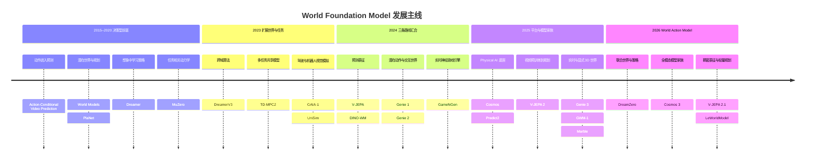

# World Foundation Model 发展演进：从潜在动力学到 World Action Model

本章按照 world model 如何从单环境的潜在动力学，发展为可复用、可后训练、可交互的 World Foundation Model 来组织，而不是按 RSSM、tokenizer、diffusion、JEPA 或 planner 横向拆解。主线是：模型先学会在动作条件下预测未来，再扩大世界覆盖、状态表示和动作接口，最后与大规模视频预训练、Physical AI 和机器人策略汇合。

本页负责解释“为什么会进入下一代”。更多代表节点的规格、Weights、Demo 与开放状态见[技术时间线](timeline.md)；动作接口和交互任务见[动作条件预测](tasks/action-conditioned-prediction.md)与[交互式世界生成](tasks/interactive-world-generation.md)；JEPA 的独立谱系见[JEPA 参考阅读](jepa.md)；完整反事实、rollout 和规划评测协议见[评测指南](evaluation.md)。

## 1. 什么变化才算进入 World Foundation Model 阶段

Foundation model 的核心不是参数量，而是在广泛数据上预训练一个可复用底座，再适配到多种下游任务 [[1]](#ref-1)。World model 的最低操作性定义，则是根据当前状态与动作预测环境如何变化：

$$
p(s_{t+1},o_{t+1},r_{t+1}\mid s_{\le t},o_{\le t},a_{\le t},c)
$$

其中 $s_t$ 是内部状态，$o_t$ 是图像、声音或传感器观测，$a_t$ 是键鼠、相机、车辆或机器人动作，$r_t$ 是可选的奖励或成本，$c$ 是语言、目标或场景条件。要从 task-specific world model 进入 World Foundation Model，通常要同时出现四种扩展：

1. **世界覆盖扩展**：从单一游戏或机器人环境，扩展到互联网视频、仿真轨迹、驾驶、游戏和多 embodiment 数据。
2. **状态与动力学扩展**：从任务专用 latent，扩展到可迁移的视觉、语义、空间或多模态世界表示。
3. **动作与接口扩展**：从固定离散动作，扩展到 latent action、键鼠、相机、语言、连续控制和多智能体动作。
4. **适配与用途扩展**：共享底座可被后训练为 simulator、planner、policy、数据生成器或交互环境。

| 概念 | 主要证据 | 不能自动推出什么 |
|---|---|---|
| 视频基础模型 | 广泛视觉与运动先验、跨条件生成 | 动作动力学、反事实或规划价值 |
| 视频 / 时间预测器 | 根据观测历史预测后续帧或特征 | 动作会怎样改变未来，以及预测能否改善决策 |
| 单环境 world model | 动作条件转移、规划 return 或控制成功 | 跨环境复用和开放世界知识 |
| 通用 world-model 算法 | 同一训练方法或超参数覆盖多任务 | 同一个预训练 checkpoint 共享世界知识 |
| 交互世界生成器 | 连续接受动作并实时生成观测 | 状态可靠、因果正确或可支持规划 |
| World Foundation Model | 广泛预训练、共享底座、可适配世界动力学 | 每个 checkpoint 都已经通过闭环验证 |
| World Action Model | 联合建模未来世界与可执行动作 | 零样本现实控制在任意任务上成立 |

因此，world-model 证据和 foundation breadth 是两个正交维度：Dreamer 一类模型可以有强决策证据但世界覆盖有限；Sora 一类视频基础模型可以有广泛视觉先验，却没有动作条件和规划证据。

## 2. World Foundation Model 发展主线

_下图展示 2015–2026 年的精选发展主线：决策型 latent dynamics 与生成式视觉模型先平行演化，随后在交互世界、Physical AI 和 World Action Model 中汇合；它不是完整产品年表，同一年内按主题而非发布日期排列。_

这条路线不是“新模型取代旧模型”的直线。像素模拟、latent planning、显式 3D、预测表征与传统物理引擎仍然并行；不同路线解决的是视觉开放性、状态可靠性、动作因果和决策效率之间的不同取舍。

## 3. 2015–2020：决策优先的前驱——在想象世界中规划

这一阶段的目标不是生成开放域高清世界，而是回答一个更严格的问题：模型预测的未来能否帮助智能体选对动作？

| 代表节点 | 这一步改变了什么 | 对 World Foundation Model 的意义 | 当时的边界 |
|---|---|---|---|
| Action-Conditional Video Prediction [[2]](#ref-2) | 把 Atari 动作显式输入未来帧预测 | 将“时间预测”推进为“采取动作后会看到什么” | 环境、画面与动作空间简单 |
| World Models [[3]](#ref-3) | 用 VAE、RNN dynamics 和 controller 分离表示、世界演化与策略 | 建立“在 learned simulator 中训练，再回到原始任务环境验证”的经典范式 | 模型和实验域都较小 |
| PlaNet [[4]](#ref-4) | 在 RSSM latent 中在线搜索动作序列 | 证明世界模型可以不在像素空间规划 | 候选动作一旦超出模型可靠分布，规划会利用误差 |
| Dreamer [[5]](#ref-5) | 用 imagined actor–critic 取代每一步在线搜索 | 把 latent rollout 直接用于策略学习 | 长 horizon 仍受模型偏差影响 |
| MuZero [[6]](#ref-6) | 只预测 reward、value 与 policy 所需的任务相关动力学 | 说明“对决策充分”不等于重建完整视觉世界 | learned state 不适合直接当作通用视觉模拟器 |

这一代确立了 world model 的核心判据：价值最终由外部环境中的 return、成功率或规划表现验证。但多数方法都在单一环境或任务集合内训练，尚不是广泛预训练、跨任务适配的 foundation model。

## 4. 2023：从单环境模型到多任务底座与动作条件视觉模拟

这一阶段出现了两种不同的“规模化”。一条路线扩大算法和共享控制模型的任务覆盖；另一条路线把生成模型的视觉能力与驾驶、导航、机器人动作结合。

| 代表节点 | 扩展方式 | foundation 化信号 | 必须保留的边界 |
|---|---|---|---|
| DreamerV3 [[7]](#ref-7) | 一套固定配置覆盖 150 多个任务 | world-model 算法跨域稳定性明显提升 | 主要证明算法通用，不是一个 checkpoint 共享所有世界知识 |
| TD-MPC2 [[8]](#ref-8) | 单个最高 317M 参数模型覆盖 80 个连续控制任务、多个 embodiment 和动作空间 | 更接近“共享多任务决策底座”，并开放模型、数据与代码 | 任务仍来自有限的连续控制集合，不是开放现实世界模型 |
| GAIA-1 [[9]](#ref-9) | 将离散图像 token 与文本、ego-action embedding 交错输入自回归 Transformer | 大规模生成式视觉模型开始显式建模车辆动作 | 合理驾驶视频不等于闭环自动驾驶安全 |
| UniSim [[10]](#ref-10) | 编排图像、导航和机器人数据，接受高级指令或低级控制 | 用异构数据学习可供策略训练的视觉模拟器 | 真实迁移证据来自论文指定任务，不能外推为任意现实环境 |

这里必须区分三个概念：同一算法反复训练、同一架构训练多个模型，以及同一个预训练 checkpoint 被多任务复用。只有第三种最接近通常所说的 foundation model；前两种仍然是重要的过渡节点。

## 5. 2024：视频预训练、潜在动作与神经交互环境汇合

2024 年不是某一种架构胜出，而是三种资源开始汇合：开放域视频提供视觉和运动先验，动作数据提供干预信号，生成或预测模型提供可 rollout 的未来。

| 技术形态 | 代表节点 | 关键进展 | 不能据此推出什么 |
|---|---|---|---|
| 开放视觉先验 | Sora [[11]](#ref-11) | 大规模视频训练表现出若干 3D、运动和对象持续能力 | “世界模拟器”仍是研究假设；模型没有公开动作接口或规划实验 |
| 抽象预测表征 | V-JEPA [[12]](#ref-12) | 在 representation space 预测缺失时空信息，不重建全部像素 | base model 本身没有动作输入，不是可交互 world model |
| 无动作标签学习控制 | Genie 1 [[13]](#ref-13) | 从互联网游戏视频学习 latent action，并生成逐帧可控环境 | latent action 未必对应可执行机器人动作 |
| 实时动作条件像素模拟 | GameNGen [[14]](#ref-14) | 用历史帧和动作实时模拟 Doom | 单一游戏中的实时结果不等于通用神经游戏引擎 |
| 特征空间规划 | DINO-WM [[15]](#ref-15) | 在预训练 DINOv2 patch feature 上学习动作动力学并优化动作序列 | 证据来自有限控制环境，且不生成开放域像素世界 |
| 开放式交互 3D 世界 | Genie 2 [[16]](#ref-16) | 从单张图生成键鼠可控世界；官方展示动作分支与回访记忆样例 | 尚无受控反事实验证；代码、权重和独立评测均未开放 |

这次汇合也暴露了一个长期分歧：像素模型容易供人检查并生成训练经验，却把容量用于纹理；latent model 更适合高效规划，却必须证明压缩状态没有丢掉任务关键变量。World Foundation Model 不要求所有模型选择同一种表示，但要求声明与证据匹配。

## 6. 2025–2026：平台、模型家族与 World Action Model

2025 年以后，“foundation”更多体现在预训练底座、数据工具、后训练方法和多个任务版本组成的系统；2026 年则进一步出现把世界 rollout 与动作或 policy 联合建模的 World Action Model。

| 代表节点 | 这一代的主要变化 | 为什么属于 foundation 化 | 当前证据边界 |
|---|---|---|---|
| Cosmos / Predict 系列 [[17]](#ref-17)、[[18]](#ref-18) | 把 tokenizer、数据处理、生成模型、guardrail、后训练工具和开放权重组织为 Physical AI 平台 | 不同下游可复用世界状态生成底座 | 平台范围不等于每个 checkpoint 都能规划或控制 |
| V-JEPA 2 / 2-AC [[19]](#ref-19) | 先从大规模无动作视频学表示，再用机器人轨迹训练动作条件 predictor | 展示“广泛视频预训练 → 少量动作后训练 → 真实机器人规划”的完整链条 | zero-shot 指目标实验室无需额外任务数据或奖励，不是从未使用机器人数据 |
| Genie 3 [[20]](#ref-20) | 官方报告从文本生成 720p、24 FPS 的实时可交互世界，并支持 promptable events | 将视觉质量、实时动作输入和分钟级一致性放进同一系统 | 尚无独立论文评测；官方仍列出动作空间、多智能体、地理准确性、文字和持续时长限制 |
| GWM-1 [[21]](#ref-21) | 在共同视频底座上分别后训练 Worlds、Avatars/Characters 与 Robotics | 体现共享底座向世界、人物和机器人分支适配 | 三个分支是不同模型，不是一个 checkpoint 完成全部任务；主要证据来自厂商评测 |
| Marble [[22]](#ref-22) | 从文本、图像、视频或粗略 3D 布局生成可编辑、扩展、组合与导出的 3D 世界 | 将多模态世界生成底座接到 Gaussian splat、mesh 和视频资产工作流 | 官方发布未证明动作条件动力学、闭环控制或物理规律正确性 |
| Cosmos 3 [[23]](#ref-23) | 在统一架构下处理语言、图像、视频、音频和动作，并发布多种后训练模型 | 将 reasoner、generator、forward/inverse dynamics 和 policy 纳入一个开放模型家族 | 模型家族不等于单一权重同时解决全部 Physical AI 任务 |
| V-JEPA 2.1 [[24]](#ref-24) | 强化稠密时空表征，并把改进延伸到机器人后训练 | 提升共享表征对理解、密集预测和控制的适用性 | 仍主要是 representation/world-modeling 路线，不是交互式像素生成器 |
| DreamZero / WAM [[25]](#ref-25) | 在视频 diffusion backbone 上联合预测未来视频与动作，并执行实时闭环机器人控制 | 把世界先验直接变成可执行 policy | 跨任务收益来自作者实验，不能据此断言所有 WAM 都优于 VLA |
| LeWorldModel [[26]](#ref-26) | 以小型端到端 JEPA latent dynamics 支持快速 MPC | 提供与 foundation-scale 路线对照的可复现实验 | 它是轻量规划模型，不应因名称而归为 World Foundation Model |

资料核查截止日期为 **2026-08-29**。这一阶段应被理解为“世界模型、生成器、reasoner 和 policy 的系统化汇合”，而不是一个万能 checkpoint 已经形成。World Action Model 仍是快速演化中的研究方向，联合预测世界与动作也不会自动保证因果正确、长期稳定或安全迁移。

## 7. 代表模型的 Paper、Project 与 Code

下表只列作者或机构的一手入口。`Code` 只标记官方实现；“未公开”表示截至 **2026-08-29** 未发现一手公开实现，不代表团队内部没有代码。已收录节点的 Weights、Demo 与许可证见[技术时间线](timeline.md)和[开放模型索引](../resources/open-models.md)。

| 模型 | Paper / Report | Project | Code |
|---|---|---|---|
| 2015 · Action-Conditional Video Prediction | [Paper](https://papers.nips.cc/paper_files/paper/2015/hash/6ba3af5d7b2790e73f0de32e5c8c1798-Abstract.html) | [Project](https://junhyuk.com/publication/2015_action_conditional/) | [Code](https://github.com/junhyukoh/nips2015-action-conditional-video-prediction) |
| 2018 · World Models | [Paper](https://arxiv.org/abs/1803.10122) | [Project](https://worldmodels.github.io/) | [Code](https://github.com/hardmaru/WorldModelsExperiments) |
| 2018 · PlaNet | [Paper](https://arxiv.org/abs/1811.04551) | [Project](https://danijar.com/project/planet/) | [Code](https://github.com/google-research/planet)（已归档） |
| 2019 · Dreamer | [Paper](https://arxiv.org/abs/1912.01603) | [Project](https://danijar.com/project/dreamer/) | [Code](https://github.com/danijar/dreamer) |
| 2019/2020 · MuZero | [Paper](https://doi.org/10.1038/s41586-020-03051-4) | [Project](https://deepmind.google/blog/muzero-mastering-go-chess-shogi-and-atari-without-rules/) | 完整代码未公开；论文附 pseudocode |
| 2023 · DreamerV3 | [Paper](https://arxiv.org/abs/2301.04104) | [Project](https://danijar.com/project/dreamerv3/) | [Code](https://github.com/danijar/dreamerv3) |
| 2023 · TD-MPC2 | [Paper](https://arxiv.org/abs/2310.16828) | [Project](https://www.tdmpc2.com/) | [Code](https://github.com/nicklashansen/tdmpc2) |
| 2023 · GAIA-1 | [Paper](https://arxiv.org/abs/2309.17080) | [Project](https://wayve.ai/thinking/scaling-gaia-1/) | 未公开 |
| 2023 · UniSim | [Paper](https://arxiv.org/abs/2310.06114) | [Project](https://universal-simulator.github.io/) | 未公开 |
| 2024 · Sora | [Technical report](https://openai.com/index/video-generation-models-as-world-simulators/) | 同左 | 未公开 |
| 2024 · V-JEPA | [Paper](https://arxiv.org/abs/2404.08471) | [Project](https://ai.meta.com/blog/v-jepa-yann-lecun-ai-model-video-joint-embedding-predictive-architecture/) | [Code](https://github.com/facebookresearch/jepa) |
| 2024 · Genie 1 | [Paper](https://arxiv.org/abs/2402.15391) | [Project](https://deepmind.google/research/publications/60474/) | 未公开 |
| 2024 · GameNGen | [Paper](https://arxiv.org/abs/2408.14837) | [Project](https://gamengen.github.io/) | 未公开 |
| 2024 · DINO-WM | [Paper](https://arxiv.org/abs/2411.04983) | [Project](https://dino-wm.github.io/) | [Code](https://github.com/gaoyuezhou/dino_wm) |
| 2024 · Genie 2 | 独立论文未公开 | [Official release](https://deepmind.google/blog/genie-2-a-large-scale-foundation-world-model/) | 未公开 |
| 2025 · Cosmos / Predict1 | [Paper](https://arxiv.org/abs/2501.03575) | [Project](https://research.nvidia.com/labs/cosmos-lab/) | [Code](https://github.com/nvidia-cosmos/cosmos-predict1) |
| 2025 · Cosmos Predict2 | [Technical release](https://developer.nvidia.com/blog/?p=101575) | [Project](https://research.nvidia.com/labs/cosmos-lab/cosmos-predict2/) | [Code](https://github.com/nvidia-cosmos/cosmos-predict2) |
| 2025 · V-JEPA 2 / 2-AC | [Paper](https://arxiv.org/abs/2506.09985) | [Project](https://ai.meta.com/research/vjepa/) | [Code](https://github.com/facebookresearch/vjepa2) |
| 2025 · Genie 3 | 独立论文未公开 | [Official release](https://deepmind.google/blog/genie-3-a-new-frontier-for-world-models/) | 未公开 |
| 2025 · GWM-1 | 独立论文未公开 | [Official release](https://runway.com/research/introducing-runway-gwm-1) | 未公开 |
| 2025 · Marble | 独立论文未公开 | [Official release](https://www.worldlabs.ai/blog/marble-world-model) | 未公开 |
| 2026 · Cosmos 3 | [Paper](https://arxiv.org/abs/2606.02800) | [Project](https://research.nvidia.com/labs/cosmos-lab/cosmos3/) | [Code](https://github.com/NVIDIA/cosmos) |
| 2026 · V-JEPA 2.1 | [Paper](https://arxiv.org/abs/2603.14482) | [Project](https://ai.meta.com/research/vjepa/) | [Code](https://github.com/facebookresearch/vjepa2) |
| 2026 · LeWorldModel | [Paper](https://arxiv.org/abs/2603.19312) | [Project](https://le-wm.github.io/) | [Code](https://github.com/lucas-maes/le-wm) |
| 2026 · DreamZero / World Action Model | [Paper](https://arxiv.org/abs/2602.15922) | [Project](https://dreamzero0.github.io/) | [Code](https://github.com/dreamzero0/dreamzero) |

## 8. 回看历史：五条能力轴怎样逐步形成

World Foundation Model 的发展不能只按参数量、分辨率或实时帧率排成一个榜单。五条能力轴在不同路线中并行形成。

| 能力轴 | 早期转折 | foundation 阶段的扩展 | 必须单独验证什么 |
|---|---|---|---|
| 世界覆盖与迁移 | World Models、PlaNet 在单环境学习动力学 | TD-MPC2、Cosmos、V-JEPA 2 扩展任务、数据与 embodiment | 固定底座后的跨域适配成本和 held-out transfer |
| 状态表示 | 像素预测转向 RSSM、任务相关 latent | V-JEPA、DINO-WM、Cosmos 3 扩展预测表征和多模态状态 | latent 是否保留决策所需变量，能否被独立 probe |
| 动作与反事实 | 固定离散动作进入预测 | latent action、键鼠、相机、机器人连续控制和 joint video–action | 同一初态换动作时，后果是否正确且只改变应变因素 |
| Memory 与长时交互 | recurrent state 维持短期 rollout | Genie 2/3、GWM-1 强调回访、实时交互和长上下文 | 对象状态、空间回环和事件结果是否持久，而非只保持外观 |
| 规划与现实效用 | PlaNet、Dreamer、MuZero 用 return 验证 | V-JEPA 2、DreamZero 把广泛预训练接到真实机器人 | policy ranking、规划增益、真实成功率和 model exploitation |

这也解释了为什么不同路线不能简单排成等级：视频基础模型强在 world coverage，Dreamer/MuZero 强在 decision evidence，Genie/GameNGen 强在交互生成，Marble 的显式 3D 路线强在空间可编辑性与资产导出，而 Cosmos/GWM 类平台强在系统范围。任何一个维度领先，都不能自动继承其他维度的结论。

## 9. 从历史看“统一 World Model”的六种含义

| 统一层级 | 实际共享什么 | 常见形态 | 不能据此推出什么 |
|---|---|---|---|
| 统一接口 | 同一 UI、SDK 或 API | 产品接收文本、图像、视频与动作 | 后端只有一个模型 |
| 统一流水线 | 数据、tokenizer、训练、guardrail 或评测工具 | Cosmos 类平台 | 每个 checkpoint 能完成全部任务 |
| 共享 backbone | 主要视觉或状态参数 | 视频底座再做动作后训练 | 所有动作空间已经对齐 |
| 模型家族 | 架构、数据基础和训练方法 | GWM-1、Cosmos 3 的任务分支 | 存在一个万能 checkpoint |
| 单一 checkpoint | 同一组核心权重处理多模态与动作 | 需要权重清单和固定权重实验确认 | 各能力同等成熟、无需外部模块 |
| 闭环系统 | world model、planner、policy 与反馈回路 | 动作 → 预测 → 决策 → 新观测 | learned simulator 与现实没有偏差 |

统一输入模态不等于统一动力学，模型家族不等于单 checkpoint，生成与动作联合训练也不等于已经形成可靠闭环。模型和系统越完整，越需要逐 checkpoint、逐任务记录证据。

## 10. Persistent World Modeling：Memory 不是更长的上下文

长期 world model 不应只把更多历史帧塞进上下文，而要维护可写入、可检索、可更新的内部世界状态：

$$
M_{t+1}=\operatorname{Update}(M_t,o_t,a_t),\qquad
\hat{o}_{t+1}=G(o_t,a_t,\operatorname{Retrieve}(M_t,q_t))
$$

其中 $M_t$ 应保存对未来预测有用的空间、实体、事件和动态状态；对象离开视野时，记忆本身还需要按照动力学继续演化：

$$
M_{t+k}=F(M_t,a_{t:t+k})
$$

| Memory 形态 | 主要保存什么 | 常见实现 | 主要失败方式 |
|---|---|---|---|
| Working memory | 最近运动、姿态和局部外观 | 滑动窗口、KV cache、压缩上下文 | 过早压缩丢失身份或事件 |
| Episodic memory | 关键帧、片段和过去经历 | 按视觉、位姿、时间或文本检索 | 取错经历或无法找到已保存信息 |
| Recurrent memory | 固定大小的长期 latent state | RNN、state-space、局部 attention + persistent state | 容量有限导致状态漂移 |
| Spatial memory | 几何、位置、视角与遮挡关系 | point map、surfel、3D/latent cache | 回访时布局或外观不一致 |
| Entity memory | 人物、物体的身份、位置与属性 | object slot、track、entity state | 换视角后身份交换或状态回滚 |
| Event memory | 动作、状态转移和因果结果 | event graph、dynamic state、可更新关系 | 离屏后忘记“已打开、已移动、已破坏” |

> 本章把 Memory 定义为：在长时生成和交互中，维护一个 persistent、updateable、addressable 的内部世界状态。

这里必须区分“存得下”“没有丢”和“之后找得到”。更长上下文只能增加容量；如果没有空间地址、实体绑定、状态覆盖和 learned forgetting，模型仍可能在关键时刻无法恢复正确世界。Unified World Memory、memory consolidation、动态离屏演化和重要性驱动的遗忘，仍是独立研究问题。

## 11. 怎样判断“下一代”真的进步了

漂亮 demo 只能证明样本存在，不能证明模型具备可重复的世界动力学。若声称进入下一代，至少应做以下对照：

| 声明 | 最低实验 | 更强证据 | 不足以支持它的证据 |
|---|---|---|---|
| 底座更通用 | 固定核心权重，比较跨任务/场景/embodiment 适配 | held-out domain 的少样本成本与任务收益 | 同一算法分别重训多个模型 |
| 动作动力学更真实 | 固定初态，只改变动作或加入 no-op | 状态变量的反事实效应误差 | 每个分支单独看都“像真的” |
| 状态更持久 | 移动物体、遮挡、执行无关动作、再次观察 | 对象状态和空间 loop consistency 随 horizon 的曲线 | 更长上下文或平滑相机运动 |
| 交互更可靠 | 自由 rollout，报告延迟与首次不可恢复错误 | 多分钟闭环、分布外动作和错误恢复 | 短片或 teacher-forced 预测 |
| 更能支持决策 | 在独立环境比较 policy ranking、return、regret | 真实成功率、安全和数据效率提升 | planner 只在同一个 learned model 内得高分 |
| 不确定性更可信 | 多未来覆盖和概率校准 | 风险敏感规划下的收益与失败率 | 单个最可能视频的视觉质量 |

完整证据阶梯见[评测指南](evaluation.md)：从视觉 plausibility、动作预测和反事实，一直到闭环 rollout、策略排序与现实效用。最关键的停止规则是：**能力声明不能高于实际证据等级**。

讨论新模型时，可使用以下谨慎模板：

> 该模型通过广泛预训练获得了 X 类视觉或状态先验，并在 Y 动作接口上展示了 Z 层证据；其长期状态、反事实准确性、跨域迁移及现实规划价值仍需通过相应闭环实验验证。

## 最小阅读路径与相邻章节

### 按 World Foundation Model 发展阅读

1. **World Models → PlaNet → Dreamer / MuZero**：理解“对决策充分”为什么不等于像素完整。
2. **DreamerV3 / TD-MPC2 → GAIA-1 / UniSim**：区分算法通用、共享 checkpoint 和动作条件视觉模拟。
3. **V-JEPA → Genie 1 → GameNGen / DINO-WM / Genie 2**：理解 representation、latent action、像素交互和规划怎样汇合。
4. **Cosmos → V-JEPA 2 → Genie 3 / GWM-1**：理解 Physical AI 平台、动作后训练和模型家族。
5. **DreamZero → Cosmos 3 / V-JEPA 2.1**：理解 World Action Model 及其证据边界。

### 继续深入

- 查更多年代节点、规格与开放状态：[技术时间线](timeline.md)。
- 追动作如何改变未来：[动作条件预测](tasks/action-conditioned-prediction.md)。
- 研究实时神经环境：[交互式世界生成](tasks/interactive-world-generation.md)。
- 学习 predictive representation：[JEPA 参考阅读](jepa.md)。
- 区分视觉 plausibility 与规律正确：[物理一致性](physical-consistency.md)。
- 设计反事实、rollout 与规划实验：[评测指南](evaluation.md)。
- 查可运行基线和训练数据：[开放模型索引](../resources/open-models.md)、[数据集索引](../resources/datasets.md)。

## 参考文献

[1] [On the Opportunities and Risks of Foundation Models](https://arxiv.org/abs/2108.07258). Rishi Bommasani, Drew A. Hudson, Ehsan Adeli, Russ Altman, Simran Arora, Sydney von Arx, et al. arXiv preprint. 2021.

[2] [Action-Conditional Video Prediction using Deep Networks in Atari Games](https://papers.nips.cc/paper_files/paper/2015/hash/6ba3af5d7b2790e73f0de32e5c8c1798-Abstract.html). Junhyuk Oh, Xiaoxiao Guo, Honglak Lee, Richard Lewis, Satinder Singh. NeurIPS. 2015.

[3] [World Models](https://arxiv.org/abs/1803.10122). David Ha, Jürgen Schmidhuber. arXiv preprint. 2018.

[4] [Learning Latent Dynamics for Planning from Pixels](https://arxiv.org/abs/1811.04551). Danijar Hafner, Timothy Lillicrap, Ian Fischer, Ruben Villegas, David Ha, Honglak Lee, et al. ICML. 2019.

[5] [Dream to Control: Learning Behaviors by Latent Imagination](https://arxiv.org/abs/1912.01603). Danijar Hafner, Timothy Lillicrap, Jimmy Ba, Mohammad Norouzi. ICLR. 2020.

[6] [Mastering Atari, Go, chess and shogi by planning with a learned model](https://doi.org/10.1038/s41586-020-03051-4). Julian Schrittwieser, Ioannis Antonoglou, Thomas Hubert, Karen Simonyan, Laurent Sifre, Simon Schmitt, et al. Nature. 2020.

[7] [Mastering Diverse Domains through World Models](https://arxiv.org/abs/2301.04104). Danijar Hafner, Jurgis Pasukonis, Jimmy Ba, Timothy Lillicrap. arXiv preprint. 2023.

[8] [TD-MPC2: Scalable, Robust World Models for Continuous Control](https://arxiv.org/abs/2310.16828). Nicklas Hansen, Hao Su, Xiaolong Wang. ICLR. 2024.

[9] [GAIA-1: A Generative World Model for Autonomous Driving](https://arxiv.org/abs/2309.17080). Anthony Hu, Lloyd Russell, Hudson Yeo, Zak Murez, George Fedoseev, Alex Kendall, et al. arXiv preprint. 2023.

[10] [Learning Interactive Real-World Simulators](https://arxiv.org/abs/2310.06114). Sherry Yang, Yilun Du, Kamyar Ghasemipour, Jonathan Tompson, Leslie Kaelbling, Dale Schuurmans, et al. ICLR. 2024.

[11] [Video Generation Models as World Simulators](https://openai.com/index/video-generation-models-as-world-simulators/). OpenAI. Technical report. 2024.

[12] [Revisiting Feature Prediction for Learning Visual Representations from Video](https://arxiv.org/abs/2404.08471). Adrien Bardes, Quentin Garrido, Jean Ponce, Xinlei Chen, Michael Rabbat, Yann LeCun, et al. arXiv preprint. 2024.

[13] [Genie: Generative Interactive Environments](https://arxiv.org/abs/2402.15391). Jake Bruce, Michael Dennis, Ashley Edwards, Jack Parker-Holder, Yuge Shi, Edward Hughes, et al. ICML. 2024.

[14] [Diffusion Models Are Real-Time Game Engines](https://arxiv.org/abs/2408.14837). Dani Valevski, Yaniv Leviathan, Moab Arar, Shlomi Fruchter. ICLR. 2025.

[15] [DINO-WM: World Models on Pre-trained Visual Features enable Zero-shot Planning](https://arxiv.org/abs/2411.04983). Gaoyue Zhou, Hengkai Pan, Yann LeCun, Lerrel Pinto. arXiv preprint. 2024.

[16] [Genie 2: A Large-Scale Foundation World Model](https://deepmind.google/blog/genie-2-a-large-scale-foundation-world-model/). Google DeepMind. Official research release. 2024.

[17] [Cosmos World Foundation Model Platform for Physical AI](https://arxiv.org/abs/2501.03575). Niket Agarwal, Arslan Ali, Maciej Bala, Yogesh Balaji, Erik Barker, Tiffany Cai, et al. arXiv preprint. 2025.

[18] [Develop Custom Physical AI Foundation Models with NVIDIA Cosmos Predict-2](https://developer.nvidia.com/blog/?p=101575). NVIDIA. Technical release. 2025.

[19] [V-JEPA 2: Self-Supervised Video Models Enable Understanding, Prediction and Planning](https://arxiv.org/abs/2506.09985). Mahmoud Assran, Adrien Bardes, David Fan, Quentin Garrido, Russell Howes, Mojtaba Komeili, et al. arXiv preprint. 2025.

[20] [Genie 3: A New Frontier for World Models](https://deepmind.google/blog/genie-3-a-new-frontier-for-world-models/). Google DeepMind. Official research release. 2025.

[21] [Introducing Runway GWM-1](https://runway.com/research/introducing-runway-gwm-1). Runway. Official research release. 2025.

[22] [Marble: A Multimodal World Model](https://www.worldlabs.ai/blog/marble-world-model). World Labs. Official research release. 2025.

[23] [Cosmos 3: Omnimodal World Models for Physical AI](https://arxiv.org/abs/2606.02800). NVIDIA. arXiv preprint. 2026.

[24] [V-JEPA 2.1: Unlocking Dense Features in Video Self-Supervised Learning](https://arxiv.org/abs/2603.14482). Lorenzo Mur-Labadia, Matthew Muckley, Amir Bar, Mido Assran, Koustuv Sinha, Mike Rabbat, et al. arXiv preprint. 2026.

[25] [World Action Models are Zero-shot Policies](https://arxiv.org/abs/2602.15922). Seonghyeon Ye, Yunhao Ge, Kaiyuan Zheng, Shenyuan Gao, Sihyun Yu, George Kurian, et al. arXiv preprint. 2026.

[26] [LeWorldModel: Stable End-to-End Joint-Embedding Predictive Architecture from Pixels](https://arxiv.org/abs/2603.19312). Lucas Maes, Quentin Le Lidec, Damien Scieur, Yann LeCun, Randall Balestriero. arXiv preprint. 2026.
