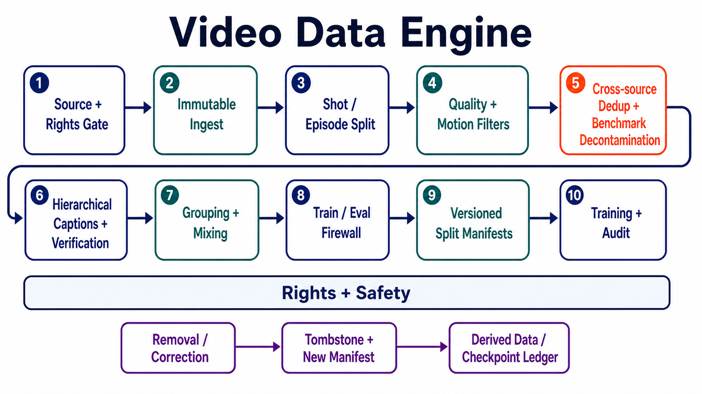
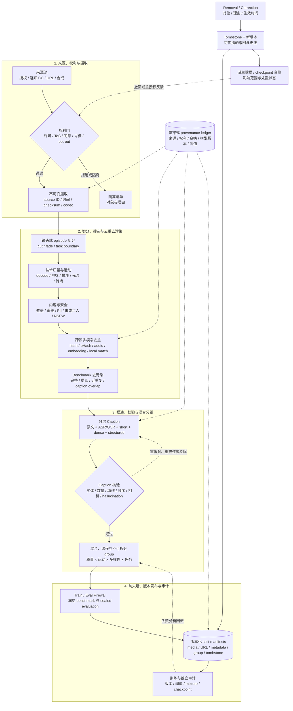

# 视频生成与 World Model 数据：从数据集清单到可审计 Data Engine

> **综述日期：2026-08-29。** 本页是一篇面向视频生成、视频世界模型和具身学习的聚焦型 scoping review。规模、可下载性和许可均是日期相关快照；用于训练前必须重新核对官方数据卡与上游条款。完整检索与纠错记录见[研究审计](../sources/research_20260829_video_data.md)。

## 先记住四句话

1. **先看统计单位，再看数字。** `10M` 可能是源视频、切出的 clips、caption rows、URL 或帧，彼此不能直接比较。
2. **“开放”不是一个布尔值。** 论文、代码、URL 索引、metadata、视频媒体和训练声明是六种不同产物。
3. **数据卡的 wrapper license 不能授予它并不拥有的上游视频版权。** “公开可访问”也不等于“可训练、可再分发或可商用”。
4. **现代视频模型的关键资产不是一张 CSV，而是可回放、可删除、可去污染的版本化 Data Engine。**

本页回答五个问题：

- 数据规模到底应该怎样读？
- 2019–2026 的数据技术路线发生了什么变化？
- 哪些产物现在真的能拿到，哪些只是论文中的训练披露？
- 视频、动作、物理和多传感器数据应该怎样统一治理？
- 怎样证明“这个数据更好”，而不是只证明“这个数据更大”？

---

## 1. 什么才算“数据集已发布”

### 1.1 六个发布层级

| 层级 | 能证明什么 | 不能证明什么 |
|---|---|---|
| 论文 | 作者描述过数据与实验 | 当前仍可访问、可复现或权利完整 |
| 项目页 / 代码 | 管线、脚本或文档存在 | 视频字节已经发布 |
| URL / ID 索引 | 可定位原始来源 | URL 仍存活、允许批量抓取或允许再分发 |
| Metadata / annotations | 时间戳、caption、质量分或标签可下载 | 原视频可获得或有训练权 |
| Media | 当前能下载视频 / 音频字节 | 可商用、可再分发、已解决肖像与隐私 |
| Training disclosure | 某模型据作者说明用过一套语料 | 语料公开、规模可独立复核或许可相同 |

因此，数据登记表至少要把 `paper`、`code`、`url_index`、`metadata`、`media`、`training_claim` 分成六列。把它们压成一个“✅ Open”会丢失最关键的信息。

### 1.2 六种常见统计单位

| 单位 | 定义 | 容易造成的错觉 |
|---|---|---|
| source video | 平台上的原始长视频或文件 | 一个源视频可产生数十个 clips |
| clip / shot / episode | 由时间窗、镜头或任务边界切出的样本 | 重叠切窗会把数量放大但不增加等量内容 |
| row / pair | manifest 中的一行或一条 caption 配对 | 一个 clip 可对应多种 caption、语言或增强版本 |
| hour | 可解码媒体总时长 | 长时长可能被静态、重复或低信息视频主导 |
| frame | 抽出的图像或训练帧 | 相邻帧高度相关，不能当独立图像样本 |
| byte / TB | 当前托管或估算的存储 | 编码、分辨率、音频和压缩率不同，不能代表语义覆盖 |

如果来源或重复簇 $s$ 贡献 $m_s$ 个高度相关 clips，令
$p_s=m_s/\sum_r m_r$。可用“有效来源 / 重复簇数”诊断集中度：

$$
N_{\mathrm{eff,source}}
=\frac{1}{\sum_s p_s^2}
=\frac{\left(\sum_s m_s\right)^2}{\sum_s m_s^2}.
$$

这只是来源集中度诊断，不是对“独立训练样本数”的估计。报告它时还应同时给出唯一来源数、重复簇数，以及每个来源或簇贡献 clips 的分位数；否则 70M rows 仍可能主要来自少量长视频的重复切分。
本页公式统一采用 [GitHub 支持的 dollar-delimited math syntax](https://docs.github.com/en/get-started/writing-on-github/working-with-advanced-formatting/writing-mathematical-expressions)。

---

## 2. 一张图看懂现代 Video Data Engine



**图 1：概念总览。** 上方 PNG 的 1–10 号框就是本章采用的主路径；紫色链给出 `Removal / Correction → Tombstone + New Manifest → Derived Data / Checkpoint Ledger`。为避免静态图中的长反馈线遮挡主流程，tombstone 回写 manifest、台账传播到训练审计、撤回或重授权反馈到权利门的精确连接放在下方 Mermaid。两者都不代表某个机构的内部实现。Rights + Safety 不是末端过滤器，而是贯穿来源登记到版本发布的控制面。

下面给出可编辑、可搜索、对读屏器更友好的确定性版本：



顺序化文字替代：

1. 登记来源、权利证据与 opt-out 通道；通过权利门后再做不可变摄取。
2. 按镜头、语义段或机器人 episode 切分，而不是默认固定窗口。
3. 先检查解码、分辨率、模糊、FPS、转场和运动信息量。
4. 再做内容覆盖、审美、PII、未成年人、NSFW 与安全筛选。
5. 合并全部来源后做跨源多模态去重，并与冻结 benchmark 做去污染。
6. 生成分层 caption，再核验实体、动作、顺序、相机与幻觉。
7. 按质量、运动、多样性和任务混合，并建立不可拆分 source / creator / episode / event groups。
8. 经过 Train / Eval Firewall 后发布版本化 split manifests。
9. 训练与独立审计都记录 manifest、mixture、阈值和 checkpoint 版本。
10. 更正或删除产生 tombstone 和新版本，传播到派生数据与 checkpoint 台账，并把需撤回或重授权的来源反馈到权利门。

---

## 3. 数据技术路线与里程碑：2019–2026

这里把“里程碑”限定为至少改变一项：**主导数据单位、annotation 表达、过滤/去重技术、公开访问面或治理机制**。单纯把数字再做大，不自动成为里程碑。

| 首次公开 / 正式发表 | 节点 | 路线变化 | 仍未解决的问题 |
|---|---|---|---|
| 2019 | HowTo100M [[1]](#ref-1) | 用 ASR 将教学视频扩展到 1.22M 源视频、136.6M narrated clips | 语音常描述意图而非当前画面；主要服务理解预训练 |
| 2021 | WebVid [[2]](#ref-2) | stock-video 描述直接成为弱 video-text 对，推动 Web-scale 预训练 | 水印、偏差、链接失效与上游权利；官方现已停止分发 |
| 2022 | HD-VILA-100M [[3]](#ref-3) | 720p、100M clips、ASR 与大规模时间戳管线 | URL/metadata 不是托管媒体；研究型非商业条款 |
| 2023 / ICLR 2024 | InternVid [[4]](#ref-4) | 帧 caption、LLM 汇总、多尺度描述与相似度筛选进入大规模 Data Engine | 完整媒体与论文规模不可直接复现；自动 caption 幻觉 |
| 2023 预印本 | Stable Video Diffusion data engine [[5]](#ref-5) | 系统披露切镜、OCR、光流、审美、caption 与人偏好阈值消融 | 约 580M annotated clips（表中 577M）与 152M LVD-F training examples 是私有池，不是公开数据集 |
| 2024 | Panda-70M [[6]](#ref-6) | 多个跨模态教师提出 caption，再用小型人工集训练选择器；增加 desirability 与 shot 标注 | 70M clips 只来自约 3.8M 源视频；媒体依赖上游 |
| 2024 | Vript / MiraData / LVD-2M [[7]](#ref-7) [[8]](#ref-8) [[9]](#ref-9) | 从短标签转向脚本式 dense caption、结构字段与长镜头 | dense 不等于正确；许可、下载面和版本高度不一致 |
| 2024 / ICLR 2025 | OpenVid-1M [[10]](#ref-10) | 高审美、高技术质量、相邻帧一致与 1080p 子集 | 包装许可与上游许可冲突，不能直接推导商用权 |
| 2024 | FineVideo [[11]](#ref-11) | 实际媒体、逐项 provenance、CC attribution、opt-out 与版本更新被放到同一发布面 | 43,751 源视频远小于 Web-scale 训练池；仍需分布审计 |
| 2025 / CVPR 2025、NeurIPS 2025 | Koala-36M / VideoUFO [[12]](#ref-12) [[13]](#ref-13) | 更强结构 caption；从真实用户 prompt 聚类反推主题覆盖 | ID overlap 不是感知去重；仍受来源与非商业条款约束 |
| 2025 / NeurIPS 2025、CVPR 2026、预印本 | UltraVideo / SpatialVID / ViMix [[14]](#ref-14) [[15]](#ref-15) [[16]](#ref-16) | UHD 长描述、相机 pose/depth/dynamic mask、跨源去重与 crawl-free access | 大存储、合成标注误差、wrapper 与 upstream rights |
| 2026 / CVPR 2026 | SceneScribe-1M [[38]](#ref-38) | 在公开视频上加入 dense depth、3D point tracks、motion masks、camera parameters 与细粒度 caption | 论文规模不等于发布规模；当前官方卡没有可用数据文件 |
| 2026 / CVPRW 2026 | Action100M [[30]](#ref-30) | 从整段 video-text 对转向分层 action segments 与 Tree-of-Captions | 观察到的开放词汇动作不是标定控制信号；当前只发布 10% preview |
| 2026 预印本 | LAION-BVD [[17]](#ref-17) | CommonCrawl URL → 80M 下载 → scene clips / audio / frames，多模态规模跃迁 | 约 13 亿是 URL rows；媒体研究非商用且部分门控；新近预印本 |

这条路线不是“越大越好”，而是：

```text
网页标题 / ASR
  → 弱 clip-caption 对
  → 多教师 + VLM/LLM recaption
  → 时序 dense / structured caption
  → 用户主题、空间、动作与多传感器 supervision
  → 可删除、可追溯、去污染、版本化的数据系统
```

---

## 4. 开放域视频—文本数据：规模、实际可得物与边界

### 4.1 2019–2024 的主干数据

| 数据 | 论文 / 当前发布口径 | 时长 / 画质 / annotation | 2026-08-29 实际可得物 | 权利与复现边界 |
|---|---|---|---|---|
| HowTo100M [[1]](#ref-1) | 1.22M 源视频；136.6M clips；约 134.5K h | instructional video + ASR | ID、字幕与工具；媒体依赖平台 | 适合视频语言前史；ASR 不是视觉 caption |
| WebVid [[2]](#ref-2) | WebVid-2M 约 2.5M；后扩至约 10M pairs | 短 stock footage、网页描述 | 官方不再分发 URL、caption 或媒体 | 2024-02 起因 cease-and-desist 撤回；只作历史/治理案例 |
| HD-VILA-100M [[3]](#ref-3) | 3.3M 源视频；100M clips；371.5K h | 平均 13.4s；720p；ASR | URL、时间戳、metadata、下载脚本 | R-UDA、研究非商用；链接和解码 yield 会漂移 |
| InternVid [[4]](#ref-4) | 论文 >7M 源视频；234M clips；约 760K h | 多尺度 synthetic caption、UMT alignment | gated 10M-FLT metadata；不是完整视频媒体 | HF 标 CC-BY-NC-SA；论文、卡片与 viewer 数字须分开 |
| Panda-70M [[6]](#ref-6) | 论文约 3.8M sources / 70.8M samples；当前 full manifest 为 3,779,763 / 70,723,513 / 167K h | full/10M/2M；semantic split；multi-teacher caption；desirability | 2.73GB full metadata、URL/时间戳、downloader；媒体估算约 36TB | 继承 HD-VILA 及自定义研究条款；manifest 不等于托管 36TB 媒体 |
| Vript [[7]](#ref-7) | 12K videos；>420K clips；约 1.3K h | 每 clip 约 145 words；shot、camera、content、title；720p–2K | 视频与 annotations 可下载 | academic only、no distribution；自动 caption 未逐条人工确认 |
| MiraData [[8]](#ref-8) | named versions 330K / 93K / 42K / 9K | 长段；主体、背景、动作、风格、相机等结构 caption | 当前 HF viewer 约 475K metadata rows；按 URL 获取/切分 | [会议补充条款](https://openreview.net/attachment?id=2myGfVgfva&name=supplementary_material)明确不默示复制、修改、发布、分发或商业化权利；与 README / 数据卡冲突，故 **rights unresolved** |
| LVD-2M [[9]](#ref-9) | 约 2M clips，均 >10s、long-take | 大运动、temporally dense captions | 来自 YouTube/HDVG/WebVid 等的 metadata/URL 与 downloader；不直接托管媒体 | 继承 HD-VILA；WebVid 分支还有撤回与链接问题 |

### 4.2 2024–2026 的高质量、长时、UHD、空间与用户主题分支

| 数据 | 论文 / 当前发布口径 | 新 supervision | 实际可得物 | 许可与关键限制 |
|---|---|---|---|---|
| OpenVid-1M [[10]](#ref-10) | 论文 >1M；当前卡片 1,453,466 rows / 12.4TB；OpenVidHD 433K 1080p | aesthetic、DOVER、temporal consistency、motion、camera motion、long caption | 托管媒体、CSV、HD 子集（约 4.5TB） | 卡片同时写 CC-BY-4.0、research/non-commercial 和多个上游条款；不可推导 blanket commercial permission |
| FineVideo [[11]](#ref-11) | 43,751 videos；3,425 h；平均 4.7min；约 600GB | time-coded ASR、scene/character/story/audio annotations、逐项 provenance | gated 但托管实际媒体；版本与 removal 线程 | 原视频 CC-BY、需要 attribution；用户需跟随 latest usable version |
| Koala-36M [[12]](#ref-12) | 论文 36M clips / 约 172K h；当前 v1 viewer 显示 3,766,054 rows，分片合计估算 35,961,606 rows / 48.9GB metadata | transition detector、结构 caption、VTSS、clarity/aesthetic/motion | 托管 metadata；视频媒体需回到上游来源获取 | 自定义非商业研究许可；viewer 行数、全分片估算与论文规模不可混写 |
| VideoUFO [[13]](#ref-13) | 1,091,712 clips；1,291 user-focused topics；论文 / 卡片称压缩媒体约 800GB，当前 HF storage 快照为 911GB | 从 VidProM 用户 prompt 聚类主题；brief+detailed captions；六类 VBench scores | metadata 与压缩媒体可下载 | 官方称 CC-BY-4.0；0.29% 仅为 YouTube ID 重合，不排除重上传 / 裁剪 |
| UltraVideo [[14]](#ref-14) | 58,781 clips；约 1.78TB；UHD，22.4% 为 8K | 九类 structured captions + summary，平均约 824 words | HF 媒体与 annotations | “CC-BY with additional restrictions”实为自定义非商业约束；需读完整条款 |
| SpatialVID [[15]](#ref-15) | 21K raw h → 2.7M clips / 7,089 h；7.67TB | camera intrinsics/poses、depth、dynamic masks、motion instructions、structured caption | gated 完整媒体和 annotations，545 groups | CC-BY-NC-SA-4.0；pose/depth 是估计标注，不是测量真值 |
| ViMix-14M [[16]](#ref-16) | 论文约 13.7M pairs / 22.8K h；当前托管 23.1GB `ViMix-14M.json` 与 100-row 示例 | 多源统一去重、质量过滤、多粒度 recaption | 完整 metadata manifest、示例和七个上游来源各自的下载命令；**没有同库托管整合媒体** | 卡片 wrapper 为 CC-BY-NC-SA；下载与使用仍需逐源履行上游义务 |
| SceneScribe-1M [[38]](#ref-38) | 论文 1M in-the-wild videos / 4,191 h | 细粒度 caption、camera parameters、dense depth、3D point tracks、motion masks / probability | 当前作者 HF 仓库只有 2.54KB README，没有 metadata 或媒体文件 | README 的 Apache badge 不能证明语料许可；应写“论文已发表、发布面为空”，不能写“1M 已开放” |
| LAION-BVD [[17]](#ref-17) | 1.3B URLs；80M downloaded raw videos / 10M h；BVD-V 从 2.4M sources 切 55M clips | video/audio captions；audio clips；300M scene-change frames | 公开 URL-only 变体；当前 BVD-V gated card 为 55M clips / 41.1TB，RAW 需研究协作或门控 | [BVD Terms of Use](https://github.com/LAION-AI/BVD/blob/main/assets/bvd_terms_of_use.pdf)限定研究、非商业用途；**URL index ≠ media availability ≠ media rights** |

### 4.3 不要虚构 “OpenVid-2M”

截至本页核查日，没有在 OpenVid 作者项目、官方 Hugging Face 或 arXiv 找到一手 “OpenVid-2M” 记录。它可能与 WebVid-2M、LVD-2M 或当前 OpenVid 卡片的 1.45M rows 混淆。数字增长不能由我们替作者改名。

同样，[VideoGen-of-Thought](https://arxiv.org/abs/2412.02259) 是 training-free 多镜头生成框架，不是数据集；另一个 arXiv 条目 2503.15138 已撤回。

---

## 5. 私有训练语料与公开数据集必须分表

| 系统 | 作者公开的数据引擎信息 | 可以得出的结论 | 不能得出的结论 |
|---|---|---|---|
| Stable Video Diffusion [[5]](#ref-5) | 论文称约 580M annotated clips（表格为 577M clips），过滤后得到 152M LVD-F training examples；另披露切镜、caption、OCR、光流、审美、对齐与人工阈值选择 | 数据过滤会显著影响生成质量；作者提供了较完整消融 | “LVD 可下载”或其全部上游可商用；这些数字不能写成源视频数 |
| Sora [[37]](#ref-37) | 技术报告披露训练视频 recaption 与原生时长 / 分辨率 / 宽高比训练；系统卡披露公开数据、合作伙伴专有数据与定制内部数据三类来源 | 两份官方来源共同支持原生规格、重描述和混合来源这一路线 | 具体数据集名称、规模、混合权重或逐项许可 |
| CogVideoX [[18]](#ref-18) | 作者报告过滤后约 35M 单镜头 clips、平均约 6s，另混入约 2B images；负面标签分类器、光流/审美与 dense recaption | 公开论文足以研究其 Data Engine 设计 | 35M 训练媒体已经随模型开源 |

这一区分也适用于模型卡中的 “trained on public data”。没有 manifest、来源比例、时间截点和 release object，就只能写“训练披露”，不能写“可复现实验数据”。

---

## 6. Caption 不再是一句话：五层表述与核验

### 6.1 建议同时保存的五层文本

1. **Source text：** 原标题、alt-text、网页文本、ASR、字幕、OCR；保留原文与语言。
2. **Prompt caption：** 简短、可作为 T2V 条件的主体—动作—场景描述。
3. **Dense temporal caption：** 按事件阶段描述先后、持续、重复与状态变化。
4. **Structured fields：** 主体、数量、动作、对象关系、背景、风格、镜头尺度、相机运动、音频事件。
5. **Grounded tracks：** 每句话关联时间段、帧、mask、track、pose、depth 或 action segment。

### 6.2 自动 Caption 的证据边界

VLM/LLM captioner 可扩展，但会出现：

- 把单帧共现写成动作因果；
- 混淆主体运动与相机运动；
- 漏掉短暂接触、细小对象和状态转移；
- 根据标题或语言先验补出画面中没有的对象；
- 用冗长、风格化措辞掩盖时间对齐错误。

因此必须记录：

```yaml
caption_provenance:
  source_text_fields: [title, asr, subtitle, ocr]
  captioner_name:
  checkpoint_or_api_version:
  api_date:
  prompt_hash:
  frame_sampling_policy:
  sampled_frame_ids:
  output_schema_version:
  verifier_name:
  verifier_threshold:
  human_audit_sample:
  correction_history:
```

VidCapBench [[19]](#ref-19) 与 VCapsBench [[20]](#ref-20) 表明，caption 评测应拆成实体、动作、时间、相机和幻觉等维度。一个 CLIP/UMT alignment 分数不能替代事实核验。

---

## 7. 从预训练数据到偏好、奖励与安全数据

生成模型的数据生命周期至少有四层：

| 阶段 | 典型单位 | 学到什么 | 主要风险 |
|---|---|---|---|
| base pretraining | video-text / image-text / audio-text pairs | 外观、运动、语义与跨模态对齐 | 来源偏差、caption 噪声、重复与权利不清 |
| quality tuning | 高质量、小规模、高清或特定镜头 clips | 清晰度、构图、运动与 prompt adherence | 审美同质化、覆盖退化 |
| preference / reward | 同 prompt 多候选、pairwise ranking、维度标签 | 人类/评测器偏好 | judge bias、reward hacking、模型自举偏差 |
| safety / refusal | 违规、边界和对抗 prompt—video 对 | 拒绝、过滤、风险分类 | 过度拒绝、群体偏差、攻击分布漂移 |

VideoDPO [[21]](#ref-21)、VideoAlign [[22]](#ref-22) 与 MJ-VIDEO [[23]](#ref-23) 代表从“更多预训练视频”走向多维偏好与对齐数据的路线。关键不是把所有维度平均成一个 reward，而是保留 `visual quality`、`text alignment`、`motion`、`temporal consistency`、`physics`、`safety` 的独立标签和不确定度。

---

## 8. 动作条件与 World Model 数据：视频不是 action

开放域视频可以提供“发生了什么”，但闭环 world model 还要知道“哪个动作、以什么坐标和延迟、在什么 embodiment 上导致了什么状态”。

### 8.1 机器人 / Action 数据主干

| 数据 | 论文 / 项目规模 | 2026-08-29 实际发布面 | 关键模态 | 权利 / 版本边界 | 对 world model 的价值 |
|---|---|---|---|---|---|
| Open X-Embodiment [[24]](#ref-24) | >1M trajectories；22 embodiments | 官方仓库、TFDS builders、GCS buckets 与统一 RLDS schema | RGB、proprioception、language、robot actions | 仓库说明代码 Apache-2.0、其他材料 CC-BY-4.0；各贡献数据的原始条款仍须逐项核验 | 跨机构、跨 embodiment 预训练 |
| DROID [[25]](#ref-25) | 76K trajectories；350 h；564 scenes；当前项目 86 tasks | full RLDS 约 1.7TB、raw 约 8.7TB GCS，以及 100-episode / 2GB sample | 多视角 RGB、末端 / 关节 action、语言 | 代码仓库 MIT 不能自动视为数据许可；使用前需从项目发布面另行确认数据条款 | 大范围真实场景与统一采集硬件 |
| RH20T [[26]](#ref-26) | 110K contact-rich sequences | 官方数据页 / 下载面与 API 仓库 | vision、force、audio、action | API 代码为 MIT；数据媒体的授权需独立核验，不能由代码许可推导 | 接触、声音与力提供视频中不可观测的物理信号 |
| RoboMIND [[27]](#ref-27) | 107K trajectories；479 tasks；4 embodiments；含失败 | gated HF v1.2，约 12.3TB | RGB、action、task、success / failure | 数据卡标 Apache-2.0，但仍受访问 gate 与组件权利约束；数字必须带版本 | 失败轨迹支持 recovery 与不确定性研究 |
| RoboMIND 2.0 [[28]](#ref-28) | 310K dual-arm；6 embodiments；739 tasks；>1,000 h；另含 12K tactile、20K mobile、20K sim | 项目页指向 ModelScope 公开发布面 | bimanual、tactile、mobile、sim | 须核验 ModelScope 当前条款；不能继承 RoboMIND v1 的 HF badge | 扩展到双臂、触觉、移动操作与 digital twin |
| AgiBot World [[29]](#ref-29) | >1M trajectories / 2,976.4 h；217 tasks；100+ scenarios / 5 domains | HF `AgiBotWorld-Beta` gated release，含媒体、proprioception 与 action | 多 embodiment、灵巧手、视觉触觉 | CC-BY-NC-SA-4.0，且 gate 要求联系方式；Beta 版本需随结果记录 | 研究真实机器人数据 scaling |
| Action100M [[30]](#ref-30) | 1.2M instructional source videos；14.6 years；$O(100\mathrm{M})$ hierarchical action segments | 官方 HF 当前仅 120,000 个 video-level rows（10% preview）；YouTube ID、metadata 与嵌套 nodes，媒体不在同库 | hierarchical temporal segments、Tree-of-Captions | FAIR Noncommercial Research License；CVPRW 2026 正式论文 | 大规模开放词汇 action representation；不是标定 robot control |

### 8.2 Episode 必备字段

- `embodiment_id`、关节拓扑、末端执行器与传感器布局；
- 相机内外参、时钟源、同步误差和曝光延迟；
- action 频率、坐标系、单位、控制模式与命令—执行延迟；
- episode / subtask 边界、语言目标、成功、失败、人工接管与恢复；
- force / torque / tactile / audio 的采样率、标定和缺失 mask；
- 环境版本、对象实例、初态、随机种子和安全终止原因。

若缺 action timing 与坐标定义，视频最多支持被动预测，不能支持严谨的动作干预：

$$
p(s_{t+1}\mid s_{\le t}, a_t, e, \Delta t),
$$

其中 $e$ 是 embodiment，$\Delta t$ 是真实控制间隔。把自然语言“向左移动”当成标定连续控制，会把 action fidelity 变成语义 plausibility。

---

## 9. 合成物理数据：窄，但可证伪

| 数据 | 可控监督 | 适合证明 | 不能外推为 |
|---|---|---|---|
| Moving MNIST [[35]](#ref-35) | 速度、反弹和像素轨迹 | 时序建模、长期预测与 stochasticity 入门 | 开放世界物理 |
| BAIR Robot Pushing [[36]](#ref-36) | 机器人 pushing videos / actions | 早期 action-conditioned video prediction | 多任务机器人泛化 |
| CLEVRER [[31]](#ref-31) | 碰撞、对象属性、描述/预测/解释/反事实问题 | 因果事件、对象持久性与反事实 | 真实材料、相机和接触动力学 |
| Physion [[32]](#ref-32) | 八类物理场景、接触预测、受控 simulator | 人类直觉物理与模型表征比较 | 仿真器外的 calibrated fidelity |
| PHYRE [[33]](#ref-33) | 2D 物理任务、动作与成功判定 | 交互规划、样本效率、跨模板泛化 | photorealistic generation |
| NewtonBench-60K [[34]](#ref-34) | 50K train + 10K test，五类 Newtonian primitives | physics reward / post-training 的可验证任务 | 一般真实世界定律；该名称还有另一套 LLM benchmark |

合成数据的优势不是“像真实视频”，而是知道初态、参数、边界、干预和 ground-truth trajectory。它应与真实视频互补：真实数据测分布覆盖，合成数据测可证伪的规律。更多证据层级见[物理一致性](../docs/physical-consistency.md)和[评测指南](../docs/evaluation.md)。

---

## 10. 第一人称、驾驶、音频、空间与多视角

| 分支 | 代表资源 | 必须保留的字段 | 常见误用 |
|---|---|---|---|
| egocentric | [Ego4D](https://ego4d-data.org/)、[EPIC-KITCHENS](https://epic-kitchens.github.io/) | wearer、视线/手、narration、长时 episode、privacy | 把 understanding label 当生成许可 |
| driving | [Waymo Open](https://waymo.com/open/)、[nuScenes](https://www.nuscenes.org/)、[BDD100K](https://www.bdd100k.com/) | 标定多相机、LiDAR/radar、ego pose、地图、control/trajectory | 只用 RGB 视频却声称闭环驾驶 world model |
| spatial / 3D | SpatialVID [[15]](#ref-15)、multiview/4D 数据 | intrinsics、extrinsics、pose convention、depth scale、dynamic mask | 把估计 pose/depth 当真实测量且不报置信度 |
| audio-video | Vript voiceover、FineVideo、LAION-BVD audio branch | audio codec、sample rate、offset、ASR、事件边界、rights | 把音乐版权或 ASR 文本许可与视频许可合并 |
| simulation | Habitat、Procgen、robot digital twins | simulator/asset version、physics parameters、seed、renderer | 不披露 sim domain 就报告“真实世界泛化” |

多模态同步应把误差当成数据：

```yaml
sync:
  clock_source:
  nominal_offset_ms:
  measured_drift_ppm:
  resampling_method:
  missing_mask:
  calibration_version:
```

---

## 11. Data Engine 的关键技术，不是“下载后直接训练”

### 11.1 来源与权利预筛

把来源至少分为：

- 机构自有或明确授权合作；
- 逐项可追溯的 CC 媒体；
- 研究型 URL/ID 索引；
- 已发布数据集的派生 metadata；
- 合成、仿真或程序生成；
- 内部拍摄、人工标注或付费创作。

Copyright、平台 ToS、个人数据、肖像/声音同意和数据集 wrapper terms 是五个不同 gate。任一未解决都应保留 `unknown` 或 `blocked`，而不是用仓库顶层的 `CC-BY`/`GPL` 标签覆盖。

### 11.2 不可变摄取与派生链

原始字节不覆盖，所有转换产生新 ID：

```text
source record
  └─ raw asset hash
       └─ decoded stream version
            └─ shot / episode interval
                 ├─ normalized training clip
                 ├─ audio segment
                 ├─ keyframes / tracks / depth / pose
                 └─ captions / scores / safety labels
```

容器重封装、codec 转码、裁剪、变速、去音频、超分和水印处理都要进入 lineage；否则无法追踪重复、删除和模型训练影响。

### 11.3 镜头、语义段与 episode 切分

- 单镜头 T2V：优先 hard cut / fade / dissolve 检测，并剔除屏中屏、片头片尾和 montage。
- 长叙事：可做 semantic stitching，但必须标出原始 cut 与拼接规则。
- 机器人：以控制 reset、任务阶段、接触和安全终止切 episode/subepisode。
- 多镜头生成：保留 shot graph、角色/场景实体 ID 和跨镜头状态，不应把每个 shot 当独立世界。

固定 4–8 秒滑窗简单，却可能同时制造重复、截断动作、切断因果和污染 train/eval。

### 11.4 技术质量、运动和内容要分开

| 维度 | 可测信号 | 典型误判 |
|---|---|---|
| decode / integrity | 解码成功率、缺帧、PTS/DTS、A/V drift | 能播放一次不等于分布式训练稳定解码 |
| visual technical | resolution、bitrate、blur、blockiness、flicker、exposure | 高分辨率可能只是低质 upscale |
| motion | optical flow、track displacement、dynamic degree、camera pose | 高光流可能来自抖动、转场或 zoom |
| shot purity | cut/fade/dissolve、屏中屏、重复段 | 邻帧 CLIP 一致无法识别所有转场 |
| semantic coverage | object/action/relation/topic/language/region | 审美过滤会偏向广告、风景和静态构图 |
| controllability | camera motion、主体 motion、style、physics、audio | 自动标签会混淆相机与对象运动 |
| safety/privacy | NSFW、暴力、未成年人、PII、人脸、车牌、医疗信息 | 一个 NSFW classifier 覆盖不了权利与隐私 |

所有模型分数都要写明 checkpoint、阈值和人工校准集。DOVER、MUSIQ、CLIP、VLM judge 和 optical flow 都是 proxy，不是 ground truth。

### 11.5 多模态去重与去污染

推荐 coarse-to-fine：

1. URL、平台 ID、文件 SHA-256 和容器归一化 hash；
2. 关键帧 perceptual hash / video hash；
3. audio fingerprint 与字幕/ASR MinHash；
4. 稀疏 clip embedding ANN 召回候选；
5. 密集帧/track 特征做局部时间段匹配；
6. 对重编码、裁剪、镜像、变速、拼接和重上传做人工抽审。

去重必须在所有来源合并后执行。`A` 内去重但不检查 `A` 与 `B`，仍会让同一 stock clip 同时进入 train 与 benchmark。

### 11.6 数据混合与课程

对来源 $i$ 的采样概率可写成：

$$
p_i=\frac{w_iN_i^\alpha}{\sum_j w_jN_j^\alpha},\qquad 0\le\alpha\le1,
$$

其中 $N_i$ 是符合条件的样本或 token 量，$\alpha<1$ 防止最大来源垄断，$w_i$ 表示任务覆盖、质量、权利完备度和失败反馈。不要把 $w_i$ 简化成审美分数。

同时披露：

- 图像 / 视频 / 音频比例；
- 静态 / 动态、短 / 长、低 / 高分辨率比例；
- T2V / I2V / V2V / action / physics 各来源权重；
- curriculum 的阶段、阈值和总 decoded frames / latent tokens；
- rejection sampling、重复采样和 sample reuse 次数。

---

## 12. Train / Eval Firewall：去重后再划分

### 12.1 正确的顺序

```text
登记来源与权利；不可变摄取并按 shot / episode 切分
    ↓
技术质量与运动筛选 → 内容与安全筛选
    ↓
合并全部来源，执行 exact + perceptual + audio + text + temporal-local dedup
    ↓
与冻结 benchmark 做完整、局部和近重复去污染
    ↓
生成分层 caption 并核验 → 混合来源并建立不可拆分 group
    ↓
Train / Eval Firewall → 版本化 sealed-eval / validation / training manifests
    ↓
训练与独立审计；混合改变后重新运行 cross-split audit
```

Removal / Correction 走同一治理回路：对象级请求生成 tombstone 与新
manifest 版本，更新派生数据和 checkpoint 台账；若来源需撤回或重授权，
再反馈到权利门，而不是只删除某台机器上的本地文件。

### 12.2 为什么不能随机按 clip 划分

同一长视频的不同时间窗、同一事件的多机位、同一 creator 的系列片段、同一 stock footage 的重编码版本都可能跨 split。随机 clip split 会让模型“见过同一个世界，只是换了几秒或一个 codec”。

### 12.3 至少报告这些污染指标

- exact duplicate count 与 byte-normalized duplicate count；
- pHash / embedding 候选数、人工 precision sample 与最终 confirmed count；
- 音频和字幕重复；
- source ID、creator、episode、event group overlap；
- 与公开 benchmark 的完整、局部、近重复和 caption overlap；
- 无法确认闭源训练数据时的风险声明；
- evaluator/benchmark 发布日期相对训练截止日。

详细评测证据边界见[评测指南](../docs/evaluation.md)。

---

## 13. 权利、provenance、removal 与版本治理

### 13.1 三个必须保留的冲突案例

- **OpenVid-1M：** 当前卡片写 `CC-BY-4.0`，同时写 research/non-commercial，并要求遵守 Panda、ChronoMagic、Open-Sora 与许可未知来源。安全结论是“条款分层且需逐源核验”，不是“可商用”。
- **MiraData：** 会议 supplemental 写“除非另有协议，不授予复制、修改、发布、分发或商业化权利”；仓库/卡片又出现 GPL 与商业表述。安全结论是 `rights_status: unresolved`。
- **LAION-BVD：** URL-only 变体公开不代表 80M raw videos 公开，更不代表 URL 指向内容可用于任意训练。必须分别记录 `url_index_access`、`media_access`、`use_scope`。

### 13.2 Removal 不是 `rm file`

一个可审计删除流程应：

1. 验证权利人或合法请求；
2. 在 source record 写入 tombstone，不复用 ID；
3. 使所有派生 clip、caption、embedding、shard 和缓存失效；
4. 发布新的 manifest 与可机器读取的 removed-ID list；
5. 通知已登记的下游镜像/训练方；
6. 在 checkpoint lineage 中标记哪些模型版本可能受影响；
7. 保存请求、决定、执行时间和例外的审计日志。

FineVideo [[11]](#ref-11) 的版本更新与 opt-out 是比“README 留一个邮箱”更完整的公开实践，但下游执行仍需用户自证。

---

## 14. 最小可复现 Manifest

下面不是万能 schema，而是能避免常见误导的最小骨架：

```yaml
dataset:
  name:
  semantic_version:
  manifest_hash:
  created_at:
  review_as_of:
  evidence_level: peer_reviewed | preprint | dataset_card | vendor_report
  release_objects: [paper, code, url_index, metadata, media, weights, training_claim]

source:
  source_id:
  platform:
  canonical_url:
  creator_id_hash:
  upload_time:
  collected_at:
  license_snapshot_uri:
  terms_snapshot_uri:
  source_file_sha256:
  opt_out_contact:

rights:
  media_license:
  metadata_license:
  code_license:
  upstream_license:
  use_scope: commercial | research_only | unknown | blocked
  redistribution:
  attribution_required:
  consent_and_likeness:
  privacy_review:
  status_reason:

clip:
  clip_id:
  parent_source_id:
  start_pts:
  end_pts:
  duration_s:
  width:
  height:
  fps:
  codec:
  audio_codec:
  clip_sha256:
  transform_lineage: []
  shot_detector:
  episode_id:
  group_id:

annotations:
  source_text: {}
  captions: []
  captioner_version:
  caption_prompt_hash:
  frame_sampling_policy:
  quality_scores: {}
  score_model_versions: {}
  camera: {}
  pose_depth_tracks: {}
  action_schema: {}
  sensor_sync: {}

dedup:
  exact_cluster:
  perceptual_cluster:
  audio_cluster:
  semantic_cluster:
  benchmark_matches: []
  decision:
  audit_version:

split:
  unit: source | creator | episode | event
  value: train | validation | sealed_test | quarantine
  assigned_by_manifest:

governance:
  tombstone: false
  removal_request_id:
  superseded_by:
  downstream_notice_at:
```

---

## 15. 怎样证明一个数据集更好

### 15.1 数据自身指标

至少报告分布而不是单个均值：

- raw → downloaded → decoded → segmented → filtered → deduped → trainable 的逐阶段存活率；
- source/clip/row/hour/frame/byte 六套口径；
- duration、resolution、FPS、bitrate、codec、audio 的分位数；
- 每个源视频的 clips 数与重复簇大小；
- motion、camera motion、shot type、object/action/topic/language/region 覆盖；
- caption entity/action/order/camera accuracy 与 hallucination rate；
- rights completeness、attribution completeness、removal latency；
- URL 存活率、下载成功率与 decode yield；
- train/eval cross-match 与公开 benchmark 污染。

### 15.2 固定计算预算的数据消融

比较数据 A/B 时固定：

1. 模型、tokenizer/VAE、初始化、优化器、学习率、batch 和训练代码；
2. 总 decoded frames、latent tokens 或 optimizer steps，而不只固定 epochs；
3. resolution、duration、FPS bucket 与图像/视频比例；
4. captioner 和 prompt 版本，除非它就是被测变量；
5. 至少多个随机种子，并报告均值、方差与失败 run；
6. 同一 sealed benchmark、同一 evaluator 版本和同一采样预算。

结果至少拆成：视觉质量、文本对齐、运动、时序/物理、长尾覆盖、memorization、safety 和 closed-loop utility。一个总分无法回答“数据到底改善了什么”。

### 15.3 必做的反事实消融

- 同样 clips 数：随机 vs quality filter；
- 同样 source 数：短 caption vs dense/structured caption；
- 同样 token budget：多源均衡 vs 单一大源；
- 去重前 vs 去重后；
- 随机 clip split vs source-group split；
- 审美高阈值 vs coverage-aware 采样；
- 无 removal/versioning vs versioned manifest；
- passive video only vs calibrated action/sensor data。

---

## 16. 按研究问题选择数据，而不是追最大数字

| 研究目标 | 首选数据属性 | 可用代表 | 不足时的补充 |
|---|---|---|---|
| 基础 T2V 预训练 | 大覆盖、可靠 clip、短/长 caption、可获取媒体或稳定 URL | OpenVid、VideoUFO、ViMix、授权内部池 | 图像数据、合成 prompt、质量 tuning 集 |
| 长视频 / 多镜头 | 长时、scene graph、dense temporal caption、跨 shot entity ID | MiraData、Vript、LVD-2M | 自建 shot/character/state annotations |
| UHD / 画质 | 原生高分辨率、codec/bitrate、非 upscale、技术质量审计 | OpenVidHD、UltraVideo | 小规模授权专业素材 |
| 相机与 3D 控制 | intrinsics/extrinsics、pose、depth、dynamic mask | SpatialVID、驾驶/多视角数据 | 合成 3D/4D 与标定实拍 |
| 原生音视频 | 原始音轨、A/V offset、audio event 与字幕 | FineVideo、Vript、LAION-BVD audio branches | 授权音效/语音数据和对齐标注 |
| action-conditioned world model | 标定 action、embodiment、latency、success/failure | OXE、DROID、RH20T、RoboMIND、AgiBot | 仿真 rollout 与真实闭环验证 |
| 物理规律 | 已知初态/参数/干预/trajectory | CLEVRER、Physion、PHYRE、NewtonBench | 标定真实实验与程序测量 |
| preference / post-training | 同 prompt 多候选、多维标签、judge uncertainty | VideoDPO、VideoAlign、MJ-VIDEO | 人类 pairwise + programmatic checks |

---

## 17. 当前前沿与尚未解决的问题

1. **从 caption 到 grounded event graph：** 文本应绑定 track、time、camera、contact、audio 和 state transition，而不是只变长。
2. **从公开视频到可证明的 rights lineage：** 技术社区仍缺跨数据集统一的逐项权利、takedown 和派生传播标准。
3. **从近重复删除到语义去污染：** 重上传、裁剪、镜像、合辑、同事件多机位和合成再生成很难只靠 embedding 阈值识别。
4. **从高审美到 coverage-aware quality：** 过度过滤会削弱动作、混乱场景、失败、低照度和真实世界长尾。
5. **从被动视频到 action/physics calibration：** 互联网视频有规模，机器人/实验数据有干预与单位；如何混合仍缺统一 scaling law。
6. **从静态发布到 living dataset：** 数据删除、链接腐烂、模型版本和 benchmark 污染要求持续 manifest，而不是一次性 ZIP。
7. **从作者报告到独立 data ablation：** 大多数数据集论文同时改变数据、captioner、模型与训练预算，难以归因。
8. **多模态权利不可合并：** 视频画面、音乐、语音、字幕、OCR、人物肖像可能来自不同权利主体。
9. **2026 超大 URL 语料的可重复性：** LAION-BVD 等把开放面扩大到十亿 URL，但研究者实际获得的 bytes、下载 yield 与法律边界仍高度不均。

---

## 18. 数据卡与实验的提交前检查表

### 统计与版本

- [ ] source videos、clips、rows、hours、frames、bytes 分开报告。
- [ ] 每个数字附 release/version/date 与统计脚本。
- [ ] raw、downloaded、decoded、retained、deduped 数量及 rejection reason 齐全。
- [ ] 当前 URL survival、media access、storage 和 checksum 已验证。

### Caption 与过滤

- [ ] captioner/checkpoint/API 日期、prompt hash、采帧策略和输出 schema 已记录。
- [ ] 技术质量、运动、审美、语义和安全阈值分开。
- [ ] proxy score 有人工 calibration 与 false-positive/negative 抽审。
- [ ] caption hallucination、相机/主体运动混淆与时间顺序已审计。

### 去重与划分

- [ ] 合并所有来源后再去重。
- [ ] exact、perceptual、audio、text、embedding 和 local temporal match 均有记录。
- [ ] source/creator/episode/event 按 group 分割。
- [ ] sealed benchmark 在训练混合冻结前已建立 firewall。
- [ ] 公布去重阈值、候选数、人工 precision/recall 样本和残余风险。

### 权利、安全与治理

- [ ] media / metadata / code / upstream 四层许可分开。
- [ ] ToS、copyright、consent/likeness、privacy、安全各自有状态。
- [ ] wrapper 许可没有被当成上游媒体 blanket license。
- [ ] opt-out、removal、tombstone、下游通知和版本替代可执行。
- [ ] 冲突条款标 `unknown/blocked`，没有凭推断解除。

### 数据效果

- [ ] 固定模型、token/frames 预算、训练设置与 evaluator 版本。
- [ ] 多 seed、置信区间和失败 run 已报告。
- [ ] 质量、覆盖、memorization、safety、physics/action utility 分开。
- [ ] 所有提升标注“作者报告”或“独立复现”。

---

## 19. 推荐阅读路线

1. 先读 WebVid [[2]](#ref-2) 与 HD-VILA [[3]](#ref-3)，理解 Web-scale URL/弱文本范式及其治理债务。
2. 再读 InternVid [[4]](#ref-4)、Panda-70M [[6]](#ref-6) 与 CogVideoX [[18]](#ref-18)，比较多尺度 caption、多教师选择和私有 data engine。
3. 用 Vript [[7]](#ref-7)、MiraData [[8]](#ref-8)、LVD-2M [[9]](#ref-9) 学 dense/long-form caption 的价值与幻觉风险。
4. 用 OpenVid [[10]](#ref-10)、FineVideo [[11]](#ref-11)、VideoUFO [[13]](#ref-13)、UltraVideo [[14]](#ref-14) 比较画质、用户主题、媒体发布和 provenance。
5. 用 SpatialVID [[15]](#ref-15)、OXE [[24]](#ref-24)、DROID [[25]](#ref-25) 把视频数据升级为空间、动作与传感器数据。
6. 最后读 LAION-BVD [[17]](#ref-17)，练习区分 URL、raw video、scene clip、audio、frame 与门控访问，并把它视作 2026-08 的暂定前沿而非定论。

继续阅读：[大模型系统路线](../docs/foundation-models.md) · [World Models](../docs/world-models.md) · [物理一致性](../docs/physical-consistency.md) · [评测指南](../docs/evaluation.md)

---

## 参考文献与官方发布面

<a id="ref-1"></a>[1] Miech et al. [HowTo100M: Learning a Text-Video Embedding by Watching Hundred Million Narrated Video Clips](https://openaccess.thecvf.com/content_ICCV_2019/papers/Miech_HowTo100M_Learning_a_Text-Video_Embedding_by_Watching_Hundred_Million_Narrated_ICCV_2019_paper.pdf). ICCV, 2019.

<a id="ref-2"></a>[2] Bain et al. [Frozen in Time: A Joint Video and Image Encoder for End-to-End Retrieval](https://openaccess.thecvf.com/content/ICCV2021/html/Bain_Frozen_in_Time_A_Joint_Video_and_Image_Encoder_for_ICCV_2021_paper.html). ICCV, 2021. [WebVid official repository and withdrawal notice](https://github.com/m-bain/webvid).

<a id="ref-3"></a>[3] Xue et al. [Advancing High-Resolution Video-Language Representation with Large-Scale Video Transcriptions](https://openaccess.thecvf.com/content/CVPR2022/html/Xue_Advancing_High-Resolution_Video-Language_Representation_With_Large-Scale_Video_Transcriptions_CVPR_2022_paper.html). CVPR, 2022. [Official data README and license](https://github.com/microsoft/XPretrain/tree/main/hd-vila-100m).

<a id="ref-4"></a>[4] Wang et al. [InternVid: A Large-scale Video-Text Dataset for Multimodal Understanding and Generation](https://proceedings.iclr.cc/paper_files/paper/2024/hash/b7bfab38ed694b43e8c20c14f6c0e900-Abstract-Conference.html). ICLR Spotlight, 2024. [Official 10M-FLT card](https://huggingface.co/datasets/OpenGVLab/InternVid).

<a id="ref-5"></a>[5] Blattmann et al. [Stable Video Diffusion: Scaling Latent Video Diffusion Models to Large Datasets](https://stability.ai/s/stable_video_diffusion.pdf). 2023 preprint. See the paper's data statistics and LVD-F filtering tables; the unit is clips / training examples, not source videos.

<a id="ref-6"></a>[6] Chen et al. [Panda-70M: Captioning 70M Videos with Multiple Cross-Modality Teachers](https://openaccess.thecvf.com/content/CVPR2024/html/Chen_Panda-70M_Captioning_70M_Videos_with_Multiple_Cross-Modality_Teachers_CVPR_2024_paper.html). CVPR, 2024. [Official release](https://github.com/snap-research/Panda-70M).

<a id="ref-7"></a>[7] Yang et al. [Vript: A Video Is Worth Thousands of Words](https://proceedings.neurips.cc/paper_files/paper/2024/hash/6903a5aaece71b76623245fc6e32f01b-Abstract-Datasets_and_Benchmarks_Track.html). NeurIPS Datasets & Benchmarks, 2024. [Official repository](https://github.com/mutonix/Vript).

<a id="ref-8"></a>[8] Ju et al. [MiraData: A Large-Scale Video Dataset with Long Durations and Structured Captions](https://proceedings.neurips.cc/paper_files/paper/2024/hash/57f6683e550eb067936c9e9f0bcb8e31-Abstract-Datasets_and_Benchmarks_Track.html). NeurIPS Datasets & Benchmarks, 2024. [Official repository](https://github.com/mira-space/MiraData), [dataset card](https://huggingface.co/datasets/TencentARC/MiraData) and [conference supplementary terms / rights disclaimer](https://openreview.net/attachment?id=2myGfVgfva&name=supplementary_material).

<a id="ref-9"></a>[9] Xiong et al. [LVD-2M: A Long-take Video Dataset with Temporally Dense Captions](https://proceedings.neurips.cc/paper_files/paper/2024/hash/1df493ec1c2530c038d94d7300b5b368-Abstract-Datasets_and_Benchmarks_Track.html). NeurIPS Datasets & Benchmarks, 2024. [Official release](https://github.com/SilentView/LVD-2M).

<a id="ref-10"></a>[10] Nan et al. [OpenVid-1M: A Large-Scale High-Quality Dataset for Text-to-video Generation](https://proceedings.iclr.cc/paper_files/paper/2025/hash/0396ca5a4c628936609aa819bfbca916-Abstract-Conference.html). ICLR, 2025. [Current media card](https://huggingface.co/datasets/nkp37/OpenVid-1M).

<a id="ref-11"></a>[11] Hugging Face. [FineVideo dataset card, provenance, terms and removal/version policy](https://huggingface.co/datasets/HuggingFaceFV/finevideo). Snapshot checked 2026-08-29.

<a id="ref-12"></a>[12] Wang et al. [Koala-36M: A Large-scale Video Dataset Improving Consistency between Fine-grained Conditions and Video Content](https://openaccess.thecvf.com/content/CVPR2025/html/Wang_Koala-36M_A_Large-scale_Video_Dataset_Improving_Consistency_between_Fine-grained_Conditions_CVPR_2025_paper.html). CVPR, 2025. [Current metadata card](https://huggingface.co/datasets/Koala-36M/Koala-36M-v1), [official repository](https://github.com/KlingAIResearch/Koala-36M) and [custom license](https://github.com/KlingAIResearch/Koala-36M/blob/main/LICENSE).

<a id="ref-13"></a>[13] Wang and Yang. [VideoUFO: A Million-Scale User-Focused Dataset for Text-to-Video Generation](https://proceedings.neurips.cc/paper_files/paper/2025/hash/1e6057620ed314b0020b3a30284b0f83-Abstract-Datasets_and_Benchmarks_Track.html). NeurIPS Datasets & Benchmarks, 2025. [Media card](https://huggingface.co/datasets/WenhaoWang/VideoUFO).

<a id="ref-14"></a>[14] Xue et al. [UltraVideo: High-Quality UHD Video Dataset with Comprehensive Captions](https://proceedings.neurips.cc/paper_files/paper/2025/hash/eeb3df2d70affd52f65ff3b9abb32487-Abstract-Datasets_and_Benchmarks_Track.html). NeurIPS Datasets & Benchmarks, 2025. [Official repository](https://github.com/xzc-zju/UltraVideo).

<a id="ref-15"></a>[15] Wang et al. [SpatialVID: A Large-Scale Video Dataset with Spatial Annotations](https://openaccess.thecvf.com/content/CVPR2026/html/Wang_SpatialVID_A_Large-Scale_Video_Dataset_with_Spatial_Annotations_CVPR_2026_paper.html). CVPR, 2026. [Current dataset card](https://huggingface.co/datasets/SpatialVID/SpatialVID).

<a id="ref-16"></a>[16] Yang et al. [ViMix-14M: A Curated Multi-Source Video-Text Dataset with Long-Form, High-Quality Captions and Crawl-Free Access](https://arxiv.org/abs/2511.18382). 2025 preprint. [Official card](https://huggingface.co/datasets/TimingYang/ViMix-14M) and [file tree](https://huggingface.co/datasets/TimingYang/ViMix-14M/tree/main).

<a id="ref-17"></a>[17] Hochlehnert et al. [LAION-BVD: A 10-Million-Hour Open Video Dataset for Multimodal Pre-training](https://arxiv.org/abs/2608.24845). arXiv v1, 2026-08-25. [Official release surfaces](https://projects.laion.ai/bvd/download.html), [current BVD-V-55M card](https://huggingface.co/datasets/laion/BVD-V-55M) and [BVD Terms of Use](https://github.com/LAION-AI/BVD/blob/main/assets/bvd_terms_of_use.pdf).

<a id="ref-18"></a>[18] Yang et al. [CogVideoX: Text-to-Video Diffusion Models with An Expert Transformer](https://proceedings.iclr.cc/paper_files/paper/2025/hash/ce31378e9f41d8907e97dab172b6c559-Abstract-Conference.html). ICLR, 2025.

<a id="ref-19"></a>[19] [VidCapBench: A Comprehensive Benchmark of Video Captioning for Controllable Text-to-Video Generation](https://aclanthology.org/2025.findings-acl.449/). Findings of ACL, 2025.

<a id="ref-20"></a>[20] [VCapsBench: A Large-scale Fine-grained Benchmark for Video Caption Quality Evaluation](https://ojs.aaai.org/index.php/AAAI/article/view/38269). AAAI, 2026.

<a id="ref-21"></a>[21] [VideoDPO: Omni-Preference Alignment for Video Diffusion Generation](https://openaccess.thecvf.com/content/CVPR2025/html/Liu_VideoDPO_Omni-Preference_Alignment_for_Video_Diffusion_Generation_CVPR_2025_paper.html). CVPR, 2025.

<a id="ref-22"></a>[22] [Improving Video Generation with Human Feedback](https://proceedings.neurips.cc/paper_files/paper/2025/hash/76227feb18ea0ee40bd15cf02c33e18e-Abstract-Conference.html) (VideoAlign). NeurIPS, 2025.

<a id="ref-23"></a>[23] [MJ-Video: Benchmarking and Rewarding Video Generation with Fine-Grained Video Preference](https://proceedings.neurips.cc/paper_files/paper/2025/hash/71ad539a57b1fd49b19e5c80070cb8b9-Abstract-Conference.html). NeurIPS, 2025.

<a id="ref-24"></a>[24] Open X-Embodiment Collaboration. [Open X-Embodiment: Robotic Learning Datasets and RT-X Models](https://arxiv.org/abs/2310.08864). ICRA, 2024. [Official project](https://robotic-transformer-x.github.io/) and [release repository](https://github.com/google-deepmind/open_x_embodiment).

<a id="ref-25"></a>[25] Khazatsky et al. [DROID: A Large-Scale In-the-Wild Robot Manipulation Dataset](https://arxiv.org/abs/2403.12945). RSS, 2024. [Current project and downloads](https://droid-dataset.github.io/droid/) and [official repository](https://github.com/droid-dataset/droid).

<a id="ref-26"></a>[26] Fang et al. [RH20T: A Comprehensive Robotic Dataset for Learning Diverse Skills in One-Shot](https://arxiv.org/abs/2307.00595). 2023. [Official data page](https://rh20t.github.io/) and [API repository](https://github.com/rh20t/rh20t_api).

<a id="ref-27"></a>[27] Wu et al. [RoboMIND: Benchmark on Multi-embodiment Intelligence Normative Data for Robot Manipulation](https://www.roboticsproceedings.org/rss21/p152.pdf). RSS, 2025. [Current gated v1.2 card](https://huggingface.co/datasets/x-humanoid-robomind/RoboMIND).

<a id="ref-28"></a>[28] Hou et al. [RoboMIND 2.0: A Multimodal, Bimanual Mobile Manipulation Dataset for Generalizable Embodied Intelligence](https://arxiv.org/abs/2512.24653). 2025 preprint. [Official project](https://log2r.github.io/RoboMIND2.0/) and [ModelScope release](https://www.modelscope.cn/datasets/X-Humanoid/RoboMIND2.0).

<a id="ref-29"></a>[29] AgiBot World Contributors. [AgiBot World Colosseo](https://arxiv.org/abs/2503.06669). 2025. [Current gated AgiBotWorld-Beta release](https://huggingface.co/datasets/agibot-world/AgiBotWorld-Beta).

<a id="ref-30"></a>[30] Chen et al. [Action100M: A Large-scale Video Action Dataset](https://openaccess.thecvf.com/content/CVPR2026W/EgoVis/html/Chen_Action100M_A_Large-scale_Video_Action_Dataset_CVPRW_2026_paper.html). CVPR Workshops (EgoVis), 2026. [Official repository and FAIR Noncommercial Research License](https://github.com/facebookresearch/Action100M) and [current 120K-row preview](https://huggingface.co/datasets/facebook/action100m-preview).

<a id="ref-31"></a>[31] Yi et al. [CLEVRER: CoLlision Events for Video REpresentation and Reasoning](https://arxiv.org/abs/1910.01442). ICLR, 2020.

<a id="ref-32"></a>[32] Bear et al. [Physion: Evaluating Physical Prediction from Vision in Humans and Machines](https://arxiv.org/abs/2106.08261). NeurIPS, 2021. [Project](https://physion-benchmark.github.io/).

<a id="ref-33"></a>[33] Bakhtin et al. [PHYRE: A New Benchmark for Physical Reasoning](https://arxiv.org/abs/1908.05656). NeurIPS, 2019. [Repository](https://github.com/facebookresearch/phyre).

<a id="ref-34"></a>[34] [What about gravity in video generation? Post-Training Newton's Laws with Verifiable Rewards](https://arxiv.org/abs/2512.00425) (NewtonRewards / NewtonBench-60K). 2025 preprint.

<a id="ref-35"></a>[35] Srivastava et al. [Unsupervised Learning of Video Representations using LSTMs](https://arxiv.org/abs/1502.04681). ICML, 2015.

<a id="ref-36"></a>[36] Finn, Goodfellow and Levine. [Unsupervised Learning for Physical Interaction through Video Prediction](https://arxiv.org/abs/1605.07157). NeurIPS, 2016.

<a id="ref-37"></a>[37] OpenAI. [Video generation models as world simulators](https://openai.com/index/video-generation-models-as-world-simulators/) (recaptioning and native duration / resolution / aspect ratio) and [Sora System Card](https://openai.com/index/sora-system-card/) (public, proprietary-partner and custom internal data sources). Official reports, 2024.

<a id="ref-38"></a>[38] Wang et al. [SceneScribe-1M: A Large-Scale Video Dataset with Comprehensive Geometric and Semantic Annotations](https://openaccess.thecvf.com/content/CVPR2026/html/Wang_SceneScribe-1M_A_Large-Scale_Video_Dataset_with_Comprehensive_Geometric_and_Semantic_CVPR_2026_paper.html). CVPR, 2026. [Author-named Hugging Face repository](https://huggingface.co/datasets/wangyunnan/SceneScribe-1M), checked 2026-08-29; it contains only a README and no released corpus files.
