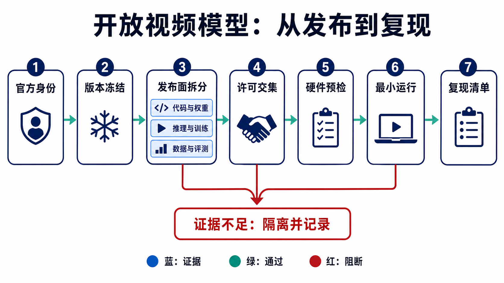
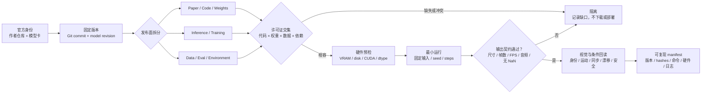
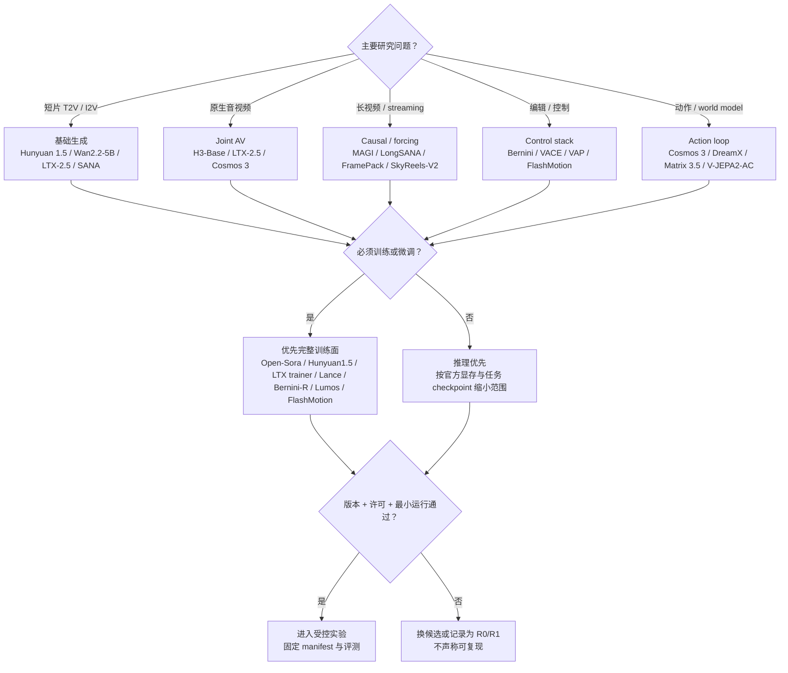
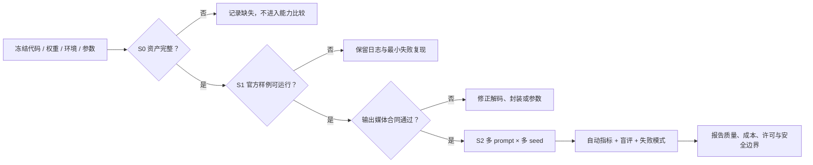

# 开放视频模型：从“有 GitHub”到可复现发布面

> **冻结日期：2026-08-30（Asia/Shanghai）。** 这是一个版本化的开放发布面审计，不是模型排行榜。仓库、权重、许可证和硬件要求会变化；实验前必须回读官方仓库、模型卡和许可证。完整检索与版本证据见[研究审计](../sources/research_20260830_open_models.md)。

## 先记住五句话

1. **“开放”不是一个布尔值。** 论文、推理代码、权重、训练代码、数据配方、评测和许可证是不同产物。
2. **代码许可证不自动覆盖权重，权重许可证也不自动覆盖训练数据或输出。** 所有依赖模型的条款还会形成许可交集。
3. **能下载不等于能复现。** 没有精确 revision、环境、采样配置、输入预处理和硬件记录，同名模型也可能产生完全不同的结果。
4. **作者给出的 VBench、速度和显存是入口证据，不是跨项目的公平排名。** 分辨率、帧数、步数、精度、offload 和计时边界必须一致后才可比较。
5. **项目页上的 “coming soon” 不是 artifact。** 本页只把冻结日实际可定位的代码、权重和文档标为已发布。

本页回答六个问题：

- 一个模型到底开放了什么？
- 2026 年最重要的开放发布路线发生了哪些变化？
- 哪些模型适合基础生成、长视频、编辑、数字人或 world model？
- 给定显存和研究目标，如何选择第一条可复现实验路线？
- 如何把一次成功 demo 升级为可审计实验？
- 哪些经典项目适合教学，但不再代表当前开放前沿？

---

## 1. 用发布向量代替“开源 / 不开源”

对一个模型版本 $m$，记录发布向量：

$$
R(m)=(P,C,W,I,T,D,E,L,H),
$$

其中：

- $P$：paper / technical report；
- $C$：核心实现代码；
- $W$：可下载权重；
- $I$：从输入到媒体文件的推理入口；
- $T$：预训练、继续训练、全量微调或 LoRA 配方；
- $D$：训练数据 manifest、数据处理或最小可替代样例；
- $E$：评测 prompts、脚本、版本和输出格式；
- $L$：代码、权重、数据及依赖的许可证；
- $H$：可复现的环境与硬件边界。

任何一项都不能由另一项推断。例如：

| 可观察事实 | 可以证明 | 不能证明 |
|---|---|---|
| 论文和 demo 存在 | 作者描述并展示过系统 | 代码或权重已发布 |
| GitHub 仓库存在 | 至少有公开文件或文档 | README 中每个模块都已实现 |
| Hugging Face 模型页存在 | 某些文件可下载 | 完整产品链、训练配方或商用权 |
| 推理脚本能运行 | 给定环境可得到输出 | 论文分数、速度或长时稳定性已复现 |
| Apache/MIT 徽章存在 | 通常能说明该仓库代码许可 | 上游权重、数据、人物肖像或输出用途 |
| 社区量化版可运行 | 社区转换路径存在 | 官方权重等价、质量无损或条款相同 |

### 1.1 最小发布等级

| 等级 | 最低要求 | 适合做什么 | 仍不能声称什么 |
|---|---|---|---|
| R0：可读 | $P$ 或项目页 | 理解方法、跟踪方向 | 可运行 |
| R1：可检查 | $C$，但关键权重或入口缺失 | 代码审计、接口研究 | 重现样例 |
| R2：可运行 | $C+W+I+L+H$ | 固定版本推理和失败分析 | 训练结果可复现 |
| R3：可适配 | R2 + 可执行 $T$ + 数据格式 | LoRA、SFT、控制模块或任务迁移 | 论文预训练可复现 |
| R4：可审计训练 | R3 + $D+E$ + 固定环境和日志 | 受控训练、评测与消融 | 与私有数据训练完全等价 |

等级只表示**发布完整度**，不表示生成质量。一个 R4 小模型可能比 R2 大模型弱，但更适合科研。

---

## 2. 一张图看懂模型进入实验前的证据链



**图 1：开放模型不是一个下载按钮。** 主链把模型身份、版本、发布物、许可证、硬件、运行证据和最终 manifest 连起来；红色出口表示证据不足时的隔离路径。上图是教学总览，下方 Mermaid 是可编辑且适合读屏器的规范版本。



顺序化文字替代：确认作者身份；固定代码和权重 revision；分别核对九个发布面；求许可证交集；检查显存、磁盘、CUDA 和精度；用固定输入与随机种子跑最小样例；验证输出媒体契约；人工回读条件遵循和失败模式；最后保存 manifest、hash、命令、硬件和日志。任一关键门失败都应记录并隔离。

---

## 3. 2026-08-30 的开放前沿：真正发生了什么变化

### 3.1 三个必须更新的版本事实

**MiniMax H3 是“开放基础生成器”，不是完整产品链全部开放。** 官方发布了两个 H3-Base 任务权重，可在本地生成 768p、4–15 秒、24 FPS 的原生立体声音视频；但用于复杂输入编排的 H3-Context-IR、2K in-context regenerate、以及初始版本承诺后续发布的稀疏注意力实现不在当前开放面内 [[1]](#ref-1)。因此，本地 H3-Base 输出与官方完整 2K workflow 不能写成同一个系统结果。

**LTX-2.5 是当前推荐版本，LTX-2.3 已是兼容旧版。** 官方仓库的 quick start 已切到 LTX-2.5，提供按组件下载、distilled 与 DFR 路线、视频/音频生成和 `ltx-trainer`；2.3 仍可运行，但不应继续作为“最新 LTX-2” [[2]](#ref-2)。LTX-2.5 使用自定义社区许可证，达到收入门槛的商业实体需要另行许可，不能只看仓库公开就写成无条件商用 [[3]](#ref-3)。

**Cosmos-Predict2.5 已迁移到 Cosmos 3。** 旧仓库明确提示有限维护并要求迁移；当前入口是 `NVIDIA/cosmos` 的模型与 cookbook 加 `NVIDIA/cosmos-framework` 的训练/推理运行面。Cosmos 3 统一 Reasoner 与 Generator，可处理文本、图像、视频、声音和动作；但当前 README 仍把部分 post-training recipes 和低精度变体列为 coming soon，不能提前标为已发布 [[4]](#ref-4), [[5]](#ref-5)。

### 3.2 当前基础模型与统一模型

表中的“已发布”仅指冻结日能从官方入口定位；性能数字均为作者口径，除非另有独立复现。

| 项目 / 当前版本 | 任务与机制 | 冻结日已发布 | 明确缺口或边界 | 官方硬件入口 | 适合的研究问题 |
|---|---|---|---|---|---|
| MiniMax H3 [[1]](#ref-1) | 33B dense omni Transformer；T2V、首尾帧、multi-reference、native AV | H3-Base FL2VA / Ref2VA 权重、推理和多框架入口 | Context-IR、2K regenerate、稀疏注意力未开放；自定义权重许可 | 官方示例以 4 GPU serving 为主 | 原生 AV、复杂参考条件、开放模块与产品模块差异 |
| LTX-2.5 [[2]](#ref-2) | joint audio-video；distilled 与 DFR 两条质量/成本路线 | 模块化权重、pipeline、LoRA/full/IC-LoRA trainer | 自定义许可证；不同 pipeline 不能混报速度和质量 | FP8/offload 可降显存，DFR 更慢且更占显存 | 统一 AV、少步生成、细节重渲染、训练工具链 |
| Cosmos 3 [[4]](#ref-4), [[5]](#ref-5) | AR reasoner + diffusion generator 的 MoT；vision/sound/action | Super/Nano/Edge 系列、framework、cookbook、部分评测 | 部分训练配方和低精度变体仍在计划；模型许可独立 | 从 Edge 单卡到 Super 多卡，模式差异很大 | world generation、forward/inverse dynamics、WAM、音视频与动作 |
| MAGI-1.1 [[6]](#ref-6) | causal autoregressive diffusion，长视频分块生成 | 24B、distilled/quantized 与 4.5B 系列权重、推理 | 论文/作者 benchmark 不是独立速度复现 | 4.5B 约 24 GB；量化窗口可到约 12 GB；24B 多卡 | causal AR、chunk cache、量化与长时漂移 |
| Bernini / Bernini-R [[7]](#ref-7) | MLLM semantic planner + Wan-based renderer；生成与编辑 | full pipeline 与 14B/1.3B renderer 权重、推理；Renderer 训练代码 | prompt enhancer 可依赖外部 VLM；full planner 与 renderer 训练面不同 | 官方主要在 H100 环境验证 | semantic planning、统一生成编辑、planner ablation |
| Lance [[8]](#ref-8) | 3B active unified understanding / generation / editing | 权重、推理、I2V、fine-tuning 和评测入口 | 研究 artifact；公开视频仅到 480p/12 FPS 训练口径 | 官方要求至少 40 GB VRAM | 小型统一模型、多任务正负迁移、训练预算研究 |
| HunyuanVideo-1.5 [[9]](#ref-9) | 8.3B DiT；T2V/I2V、SSTA、超分和蒸馏 | 权重、推理、training/LoRA、部分 step-distilled I2V | open-source plan 中仍有 sparse/distill/SR 权重未完成 | offload 最低约 14 GB；配置不同不可直接比时延 | 消费级基线、训练代码、蒸馏和 bilingual prompt |
| Wan2.2 [[10]](#ref-10) | A14B MoE + 5B dense TI2V；T2V/I2V/S2V/Animate | 多系列权重和一方推理代码 | 一方主仓偏推理；社区 training 不能冒充官方预训练配方 | 5B 官方称约 24 GB；A14B 路线约 80 GB | MoE denoising、统一 TI2V、语音驱动与角色动画 |
| SANA-Video / LongSANA [[11]](#ref-11) | linear-attention video DiT；短视频与流式长视频 | 2B 权重、推理、LongSANA train/test/weights、RL 入口 | SANA-Video 2.0 的新报告/项目不能自动视作对应权重已发 | 作者在 H100 条件报告长视频速度 | 线性注意力、长上下文、实时流式与固定预算 |
| SkyReels-V3 [[12]](#ref-12) | multi-reference、video extension、talking avatar | 任务权重与推理脚本 | 作者内评不能当独立质量排名；许可须逐模型卡复核 | 按 task 和 checkpoint 分开核对 | 多参考组合、多镜头续写、长音频数字人 |
| Open-Sora 2.0 [[13]](#ref-13) | 11B 开放训练栈，图像/视频统一 | checkpoint、训练/推理与数据处理代码 | 作者的成本和 human preference 仍需复现 | 训练面面向多卡集群 | 从数据到 checkpoint 的端到端研究、训练成本消融 |
| CogVideoX-1.5 [[14]](#ref-14) | expert Transformer + 3D causal VAE；T2V/I2V | 2B/5B/1.5 权重、SAT/Diffusers 推理、LoRA 路线 | 2B Apache 与 5B 自定义许可不同；不是同一许可对象 | Diffusers/offload 可显著降低峰值显存 | 成熟基线、VAE、LoRA、text encoder 和 scheduler 对照 |
| Step-Video-T2V / TI2V [[15]](#ref-15) | 30B flow-matching DiT + deep-compression VAE + DPO | T2V/Turbo/TI2V 权重和推理 | 一方训练代码未随主仓开放；30B 运行成本高 | 官方推荐 80 GB，204 帧样例约 72–79 GB | 大模型对照、VAE 压缩、DPO 与蒸馏 |
| Mochi 1 [[16]](#ref-16) | 10B AsymmDiT T2V | 权重、推理、LoRA fine-tuner | 研究 preview，480p 与极端运动有已知限制 | 一方实现约 60 GB；LoRA 建议 80 GB | 简洁可改架构、motion prior、LoRA 与开源许可 |

### 3.3 长视频、控制、编辑与 world model 的可运行分支

| 项目 | 路线 | 当前可得物 | 不能越界的结论 |
|---|---|---|---|
| FramePack [[17]](#ref-17) | constant-length context packing + next-section prediction | 代码、GUI、权重入口；作者称 13B 在 6 GB 可生成长视频 | 低 VRAM 来自 offload/packing，不等于实时；TeaCache/量化可能改变输出 |
| SkyReels-V2 [[18]](#ref-18) | diffusion forcing，自回归 extension | 权重、I2V/DF inference 与 30 秒示例 | “infinite-length” 是机制能力主张，不是任意长程无漂移保证；V3 已是新任务入口 |
| DreamX-World 1.0 [[19]](#ref-19) | camera action + event prompt + geometry memory | 5B-Cam 与 5B long-horizon 权重、推理 | 14B-Cam 和 joint AV 仍在计划；速度是 H20 作者口径 |
| Matrix-Game 3.5 [[20]](#ref-20) | Patch Memory、Warped PRoPE、few-step causal distillation | 代码、first/third-person 5B base、3-step first-person 权重 | project/report 证据，无正式 venue或统一硬件独立复现 |
| VACE [[21]](#ref-21) | R2V / V2V / masked V2V 的统一 condition injection | 推理、预处理、1.3B/14B 权重、benchmark | 不同 base 权重继承不同许可证；不是一套许可覆盖全部模型 |
| Video-As-Prompt [[22]](#ref-22) | 把 mask/depth/pose/flow 等语义视频作为统一 prompt | 官方权重/推理；DiffSynth 提供额外训练路径 | 社区集成必须单独标注，不能写成原论文官方训练 release |
| FlashMotion [[23]](#ref-23) | trajectory control + few-step distillation，基于 Wan2.2-5B | 训练、推理、权重、数据与评测入口 | 需要同时满足上游 Wan 与本项目许可；作者速度需同协议复测 |
| Lumos-1 [[24]](#ref-24) | LLM-style AR + discrete diffusion，图像/视频统一 token | ICLR 2026 代码、checkpoint、SFT 和 fine-tuning | 统一 token 方便研究，不等于当前最高开放画质 |
| V-JEPA 2.1 / 2-AC [[25]](#ref-25) | masked latent prediction + action-conditioned latent world model | encoder、configs、checkpoints 和 AC 研究入口 | 输出主要是 latent 表征/规划，不是像素视频生成器 |

### 3.4 研究框架与模型本体必须分开

| 工具 | 它解决什么 | 它不替你解决什么 |
|---|---|---|
| Diffusers [[26]](#ref-26) | 统一 pipeline、scheduler、offload、量化和部分训练脚本 | 上游权重许可、论文原始环境、任意社区转换的等价性 |
| Finetrainers [[27]](#ref-27) | 多种视频模型的 LoRA/full fine-tuning 编排 | 原模型预训练数据与配方，也不保证任意显卡可训练 |
| DiffSynth-Studio [[28]](#ref-28) | 多模型低显存推理、训练与控制组合 | 不能把第三方适配写成作者官方 release |
| ComfyUI [[29]](#ref-29) | 节点式推理、快速工作流和社区模型接入 | 节点版本锁定、模型卡许可、科学评测和可复现日志 |
| FFmpeg [[30]](#ref-30) | 解码、抽帧、转码、封装和媒体规格检查 | 生成质量、帧语义或真实物理正确性 |

---

## 4. 先选研究问题，再选模型



### 4.1 按显存筛选时的正确读法

| 官方入口级别 | 可先考虑的路线 | 关键限定 |
|---|---|---|
| 约 6–12 GB | FramePack 低显存路径；MAGI-1 4.5B 量化窗口；CogVideoX 小模型/offload | 往往大量依赖 CPU offload、量化或分块；速度和质量不能与 full precision 直接比较 |
| 约 14–24 GB | HunyuanVideo-1.5 offload；Wan2.2 TI2V-5B；MAGI-1 4.5B；部分 LTX pipeline | 分辨率、帧数、decoder 和 prompt encoder 会改变峰值；预留 host RAM 和磁盘 |
| 约 40–80 GB | Lance、Mochi、Step-Video、Wan A14B、DreamX-World、Matrix 3.5 | 40/80 GB 只是某个官方配置；多任务或长片段可能超过表面数字 |
| 多张 80 GB | H3 serving、Cosmos Nano/Super、MAGI 24B、Open-Sora 训练 | 同时记录张数、并行策略、互联、dtype 和每卡峰值，不能只写“8 GPU” |

这不是硬件承诺。最小显存数字常把模型加载、VAE 解码、text encoder、offload、编译和缓存放在不同边界。真正的实验记录至少包括：`GPU 型号 × 数量、VRAM、driver、CUDA、PyTorch、dtype、quantization、offload、分辨率、帧数、步数、峰值显存、wall-clock`。

---

## 5. 从“下载成功”到“可复现”的最小流程

### 5.1 冻结四类对象

一次可复现实验不能只保存 prompt。至少要同时冻结：

1. **代码**：仓库 URL、commit SHA、未提交 patch；
2. **权重**：模型卡 URL、revision、文件清单与 SHA-256；
3. **环境**：容器或 lockfile、driver/CUDA/PyTorch、推理后端；
4. **推理清单**：任务、输入文件 hash、seed、尺寸、帧率、帧数、采样器、步数、CFG、dtype、量化/offload 和输出 hash。

建议把这些信息写入机器可读的 `manifest.yaml`，而不是散落在终端历史和截图里。若官方仓库同时提供原生入口与 Diffusers/ComfyUI 入口，应把它们视为不同实现，分别冻结和验收。

### 5.2 三层 smoke test

| 层级 | 要回答的问题 | 最小证据 |
|---|---|---|
| S0：资产完整 | 权重、配置、tokenizer/VAE 是否下载完整？ | 文件清单、hash、无 Git LFS pointer 残留 |
| S1：管线可运行 | 官方最小样例是否从输入走到可解码输出？ | 命令、退出码、日志、媒体探针、首尾帧 |
| S2：结果可比较 | 同一协议能否跨 seed、prompt 或实现重复？ | 多 seed 输出、统一容器规格、失败样例、成本记录 |

单个“最好看”的视频只能证明一次成功，不能证明模型稳定。最低限度应使用多个 prompt 与 seed，并统一输出合同：容器、编码、宽高、FPS、帧数、音轨和时长。FFmpeg 可检查媒体规格，但不能替代语义和物理评测 [[30]](#ref-30)。



---

## 6. 训练与微调：先问“开放到哪一层”

把“有训练脚本”写成“可复现预训练”通常是最严重的开放性误判。登记一个训练入口时，至少回答：

- 是 LoRA、全量 fine-tuning、蒸馏，还是从头预训练？
- 数据 schema、预处理、过滤、caption/音频对齐和采样权重是否公开？
- VAE、text/audio encoder 是否冻结？使用哪个 revision？
- objective、noise schedule、loss weighting、optimizer、EMA 和 curriculum 是否明确？
- global batch、序列长度、分辨率桶、并行策略和 gradient accumulation 是否可重建？
- seed、GPU 型号/数量、GPU-hours、checkpoint 间隔与恢复策略是否记录？

例如，HunyuanVideo-1.5 的训练入口和 LoRA 支持使它比纯推理 release 更适合教学实验，但仓库中的 dummy dataloader 或接口示例只证明“训练入口开放”，不自动证明原始数据配方可复现 [[9]](#ref-9)。Open-Sora 2.0、LTX trainer、Lance、Bernini-R、Lumos 与 FlashMotion分别开放了不同深度的训练面，必须按第 2 节的 release vector 分项登记，而不是都归为一句“代码开源” [[2]](#ref-2), [[7]](#ref-7), [[8]](#ref-8), [[13]](#ref-13), [[23]](#ref-23), [[24]](#ref-24)。

---

## 7. 许可证、安全与数据来源

### 7.1 实际可用范围是多个约束的交集

对一个基于上游权重、附加 control module、第三方推理框架和输入素材的系统，允许用途不是其中任何一张许可证单独决定，而是：

\[
U_{\text{allowed}}
= U_{\text{base weights}}
\cap U_{\text{adapter}}
\cap U_{\text{tool}}
\cap U_{\text{data}}
\cap U_{\text{content policy}}.
\]

常见误读包括：

- GitHub 仓库 Apache-2.0，不代表下载的全部权重也是 Apache-2.0；
- “community license” 不等于无限制商业使用；LTX-2.5 对达到特定收入门槛的实体另有商业许可要求 [[3]](#ref-3)；
- 1.3B 与 14B、base 与 adapter、研究代码与托管 API 可能是不同许可对象；
- 上游权重的使用限制不会因为换成 Diffusers、ComfyUI 或量化文件而消失。

### 7.2 最小安全记录

每次发布或内部评测至少记录：输入素材授权与人物同意、是否包含真实人物/未成年人、身份冒用风险、音视频水印或 provenance、NSFW/暴力筛查、失败输出的访问权限、第三方 API 是否留存数据，以及模型卡要求的归因和使用限制。数字人、语音驱动和多参考角色任务应额外检查身份一致性与声音克隆授权。

---

## 8. 评测：把 release、能力和证据分开

### 8.1 三张表，而不是一个总榜

| 表 | 记录什么 | 禁止混入什么 |
|---|---|---|
| Release 表 | 权重、代码、训练面、数据、评测脚本、许可、硬件 | 主观画质排名 |
| Capability 表 | T2V/I2V、AV、控制、长视频、动作、编辑、分辨率/FPS | 未发布模块和营销 demo 推断 |
| Evidence 表 | 论文表格、作者命令、复现实验、盲评、失败率、成本 | 不同协议的单一分数横比 |

不能从不同项目 README 复制各自的 VBench 或 human-preference 数字后直接排序：prompt 集、分辨率、帧数、FPS、裁剪、版本、评测代码乃至是否挑样都可能不同。更稳妥的顺序是：

1. 固定同一输入集与输入 hash；
2. 固定输出合同和每模型合理的官方参数；
3. 使用多个 seed，公开失败与重试规则；
4. 同时做自动指标与去标识盲评；
5. 单列文字一致性、主体/背景、镜头、运动、时序、物理、音画同步和安全失败；
6. 报告 wall-clock、峰值显存、GPU-hours、许可证和人工筛选成本。

对于 world model，还应把像素逼真度、动作可控性、长期状态保持和闭环任务成功率分开；V-JEPA 类 latent predictor 的表征或控制结果不能直接与像素视频生成器的画质指标比较 [[25]](#ref-25)。

---

## 9. 历史基线：保留机制坐标，不假装仍是当前入口

| 项目 | 历史价值 | 今天如何使用 |
|---|---|---|
| VideoGPT [[31]](#ref-31) | VQ-VAE + autoregressive Transformer 的清晰视频 token 基线 | 教学小规模实验与 token/AR 对照，不作为当前高分辨率主线 |
| MAGVIT / OmniTokenizer [[32]](#ref-32) | 高效时空 tokenizer 与图像—视频统一 token | 研究压缩率、重建误差和生成性能的关系 |
| Stable Video Diffusion [[33]](#ref-33) | latent video diffusion 与 I2V 工程基线 | 复现经典 latent pipeline；同时冻结原仓库和模型卡许可 |
| AnimateDiff [[34]](#ref-34) | 把 motion module 注入图像扩散模型 | 研究模块化运动先验和个性化生态，避免与原生 video DiT 混为一类 |
| VideoCrafter [[35]](#ref-35) | 早期开放 T2V/I2V latent diffusion 系列 | 做历史回归、数据/分辨率演进和旧硬件基线 |

---

## 10. 建议的模型登记卡

```yaml
model_id: org/model
model_revision: exact-weight-revision
code_repo: https://github.com/org/repo
code_commit: full-commit-sha
checked_at: 2026-08-30
task: [t2v, i2v]
release_level: R2
release_vector:
  paper: true
  code: true
  weights: true
  inference: true
  training: false
  data_recipe: false
  evaluation: partial
license:
  code: SPDX-or-link
  weights: exact-model-card-link
  upstream: [base-model-license]
hardware:
  gpu: NVIDIA-H100-80GB
  count: 1
  peak_vram_gb: null
environment:
  driver: null
  cuda: null
  pytorch: null
  dtype: bf16
  quantization: none
  offload: none
inference:
  width: null
  height: null
  frames: null
  fps: null
  steps: null
  seed: [0, 1, 2, 3]
artifacts:
  input_hashes: []
  output_hashes: []
evidence:
  official_smoke_test: pending
  independent_replication: pending
known_gaps: []
```

---

## 11. 仍然开放的问题

1. 如何设计跨 T2V、I2V、native AV、控制和 world model 都不过度偏置的统一协议？
2. 低显存优化的质量、速度、host RAM 和可移植性应如何共同报告？
3. 开放权重但缺预训练数据时，怎样量化“可研究”与“可复现”的差距？
4. 长视频的记忆、镜头边界和累积漂移，应该按固定时长还是固定计算预算比较？
5. planner、renderer、VAE、text/audio encoder 与 safety filter 的版本贡献如何单独消融？
6. release 页面快速更新时，如何用自动化监测版本、权重、许可和已知缺口，而不把计划项误写成已发布？

---

## 参考文献与官方入口

<a id="ref-1"></a>[1] MiniMax AI. [MiniMax-H3 official repository](https://github.com/MiniMax-AI/MiniMax-H3); [MiniMax-H3 model collection](https://huggingface.co/MiniMaxAI/MiniMax-H3). Accessed 2026-08-30.

<a id="ref-2"></a>[2] Lightricks. [LTX-2 official repository](https://github.com/Lightricks/LTX-2). Accessed 2026-08-30.

<a id="ref-3"></a>[3] Lightricks. [LTX-2.5 Community License Agreement](https://github.com/Lightricks/LTX-2/blob/main/LICENSE). Effective 2026-08-11; accessed 2026-08-30.

<a id="ref-4"></a>[4] NVIDIA. [Cosmos official repository](https://github.com/NVIDIA/cosmos). Accessed 2026-08-30.

<a id="ref-5"></a>[5] NVIDIA. [Cosmos Framework](https://github.com/NVIDIA/cosmos-framework); [Cosmos Hugging Face organization](https://huggingface.co/nvidia). Accessed 2026-08-30.

<a id="ref-6"></a>[6] SandAI. [MAGI-1 official repository](https://github.com/SandAI-org/MAGI-1). Accessed 2026-08-30.

<a id="ref-7"></a>[7] ByteDance. [Bernini official repository](https://github.com/bytedance/Bernini). Accessed 2026-08-30.

<a id="ref-8"></a>[8] ByteDance. [Lance official repository](https://github.com/bytedance/Lance). Accessed 2026-08-30.

<a id="ref-9"></a>[9] Tencent Hunyuan. [HunyuanVideo-1.5 official repository](https://github.com/Tencent-Hunyuan/HunyuanVideo-1.5). Accessed 2026-08-30.

<a id="ref-10"></a>[10] Wan Team. [Wan2.2 official repository](https://github.com/Wan-Video/Wan2.2). Accessed 2026-08-30.

<a id="ref-11"></a>[11] NVIDIA Research. [SANA and SANA-Video official repository](https://github.com/NVlabs/Sana). Accessed 2026-08-30.

<a id="ref-12"></a>[12] Skywork AI. [SkyReels-V3 official repository](https://github.com/SkyworkAI/SkyReels-V3). Accessed 2026-08-30.

<a id="ref-13"></a>[13] HPC-AI Tech. [Open-Sora official repository](https://github.com/hpcaitech/Open-Sora); [Open-Sora 2.0 technical report](https://arxiv.org/abs/2503.09642). Accessed 2026-08-30.

<a id="ref-14"></a>[14] Zhipu AI. [CogVideo official repository](https://github.com/zai-org/CogVideo). Accessed 2026-08-30.

<a id="ref-15"></a>[15] StepFun. [Step-Video-T2V official repository](https://github.com/stepfun-ai/Step-Video-T2V). Accessed 2026-08-30.

<a id="ref-16"></a>[16] Genmo. [Mochi official repository](https://github.com/genmoai/mochi). Accessed 2026-08-30.

<a id="ref-17"></a>[17] Lvmin Zhang. [FramePack official repository](https://github.com/lllyasviel/FramePack). Accessed 2026-08-30.

<a id="ref-18"></a>[18] Skywork AI. [SkyReels-V2 official repository](https://github.com/SkyworkAI/SkyReels-V2). Accessed 2026-08-30.

<a id="ref-19"></a>[19] AMAP-ML. [DreamX-World official repository](https://github.com/AMAP-ML/DreamX-World). Accessed 2026-08-30.

<a id="ref-20"></a>[20] Riemann Dynamics. [Matrix-Game 3.5 official repository](https://github.com/Riemann-Dynamics/Matrix-Game-3.5). Accessed 2026-08-30.

<a id="ref-21"></a>[21] Alibaba VILab. [VACE official repository](https://github.com/ali-vilab/VACE). Accessed 2026-08-30.

<a id="ref-22"></a>[22] ByteDance. [Video-As-Prompt official repository](https://github.com/bytedance/Video-As-Prompt). ICLR 2026; accessed 2026-08-30.

<a id="ref-23"></a>[23] Hao Li et al. [FlashMotion official repository](https://github.com/quanhaol/FlashMotion). CVPR 2026; accessed 2026-08-30.

<a id="ref-24"></a>[24] Alibaba DAMO Academy. [Lumos official repository](https://github.com/alibaba-damo-academy/Lumos). ICLR 2026; accessed 2026-08-30.

<a id="ref-25"></a>[25] Meta AI. [V-JEPA 2 official repository](https://github.com/facebookresearch/vjepa2). Accessed 2026-08-30.

<a id="ref-26"></a>[26] Hugging Face. [Diffusers](https://github.com/huggingface/diffusers). Accessed 2026-08-30.

<a id="ref-27"></a>[27] Hugging Face. [Finetrainers](https://github.com/huggingface/finetrainers). Accessed 2026-08-30.

<a id="ref-28"></a>[28] ModelScope. [DiffSynth-Studio](https://github.com/modelscope/DiffSynth-Studio). Accessed 2026-08-30.

<a id="ref-29"></a>[29] Comfy Org. [ComfyUI](https://github.com/Comfy-Org/ComfyUI). Accessed 2026-08-30.

<a id="ref-30"></a>[30] FFmpeg Project. [FFmpeg documentation](https://ffmpeg.org/documentation.html). Accessed 2026-08-30.

<a id="ref-31"></a>[31] Wilson Yan et al. [VideoGPT: Video Generation using VQ-VAE and Transformers](https://arxiv.org/abs/2104.10157). 2021.

<a id="ref-32"></a>[32] Google Research. [MAGVIT project page](https://magvit.cs.cmu.edu/); [OmniTokenizer official repository](https://github.com/FoundationVision/OmniTokenizer). Accessed 2026-08-30.

<a id="ref-33"></a>[33] Stability AI. [Generative Models repository, including Stable Video Diffusion](https://github.com/Stability-AI/generative-models). Accessed 2026-08-30.

<a id="ref-34"></a>[34] Guoyang Guo et al. [AnimateDiff official repository](https://github.com/guoyww/AnimateDiff). Accessed 2026-08-30.

<a id="ref-35"></a>[35] Tencent ARC Lab. [VideoCrafter official repository](https://github.com/AILab-CVC/VideoCrafter). Accessed 2026-08-30.
