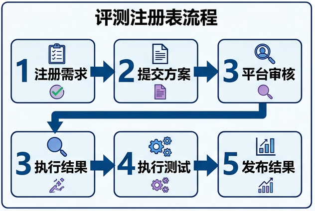
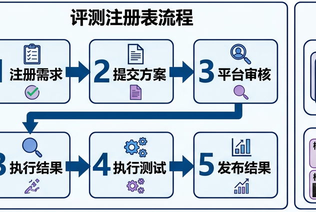

# Research audit: video generation, editing, world-model and reasoning evaluation

This file records the source-verification and synthesis trail behind the 2026-08-29 audit of `docs/evaluation.md`. It is a focused scoping audit, not a formal meta-analysis and not a leaderboard.

## Scope

- **Review date:** 2026-08-29 (Asia/Shanghai).
- **Repository baseline:** `docs/evaluation.md` contained 570 lines, 35 references and one Mermaid diagram at audit time.
- **Registry baseline:** neither `docs/resources/benchmarks.md` nor another central benchmark registry existed.
- **Primary question:** What evidence is required to evaluate open video generation, source-conditioned video editing, action-conditioned world models and video reasoning without conflating their success criteria?
- **Secondary questions:** What do FVD, IS, FID, CLIPScore and learned judges actually measure; how should human and arena preferences be aggregated; how should latency, memory, energy and SLOs be measured; and what do watermarks and C2PA 2.4 prove?
- **Time window:** foundational metric papers from 2016 onward and benchmark/specification work available through 2026-08-29.
- **Mutation boundary:** this audit created only this research record. It did not modify `docs/evaluation.md`.

## Repository findings that motivated the review

The existing chapter has a strong methodological backbone: it distinguishes reference fidelity from distributional quality, rejects cross-paper FVD copying, asks for prompt-level uncertainty, separates open-loop video plausibility from decision evidence and provides an L0-L7 world-model evidence ladder. The central weakness is freshness and task coverage, not the core thesis.

Confirmed issues in the audited snapshot were:

1. The chapter says its search is current through August 2026, but its main benchmark timeline omits most 2025-2026 generation, editing, evaluator-meta-evaluation, reasoning and watermark families.
2. T2VSafetyBench is described as having 12 aspects. The official NeurIPS abstract states **4 primary categories and 14 critical aspects**, evaluated on 9 T2V models.
3. The C2PA reference is version 2.2. The current official specification is **2.4, April 2026**.
4. Editing benchmarks appear in `docs/tasks/video-to-video.md` but not in the central evaluation matrix.
5. The current reasoning chapter is substantially newer than the central evaluation chapter; reasoning needs a task-specific protocol entry rather than silent treatment as ordinary generation.
6. Human evaluation guidance does not specify a pairwise ranking model, connected comparison design, tie policy, arena non-stationarity or power/uncertainty requirements.
7. Efficiency is represented by one row and one template bullet, without TTFF, latency tails, jitter, deadline misses, memory growth or measurement boundaries for energy.
8. Behavioral safety, AI-generated-media detection, watermark robustness and signed provenance are compressed into adjacent concepts although they provide different guarantees.

## Search and verification method

### Discovery routes

Candidate works were found through exact-title and concept searches in arXiv, official conference proceedings and official project repositories. Query concepts included:

```text
video generation evaluation benchmark
FVD temporal sensitivity content bias JEDi
VBench++ VBench 2.0 intrinsic faithfulness
text-to-video compositional benchmark
video editing benchmark source fidelity instruction compliance
physical commonsense video generation benchmark
interactive video world model benchmark action evaluation
video reasoning benchmark chain of frames
video evaluator meta-evaluation controlled degradation
video human preference arena Bradley Terry judge calibration
video watermark robustness benchmark removal forgery
C2PA 2.4 live video environmental sustainability
video generation TTFF latency energy SLO
```

Sources used for candidate discovery or verification were:

| Source class | Use in this audit |
|---|---|
| CVF, NeurIPS, PMLR, ACL, AAAI, ICLR/OpenReview and ICLR proceedings | Preferred record for peer-reviewed benchmark and metric claims |
| arXiv abstract/API and version history | Current preprint version, submission date and author-reported numbers when no proceedings record was available |
| C2PA specification and guidance | Normative provenance/version claims |
| ITU-T P.910 and MLCommons documentation | Human video quality and power-measurement protocol anchors |
| Official GitHub/project pages | Code availability, evaluator implementation and mutable arena/leaderboard status |
| Artificial Analysis methodology | Industry example of blind pairwise ranking and end-to-end API timing; not treated as peer-reviewed evidence |

This was a targeted audit seeded by named benchmarks and repository claims. Broad search denominators were not recorded consistently, so this document does not invent PRISMA counts. It records the primary-source ledger and explicit selection rules instead.

### Inclusion criteria

A source was included when it supplied at least one of the following:

1. a new evaluation task definition or diagnostic axis for generated or edited video;
2. a benchmark with sufficiently specified prompts, source videos, human labels or automated evaluators;
3. a controlled analysis of metric or judge failure;
4. an action-, intervention-, rollout- or decision-centered world-model evaluation protocol;
5. a reproducible human, arena, systems, power, watermark or provenance evaluation method;
6. the current normative C2PA version or an official implementation/validation rule.

### Exclusion criteria

- Secondary surveys when a primary paper or standard was available.
- Product marketing without a technical protocol.
- Leaderboard ranks without enough method/version information to interpret the comparison.
- Pure video-understanding benchmarks unless they directly evaluated a judge used for generated-video assessment.
- Image-only metrics presented as complete video metrics without an explicit temporal aggregation protocol.
- Duplicate arXiv versions after the current version had been checked.
- A benchmark name collision when the task differed. In particular, 2026 `VEBench` without a hyphen evaluates MLLM video-editing knowledge and operational reasoning; it is not interchangeable with `VE-Bench`, the edited-video quality benchmark.

### Verification procedure

For each promoted source, the audit checked the title, venue/status, current version where relevant, abstract or specification text, and the numbers used in the synthesis. Official proceedings or standards were preferred over an arXiv mirror. Author-reported performance is labeled as such and was not treated as independently reproduced.

The review workflow is shown below. This is a trace diagram, not a numerical PRISMA flow because a complete candidate denominator was not captured.


## Evidence levels

Evidence level describes the source and the maximum claim it can safely support. It is not a score for paper quality.

| Level | Evidence type | Appropriate use | Main limitation |
|---|---|---|---|
| E1 | Current normative standard or official measurement recommendation | Versioned requirements, validation behavior, measurement definitions | A standard defines conformance; it does not prove a system is truthful or effective |
| E2 | Peer-reviewed official proceedings paper | Benchmark design, dataset size, reported experiments and documented limitations | Results remain tied to tested models, prompts and evaluator versions |
| E3 | Current author preprint with primary methods and data | Fast-moving 2026 milestones and provisional protocols | Not yet peer-reviewed; conclusions may change across versions |
| E4 | Official code, project, model card or transparent industry methodology | Reproduction details, mutable arena state and operational timing method | Availability and implementation evidence, not independent scientific validation |
| E5 | Repository synthesis or proposed protocol derived from E1-E4 | Decision rules, stress tests and reporting templates | Must be presented as recommendation or inference, not as a source finding |

When two records conflict, the current normative version wins for standards; the formal proceedings version wins for venue and reviewed content; and the latest arXiv revision wins only for explicitly labeled preprint updates.

## Benchmark registry

### General video generation and evaluator meta-evaluation

| Benchmark | Status at review date | Scope and key numbers | Evaluator design | Safe claim ceiling | Primary source | Level |
|---|---|---|---|---|---|---|
| VBench | CVPR 2024 | 16 disentangled quality and condition dimensions | Dimension-specific automatic metrics calibrated with per-dimension human preference | Diagnostic T2V capability profile, not a universal scalar or causal test | <https://openaccess.thecvf.com/content/CVPR2024/html/Huang_VBench_Comprehensive_Benchmark_Suite_for_Video_Generative_Models_CVPR_2024_paper.html> | E2 |
| VBench++ | arXiv 2024; official open-source ecosystem | Extends support to T2V and I2V and adds trustworthiness-oriented evaluation | Reuses a hierarchy of tailored evaluators and human alignment sets | Broader modality/trustworthiness profile; should not be merged conceptually with VBench-2.0 | <https://arxiv.org/abs/2411.13503> | E3 |
| VBench-2.0 | arXiv 2025 | Five top-level dimensions: Human Fidelity, Controllability, Creativity, Physics and Commonsense | Generalist VLM/LLM evaluators plus specialist anomaly detectors and human alignment | Intrinsic-faithfulness diagnostics; still not action-conditioned causality | <https://arxiv.org/abs/2503.21755> | E3 |
| T2V-CompBench | CVPR 2025 | 1,400 prompts; seven categories covering static/dynamic attribute binding, spatial relations, motion/action binding, interactions and numeracy | MLLM, detection and tracking, with a human meta-evaluation subset | Compositional prompt adherence, not overall quality or world-model evidence | <https://openaccess.thecvf.com/content/CVPR2025/html/Sun_T2V-CompBench_A_Comprehensive_Benchmark_for_Compositional_Text-to-video_Generation_CVPR_2025_paper.html> | E2 |
| TC-Bench | Findings of ACL 2025 | Initial-to-final attribute or relation transitions | State-transition questions and automatic/human assessment | Temporal compositional completion rather than keyword co-occurrence | <https://aclanthology.org/2025.findings-acl.241/> | E2 |
| T2VWorldBench | WACV 2026 | 1,200 prompts; 6 categories and 60 subcategories of world knowledge | Category-specific generated-video assessment | Open-world knowledge plausibility, not interactive dynamics | <https://openaccess.thecvf.com/content/WACV2026/html/Chen_T2VWorldBench_A_Benchmark_for_Evaluating_World_Knowledge_in_Text-to-Video_Generation_WACV_2026_paper.html> | E2 |
| SLVMEval | CVPR 2026 according to current author metadata | Controlled pairs up to 10,486 seconds across 10 degradations; humans achieve 84.7%-96.8% pairwise accuracy and tested evaluators lag humans in 9 of 10 aspects, author-reported | Synthetic degradation plus crowd filtering and pairwise ranking | Reliability of long-video evaluators under known changes, not model ranking | <https://arxiv.org/abs/2603.29186> | E3 |
| HuM-Eval and HuM-Bench | ICME 2026 according to current author metadata | 1,000 human-centric prompts; author reports 58.2% average human correlation | Coarse VLM judgment, then 2D pose and 3D motion checks | Human anatomy and motion diagnostics, not general scene quality | <https://arxiv.org/abs/2604.25361> | E3 |

### Video editing

| Benchmark | Status at review date | Scope and key numbers | Core axes | Safe claim ceiling | Primary source | Level |
|---|---|---|---|---|---|---|
| VE-Bench | AAAI 2025 | Paper experiments cover 8 editing models, 24 annotators and 28,080 subjective score samples | Text-to-edited-video alignment, source-to-edited-video relevance, aesthetics and distortion | Human-aligned edited-video quality on represented edit/model distribution | <https://ojs.aaai.org/index.php/AAAI/article/view/32763> | E2 |
| FiVE-Bench | ICCV 2025 | 74 real and 26 generated source videos; 6 edit types; 420 object-level prompt pairs and masks; 15 metrics | Object-level edit success, preservation and temporal quality | Fine-grained edit diagnostics under provided masks/prompts | <https://openaccess.thecvf.com/content/ICCV2025/html/Li_FiVE-Bench_A_Fine-grained_Video_Editing_Benchmark_for_Evaluating_Emerging_Diffusion_ICCV_2025_paper.html> | E2 |
| IVEBench | ICLR 2026 | 600 source videos; 7 semantic dimensions; 32-1,024 frames; 8 major and 35 subcategories | Video quality, instruction compliance and video fidelity | Broad instruction-guided editing comparison; VLM results still need human calibration | <https://iclr.cc/virtual/2026/poster/10007517> | E2 |

Editing evaluation requires three simultaneous comparisons: output to instruction, output to source, and changed region to unchanged region. A generator can produce an attractive target-looking clip while failing the edit by redrawing identity, motion or background.

### Physical plausibility and video world models

| Benchmark or framework | Status at review date | Scope and key numbers | What it measures | Safe claim ceiling | Primary source | Level |
|---|---|---|---|---|---|---|
| VideoPhy | ICLR 2025 | Semantic and physical commonsense assessment over material and activity prompts | Joint semantic adherence and visible physical plausibility | L2 physical diagnostic; not controlled dynamics | <https://arxiv.org/abs/2406.03520> | E2 |
| PhyGenBench | ICML 2025 | 160 prompts, 27 physical laws and 4 domains | Hierarchical physical commonsense evaluation | Visible adherence to selected laws | <https://proceedings.mlr.press/v267/meng25c.html> | E2 |
| VideoPhy-2 | ICLR 2026 | 200 action types; conservation-focused hard cases; paper reports about 22% best joint semantic/physics score on its hard subset | Action-centric visible physical commonsense | Harder L2 diagnosis, not counterfactual action fidelity | <https://arxiv.org/abs/2503.06800> | E2 |
| Physics-IQ | WACV 2026 | Fluids, optics, solids, magnetism and thermodynamics | Whether visual realism tracks physical-principle performance | Evidence that appearance quality and tested physical understanding can diverge | <https://openaccess.thecvf.com/content/WACV2026/html/Motamed_Do_Generative_Video_Models_Understand_Physical_Principles_WACV_2026_paper.html> | E2 |
| WorldModelBench | NeurIPS 2025 | 67K human labels, 14 frontier models and a 2B learned judge | Instruction following, temporal/aesthetic common sense and visible physical violations | Primarily L1-L2 generated-video diagnosis | <https://proceedings.neurips.cc/paper_files/paper/2025/hash/4ec03ed08a3fcb59e1c815b5598beff1-Abstract-Datasets_and_Benchmarks_Track.html> | E2 |
| WorldMark v2 | arXiv revision dated 2026-08 | Shared WASD-style controls through adapters; 10 heterogeneous models and 500 standardized cases | Per-axis direction accuracy, direction purity, response latency, motion stability, memory and visual quality | Action-response diagnostics; stronger than prompt plausibility but not real-environment policy value | <https://arxiv.org/abs/2604.21686> | E3 |
| Decision-centered evidence ladder | 2026 preprint | Counterfactual action fidelity, closed-loop rollout, reward/value, policy ranking, optimization lift, exploitability and calibration | Whether a learned model supports correct decisions | Framework for L3-L7 evidence; not itself a completed public benchmark | <https://arxiv.org/abs/2606.15032> | E3 |

The correct boundary is important: a clip that looks physically plausible may show learned regularities, but it does not establish that changing action while holding state fixed produces the correct counterfactual or that planning in the learned model improves real return.

### Video reasoning

Reasoning must be routed separately because success may be deterministically checkable even when video quality is mediocre, and a visually polished trajectory can contain illegal intermediate states. The current primary benchmark family includes:

| Benchmark | Main role in the family | Primary source | Level |
|---|---|---|---|
| MME-CoF | Broad Chain-of-Frames capability evaluation | <https://arxiv.org/abs/2510.26802> | E3 |
| TiViBench | Temporal and visual reasoning tasks for generated trajectories | <https://arxiv.org/abs/2511.13704> | E3 |
| Gen-ViRe | Generative visual reasoning evaluation | <https://arxiv.org/abs/2511.13853> | E3 |
| V-ReasonBench | Video-model reasoning benchmark | <https://arxiv.org/abs/2511.16668> | E3 |
| VBVR | Large-scale verifiable video reasoning infrastructure | <https://arxiv.org/abs/2602.20159> | E3 |
| World Reasoning Arena | Pairwise/arena comparison for world reasoning | <https://arxiv.org/abs/2603.25887> | E3 |
| VBVR-Pro | August 2026 extension of verifiable video reasoning | <https://arxiv.org/abs/2608.26105> | E3 |

The central evaluation protocol should require final-answer accuracy, intermediate-state legality, problem preservation, pass@1 and pass@k under explicit compute budgets, and in-/out-of-distribution splits. Exact, functional or programmatic scorers take priority over a VLM judge whenever the task permits them.

### Safety and watermark robustness

| Benchmark or method | Status at review date | Scope and key numbers | Safe claim ceiling | Primary source | Level |
|---|---|---|---|---|---|
| T2VSafetyBench | NeurIPS 2024 Datasets and Benchmarks | 4 primary categories, 14 critical aspects, 9 T2V models | Behavioral safety and usability trade-off on tested prompts/models | <https://proceedings.neurips.cc/paper_files/paper/2024/hash/74eed5f568354c2e77dd9b018f38a9d4-Abstract-Datasets_and_Benchmarks_Track.html> | E2 |
| VideoMarkBench | 2025 preprint | 3 generators, 3 styles, 4 watermark methods, 7 detection aggregation strategies and 12 perturbations under white-, black- and no-box removal/forgery threats | Comparative watermark robustness under enumerated threats | <https://arxiv.org/abs/2505.21620> | E3 |
| SIGMark | ICLR 2026 | Blind in-generation video watermarking and temporal-disturbance tests | Evidence for one method under its evaluated attacks, not universal provenance | <https://proceedings.iclr.cc/paper_files/paper/2026/hash/f3f6f1739b646e0bd20111261ce23adb-Abstract-Conference.html> | E2 |

## Traditional metric mechanisms and failure boundaries

### Inception Score

Inception Score is

```math
\mathrm{IS}=\exp\left(\mathbb{E}_{x}\mathrm{KL}(p(y\mid x)\|p(y))\right).
```

It rewards confident classifier predictions for individual samples and a broad marginal class distribution. It has no real-data reference, inherits the classifier's taxonomy and domain bias, does not directly measure within-class diversity and can be distorted by classifier artifacts. Its finite-sample estimate is biased.

### Fréchet Inception Distance

FID compares real and generated image features through their estimated means and covariances. It detects some fidelity and coverage changes that IS misses, but assumes the chosen feature space and its Gaussian second-order approximation are suitable. Finite-sample bias is model-dependent, so merely fixing the same sample count does not make the estimator unbiased. Per-frame FID has no knowledge of temporal order.

Primary finite-sample analysis: <https://openaccess.thecvf.com/content_CVPR_2020/html/Chong_Effectively_Unbiased_FID_and_Inception_Score_and_Where_to_Find_CVPR_2020_paper.html>.

### Fréchet Video Distance

FVD applies a Fréchet distance to video features, conventionally I3D features. It is useful for controlled ablation when the reference set, implementation, sample count, clip length, FPS, resolution and preprocessing are identical. It is not a portable absolute quality scale.

Documented failure modes are:

- I3D features may be dominated by content and action category rather than subtle temporal defects.
- Severe temporal corruption can produce surprisingly small changes.
- Selecting nearly static samples can improve FVD without improving temporal realism.
- The I3D feature distribution is not well modeled as Gaussian in all tested settings.
- Stable estimates can require impractically large samples.
- TensorFlow/PyTorch implementations, weights and video preprocessing alter the number.

Primary sources:

- Original FVD: <https://arxiv.org/abs/1812.01717>.
- Content bias analysis, CVPR 2024: <https://openaccess.thecvf.com/content/CVPR2024/html/Ge_On_the_Content_Bias_in_Frechet_Video_Distance_CVPR_2024_paper.html>.
- Beyond FVD/JEDi, ICLR 2025: <https://arxiv.org/abs/2410.05203>.

JEDi replaces I3D with JEPA features and the Gaussian Fréchet model with polynomial-kernel MMD. The paper reports reaching a steady value with 16% of FVD's samples and increasing human alignment by 34% on average in its experiments. These are author-reported results on tested datasets, not proof of a task-independent metric.

### CLIPScore and frame aggregation

CLIPScore was introduced for reference-free image-caption evaluation, not video. A common video adaptation averages frame-text similarities. Arithmetic frame averaging is invariant to frame permutation and therefore cannot by construction validate event order. CLIP-family scores are also weak evidence for object count, negation, attribute binding, spatial relations, motion binding and completed state transitions.

Primary CLIPScore source: <https://aclanthology.org/2021.emnlp-main.595/>.

FETV reports poor alignment of common automatic metrics, including CLIPScore and FVD, with fine-grained human judgments on text-to-video outputs: <https://proceedings.neurips.cc/paper_files/paper/2023/hash/c481049f7410f38e788f67c171c64ad5-Abstract-Datasets_and_Benchmarks.html>.

### Reference and no-reference perceptual metrics

PSNR, SSIM, LPIPS, VMAF, keypoint error and trajectory error can be appropriate when there is a valid reference or known target. DOVER-like no-reference VQA models can diagnose technical and aesthetic quality. None of these alone verifies prompt semantics, correct physical causality, distribution coverage or editing locality.

### Required metric stress suite

Before a metric is used as evidence for a capability, it should be tested against controlled changes with a known expected direction.

| Target capability | Positive/negative control | Required observation |
|---|---|---|
| Temporal order | Shuffle frames or reverse a directional event | Temporal score should deteriorate while content presence remains similar |
| Motion and non-stasis | Freeze, repeat or drop frames | Metric must not reward stable but motionless output as correct motion |
| Speed robustness | Change FPS and playback speed separately | Report whether the metric measures motion semantics or encoding/sampling |
| Transient errors | Insert a brief identity swap, disappearing object or contact failure | Evaluator must detect errors shorter than its normal frame-sampling interval |
| Compositional binding | Swap color, count, left/right relation or action target | Condition score must follow the bound fact, not noun co-occurrence |
| State transition | Remove the critical event while preserving initial/final-looking frames | Transition evaluator should fail the incomplete process |
| Codec robustness | Re-encode at multiple codecs/bitrates | Semantic/physics scores should not be dominated by compression artifacts |
| Distribution sensitivity | Duplicate samples or collapse motion/content modes | Coverage/diversity metrics should move in the expected direction |

## Learned judge calibration protocol

Learned evaluators are useful for scale, but their output is an instrument reading, not ground truth. The following gate is recommended before a judge score enters a model table.

### Gold-set design

1. Hold out a balanced human-labeled gold set that was not used to train the generator, reward model or judge.
2. Balance prompt category, difficulty, duration, motion, language, demographic content, model family and failure type.
3. Use prompt or source-video families as the statistical unit; frames from one video are not independent samples.
4. Retain ties, both-bad and ambiguous examples instead of forcing all pairs into a binary preference.

### Calibration outputs

- Pairwise accuracy and tie accuracy with prompt-clustered confidence intervals.
- Spearman or Kendall rank correlation for ordered scores.
- Per-capability and per-duration slices, not only a pooled mean.
- Brier score and expected calibration error when the judge emits probabilities.
- Coverage-risk curve when the judge can abstain.
- Human-judge disagreement taxonomy for high-impact and low-margin cases.

### Bias and sensitivity tests

- Repeat every pair with left/right order reversed.
- Sweep frame sampling, resolution, context length and codec.
- Include shuffle, freeze, repeat, deletion, speed, binding and transient-error controls.
- Test self-preference and model-family preference where the judge shares a provider or backbone with a candidate.
- Freeze judge checkpoint/API date, rubric, system prompt, decoding settings and preprocessing.
- Weight an ensemble by held-out reliability; a naive majority of mixed-quality video judges can be worse than the best individual judge.

General LLM-as-judge work documents position, verbosity and self-enhancement biases: <https://proceedings.neurips.cc/paper_files/paper/2023/hash/91f18a1287b398d378ef22505bf41832-Abstract-Datasets_and_Benchmarks.html>.

Video-specific judge reliability study: <https://arxiv.org/abs/2503.05977>.

### Separation of optimization and evaluation

The following roles should not collapse into one model:

1. training reward;
2. development-set automatic metric;
3. frozen external evaluator;
4. final blind human evaluation.

If the same judge supplies both the optimization reward and final ranking, reward hacking is an expected threat. The final report should include an external frozen judge, metric stress tests and blind human audits.

## Human evaluation and arena statistics

### Presentation protocol

- Hide model identity and randomize left/right order.
- Match resolution, FPS, codec, audio, looping, playback controls and display conditions.
- Ask separate questions for condition adherence, temporal coherence, motion/physics, technical quality and direct usability.
- Permit `tie`, `both bad` and `cannot judge`.
- Use stratified random prompts and equal generation/retry budgets; do not use provider-selected demonstrations.
- Record annotator recruitment, language, geography/demographics where appropriate, training, quality controls and exclusion rules.

ITU-T P.910 provides the current general anchor for subjective video quality methods: <https://www.itu.int/rec/T-REC-P.910-202310-I/en>.

### Aggregation model

For a basic Bradley-Terry model,

```math
P(i \succ j)=\sigma(\theta_i-\theta_j).
```

Use Bradley-Terry, Thurstone or a documented tie-aware extension rather than raw win rate alone. The comparison graph must be connected, each matchup needs enough repeated prompts, and uncertainty should be obtained by clustering/bootstrap at the prompt level. If the same raters score many clips, a mixed-effects logistic or ordinal model can include prompt and rater effects.

Report category-level ratings and confidence intervals. Correct multiple comparisons when many models and axes are tested. A one-number Elo-like display may be offered as a navigation aid, but it should not replace the underlying pair counts, categories, time window and uncertainty.

### Arena-specific threats

Arena data are a relative, time-varying preference sample. Rankings can shift because of model/API updates, user self-selection, prompt-population drift, unequal matchup scheduling, presentation effects and disconnected or weakly connected comparison regions. Publish:

- exact model identifier and availability window;
- match graph and per-pair counts;
- user/duplicate/bot filtering;
- tie policy and ranking model;
- overall and category ratings with uncertainty;
- policy for model updates and historical snapshots.

The VBench project's official README records the evolving VBench Arena ecosystem: <https://raw.githubusercontent.com/Vchitect/VBench/master/README.md>.

Artificial Analysis documents a blind pairwise, Bradley-Terry maximum-likelihood approach and end-to-end API timing. It is a transparent industry methodology rather than peer-reviewed evidence: <https://artificialanalysis.ai/video/methodology>.

## Efficiency, memory, energy and SLO protocol

### Reproducibility envelope

Every performance result should state:

- model checkpoint or API version and access date;
- GPU/accelerator count and model, host CPU/RAM, driver and interconnect;
- framework, compiler, precision/quantization and attention implementation;
- batch size, resolution, FPS, duration, audio and number of output samples;
- sampler, denoising steps, guidance, prompt rewriting and post-processing;
- warm/cold state, concurrency and whether upload, queue, encode and download are included.

### Offline batch metrics

| Metric | Definition or reporting rule |
|---|---|
| End-to-end latency | Request/start to usable encoded artifact; report cold and warm p50/p95/p99 |
| Throughput | Videos/hour and generated output-frames/second at stated concurrency |
| Real-time factor | Compute seconds divided by generated media seconds |
| Peak device memory | Report allocated and reserved where the framework distinguishes them |
| Peak host memory | Include offload, preprocessing and encoding |
| Horizon memory growth | Memory or cache size versus generated duration, not only a short fixed clip |
| Failure-inclusive cost | Cost and latency denominator includes errors, refusals, retries and corrupt outputs |
| Time to usable video | Wall time until the output passes the declared quality/validity gate |

### Interactive and streaming metrics

- Time to first frame or first playable chunk.
- Control-input to visible-response latency.
- Inter-frame/inter-chunk p50, p95 and p99.
- Jitter and deadline-miss rate against the declared SLO.
- Sustained horizon before memory exhaustion, drift or deadline failure.
- Recovery time and state continuity after a miss or reconnect.

Averages alone are insufficient for an interactive system because rare stalls determine usability.

### API decomposition

For commercial APIs, measure submit, upload, queue, generation, encode and download separately when observable, plus their total. I2V and editing evaluations must include source-media upload. Record rate-limit errors, safety refusals, timeouts and retries. Closed APIs should be treated as dated product snapshots, not immutable model checkpoints.

### Energy measurement

Wall-AC measurement is preferred for whole-system energy. Synchronize the power window to the workload, include warm-up policy and repeated runs, and publish both gross energy and the chosen idle-baseline subtraction. GPU telemetry alone should be labeled partial because it omits CPU, memory, networking, storage and cooling overhead.

Report joules or kWh per generated second and per **accepted** generated second. Carbon and water conversions require separate location, time and accounting assumptions; they should not be silently inferred from device energy.

MLCommons full-system power guidance: <https://docs.mlcommons.org/inference/power/>.

Quality, latency, memory, energy and cost form a Pareto surface. A fair comparison fixes either the quality target and compares resources, or fixes the resource/SLO budget and compares quality. `time_to_usable_video` and `energy_per_accepted_second` are more deployment-relevant than fastest successful sample.

## Safety, detection, watermark and provenance

These layers must be evaluated independently.

### Behavioral safety

Report attack success rate for malicious prompts, harmful-output severity, normal-prompt false refusal, cross-frame escalation, portrait/privacy, copyright, minor safety and misleading-content categories. Preserve refusals, timeouts and filtered outputs in the denominator. Because attack surfaces change, maintain a private and refreshed challenge set in addition to a public development set.

### AI-generated-media detection

Detection is a classifier problem. Report TPR at fixed low FPR, calibration, real-media false positives, cross-generator/domain performance and performance after codec, crop, screen capture, watermark removal and fake-watermark insertion. Detection must not be conflated with watermark extraction or signed provenance.

### Watermark protocol

Measure:

- visual/audio fidelity, including blind human assessment where artifacts matter;
- TPR at fixed low FPR, bit accuracy/BER, payload capacity and localization;
- extraction latency, key management and storage overhead;
- H.264/H.265 re-encoding, resize/crop, color changes, overlays and screen capture;
- trim, insert, delete, reorder, interpolate, FPS and speed changes;
- generative re-editing, removal, forgery, collusion and key-compromise threats;
- white-box, black-box and no-box attackers;
- cross-generator, cross-domain and real-media false positives.

### C2PA 2.4 current specification

The official version index is <https://spec.c2pa.org/specifications/>. The current technical specification at the review date is **C2PA 2.4, April 2026**:

- Technical specification: <https://spec.c2pa.org/specifications/specifications/2.4/specs/C2PA_Specification.html>.
- Implementation guidance: <https://spec.c2pa.org/specifications/specifications/2.4/guidance/Guidance.html>.

Version 2.4 adds or clarifies:

1. **crJSON**, a JSON-LD-derived view of a C2PA Manifest Store for profile evaluation, interoperability testing and validation reporting. It is not independently verifiable and is not an input format.
2. **Repository Receipt Assertion**, labeled `c2pa.repository-receipt`, for evidence that a manifest repository ingested a manifest.
3. **Environmental Sustainability Assertion**, labeled `c2pa.environmental-sustainability`, with optional `energy_kwh`, `carbon_kgco2e` and `water_litres` measurements and measurement-method metadata.
4. Clarifications and improvements to actions, ingredients, cryptography, live video and dynamic packaging.
5. Live-video support for ISO BMFF and CMAF, not MPEG Transport Streams, with independently verifiable segments and sequence/continuity mechanisms.

For generated media, the creation action and `trainedAlgorithmicMedia` digital source type should be represented as specified. A signed sustainability assertion conveys an attributable claim; it does not independently establish that the energy or emissions measurement was correct.

### C2PA conformance and resilience tests

Positive-path tests should cover manifest structure, hard binding, signature, trust list, timestamp/revocation information, action/ingredient chain, generator/version, AI source type, embedded/external availability and multiple independent validators.

Transformation tests should cover transcode, rewrap, resize, crop, trim, concatenate, overlay, export and platform upload. The expected result must be defined in advance: preserved valid credential, a correctly created derived credential, or recoverable provenance through a repository/soft binding.

Negative tests should cover byte/assertion tampering, signature replacement, ingredient removal, expired/revoked/untrusted signers, missing manifests, content substitution and replay. Live streams additionally need segment reorder, deletion, duplication, key rotation, initialization-segment binding, outage/recovery and per-segment validation latency.

Publish four rates separately:

1. manifest presence;
2. cryptographic validity;
3. trusted signer;
4. claimed provenance completeness.

The interpretation boundary is non-negotiable: absence of C2PA does not prove media are false, and a cryptographically valid credential does not prove the depicted event is true. C2PA provides tamper-evident association and signed provenance claims within a trust ecosystem.

## Task-routing evaluation protocol

The protocol below prevents a metric from being promoted beyond the task it measures.


| Task | Evaluation unit | Primary evidence | Claim that remains unsupported |
|---|---|---|---|
| Open generation | Prompt by seed | Quality, distribution/coverage, compositional adherence, time, task-specific physics and human preference | Action causality or planning value |
| Video editing | Source by instruction by seed, optionally mask/object | Edit success, source fidelity, locality, identity/motion preservation and temporal quality | Open-domain generation coverage |
| Video reasoning | Problem/initial state by seed and compute budget | Exact result, legal intermediate process, pass@1/pass@k, ID/OOD and closed-loop verifier | World-model value without action intervention |
| World model | Initial state by action branch by horizon by policy | Action alignment, counterfactual consistency, rollout failure curve, policy ranking, regret and independent/real return | Universal world understanding outside tested domains |

## Key disagreements and resolution rules

### FVD should be replaced versus retained

The evidence supports neither uncritical use nor total deletion. FVD remains useful for same-dataset, same-implementation ablations with uncertainty. It should not be used as a cross-paper universal ranking or proof of temporal realism. JEDi is a promising alternative whose own task/domain sensitivity still requires stress testing.

### VLM judge can replace humans versus only scale them

Learned judges can make evaluation cheaper and more diagnostic, but current evidence supports human-calibrated deployment, not unconditional replacement. A judge that correlates on its original paper can fail on new generators, long clips, subtle transient errors or adversarially optimized outputs.

### Physical plausibility versus causal world modeling

VideoPhy, PhyGenBench, VideoPhy-2, Physics-IQ and WorldModelBench diagnose visible violations. They do not establish that the model has the correct action-conditioned transition, counterfactual branch or planning utility. WorldMark begins action-response diagnosis; real or independent-simulator policy evaluation remains the stronger test.

### Arena rank versus absolute quality

Arena rankings provide useful relative preferences for a particular user and model snapshot. They are non-stationary and schedule-dependent. They require versioned snapshots, connected match graphs, category ratings and uncertainty before being interpreted scientifically.

### Watermark versus provenance

A watermark may survive transformations but lack an authenticated creation/edit chain. C2PA may authenticate claims but disappear in unsupported toolchains. AI detection estimates a class label without either guarantee. Production evaluation needs all relevant layers and must report them separately.

### Best-of-k versus reliability

Best-of-k and pass@k measure capability under extra sampling and selection. They are not pass@1 reliability and are not free. Report pass@1, average outcome, pass@k/best-of-k, selector/oracle assumptions, latency, energy and total cost together.

### One total score versus a decision profile

Quality, motion, adherence, safety, latency and energy are not naturally exchangeable. The default output should be a per-axis profile and Pareto frontier. If a deployment requires a scalar, its weights, normalization and sensitivity analysis must be fixed before evaluation.

## Recommended benchmark registry schema

A future central registry should keep one row per benchmark version with these fields:

```text
name
task_type
input_modality
output_modality
version_or_commit
release_or_revision_date
venue_status
sample_and_prompt_counts
capability_axes
unit_of_analysis
automatic_evaluator_and_checkpoint
evaluator_prompt_and_preprocessing_hash
human_gold_set_and_protocol
license_and_access
official_paper
official_code
known_contamination_risk
supported_claim_level
known_failure_modes
last_verified_date
```

Mutable leaderboards and closed APIs additionally need the exact access window and model identifier. A benchmark name without version, scorer checkpoint and preprocessing is not a reproducible result.

## Minimal evidence-backed report template

An evaluation report should contain:

1. claim card and intended use;
2. task route and world-model evidence ceiling if relevant;
3. model/API versions, access dates and generation budget;
4. dataset, source-video or scenario versions and contamination risk;
5. automatic metrics with implementation and stress-test results;
6. judge gold-set calibration and frozen configuration;
7. blind human/arena protocol, aggregation model and confidence intervals;
8. failure-, refusal- and timeout-inclusive statistics;
9. latency tails, TTFF, throughput, memory, energy and cost boundaries;
10. behavioral safety, detection, watermark and provenance as separate sections;
11. per-category results, representative random failures and Pareto frontier;
12. primary sources, code commits and all access dates.

## Review limitations and update triggers

- This is a focused scoping audit driven partly by the repository's named gaps, not an exhaustive systematic review of every video metric.
- Several 2026 works were preprints at the review date and are therefore E3 evidence.
- Author-reported benchmark/judge numbers were source-verified but not independently reproduced.
- Closed APIs and arenas can change without preserving historical behavior.
- Citation counts were not used to rank very recent works because they are unstable and would systematically penalize 2026 papers.
- The review did not run every benchmark implementation; it audits task definition, primary claims and evaluation protocol.
- Human and legal notions of harm, consent, copyright and authenticity vary across deployment jurisdictions; benchmark coverage is not legal compliance.

This record should be refreshed when any of the following occurs:

1. C2PA publishes a version newer than 2.4;
2. VBench, an editing suite or a reasoning benchmark changes evaluator/checkpoint or test set;
3. WorldMark or another interactive suite adds independently validated policy/return evidence;
4. a controlled meta-evaluation materially changes the recommended video judge;
5. watermark attacks or platform transformations invalidate the current robustness suite;
6. a closed API or arena result is reused after its original access window.
