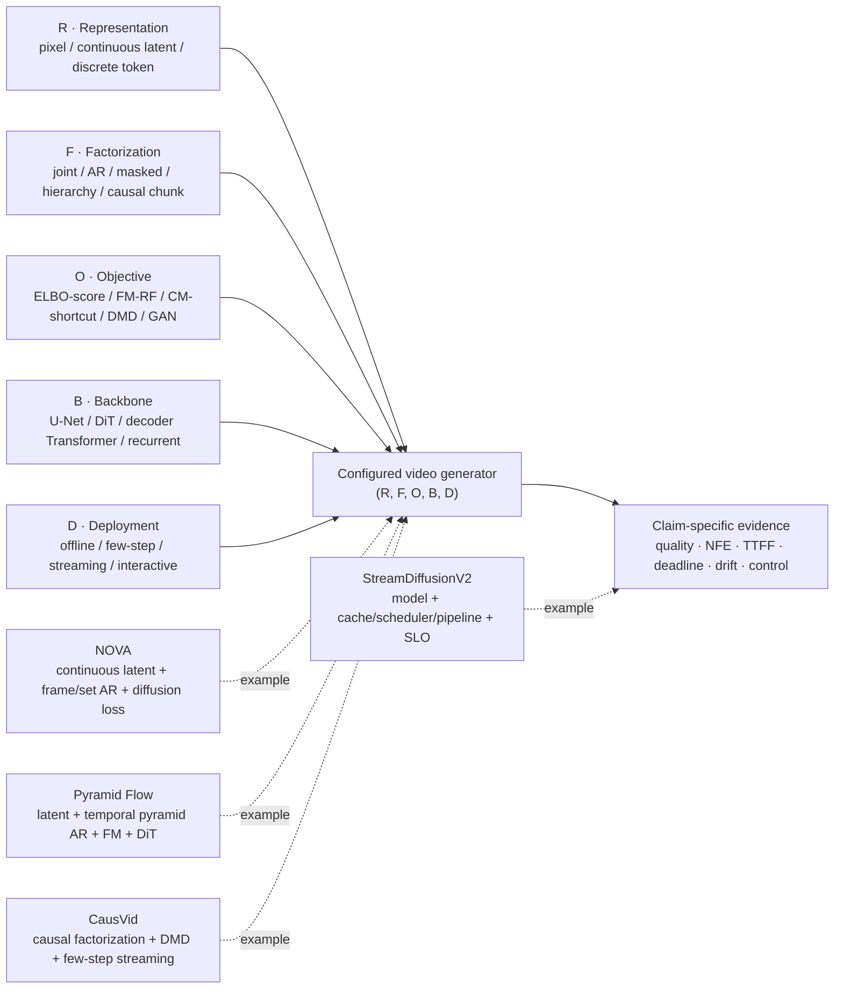

# 生成模型路线审计与 2024–2026 一手研究轨迹

> 截止日期：2026-08-29（Asia/Shanghai）
> 性质：只读审计与重写依据；本文不修改教材正文，也不构成模型排行榜
> 审计对象：`docs/generative-models.md`、`docs/generative-models/diffusion-models.md`、`docs/generative-models/flow-consistency-models.md`

## 结论先行

现有三页已经覆盖 VAE、GAN、diffusion、flow、consistency、autoregressive、masked 与 causal/streaming 等关键词，但总览表把五个彼此正交的设计轴混在一个“生成机制”列中。结果是读者容易把“latent”“DiT”“autoregressive”“flow matching”“few-step”“streaming”误当成互斥模型家族。

建议重写时以如下五元组作为每个系统的最小描述：

$$
\text{system}=\text{representation}\times\text{factorization}\times
\text{objective}\times\text{backbone}\times\text{deployment}.
$$

截至 2026 年，最重要的变化不是某一种家族完全替代另一种，而是组合边界变清楚了：连续 latent 可以做 autoregressive，autoregressive 条件分布可以用 diffusion loss，flow matching 可以配 temporal-pyramid autoregression，DMD/consistency 可以把双向教师蒸馏成少步 causal student，streaming 系统还必须在模型之外满足首帧与逐帧 SLO。

## 1. 审计范围、快照与方法

### 1.1 文件快照

本次审计基于以下只读快照。哈希用于将行号问题绑定到可复核版本；若正文之后改写，应重新计算行号与哈希。

| 文件 | 行数 | SHA-256 |
|---|---:|---|
| `docs/generative-models.md` | 168 | `cd00760926b1a4cca793d2daa3420b619e4075f1114814e5f08fddf5c9a316fd` |
| `docs/generative-models/diffusion-models.md` | 94 | `0b2f05f7d64f19620b754a17e1468501ef27587d105f414d2dfc0d852fb7d925` |
| `docs/generative-models/flow-consistency-models.md` | 83 | `002a08d5eacdd11e4705d4cd0f0ea34699e10bd9c747c87b966983bebd5795b8` |

### 1.2 检索问题

检索围绕五组可证伪问题展开：

1. DDPM、score model、连续 SDE、reverse-time SDE 与 probability-flow ODE 的等价范围和非等价范围是什么？
2. Flow Matching 与 Rectified Flow 是什么关系；直线条件插值是否等于学习到的全局直线轨迹；是否天然少步？
3. Consistency、Shortcut、MeanFlow/rCM 与 DMD/DMD2 分别在匹配轨迹、速度还是分布；能否从头训练；是否依赖教师？
4. Autoregressive 与 masked generation 是 factorization 还是 objective；连续 latent、离散 token 与 diffusion/flow head 能否交叉组合？
5. Causal、few-step、streaming、interactive、real-time 与 SLO 分别需要什么证据？

检索优先级为官方会议论文页或出版社页面，其次为作者提交的论文/正式技术报告，再其次为官方项目与代码文档。搜索词组合包括论文全名，以及 `DDPM score SDE probability flow ODE`、`flow matching rectified flow reflow`、`consistency DMD shortcut MeanFlow`、`autoregressive masked continuous token video`、`causal streaming video diffusion latency SLO`。

### 1.3 纳入、排除与证据等级

纳入：提出方法的原始论文、正式会议论文页、作者/机构技术报告、与论文配套的官方实现文档。2024–2026 里程碑优先收录正式 venue；没有正式 venue 但影响章节术语的系统，仅以技术报告身份纳入。

排除：综述、博客转述、聚合排行榜、二手数据库、无论文支撑的产品宣传、只给演示不披露任务设置的性能比较。图像论文只有在定义通用 objective 或澄清组合边界时纳入，不能直接作为视频质量证据。

| 等级 | 证据 | 可支撑范围 |
|---|---|---|
| A | 官方同行评审 proceedings、出版社论文页 | 方法定义、正式 venue、论文在其设置内报告的结果 |
| B | 作者论文、arXiv、机构正式技术报告 | 原作者披露的机制与结果；不得写成已同行评审共识 |
| C | 官方项目页、代码或模型文档 | 实现、配置、版本与复现入口；不能单独支撑通用科学结论 |
| S | 本文综合判断 | 章节结构、术语规范、重写建议；必须与 A/B 事实分开 |

## 2. 当前三页的具体缺陷

### 2.1 高风险：会改变读者对模型家族的理解

| 位置 | 问题 | 为什么重要 | 建议修正 |
|---|---|---|---|
| `generative-models.md:9–22` | “生成机制”表并列 recurrent、VAE、GAN、AR、masked、diffusion、flow/consistency、causal/streaming | 这些分别属于 factorization、representation/model class、objective 与 deployment；并非互斥 | 改成五轴表；每个代表系统填一个五元组 |
| `generative-models.md:84–90` | DDPM 反向过程写成确定性的 $x_{t-1}=g_\theta(x_t,t,c)$ | 原始 DDPM 的反向转移是高斯条件分布并包含随机采样；确定性形式需明确是 DDIM/PF-ODE 等采样器 | 写成 $p_\theta(x_{\tau-1}\mid x_\tau,c)=\mathcal N(\mu_\theta,\Sigma_\theta)$，另列确定性 sampler |
| `generative-models.md:39–47,84–90` | 同一符号 $t$ 先表示视频帧时间，后表示噪声时间 | “autoregressive over frames”与“reverse diffusion over noise levels”是两个不同序列；混用会直接诱发“反向扩散就是视频 AR”的误解 | 视频时间用 $k$，噪声/运输时间用 $\tau$ 或 $s$ |
| `flow-consistency-models.md:3` | 把 Flow Matching、Rectified Flow、Consistency Models 统一描述为减少网络调用 | FM 首先是训练连续速度场的方法；NFE 取决于路径、学习误差和求解器。CM/Shortcut/DMD 才显式以一步/少步为主要目标 | 开头先按“连续运输目标”和“轨迹/分布压缩目标”分组 |
| `flow-consistency-models.md:13` | 以“ODE 对比 diffusion 随机反向链”区分 flow 与 diffusion | Score-based diffusion 同时存在 stochastic reverse SDE 与 deterministic PF-ODE；ODE 不是 flow matching 的专属特征 | 增加 DDPM → score/SDE → PF-ODE 桥梁，再比较训练目标 |
| `flow-consistency-models.md:67–71` | 选择建议只有 diffusion / flow / consistency，随后直接跳到 causal streaming | 缺 DMD/DMD2、Shortcut、sCM/rCM，也没有把 objective distillation 与 temporal factorization 拆开 | 新增“教师轨迹、分布匹配、自蒸馏、从头 few-step”决策表 |

### 2.2 中风险：陈述基本正确，但证据链或边界不完整

| 位置 | 问题 | 证据边界或缺口 | 建议修正 |
|---|---|---|---|
| `generative-models.md:49–64` | VAE 小节把 MoCoGAN 放在主要代表工作中 | MoCoGAN 是 adversarial generator；内容/运动 latent 解耦可以跨章引用，但不能充当 VAE objective 代表 | 用 stochastic video VAE/SV2P 代表 VAE，把 MoCoGAN 移到“跨轴设计”旁注 |
| `generative-models.md:98–110` | Diffusion 到 flow/consistency 之间缺 score/SDE/PF-ODE | 读者看不到同一 score 如何驱动随机 SDE 与确定性 ODE，也无法理解 FM 与 diffusion path 的重叠 | 在两节之间插入统一数学桥 |
| `generative-models.md:100–118` | 2024 之后只突出 Lumiere/Sora，并将 flow/consistency 压缩成加速段 | 2024–2026 的核心进展还包括连续 token AR、temporal-pyramid FM、DMD causal distillation、self-forcing 与 SLO-aware streaming | 用里程碑矩阵替代单线时间轴 |
| `diffusion-models.md:20–26` | 正确指出训练参数化与 sampler 不同，但未给 score、$\epsilon/x_0/v$ 的关系 | “预测什么”仍可能被读成不同模型家族 | 明确它们是给定 schedule 下可相互换算的参数化；引用 Score-SDE/EDM |
| `diffusion-models.md:26` | 正文点名 DDIM、DPM-Solver，但参考文献没有对应条目 | 相邻主张缺直接来源 | 补 DDIM（ICLR 2021）与 DPM-Solver（NeurIPS 2022） |
| `diffusion-models.md:52–54` | CFG 写成 $(1+w)\epsilon_c-w\epsilon_u$，但不定义 $w$ | 该式与常见 $\epsilon_u+s(\epsilon_c-\epsilon_u)$ 等价于 $s=1+w$；未说明会造成 scale 对不上 | 明确本页采用哪一种 scale 约定 |
| `diffusion-models.md:64–68` | 蒸馏只列技术类别，没有区分 solver、trajectory consistency、distribution matching | 这些方法训练成本、教师依赖、模式覆盖与推理步数不同 | 分成 training-free solver、trajectory/consistency、DMD/GAN hybrid 三组 |
| `flow-consistency-models.md:27–33` | 直线条件插值与“轨迹越直”相邻，容易被读成模型轨迹天然直 | RF 的训练样本路径是直线；回归后的 marginal velocity 与其 ODE 轨迹未必逐样本等于该线段；reflow 才改变 coupling 并进一步拉直 | 明确“conditional path、marginal field、learned ODE trajectory”三层 |
| `flow-consistency-models.md:35–47` | CM 定义准确，但缺 DMD，导致所有少步方法都像轨迹一致性 | DMD 匹配 student 与 target 的分布，梯度使用两个 score 的差；不要求 student 与 teacher 样本逐轨迹一一对应 | 单列 DMD/DMD2，不归入 CM 同义词 |

### 2.3 术语与可读性问题

- `generative-models.md` 标题只列 VAE、GAN、Diffusion、Flow，但正文总览还承担 recurrent、AR、masked、consistency 与 streaming；标题和页面职责不一致。
- `generative-models.md:37` 已经意识到“按什么顺序”“在什么空间”“如何拟合分布”不同，这是正确重构的种子；应将这句话上升为全章主骨架，而不是表后的补充说明。
- `generative-models.md:139–140` 有序列表之后没有空行，Markdown 可读性与 lint 兼容性较差。
- `flow-consistency-models.md:45–47` 关于“看到 velocity prediction 不能单独判定 RF”是重要且正确的边界，应保留并扩展为参数化、objective、sampler 三分法。
- “masked autoregressive”存在真实命名冲突。MaskGIT 采用“非逐 token 的 masked iterative decoding”；MAR 论文把它重写为广义的 next-set-of-tokens autoregression。教材应声明自己的窄义用法，不能暗示社区只有一个定义。
- “causal”在视频生成论文中通常只表示时间箭头与不可看未来，不等于结构因果模型、干预正确性或物理因果推理。

## 3. 建议采用的五轴正交 taxonomy

### 3.1 五个轴分别回答什么

| 轴 | 核心问题 | 常见取值 | 不能从该轴推出什么 |
|---|---|---|---|
| Representation | 模型在哪种变量空间工作？ | RGB pixels；连续 VAE/AE latent；离散 VQ token；多尺度/混合表示 | 不能推出 factorization、objective 或是否 causal |
| Factorization | 联合分布按什么条件顺序分解或补全？ | 全序列 joint/bidirectional；逐帧/逐 token AR；recurrent；masked/block iterative；hierarchical/next-scale；causal chunk/rolling | 不能推出使用 CE、diffusion 还是 flow loss，也不能推出实时 |
| Objective | 参数通过什么统计目标学习？ | MLE/ELBO；adversarial；denoising/score；FM/RF；consistency/shortcut；DMD；preference/RL | 不能推出 U-Net/DiT，也不能推出 data-time 顺序 |
| Backbone | 用什么网络实现条件映射或场？ | 2D/3D U-Net；2D backbone + temporal blocks；DiT/spacetime Transformer；decoder-only Transformer；recurrent/SSM；cascade/MoE | 不能单独推出 objective；“Transformer diffusion”不是新概率家族 |
| Deployment | 输出何时可见，系统在什么约束下运行？ | offline multistep；few-step offline；progressive preview；causal streaming；interactive；quantized/cached/pipelined serving | 不能只凭 causal mask、低 NFE 或高平均 FPS推出 SLO 达标 |

### 3.2 表示空间的判定规则

1. **Pixel**：生成变量直接是像素；可以搭配 diffusion、flow、GAN 或 AR。
2. **连续 latent**：编码器输出连续张量，生成 objective 可是 diffusion、flow、DMD 或 per-token diffusion loss。
3. **离散 token**：量化到有限 codebook，常用 categorical likelihood/CE，但也可使用 discrete diffusion 或 masked objective。
4. **Spacetime patch**：通常是把像素或 latent 张量切成 Transformer 输入单元，属于 tokenization/patchification；除非再做 VQ，否则不等于“离散视觉 token”。
5. **Causal VAE**：只说明 codec 的时间卷积/注意力不看未来，便于在线编码解码；它不证明上层生成器是 causal，也不证明端到端 streaming。

### 3.3 Factorization 的窄义教材约定

为避免命名冲突，建议教材采用以下局部定义，并在第一次出现时显式声明：

- **Strict autoregressive**：存在固定或动态全序，每次条件在已生成前缀上，典型形式为

  $$
  p(x_{1:K}\mid c)=\prod_{k=1}^{K}p(x_k\mid x_{<k},c).
  $$

- **Masked/block iterative**：每轮并行预测一组未知变量，之后按置信度或预设 schedule 重新 mask/commit。给定具体顺序时可写成 block factorization

  $$
  p(X_{1:J}\mid c)=\prod_{j=1}^{J}p(X_j\mid X_{<j},c),
  $$

  但 $X_j$ 内部通常并行，attention 也可为双向；因此应与逐 token causal AR 分栏。
- **Temporal causal chunking**：视频帧或 chunk 只能看过去，chunk 内部可以双向联合生成。它是 data-time factorization，不是 noise-time sampler。
- **Hierarchical/next-scale**：先生成低分辨率、关键帧或粗尺度，再条件生成细尺度；“先后”发生在尺度或层级，不一定发生在视频时间。

### 3.4 Objective 的判定规则

- 论文写“predicts velocity”不足以判定 RF，因为 diffusion 的 $v$-parameterization、FM vector field 与 RF velocity 都会使用速度语言。
- 论文写“ODE sampler”不足以判定 FM，因为 score-based diffusion 的 PF-ODE 与 DPM-Solver 同样是 ODE。
- 论文写“one-step diffusion”不足以判定 CM，因为 DMD、adversarial distillation、shortcut/flow-map 类目标也可一步。
- 论文写“autoregressive diffusion”时必须补全：是 data-time AR 加每条件项 diffusion head，还是仅指 reverse diffusion 在 noise time 上的 Markov chain。

## 4. Diffusion、score、SDE 与 PF-ODE 的严格边界

本节统一用 $k$ 表示视频时间，用 $\tau$ 表示 diffusion/noise time。不同论文的 $0/T$ 方向可能相反，引用公式时必须同步说明端点约定。

### 4.1 离散 DDPM：反向过程默认是随机的

前向链可写为

$$
q(x_\tau\mid x_{\tau-1})=
\mathcal N(\sqrt{1-\beta_\tau}x_{\tau-1},\beta_\tau I).
$$

原始 DDPM 学习的反向转移是

$$
p_\theta(x_{\tau-1}\mid x_\tau,c)=
\mathcal N\!\left(\mu_\theta(x_\tau,\tau,c),
\Sigma_\theta(x_\tau,\tau,c)\right),
$$

所以一次反向更新通常包含随机项。DDPM 将变分界与 denoising score matching 联系起来；简化的噪声预测 MSE 是一种训练参数化，不是反向采样器的完整定义。[DDPM，NeurIPS 2020](https://proceedings.neurips.cc/paper/2020/hash/4c5bcfec8584af0d967f1ab10179ca4b-Abstract.html)

### 4.2 Score 与 $\epsilon/x_0/v$：同一场的不同坐标表达

若常见高斯扰动写成

$$
x_\tau=\alpha_\tau x_0+\sigma_\tau\epsilon,
\qquad \epsilon\sim\mathcal N(0,I),
$$

则条件扰动核的 score 为 $-\epsilon/\sigma_\tau$；在最优 denoising score matching 条件下，噪声预测网络给出边缘 score 的估计

$$
s_\theta(x_\tau,\tau)\approx
-\frac{\epsilon_\theta(x_\tau,\tau)}{\sigma_\tau}.
$$

$x_0$ prediction、$\epsilon$ prediction、score prediction 与常见 $v$ prediction 可在已定义的 schedule 下线性换算。它们会改变数值条件、loss weighting 和实现接口，但不应在 taxonomy 中被列为四种独立生成家族。[Score-SDE，ICLR 2021 Oral](https://arxiv.org/abs/2011.13456) 与 [EDM，NeurIPS 2022](https://proceedings.neurips.cc/paper_files/paper/2022/hash/a98846e9d9cc01cfb87eb694d946ce6b-Abstract-Conference.html) 支撑这种模块化区分。

### 4.3 连续 SDE：同一 score 驱动随机与确定性生成

从数据到噪声的前向 Itô SDE 为

$$
\mathrm dx=f(x,\tau)\,\mathrm d\tau+g(\tau)\,\mathrm dW.
$$

沿 $T\rightarrow0$ 反向积分时，reverse-time SDE 为

$$
\mathrm dx=\left[f(x,\tau)-g(\tau)^2
\nabla_x\log p_\tau(x)\right]\mathrm d\tau
+g(\tau)\,\mathrm d\bar W,
$$

其中仍有随机 Wiener 项。与它共享每个时刻边缘分布的 probability-flow ODE 为

$$
\mathrm dx=\left[f(x,\tau)-\frac{1}{2}g(\tau)^2
\nabla_x\log p_\tau(x)\right]\mathrm d\tau.
$$

因此：

- “diffusion 是随机、flow 是确定性”不成立；score diffusion 自身就有 stochastic SDE 与 deterministic PF-ODE 两条采样路径。
- PF-ODE 与 reverse SDE 在精确 score 和精确积分下共享边缘分布，不代表逐样本路径相同。
- DDIM 可在同一训练 objective 下采用非马尔可夫、可确定的生成过程；DPM-Solver 是面向 diffusion ODE 的训练后数值求解器。两者首先属于 sampler 层，而不是新 objective。[DDIM，ICLR 2021](https://openreview.net/forum?id=St1giarCHLP)；[DPM-Solver，NeurIPS 2022](https://proceedings.neurips.cc/paper_files/paper/2022/hash/260a14acce2a89dad36adc8eefe7c59e-Abstract-Conference.html)

## 5. Flow Matching、Rectified Flow、Consistency 与 DMD

### 5.1 Flow Matching：回归选定概率路径的速度场

Flow Matching 在 Continuous Normalizing Flow 上定义无需训练时模拟轨迹的回归目标。令噪声到数据方向为 $s:0\rightarrow1$，

$$
\frac{\mathrm dx_s}{\mathrm ds}=v_\theta(x_s,s),
\qquad
\mathcal L_{\mathrm{FM}}=
\mathbb E\left\|v_\theta(x_s,s)-u_s(x_s\mid z)\right\|_2^2.
$$

条件路径可选 diffusion path、OT displacement path 或其他路径。训练“simulation-free”只表示 loss 估计不需要先完整求解 ODE；推理仍需数值积分。FM 不自动保证少 NFE，也不自动保证 learned field 的轨迹很直。[Flow Matching，ICLR 2023](https://openreview.net/forum?id=PqvMRDCJT9t)

### 5.2 Rectified Flow：FM 相关但更具体的直线耦合/再耦合方案

经典 RF 用配对 $(x_0,x_1)$ 构造直线条件插值

$$
x_s=(1-s)x_0+s x_1,
\qquad \dot x_s=x_1-x_0.
$$

要区分三件事：训练样本的 conditional interpolation 是直线；最优回归得到的是给定 $x_s$ 后条件速度的平均；由近似网络积分出的 marginal ODE trajectory 未必逐样本沿原线段。Reflow 使用当前模型生成的新 coupling 再训练，以降低运输成本并进一步拉直。因而“linear interpolation”“rectified flow”“one-step”不是同义词。[Rectified Flow，ICLR 2023](https://openreview.net/forum?id=XVjTT1nw5z)

### 5.3 Consistency：同一 PF-ODE 轨迹上的端点一致

Consistency Model 学习把同一 PF-ODE 轨迹上的不同点映射到共同端点：

$$
f_\theta(x_\tau,\tau)\approx f_\theta(x_\sigma,\sigma)
\quad\text{if }x_\tau,x_\sigma\text{ are on the same trajectory}.
$$

原始 CM 支持从预训练 diffusion 蒸馏，也支持 standalone consistency training；设计目标是一步生成，同时保留多步 refinement 的质量—计算折中。Consistency 不等于严格单步，也不等于 distribution matching。[Consistency Models，ICML 2023](https://proceedings.mlr.press/v202/song23a.html)

2025 的 sCM 重点是连续时间 CM 的稳定化与规模扩展；Shortcut Models 则让网络额外条件于 desired step size，以单网络、单训练阶段支持可变步数。它们都属于 few-step objective 设计，但训练信号不应混写成同一个 loss。[sCM，ICLR 2025](https://proceedings.iclr.cc/paper_files/paper/2025/hash/7e9c2053258b1bdd32ff2654802cd594-Abstract-Conference.html)；[Shortcut Models，ICLR 2025](https://proceedings.iclr.cc/paper_files/paper/2025/hash/559a0998fab1d19b80e7e43a5852401c-Abstract-Conference.html)

### 5.4 DMD：匹配分布，不要求逐轨迹一一对应

DMD 将多步 diffusion 教师压缩为一步 student，通过近似 KL 的梯度匹配 student distribution 与 target distribution；梯度可写成 target score 与 fake/student score 的差。原始 DMD 还加入教师噪声—图像对上的 regression loss以稳定训练。[DMD，CVPR 2024](https://openaccess.thecvf.com/content/CVPR2024/html/Yin_One-step_Diffusion_with_Distribution_Matching_Distillation_CVPR_2024_paper.html)

DMD2 明确强调 distribution-level matching 不强制 student 与 teacher sampling trajectory 一一对应，并移除原始 regression dataset，加入 two-time-scale fake critic 更新、GAN loss 与面向 multi-step/on-policy 输入的训练。[DMD2，NeurIPS 2024](https://proceedings.neurips.cc/paper_files/paper/2024/hash/54dcf25318f9de5a7a01f0a4125c541e-Abstract-Conference.html)

这意味着教材应把下列三类目标分开：

| 类别 | 主要对齐对象 | 教师依赖 | 常见风险 |
|---|---|---|---|
| Consistency / flow-map / shortcut | 同一生成轨迹的跨时间映射或有限步流映射 | 可蒸馏，也可从头训练，取决于方法 | JVP/目标稳定性、局部误差累积 |
| DMD / DMD2 | student 与 target 的分布或 score 差 | 通常需要 diffusion teacher/target score | fake score 估计、mode seeking/coverage、GAN 稳定性 |
| Solver / schedule | 已训练 score/velocity field 的数值积分 | 不重新训练或只做轻量校准 | 小 NFE 离散误差、guidance 下误差放大 |

## 6. AR、masked 与 streaming 的边界

### 6.1 AR 是 data factorization，不是离散 token 或 CE 的同义词

2024 的 MAR 直接展示：连续 latent token 可以按 AR 或 masked-AR factorization 建模，每个 token 的条件分布由 diffusion loss 表示，而不是 categorical cross-entropy。[MAR，NeurIPS 2024](https://proceedings.neurips.cc/paper_files/paper/2024/hash/66e226469f20625aaebddbe47f0ca997-Abstract-Conference.html)

2025 的 NOVA 将该组合扩展到视频：连续 Video-VAE latent；时间上 frame-by-frame causal factorization；帧内 set-by-set masked/bidirectional factorization；每个连续 token 的条件分布用 diffusion denoising MLP 学习。[NOVA，ICLR 2025](https://proceedings.iclr.cc/paper_files/paper/2025/hash/6e5112eaa45f8c30b242c5f576213a92-Abstract-Conference.html)

因此以下写法都合法且含义不同：

- discrete-token AR + categorical CE；
- discrete-token masked iterative + categorical CE/discrete diffusion；
- continuous-latent AR + diffusion/flow conditional head；
- continuous full-sequence joint diffusion/flow；
- temporal AR outside + bidirectional denoising inside each frame/chunk。

### 6.2 Masked generation 与 AR 的命名冲突应显式处理

MaskGIT 把 masked iterative decoding作为顺序 raster AR 的替代：训练随机 mask，推理从全 mask 开始并行预测再多轮 refinement。[MaskGIT，CVPR 2022](https://openaccess.thecvf.com/content/CVPR2022/html/Chang_MaskGIT_Masked_Generative_Image_Transformer_CVPR_2022_paper.html)

MAR 则从概率分解角度把每轮预测一组 token 写成 generalized “next set-of-tokens prediction”。两种叫法都来自一手论文。建议教材：

1. 用“strict causal AR”表示逐 token/逐帧前缀分解；
2. 用“masked/block iterative（部分论文称 generalized masked AR）”表示 set-wise 更新；
3. 每次都报告 order、每轮 commit 数、attention 方向与是否可用 KV cache。

### 6.3 Causal、streaming、real-time、interactive 是四层声明

| 声明 | 最低必要证据 | 不足以证明它的条件 |
|---|---|---|
| Causal factorization | 当前帧/chunk 不读取未来输出；训练和推理依赖关系明确 | 只使用 causal VAE；只把 attention mask 改成下三角 |
| Streaming | 完整序列结束前持续提交不可回看或有界回看的输出；状态增量更新 | 只生成很长视频；只把多个离线短片拼接 |
| Real-time | 指定硬件、分辨率、FPS、denoising steps、batch、精度下满足 frame deadline | 只报告平均 FPS；离线吞吐高于播放帧率 |
| Interactive | 新 prompt/action 的注入时刻与生效帧可测，报告响应延迟 | 只支持预先给定的时间变化 prompt |

Few-step 只降低每帧/chunk 的 NFE，causal factorization 只限制信息方向，两者都不单独构成 streaming。Streaming 还需要增量状态、KV/cache 生命周期、调度、TTFF、逐帧 deadline 与 jitter。

## 7. 2024–2026 事实与里程碑矩阵

以下表不做全局性能排序，只记录对 taxonomy 或章节边界有直接价值的里程碑。“部署”列是论文明确展示的形态，不等于所有实现都达到同一 SLO。

| 年份 | 工作与正式状态 | 五轴定位 | 经核验事实 | 证据边界 |
|---:|---|---|---|---|
| 2024 | MAGVIT-v2，ICLR 2024 | 离散视频 token × masked LM × categorical token modeling × Transformer × offline iterative | 论文把 tokenizer 质量作为语言式视觉生成的关键变量，并在受控数据/规模/预算比较中覆盖图像与 Kinetics 视频 | 不能概括成“所有 LM 都优于 diffusion” |
| 2024 | VideoPoet，ICML 2024 | 离散多模态 token × causal AR × 混合生成目标 × decoder-only Transformer × offline | 单一 decoder-only Transformer 处理文本、图像、视频、音频输入并做多任务生成 | 多模态/变长能力不等于低延迟 streaming |
| 2024 | Lumiere，SIGGRAPH Asia 2024 | 视频 diffusion × 全时段联合生成 × Space-Time U-Net × offline | Space-Time U-Net 一次覆盖完整短视频时间范围，避免先关键帧后插帧的分段设计 | 是特定模型的设计，不证明 joint generation 普遍优于 causal |
| 2024 | Sora，OpenAI 技术报告 | 压缩连续 latent + spacetime patches × diffusion × Transformer × offline | 官方报告明确先压缩视频，再 patchify latent，并在 Transformer 上训练 text-conditional diffusion | 报告不披露模型/实现细节且非同行评审；不能推断 attention 方向或复现成本 |
| 2024 | DMD，CVPR 2024 | image-side distribution matching distillation × one-step student | 以 target/fake score 差近似分布匹配梯度，并用 regression loss 稳定一步 student | 是图像证据；视频扩展需由 CausVid 等另证 |
| 2024 | Diffusion Forcing，NeurIPS 2024 | 连续序列 × causal next-token/chunk × 独立 per-token noise diffusion × causal model × rollout | 每个 token 可有独立噪声级，连接 next-token prediction 与 full-sequence diffusion；论文展示超训练 horizon rollout | 变长 rollout 不自动等于 production streaming 或无漂移 |
| 2024 | MAR，NeurIPS 2024 | 连续 latent × strict/masked AR × per-token diffusion loss × Transformer + denoising MLP × offline | 直接证明 AR factorization 不要求 VQ token，也不要求 categorical CE | 核心实验是图像；视频结论由后续 NOVA 等另证 |
| 2024 | DMD2，NeurIPS 2024 | distribution-level distillation × one/multi-step × GAN hybrid | 去掉原始 regression dataset，使用 two-time-scale critic、GAN loss 与 on-policy/multi-step训练 | 仍是图像侧；不能把其 FID/速度直接迁移到视频 |
| 2025 | Pyramidal Flow Matching，ICLR 2025 | 连续 latent × spatial/temporal pyramid + temporal AR × FM × 单一 DiT × offline | 将 denoising/transport 过程组织成 pyramid stages，并以 temporal pyramid 压缩历史；单一 DiT 端到端训练 | “autoregressive”不等于已满足逐帧 SLO；分辨率/时长数字是论文设置 |
| 2025 | NOVA，ICLR 2025 | 连续 Video-VAE latent × 帧间 causal AR + 帧内 set-AR × per-token diffusion loss × Transformer/MLP × KV-cache decoding | 这是五轴交叉最清楚的反例：AR、masked、continuous latent、diffusion objective 同时存在 | 论文中的效率/质量比较限其数据与基线，不是通用家族排序 |
| 2025 | MAGI，CVPR 2025 | 帧内 masked × 帧间 causal × hybrid video generator | Complete Teacher Forcing 用完整观察帧条件 masked target frames，论文报告从 16 帧训练外推到超过 100 帧 | 长度外推仍需检查 exposure bias、漂移和任务分布 |
| 2025 | CausVid，CVPR 2025 | latent video × causal AR × video DMD × causal DiT × few-step streaming | 将 50-step 双向 diffusion teacher 蒸馏成 4-step causal student，并报告 KV-cache streaming | 9.4 FPS/1.3 s 初始延迟是论文特定硬件与配置结果，不是架构保证 |
| 2025 | Shortcut Models，ICLR 2025 | flow/diffusion shortcut objective × variable NFE × DiT × offline few-step | 网络条件于 desired step size，单网络/单训练阶段覆盖多种 inference budget | 论文主要是图像；不是视频 streaming 证据 |
| 2025 | sCM，ICLR 2025 | continuous-time consistency × few-step × large DiT | 简化和稳定连续时间 CM，并扩展至 1.5B 参数、两步图像生成 | 图像 FID 不外推到视频细节与运动 |
| 2025 | Self Forcing，NeurIPS 2025 | latent video × causal AR × few-step diffusion + self-rollout training × rolling KV × streaming | 训练时条件于模型自生成历史，直接处理 teacher-forcing exposure gap | “real-time”仍依赖论文配置；不能替代长期状态/闭环评测 |
| 2026 | rCM，ICLR 2026 | large video diffusion teacher × score-regularized continuous-time consistency × DiT × 1–4 step | 在 Cosmos-Predict2/Wan2.1、最高 14B 和 5 秒视频上扩展 JVP-based consistency；论文报告 1–4 步及 15–50× 加速 | 是作者设置内结果；“缓解 mode collapse”不等于消除所有覆盖损失 |
| 2026 | FACM / AlphaFlow，ICLR 2026 | FM anchor + consistency/MeanFlow family × few-step | FACM 用 FM task 锚定 shortcut objective；AlphaFlow 分析 MeanFlow 的 trajectory FM 与 consistency 冲突并给统一目标 | 主要是图像/方法论证据；可用于术语图，不可当视频质量里程碑 |
| 2026 | Separable Causal Diffusion，CVPR 2026 | causal temporal encoder × frame-wise diffusion decoder × multistep rendering × low-latency causal generation | 论文通过 probing 后把 once-per-frame temporal reasoning 与 iterative denoising 分开，直接证明 causal computation 与 denoising 可解耦 | 论文中的“causality”明确是 temporal arrow-of-time，不是结构因果/干预语义 |
| 2026 | StreamDiffusionV2，MLSys 2026 | 继承视频 diffusion × rolling KV/cache + pipeline × live SLO deployment | 正式把 TTFF、per-frame deadline、jitter、SLO-aware batching 与多 GPU pipeline 纳入视频生成系统；4×H100 上报告 <0.5 s 首帧和多种 FPS 模式 | 系统数字依赖 4×H100、模型规模、分辨率、NFE 与精度；平均 FPS 不能脱离 SLO 解读 |

### 7.1 三年路线的可证据化概括

- **2024：表示与 factorization 解耦。** MAGVIT-v2 强化离散 token 路线；MAR 证明连续 token 也能做 AR/masked AR；Sora 将连续 latent、spacetime patch、Transformer 与 diffusion组合。
- **2025：objective 与 data-time factorization 交叉。** Pyramidal Flow 将 FM、DiT 与 temporal pyramid AR 组合；NOVA 把 continuous latent、frame AR、set AR 与 per-token diffusion loss组合；CausVid/Self Forcing把少步蒸馏与 causal rollout结合。
- **2026：从“组合”走向“可分离与可部署”。** rCM/FACM/AlphaFlow重新组织 few-step objective；SCD把 temporal reasoning 与 denoising计算拆开；StreamDiffusionV2把质量—NFE问题升级为 TTFF/deadline/jitter/pipeline 问题。

## 8. 可直接用于重写的事实表

| 主题 | 可安全写入教材的句子 | 不应写成 |
|---|---|---|
| DDPM reverse | 原始 DDPM 的反向生成是学习高斯条件转移并逐步采样；确定性生成需注明 DDIM/PF-ODE 或其他 sampler | “所有 diffusion 每步都是确定函数” |
| Score | 在常见高斯扰动下，$\epsilon$ prediction 可按 schedule 换算为 noisy marginal score 的估计 | “$\epsilon$ model 与 score model 是互斥家族” |
| SDE/PF-ODE | 同一 score 可定义随机 reverse SDE 与共享边缘分布的确定性 PF-ODE | “ODE 就是 flow matching，SDE 才是 diffusion” |
| Sampler | DDIM、DPM-Solver 首先改变已训练场的积分/采样方式，不等于更换训练 objective | “换 sampler 就重新训练了一个新 diffusion 家族” |
| FM | FM 回归选定条件概率路径的速度场，训练可 simulation-free；采样通常仍需 ODE 积分 | “FM 天生一步” |
| RF | RF 常以直线条件插值与 rectification/reflow构造更易积分的运输；learned ODE 轨迹并非自动逐样本严格直线 | “看到 velocity prediction 就是 RF” |
| CM | CM 约束同一 PF-ODE 轨迹上不同时间点映射到一致端点，可蒸馏也可 standalone training | “consistency 必然是单步教师蒸馏” |
| DMD | DMD 在分布层面对齐 student 与 teacher/target，不要求逐样本轨迹一一对应 | “DMD 是 consistency loss 的别名” |
| AR | AR 描述数据变量的条件分解；变量可为 pixels、离散 token 或连续 latent，条件分布也可由 diffusion/flow head 表示 | “AR 必须离散 VQ + CE” |
| Masked | Masked iterative 每轮可并行预测一组未知 token；部分论文称其 generalized masked AR，教材需声明术语约定 | “masked 与所有 AR 在任何定义下完全互斥” |
| Causal | 视频 causal 通常表示帧/chunk 不看未来，是时间信息约束 | “causal attention 证明模型理解物理因果” |
| Few-step | 低 NFE 主要解决每次输出的迭代成本，不自动解决长时漂移、状态记忆或首帧延迟 | “四步模型天然支持实时长视频” |
| Streaming | Streaming 需要完整序列结束前持续输出和增量状态；real-time 还必须报告 TTFF、deadline、jitter 与硬件配置 | “平均 FPS 高于播放帧率就已满足实时 SLO” |
| DiT | DiT 是 backbone，可承载 denoising、score、FM、RF、consistency 等不同 objective | “DiT 是与 diffusion/flow 并列的概率模型” |
| Spacetime patch | Patchification 是把像素/latent组织成 Transformer 输入；是否离散取决于前置 tokenizer 是否量化 | “spacetime patch 就是 VQ token” |

## 9. 建议的章节决策树与页面分工

### 9.1 判定一个模型应该放在哪一节

1. **先问生成变量是什么。** Pixel、连续 latent 还是离散 token？把 codec 与 generator 分开写。
2. **再问数据时间怎样分解。** 全片 joint、strict AR、masked/block、hierarchical，还是 causal chunk？
3. **再问训练 objective。** ELBO/score、FM/RF、CM/shortcut、DMD、GAN，还是组合？
4. **再问 backbone。** U-Net、DiT、decoder-only Transformer、recurrent/SSM 或 cascade？
5. **最后问 deployment claim。** Offline、few-step、streaming、interactive、real-time？对应证据是否报告 NFE、TTFF、deadline、jitter、硬件和精度？

任一步都不得从前一步自动推断。例如“continuous latent + DiT”不能推出 diffusion；“causal DiT + four steps”不能推出实时；“flow matching”不能推出 rectified flow。

### 9.2 三页及相邻专章的职责边界

| 页面 | 应负责 | 应移出或只做链接 |
|---|---|---|
| `generative-models.md` | 五轴 taxonomy；跨轴组合实例；历史与任务导航 | 详细 SDE 推导、solver 公式、单篇系统参数 |
| `diffusion-models.md` | DDPM → score → SDE/PF-ODE；$\epsilon/x_0/v$ 参数化；sampler 与 objective 分离 | 长篇 AR/streaming 系统实现 |
| `flow-consistency-models.md` | FM/RF/CM/Shortcut/DMD 的目标、教师依赖、路径/分布边界；few-step 决策表 | 把 causal/streaming 当作 objective 子类 |
| `autoregressive-generation.md` | strict token/frame/chunk factorization；continuous conditional heads；exposure bias | 把所有 masked iterative 统一叫 strict AR |
| `masked-generation.md` | masked schedule、block conditional、bidirectional attention、commit策略；命名冲突说明 | 暗示 masked 只能用离散 token |
| `causal-streaming-generation.md` | causal rollout、自生成历史、bounded memory、KV/cache、TTFF/deadline/jitter/SLO | 重复定义 diffusion/FM/CM 的全部数学背景 |

## 10. 概念图设计说明

### 10.1 图的叙事目标

图名建议为“视频生成系统不是单标签：五个正交选择汇合为一个可评测系统”。图不能画成 VAE → AR → Diffusion → Streaming 的线性进化，因为五轴可以自由组合。画面应先让五个独立选择汇入 `Configured generator`，再从系统声明反向指向相应证据。

### 10.2 节点与视觉规范

| 节点 ID | 形状 | 色彩建议 | 文本上限 | 进入/离开边 |
|---|---|---|---:|---|
| R | 圆角矩形 | 蓝 `#0072B2` | 2 行 | `R → M` 实线 |
| F | 圆角矩形 | 橙 `#E69F00` | 2 行 | `F → M` 实线 |
| O | 圆角矩形 | 绿 `#009E73` | 2 行 | `O → M` 实线 |
| B | 圆角矩形 | 紫 `#CC79A7` | 2 行 | `B → M` 实线 |
| D | 圆角矩形 | 天蓝 `#56B4E9` | 2 行 | `D → M` 实线 |
| M | 六边形或深灰粗框 | 灰 `#4D4D4D`，白字 | 2 行 | 五条输入；`M → E` |
| E | 文档形 | 黄 `#F0E442`，黑字 | 2 行 | 从 M 输入；强调“主张决定证据” |
| X1–X4 | 白底虚线卡片 | 对应组合轴的双色边框 | 每卡 2 行 | 虚线指向 M 或 E，仅作为实例 |

画布建议 16:9、白底、最小字号 18 px；色彩使用 Okabe–Ito 友好配色，并以形状/实虚线提供冗余编码。图注应写明：“示例只展示组合关系，不代表性能排序；不同论文对 masked AR、causal 与 real-time 的术语可能不同。”替代文本应完整列出五轴、四个例子及“系统主张必须由任务特定证据验证”的结论。

## 11. 一手来源 registry

### 11.1 基础数学与 few-step objective

| ID | 一手来源 | 正式状态 | 本文使用范围 |
|---|---|---|---|
| S01 | [Denoising Diffusion Probabilistic Models](https://proceedings.neurips.cc/paper/2020/hash/4c5bcfec8584af0d967f1ab10179ca4b-Abstract.html) | NeurIPS 2020 | 离散前向/反向链、ELBO 与 denoising score 连接 |
| S02 | [Denoising Diffusion Implicit Models](https://openreview.net/forum?id=St1giarCHLP) | ICLR 2021 | 同一训练 objective 下的非马尔可夫、可确定 sampler |
| S03 | [Score-Based Generative Modeling through Stochastic Differential Equations](https://arxiv.org/abs/2011.13456) | ICLR 2021 Oral；作者稿 | score、reverse SDE、PF-ODE 与共享边缘分布 |
| S04 | [Elucidating the Design Space of Diffusion-Based Generative Models](https://proceedings.neurips.cc/paper_files/paper/2022/hash/a98846e9d9cc01cfb87eb694d946ce6b-Abstract-Conference.html) | NeurIPS 2022 | 参数化、preconditioning、training/sampling 模块化 |
| S05 | [DPM-Solver](https://proceedings.neurips.cc/paper_files/paper/2022/hash/260a14acce2a89dad36adc8eefe7c59e-Abstract-Conference.html) | NeurIPS 2022 | diffusion ODE 的 training-free 专用 solver |
| S06 | [Flow Matching for Generative Modeling](https://openreview.net/forum?id=PqvMRDCJT9t) | ICLR 2023 | conditional probability path 与 simulation-free vector-field regression |
| S07 | [Flow Straight and Fast](https://openreview.net/forum?id=XVjTT1nw5z) | ICLR 2023 | Rectified Flow、直线 coupling、rectification/reflow |
| S08 | [Consistency Models](https://proceedings.mlr.press/v202/song23a.html) | ICML 2023 | 轨迹一致性、distillation/standalone、一/多步 |
| S09 | [One-step Diffusion with Distribution Matching Distillation](https://openaccess.thecvf.com/content/CVPR2024/html/Yin_One-step_Diffusion_with_Distribution_Matching_Distillation_CVPR_2024_paper.html) | CVPR 2024 | DMD 的分布匹配与双 score 梯度 |
| S10 | [Improved Distribution Matching Distillation for Fast Image Synthesis](https://proceedings.neurips.cc/paper_files/paper/2024/hash/54dcf25318f9de5a7a01f0a4125c541e-Abstract-Conference.html) | NeurIPS 2024 | DMD2、two-time-scale critic、GAN 与 multi-step/on-policy |
| S11 | [One Step Diffusion via Shortcut Models](https://proceedings.iclr.cc/paper_files/paper/2025/hash/559a0998fab1d19b80e7e43a5852401c-Abstract-Conference.html) | ICLR 2025 | desired step size 与可变 inference budget |
| S12 | [Simplifying, Stabilizing and Scaling Continuous-time Consistency Models](https://proceedings.iclr.cc/paper_files/paper/2025/hash/7e9c2053258b1bdd32ff2654802cd594-Abstract-Conference.html) | ICLR 2025 | sCM、连续时间 consistency 的稳定和扩展 |
| S13 | [Large Scale Diffusion Distillation via Score-Regularized Continuous-Time Consistency](https://proceedings.iclr.cc/paper_files/paper/2026/hash/0534abc9e6db91683d82186ef0d68202-Abstract-Conference.html) | ICLR 2026 | rCM、application-scale image/video consistency distillation |
| S14 | [FACM: Flow-Anchored Consistency Models](https://proceedings.iclr.cc/paper_files/paper/2026/hash/0d0dac08f4199f0c348dd2feace0305a-Abstract-Conference.html) | ICLR 2026 | FM anchor 与 consistency shortcut 的联合 |
| S15 | [AlphaFlow: Understanding and Improving MeanFlow Models](https://proceedings.iclr.cc/paper_files/paper/2026/hash/e8c20cafe841cba3e31a17488dc9c3f1-Abstract-Conference.html) | ICLR 2026 | MeanFlow 的 trajectory FM/consistency 分解与统一 |

### 11.2 表示、factorization 与视频系统

| ID | 一手来源 | 正式状态 | 本文使用范围 |
|---|---|---|---|
| S16 | [MaskGIT](https://openaccess.thecvf.com/content/CVPR2022/html/Chang_MaskGIT_Masked_Generative_Image_Transformer_CVPR_2022_paper.html) | CVPR 2022 | masked iterative 与 raster AR 的经典边界 |
| S17 | [Language Model Beats Diffusion — Tokenizer is Key](https://proceedings.iclr.cc/paper_files/paper/2024/hash/036912a83bdbb1fd792baf6532f102d8-Abstract-Conference.html) | ICLR 2024 | MAGVIT-v2、离散视频 tokenizer 与受控 masked-LM 比较 |
| S18 | [VideoPoet](https://proceedings.mlr.press/v235/kondratyuk24a.html) | ICML 2024 | decoder-only multimodal AR video generator |
| S19 | [Lumiere](https://doi.org/10.1145/3680528.3687614) | SIGGRAPH Asia 2024 | Space-Time U-Net 与全时段联合生成 |
| S20 | [Video Generation Models as World Simulators](https://openai.com/index/video-generation-models-as-world-simulators/) | OpenAI 技术报告，2024 | Sora 的 compressed latent、spacetime patch、Transformer diffusion；披露边界 |
| S21 | [Autoregressive Image Generation without Vector Quantization](https://proceedings.neurips.cc/paper_files/paper/2024/hash/66e226469f20625aaebddbe47f0ca997-Abstract-Conference.html) | NeurIPS 2024 | 连续 token、AR/masked AR 与 per-token diffusion loss |
| S22 | [Diffusion Forcing](https://proceedings.neurips.cc/paper_files/paper/2024/hash/2aee1c4159e48407d68fe16ae8e6e49e-Abstract-Conference.html) | NeurIPS 2024 | per-token noise、causal sequence factorization 与 rollout |
| S23 | [Pyramidal Flow Matching for Efficient Video Generative Modeling](https://proceedings.iclr.cc/paper_files/paper/2025/hash/3ab228c4703c4459b1a600ebadc5732c-Abstract-Conference.html) | ICLR 2025 | pyramid FM、temporal AR 与单一 DiT |
| S24 | [Autoregressive Video Generation without Vector Quantization](https://proceedings.iclr.cc/paper_files/paper/2025/hash/6e5112eaa45f8c30b242c5f576213a92-Abstract-Conference.html) | ICLR 2025 | NOVA 的五轴交叉组合 |
| S25 | [Taming Teacher Forcing for Masked Autoregressive Video Generation](https://openaccess.thecvf.com/content/CVPR2025/html/Zhou_Taming_Teacher_Forcing_for_Masked_Autoregressive_Video_Generation_CVPR_2025_paper.html) | CVPR 2025 | MAGI、帧内 masked 与帧间 causal factorization |
| S26 | [From Slow Bidirectional to Fast Autoregressive Video Diffusion Models](https://openaccess.thecvf.com/content/CVPR2025/html/Yin_From_Slow_Bidirectional_to_Fast_Autoregressive_Video_Diffusion_Models_CVPR_2025_paper.html) | CVPR 2025 | CausVid、video DMD、causal student 与 streaming |
| S27 | [Self Forcing](https://proceedings.neurips.cc/paper_files/paper/2025/hash/f4823f831af67a3ef15e41a85434422a-Abstract-Conference.html) | NeurIPS 2025 | 自生成历史训练、exposure gap 与 rolling KV |
| S28 | [Causality in Video Diffusers is Separable from Denoising](https://openaccess.thecvf.com/content/CVPR2026/html/Bai_Causality_in_Video_Diffusers_is_Separable_from_Denoising_CVPR_2026_paper.html) | CVPR 2026 | temporal causal computation 与 iterative denoising 解耦 |
| S29 | [StreamDiffusionV2](https://proceedings.mlsys.org/paper_files/paper/2026/hash/698cfaf72a208aef2e78bcac55b74328-Abstract-Conference.html) | MLSys 2026 | TTFF、frame deadline、jitter、cache、调度与多 GPU pipeline |

## 12. 关键分歧与证据边界

1. **Masked 是否属于 AR。** MaskGIT 在窄义上把 masked decoding 与 raster AR 对照；MAR 在广义上把它写成 next-set AR。两者不矛盾，差异来自“AR”定义粒度。教材必须声明本地术语。
2. **Diffusion 与 flow 是否两条互斥路线。** Score-SDE 的 PF-ODE、FM 对 diffusion paths 的兼容、现代 DiT 的共享参数化都说明边界交叉；但训练 objective、path construction 与 likelihood/solver 属性仍不可混同。
3. **RF 是否天然少步。** 直线 conditional path 和 reflow 有利于粗积分，但有限数据、近似网络和 marginalization 后没有无条件一步保证。
4. **CM 与 DMD 谁“更像 diffusion”。** 这是错误问题。CM 关注轨迹映射一致，DMD 关注分布/score 差；二者都可蒸馏 diffusion teacher，也可与 GAN/FM 信号组合。
5. **AR 是否必然慢。** 逐 token strict AR 有串行下界，但 block/set prediction、帧级 AR、KV cache、parallel token groups 会改变有效串行长度；必须报告 commit granularity 与 wall-clock。
6. **Causal 是否等于 streaming。** Causal 是信息约束，streaming 是输出协议和状态管理，real-time 是硬件与 SLO 实测。三者只能逐层证明。
7. **视频论文与图像 objective 的外推。** DMD、sCM、Shortcut、AlphaFlow 等图像结果可支撑 objective 定义，不能支撑视频运动、身份持久性或相同速度收益；必须由视频论文另证。
8. **技术报告的披露边界。** Sora 等机构报告可支撑其公开说明的 representation/backbone/objective 大类，不能补写未公开 attention、训练数据、参数量、sampler 或成本。

## 13. 后续维护触发条件

出现以下任一情况时应重审本研究轨迹：

- 新论文把 masked/AR/FM/consistency 的术语重新定义并被主要 venue 接纳；
- 大规模视频模型公开训练 objective、sampler 或 tokenizer 细节，足以修正当前 B 级技术报告边界；
- 有统一 benchmark 在相同视频长度、分辨率、硬件、NFE、guidance 与精度下比较 DDPM/PF-ODE/FM/CM/DMD；
- Streaming 论文开始统一报告 TTFF、deadline miss rate、jitter、steady-state FPS、峰值显存与交互响应；
- 章节正文发生改写，导致本文件的行号或哈希失效。

## 14. 自检记录

- `markdownlint-cli2`：2026-08-29 对本文件检查，0 issues。
- `git diff --check`：通过；未发现尾随空格或空白错误。
- 来源链接：29 个唯一 URL 中，27 个经自动请求返回 HTTP 200；ACM DOI 与 OpenAI Sora 页面自动请求返回 HTTP 403，但均已通过浏览器检索并打开正文，判定为自动访问限制而非失效链接。
- 实施结果：第 1 节保留的是改写前只读快照；研究完成后已据此重写三份教材正文，未在研究阶段自行提交 Git。

## 15. 实施交接

| 文件 | 最终行数 | 参考文献 | 可编辑/嵌入视觉 | 最终 SHA-256 |
|---|---:|---:|---:|---|
| `docs/generative-models.md` | 441 | 32 | 2 Mermaid + 1 PNG | `20dc2997a14f696dfeb17dcd25d008d4ad7271b88eeefe198f4e0f6ca96b02ba` |
| `docs/generative-models/diffusion-models.md` | 413 | 24 | 2 Mermaid | `793f2f7f8ae4bbf6899a79f7d5b068d222c20e86d557b85979285452827ebb16` |
| `docs/generative-models/flow-consistency-models.md` | 546 | 20 | 2 Mermaid | `4f07b45f21718aeb3ec75dc2cdf4195c24ae5dabffd972995fc018a65fcaa37b` |

配套生成图 `assets/diagrams/video-generation-five-axis-map.png` 为 1672×941，SHA-256 为 `bf7d1668123701579bfaa03b54b7a030e1b58b4b6c1575939892282062a5bc59`。三章均通过 Markdown lint、引用锚点、内部链接和 `git diff --check`；六张 Mermaid 均已用系统 Chrome 实际渲染。总览另经独立准确性审计，将“五个正交轴”收敛为带兼容约束的“五个交叉分类轴”，修复一条 NeurIPS 永久链接，并使生成图标题及示例连接与确定性 Mermaid 对齐。
